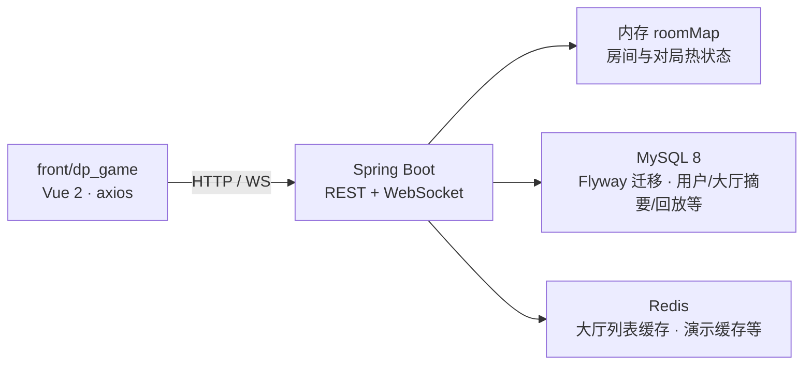
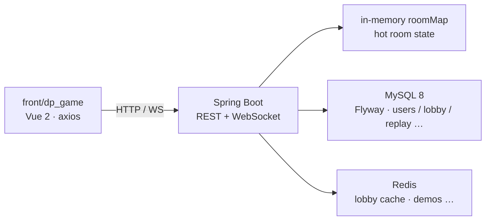

# MGDemoPlus(此版本为前瞻版)

基于 **Spring Boot 3** 的 Web 演示项目：多人实时房间、卡牌对战流程、AI / 可选大模型玩家、对局回放与大厅匹配。前端 `**front/dp_game`**（**Vue 2** + **Vue Router** + **Vuex** + **Element UI** + **axios**）可由 `**[Dockerfile](Dockerfile)`** 多阶段构建打进后端 JAR（`npm ci` → `dist` → `src/main/resources/static` → `mvn package`），与 REST、WebSocket **同端口**发布。已配置CI/CD

**运维与迭代长说明：** 中文 **[README.ch.md](README.ch.md)** · 英文 **[README.en.md](README.en.md)**（同结构对照）。**本文与长文若与仓库内 Java/YAML/迁移/Flyway/Compose/前端实现不一致，以本仓库当前实现与脚本为准；专题文档可能滞后。**

---

## 给代码评审

- **项目是什么**：端到端演示「注册登录 → **大厅** / **快匹** → 进房 → **对局页** WebSocket + 轮询驱动的对局」，含规则型 NPC、可选方舟兼容接口的 LLM 座位、手牌历史落库与列表。
- **能演示什么**：Docker 一键起栈后对局走通；快匹 **REST 入队 + WS 收状态** / 大厅分页 / JWT / 房内推送 / 好友邮箱与 SSE / 周榜。代码入口：`**DpRoomRegistry.roomMap`**、`[DpRoomQuickMatchBridge](src/main/java/com/example/mgdemoplus/room/support/DpRoomQuickMatchBridge.java)`、`[JoinableQuickMatchRoomIndex](src/main/java/com/example/mgdemoplus/quickmatch/JoinableQuickMatchRoomIndex.java)`、`[DpQuickMatchPairingCoordinator](src/main/java/com/example/mgdemoplus/quickmatch/pairing/DpQuickMatchPairingCoordinator.java)`、`[DpNpcEngine](src/main/java/com/example/mgdemoplus/npc/engine/DpNpcEngine.java)` / `[DpLlmNpcDecisionService](src/main/java/com/example/mgdemoplus/npc/llm/DpLlmNpcDecisionService.java)`；**Flyway V1–V7**（V7 周榜 `dp_leaderboard_weekly`）。
- **启动与配置**：`com.example.mgdemoplus.MgDemoPlusApplication` 启动前 `**LocalDotenvLoader`** 加载根目录 `**.env**` → `**System.setProperty**`，便于本地与容器注入（与 Spring `**application.yml**` 占位符配合）；`@MapperScan` 覆盖 `**common` / `user` / `history` / `music` / `lobby` / `social` / `roomchat` / `leaderboard**` 的 `mapper` 包（`**room` / `npc` / `quickmatch` 无 DB Mapper**，热状态在内存）。
- **技术栈一句话**：Java 17、Spring Boot **3.5.11**（`[pom.xml](pom.xml)` parent）、Security/WebSocket、MyBatis-Plus、MySQL 8 + **Flyway**（`[pom.xml](pom.xml)` `flyway-core` / `flyway-mysql`）、Lettuce/Redis、Vue 2 前端。
- **后端模块化分包（面试官扫读）**：


| 包                                                     | 职责                 | 入口/要点                                                                                                          |
| ----------------------------------------------------- | ------------------ | -------------------------------------------------------------------------------------------------------------- |
| `**controller/`**                                     | 8 个 REST 控制器       | `/dpRoom`、`/dpUser`、`/dp`、`/dp/social`、`/dpHandHistory`、`/dpMusic`、`/dp/leaderboard`、`/upload`                                   |
| `**room/**` + `**room/support/**`                     | 对局热状态、建房/下注/踢人     | `**DpRoomRegistry.roomMap**`（`ConcurrentHashMap`）；`DpRoomQuickMatchBridge`、`DpRoomHeartbeatScheduler`（1s tick） |
| `**lobby/**`                                          | 大厅表与 Redis 分页缓存    | `DpRoomHallServiceImpl`；`**DpRoomLobbyReconcileScheduler**`（DB 与内存对齐，可条件开启）                                    |
| `**quickmatch/**`                                     | 快匹可进房索引与配对         | `JoinableQuickMatchRoomIndex`、`DpQuickMatchPairingCoordinator`                                                 |
| `**npc/engine**` + `**npc/strategy**` + `**npc/llm**` | 规则 Bot 同步 / LLM 异步 | `DpNpcEngine`、`DpNpcUnifiedPreflopStrategy`、`DpLlmNpcDecisionService`                                          |
| `**social/**` + `**presence/**`                       | 好友、私信、SSE、站点心跳     | `DpFriendSocialService`；`SocialSseHub`（单 JVM）                                                                  |
| `**history/**`                                        | 牌谱观测与落库            | `DpHandHistoryObservedImpl` → `DpHandHistoryPersistServiceImpl`                                                |
| `**user/**`                                           | 注册登录、bcrypt、登录 JTI | `DpUserServiceImpl`；`DpRedisLoginCacheService`（`user/cache`）                                                   |
| `**common/**`                                         | 跨模块实体与 `DpRoomBO`  | `DpUser`、`DpPlayer`、`DpRoom` 等                                                                                 |
| `**websocket/**`                                      | 对局房 / 快匹长连         | `DpGameRoomWebSocketHandler`、`DpQuickMatchWebSocketHandler`                                                    |


专题索引与包树说明见 [docs/README.md](docs/README.md)。

- **单实例房间模型（免责）**：`**roomMap` 在单机 JVM**（`[DpRoomRegistry](src/main/java/com/example/mgdemoplus/room/support/DpRoomRegistry.java)`），与 Redis 无关；WS 会话表亦进程内。多实例需会话粘滞或分布式房间方案；生产多副本宜 `**mgdemoplus.dp-lobby-reconcile-enabled=false`**，否则 `[DpRoomLobbyReconcileScheduler](src/main/java/com/example/mgdemoplus/lobby/DpRoomLobbyReconcileScheduler.java)` 可能误删他节点仍在线的大厅行（见 [docs/WEBSOCKET.md](docs/WEBSOCKET.md)）。
- **更深细节**：专题说明在 **[docs/README.md](docs/README.md)**。

---

## 怎么跑（最短路径）

仓库根目录：

```bash
docker compose up --build
```

- **经 Nginx**：`[docker/nginx/default.conf](docker/nginx/default.conf)` 对 `**server_name catandppoker.asia`**：监听 **80** 跳转 **HTTPS**，**443 ssl** 反代到 `**app:8088`**；本地对照 `[docker-compose.yml](docker-compose.yml)` 文件头注释使用 `**https://localhost**`（证书 **CN/SAN** 与 **server_name** 可能不一致，浏览器会告警；也可在 hosts 中把域名指向本机后访问）。专题说明仍见 [docs/NGINX.md](docs/NGINX.md)（可能与当前 Compose/Nginx 细节不完全同步）。
- **直连应用**：端口 `**8088`** 见 `[src/main/resources/application.yml](src/main/resources/application.yml)`。根目录 `**docker compose up --build**` 使用 `[docker-compose.yml](docker-compose.yml)` 时，`**app` 的 `8088:8088` 映射默认注释**，宿主机 `**http://localhost:8088` 通常不可达**——取消注释其中 `**ports`**，或改用 `[docker-compose.hub.yml](docker-compose.hub.yml)`（`**${APP_HOST_PORT:-8088}:8088**`）；本机 `**mvn spring-boot:run**` 可直接 **[http://localhost:8088](http://localhost:8088)**（**hash 路由**，如 `**/#/login`**——Vue Router 未显式 `history` 模式时为默认 hash）。

本机前后端分离、`.env`、Hub 镜像与 Flyway 注意点见 **[快速开始](#quick-start)**。

---

## 一张图读懂目录




---

## 项目一览

### 对局与房间

- 服务端实现完整回合流与结算（`[room.impl.DpRoomServiceImpl](src/main/java/com/example/mgdemoplus/room/impl/DpRoomServiceImpl.java)`）；`**roomMap**` 由 `[DpRoomRegistry](src/main/java/com/example/mgdemoplus/room/support/DpRoomRegistry.java)` 持有；房内写路径 `**synchronized (DpRoomBO)**` 串行化。
- 建房、密码、初始分、踢人批量等见 [docs/DPGAME.md](docs/DPGAME.md) 与 [docs/RoomUi.md](docs/RoomUi.md)。
- 大厅公开房列表以 `**dp_room_lobby**` 为权威摘要（表在 **Flyway V1** 中建），分页带 Redis 版本缓存（细节 [README.ch.md](README.ch.md) / [docs/Redis.md](docs/Redis.md)）。
- 对局可落库与按用户分页查询（概览 [docs/DP_PERSISTENCE_README.md](docs/DP_PERSISTENCE_README.md)）。**Flyway（V1–V7）**：`[V1](src/main/resources/db/migration/V1__init_schema.sql)` 基线、`[V2](src/main/resources/db/migration/V2__friend_dm_and_room_chat.sql)` 好友私信与局内聊天、`[V3](src/main/resources/db/migration/V3__room_chat_composite_pk.sql)` 局内聊天主键、`[V4](src/main/resources/db/migration/V4__user_stats.sql)` `**dp_user_stats**`、`[V5](src/main/resources/db/migration/V5__largest_room_net_multiplier.sql)` / `[V6](src/main/resources/db/migration/V6__largest_pot_won_multiplier.sql)` 净赢倍数、`[V7](src/main/resources/db/migration/V7__leaderboard_weekly.sql)` 周榜。表 `dp_shark_opponent_profile` 仍保留，**服务层已不再读写**。
- **后端包结构**：模块化域包见上文 **[给代码评审](#给代码评审)** 表；索引 [docs/README.md](docs/README.md)。

### 主要 REST 前缀（实现核对）


| 前缀                   | 说明                                                                                                                                                                                                                                                                                                                                                                                                       |
| -------------------- | -------------------------------------------------------------------------------------------------------------------------------------------------------------------------------------------------------------------------------------------------------------------------------------------------------------------------------------------------------------------------------------------------------- |
| `**/dpRoom**`        | 建房、进退房、快匹、准备、下注、踢人、规则/LLM Bot 等（`[DpRoomController](src/main/java/com/example/mgdemoplus/controller/DpRoomController.java)`）。`joinRoom2` / `quickMatch2` / `quickMatchCancel2`：**JWT subject == `nickname**`。`getNowRoom` / `getAllRooms2` 为 **permitAll**（读内存 `roomMap`）；`**publicRooms` / `publicRooms/query` 需 JWT**（读 `dp_room_lobby` + Redis 缓存）。                                                   |
| `**/dpUser**`        | 注册、`loginProfile`（推荐）、`loginUser`、资料（`[DpUserController](src/main/java/com/example/mgdemoplus/controller/DpUserController.java)`）。                                                                                                                                                                                                                                                                       |
| `**/dp**`            | 好友申请/列表/删除、邮箱、进房邀请、**好友私信**、跟随进房/观战（`[DpFriendMailboxController](src/main/java/com/example/mgdemoplus/controller/DpFriendMailboxController.java)`）。站点在线：`GET /dp/presence/site-heartbeat/config`（匿名）、`POST /dp/presence/site-heartbeat`（JWT）；`GET /dp/friends` 含 `presence`：`OFFLINE` / `IDLE` / `IN_GAME`（房内态优先）。TTL：`mgdemoplus.dp-site-presence-ttl-ms`（默认 90s，`MGDEMOPLUS_DP_SITE_PRESENCE_TTL_MS`）。 |
| `**/dp/social**`     | 大厅 SSE：`GET /dp/social/stream`（Bearer 或 `**?token=**`）；`GET /dp/social/notify-summary` 断线兜底（`[DpSocialController](src/main/java/com/example/mgdemoplus/controller/DpSocialController.java)`）。                                                                                                                                                                                                            |
| `**/dpHandHistory**` | 牌谱列表/详情；`userId` 须为参与者 id（**服务端未强制等于 JWT 用户**，客户端勿传他人 id）。写入在 `room` 结算链，本包只读查询。                                                                                                                                                                                                                                                                                                                         |
| `**/dpMusic**`       | 曲库上传（JWT）/列表（`permitAll`）。                                                                                                                                                                                                                                                                                                                                                                               |
| `**/upload**`        | 通用图片上传（JWT）；静态 `**/images/****` 匿名可读。                                                                                                                                                                                                                                                                                                                                                                    |


白名单与 JWT 链见 [docs/JWT.md](docs/JWT.md)；登录后 Redis 存 **JTI 单会话**（新登录踢旧 token）。`**permitAll**` 含 ``/ws/`**`（对局 WS 握手匿名；**快匹 WS** 在 Handler 内自行校验 **token + nickname**，见下）。

### 实时与匹配

- **对局页** WebSocket：`**/ws/dp-game?roomId=…`**；**可选查询参数 `nickname=`**（观战/视角快照等，服务端按实现过滤）。下行 JSON 与 `**GET /dpRoom/getNowRoom**` 同类摘要；上行支持 `**chatSend**`、`**roomMusicSync**` 等（以 `[DpGameRoomWebSocketHandler](src/main/java/com/example/mgdemoplus/websocket/DpGameRoomWebSocketHandler.java)` 为准）。
- **快匹** WebSocket：`**/ws/dp-quick-match?nickname=…&token=…`**（**必填**；握手内 `**JwtTokenService` 校验**，subject 须与 nickname 一致）。说明见 [docs/WEBSOCKET.md](docs/WEBSOCKET.md)。注册见 `[WebSocketGameRoomConfig](src/main/java/com/example/mgdemoplus/config/WebSocketGameRoomConfig.java)`（`**allowedOriginPatterns("*")`** 为演示便利，生产请收紧）。
- 快匹 **REST**：`POST /dpRoom/quickMatch2` 入 FIFO（默认 5/10 盲注、9 人桌）并触发 `[DpQuickMatchPairingCoordinator](src/main/java/com/example/mgdemoplus/quickmatch/pairing/DpQuickMatchPairingCoordinator.java)`；**状态推送须连** `/ws/dp-quick-match`（`[DpQuickMatchPushService](src/main/java/com/example/mgdemoplus/websocket/DpQuickMatchPushService.java)`），REST  alone 不足以收 `MATCHED` 等详情。
- 配对顺序：**先** `[JoinableQuickMatchRoomIndex](src/main/java/com/example/mgdemoplus/quickmatch/JoinableQuickMatchRoomIndex.java)` 灌入已有公开空桌；**再无桌且队列 ≥2** 时批量出队建新公开房（至多 `min(MAX_NEW_ROOM_BATCH, 队列人数)`，不超过最大座位）。
- **并发**：`**dpQuickMatchAssignmentLock`** 仍包裹 `DpRoomServiceImpl` 中整次 `**attemptQuickMatchPairing()` → `attemptPairing()**`；协调器与 `**JoinableQuickMatchRoomIndex**` 另有 `**defaultQmLock` / `indexLock**` 等，与单房监视器配合。详见 [docs/dp-quick-match-concurrency.md](docs/dp-quick-match-concurrency.md)（若文档写「旧锁已废弃」，以代码为准）。
- 大厅快匹 `quickMatch2` / 取消与流程说明见 [docs/dp-quick-match-flow.md](docs/dp-quick-match-flow.md)。
- 快匹队列单条等待超时约 **3 分钟**（`DEFAULT_QM_WAIT_MS`）；周期性清理间隔 `**mgdemoplus.dp-quick-match-prune-ms`**（默认 **30s**，`[DpRoomServiceImpl](src/main/java/com/example/mgdemoplus/room/impl/DpRoomServiceImpl.java)`）。

### 账号与社交

- **Spring Security + JWT**（白名单见 [docs/JWT.md](docs/JWT.md)）；密码 **bcrypt**；令牌约 **3 天**过期（`mgdemoplus.jwt.expiration.time`）。若 [docs/DpUserPassword.md](docs/DpUserPassword.md) / [docs/JWT.md](docs/JWT.md) 仍写 MD5 或 `application.properties`，以 **yml + 源码**为准。
- **主配置**：`[application.yml](src/main/resources/application.yml)`（**无 Spring profiles**、无 `application.properties`）；环境变量见 [docs/ENV_README.md](docs/ENV_README.md)。
- **好友邮箱 MVP**（申请、邀请、mailbox、好友私信、SSE）：[docs/dp_friend_mailbox_mvp.md](docs/dp_friend_mailbox_mvp.md)。站点心跳：`GET/POST /dp/presence/site-heartbeat*`。
- **大厅 SSE**：`GET /dp/social/stream` 推送 `event: notify`（邮箱未读 + 私信未读）；**单 JVM 扇出**（`SocialSseHub`），多副本需粘滞或接受各节点独立推送。Nginx 代理须 `proxy_buffering off`（[docs/NGINX.md](docs/NGINX.md)）。`spring.mvc.async.request-timeout: -1` 避免 SSE 被掐断。
- 前端：`api.dpSocial.js`、`dpSocialStream.js`、`Vuex dpMailbox`；开发代理见 `[vue.config.js](front/dp_game/vue.config.js)`。

### 前端（`front/dp_game`）要点

仅列与后端联调相关的一级信息；组件/UI/主题见 `**[front/dp_game/docs/README.md](front/dp_game/docs/README.md)`**。

- **路由**：默认 **hash**（`/#/home`、`#/game/:roomId`）；**401** → 登录由 `[main.js](front/dp_game/src/main.js)` axios 拦截处理。
- **HTTP**：开发 `**baseURL` `/dev-api`** + `[vue.config.js](front/dp_game/vue.config.js)` 代理 **8088**；生产同域 `**baseURL` 空**。
- **WebSocket**：开发 `**/dp-ws/dp-game`**、`**/dp-ws/dp-quick-match**` → `**/ws/...**`；生产 `**/ws/dp-game**`、`**/ws/dp-quick-match**`。
- **Vuex**：`**dpGame`**（对局）、`**dpMailbox**`（好友/邮箱 + `[api.dpSocial.js](front/dp_game/src/api/api.dpSocial.js)`）；大厅 SSE：`**[dpSocialStream.js](front/dp_game/src/utils/dpSocialStream.js)**`（`?token=`）。
- **嵌入 JAR**：`[Dockerfile](Dockerfile)` 将 `dist` 拷入 `static`；纯 `**mvn package`** 未必含最新前端构建。

### AI 与曲库

- **规则 NPC**（`[DpNpcEngine](src/main/java/com/example/mgdemoplus/npc/engine/DpNpcEngine.java)`）：`BOT_FISH_` / `BOT_TAG_` / `BOT_LAG_` / `BOT_NIT_` / `BOT_CALL_` / `BOT_MANIAC_` / `BOT_CUSTOM_`（遗留 `BOT_Shark`→TAG）；翻前统一 `[DpNpcUnifiedPreflopStrategy](src/main/java/com/example/mgdemoplus/npc/strategy/DpNpcUnifiedPreflopStrategy.java)`；翻后 `npc/strategy/*`；思考延时 **`dp.npc.rule-think`**（可关）。文档：[docs/ai/npc-engine/README.md](docs/ai/npc-engine/README.md)、[docs/ai/npc-preflop-unified-decision-flow.md](docs/ai/npc-preflop-unified-decision-flow.md)。
- **LLM NPC**（`[DpLlmNpcDecisionService](src/main/java/com/example/mgdemoplus/npc/llm/DpLlmNpcDecisionService.java)`）：心跳 **1s** tick 异步方舟 API（`[OpenAiCompatibleChatClient](src/main/java/com/example/mgdemoplus/llm/OpenAiCompatibleChatClient.java)`）；`BOT_LLM_*` 单轮，`BOT_LLM_GLOBAL_*` 每手多轮。REST：`addLlmBot` / `addLlmGlobalBot` / `addRuleNpcBatch` 等。配置 `**dp.llm.ark.*`** / `**ARK_***`（[docs/ENV_README.md](docs/ENV_README.md)）；未配置时本地兜底。分册：[docs/ai/npc-llm/part01_类间关系以及调用.md](docs/ai/npc-llm/part01_类间关系以及调用.md)。
- 曲库 BGM：[docs/DpMusicWebPath.md](docs/DpMusicWebPath.md)；Redis（登录 JTI、大厅缓存、曲库列表，**非 roomMap**）：[docs/Redis.md](docs/Redis.md)。

---

## 技术栈


| 层级     | 技术                                                                                                                                                                                                                                              |
| ------ | ----------------------------------------------------------------------------------------------------------------------------------------------------------------------------------------------------------------------------------------------- |
| 后端     | Java **17**、**Spring Boot 3.5.11**（`[pom.xml](pom.xml)`）、Spring Web / Security / WebSocket、**MyBatis-Plus**、**PageHelper**、**Druid**、MySQL 驱动、**Lettuce**（Redis）、**JJWT**                                                                       |
| 前端（游戏） | **Vue 2**、Vue Router（默认 **hash**）、**Vuex**（`**dpGame`、`dpMailbox`**）、**Element UI**、axios（`**front/dp_game`**）                                                                                                                                  |
| 数据     | **MySQL 8**（默认库 `school_db`）、**Redis 7**、**Flyway**（`classpath:db/migration`；当前 **V1–V7**，基线 `**[V1__init_schema.sql](src/main/resources/db/migration/V1__init_schema.sql)`**；依赖 `**flyway-core**` / `**flyway-mysql**`，见 `[pom.xml](pom.xml)`） |
| 构建与部署  | **Maven**、**Docker** / **Docker Compose**（`[Dockerfile](Dockerfile)` 多阶段含 **Node 20** 构建前端）、**Nginx**（`[Dockerfile.nginx](Dockerfile.nginx)` + `[docker/nginx/default.conf](docker/nginx/default.conf)`）                                        |


对局页布局与 CSS 分层等实现细节见 [front/dp_game/docs/GAME_LAYOUT_TUNING_README.md](front/dp_game/docs/GAME_LAYOUT_TUNING_README.md)。**界面主题与「猫咪派对」展示文案**（仅前端）见 [front/dp_game/docs/README.md](front/dp_game/docs/README.md) 与同目录主题说明。前端专题索引用 `**[front/dp_game/docs/README.md](front/dp_game/docs/README.md)`**（`**front/dp_game` 根目录无 README** 时以该索引为准）。

---

## 环境要求

- **JDK 17**、**Maven 3.6+**
- 开发前端：**Node.js**（与 `front/dp_game/package.json` 中 Vue CLI 5 兼容；**Docker 构建**使用 **Node 20**，见 `[Dockerfile](Dockerfile)`）
- 本机跑后端还需 **MySQL 8**、**Redis**（或与 `application.yml` / `.env` 中 `SPRING_DATASOURCE_*`、`SPRING_DATA_REDIS_*` 一致）
- 可选：**Docker 20+**、**Docker Compose 2+**

### 配置要点（本机 vs Docker）

以 `[application.yml](src/main/resources/application.yml)` 与 [docs/ENV_README.md](docs/ENV_README.md)、[docs/CONFIG_LAYERS.md](docs/CONFIG_LAYERS.md) 为准（**无 Spring profiles**）：


| 项        | 本机 yml 默认                               | Compose（`docker-compose.yml`）                |
| -------- | --------------------------------------- | -------------------------------------------- |
| DB 密码    | `mgdemo_root`                           | `MYSQL_ROOT_PASSWORD`（默认 `mgdemo_root`）      |
| Redis 密码 | `mgdemo_redis`                          | `REDIS_PASSWORD`（默认 `mgdemo_redis`）          |
| MySQL 连接 | JDBC `**localhost:3307`** / `school_db` | 容器内 `mysql:3306`；宿主 `**3307:3306**`          |
| Redis    | `**127.0.0.1:6380**`                    | 容器 `redis:6379`；宿主 `**6380:6379**`           |
| 应用端口     | **8088**                                | `**app` 映射 8088**（根 compose 可能注释宿主端口，见「怎么跑」） |


**无 Spring Boot profiles**；仅单文件 `[application.yml](src/main/resources/application.yml)` + 根目录 `[.env](.env.example)`（`LocalDotenvLoader` 在 main 中先于 Spring 加载）。**Druid** 仅作连接池，未启用监控控制台。

---


## 快速开始

### 1. 克隆与配置

```bash
git clone <你的仓库地址> MGDemoPlus
cd MGDemoPlus
copy .env.example .env
# 编辑 .env：MYSQL_ROOT_PASSWORD、REDIS_PASSWORD、JWT_SECRET、ARK_* 等（勿提交含真实密钥的 .env）
```

环境变量与 **[application.yml](src/main/resources/application.yml)** 的映射见 **[docs/ENV_README.md](docs/ENV_README.md)**。根目录 `**.env`** 经 `LocalDotenvLoader` 注入（**不覆盖**已有环境变量）；本机须起 **3307/6380** 上的 MySQL/Redis，或改 `SPRING_`* / `.env` 与端口一致。

### 2. Docker 一键（推荐）

在**仓库根目录**执行：

```bash
.\build-push-hub.ps1
docker compose -f docker-compose.hub.yml up -d
```

或本机构建：

```bash
docker compose up --build
```

Hub 镜像与 GitHub Actions 发布说明见 **[docs/DOCKER.md](docs/DOCKER.md)**；工作流 `**on.push.branches`** 当前为 `**desensitization-pre**`（见 [.github/workflows/docker-publish.yml](.github/workflows/docker-publish.yml)）。`**[docker-compose.hub.yml](docker-compose.hub.yml)**` 可能注入 `**ARK_RESPONSE_JSON_OBJECT**` 等额外环境变量；`**[docker-compose.yml](docker-compose.yml)**` 未逐项等价——以各文件及运行容器 `env` 为准。

- **数据库（Compose + Flyway）**：`[docker-compose.yml](docker-compose.yml)` 中 `**SPRING_DATASOURCE_URL`** 指向 `**jdbc:mysql://mysql:3306/school_db...**`；**表结构在应用启动时由 Flyway** 执行 `**V1`–`V6`**。若本地旧卷与迁移版本冲突，开发机可 `docker compose down -v` 删卷重来（**清空数据**；生产须备份与迁移策略）。
- **经 Nginx**：同上「怎么跑」——`**https://localhost`**（`[docker-compose.yml](docker-compose.yml)` 注释）、`[docker/nginx/default.conf](docker/nginx/default.conf)`。
- **直连应用**：同上——`[docker-compose.yml](docker-compose.yml)` **默认不映射宿主 8088**；`[docker-compose.hub.yml](docker-compose.hub.yml)` **默认映射 `${APP_HOST_PORT:-8088}:8088`**；本机 `**mvn**` 直连 **[http://localhost:8088](http://localhost:8088)**。

默认 MySQL / Redis 宿主机端口等见 **[docs/DOCKER.md](docs/DOCKER.md)**。本机 `**docker-compose.yml`** 与 Hub 编排的**卷**差异（bind mount `**./docker-data/uploads`** vs 命名卷 `**mgdemo_uploads**`）见 [docs/DOCKER.md](docs/DOCKER.md)。

**监控（仅 `docker-compose.yml`）**：`docker compose up -d` 后可用 **Prometheus** [http://localhost:9090](http://localhost:9090)、**Grafana** [http://localhost:3000](http://localhost:3000)（默认账号 `**admin` / `admin`**，仅本地开发）、**cAdvisor** [http://localhost:8080](http://localhost:8080)。Grafana 已预置 Prometheus 数据源；容器指标可在 Grafana 中 **Import** 社区面板 **ID 193**（Docker monitoring）。详细说明见 **[docs/监控-Grafana使用说明.md](docs/监控-Grafana使用说明.md)**。

### 3. 本机开发（后端 + 前端分离）

**后端**（工作目录为**仓库根目录**，以便加载根目录 `.env`）：

```bash
mvn spring-boot:run
# 或
mvn -q -DskipTests package && java -jar target/MGDemoPlus-0.0.1-SNAPSHOT.jar
```

**前端**：

```bash
cd front/dp_game
npm install
npm run dev
```

**开发代理**：以 `**[front/dp_game/vue.config.js](front/dp_game/vue.config.js)`** 为准——`**/dev-api` → 后端**（常 **8088**）、`**/dp-ws` → `/ws`**（避免 HMR 与对局 WS 路径冲突）。大厅/对局主题与 `localStorage` 键说明见 **[front/dp_game/docs/THEME_BINDING_README.md](front/dp_game/docs/THEME_BINDING_README.md)**。

---

## 测试（抽查）

与 **dp** 相关的单元/组件测试（**非** HTTP/WS 端到端）包括但不限于：`JoinableQuickMatchRoomIndexTest`、`DpQuickMatchPairingCoordinatorTest`、`DpRoomDesertedRoomCleanupTest`、`DpFriendSocialServiceFollowSpectateTest`、`DpFriendPresenceServiceTest`；`**MgDemoPlusApplicationTests`** 做 Spring 上下文加载。`**DpRoomController` / 公共 WS 的集成级用例较少**——以代码与需求为准逐步补全。

---

## 仓库结构（概览）

```
MGDemoPlus/
├── src/main/java/com/example/mgdemoplus/
│   ├── controller/ config/ security/ websocket/ utils/ llm/   # 全局 HTTP/WS/安全
│   ├── common/          # DpUser、DpRoomBO 等跨模块共享
│   ├── room/ lobby/ quickmatch/ npc/ social/ history/
│   ├── user/ music/ roomchat/ presence/                     # 按域 impl·mapper·entity
│   └── MgDemoPlusApplication.java
├── front/dp_game/                          # 游戏前端（Vue CLI）
├── docker/                                 # Nginx 等配置
├── docker-data/
├── docker-compose.yml
├── docker-compose.hub.yml
├── Dockerfile / Dockerfile.nginx
├── pom.xml
├── README.md                               # 本文件：中英对照主入口（上半中文 · 下半 English 同级结构）
├── README.ch.md                            # 中文长说明（可能滞后，以代码为准）
├── README.en.md                            # 英文长说明（可能滞后，以代码为准）
└── docs/                                   # 专题文档；总索引 docs/README.md
```

---

## 文档索引

- **文档总导航**：[docs/README.md](docs/README.md)
- **专题文档索引**：[docs/README.md](docs/README.md)
- **前端专题索引**：[front/dp_game/docs/README.md](front/dp_game/docs/README.md)
- **环境与变量**：[docs/ENV_README.md](docs/ENV_README.md)
- **Docker**：[docs/DOCKER.md](docs/DOCKER.md)
- **维护级长说明**：[README.ch.md](README.ch.md)（中文）· [README.en.md](README.en.md)（英文）

## 路线图（内部备忘摘要）

来自 [TODO.md](TODO.md)，与实现可能不同步：**房间定时器优化**；**LLM 多轮跟进整局**（`BOT_LLM_GLOBAL` 已部分支持）；**好友举报与查证**；**管理员 API**（规划前缀 `/dp/admin/`**）。

---

## 许可证与声明

**本项目仅为计算机技术学习与演示使用，采用虚拟积分，不涉及真实货币交易，不包含任何赌博相关功能。**

若本短版与**当前仓库实现**不一致，以 **Java/YAML 源码、`db/migration`、Compose/Dockerfile、`front/dp_game` 行为**为准，并优先修正长文档与 `docs/`，而非相反。

---

## English

**Spring Boot** demo focused on **multiplayer online strategy card play**: multi-room sessions, real-time battle flow, AI rule bots and optional Ark-compatible LLM seats, replay persistence, lobby matching. Frontend `**front/dp_game`** is **Vue 2 + Vue Router (default hash) + Vuex (`dpGame`, `dpMailbox`) + Element UI + axios**; production builds embed into the backend JAR via `**[Dockerfile](Dockerfile)`** (**Node build → `dist` → `src/main/resources/static` → Maven package**), same port as REST and WebSocket.

**Long-form ops notes:** **[README.ch.md](README.ch.md)** · **[README.en.md](README.en.md)**. **If this file or long reads disagree with the repo’s current Java/YAML, Flyway, Compose, or frontend code, trust the implementation first; topic docs may lag.**

### For reviewers / interviewers

- **What it is**: End-to-end demo from auth → **lobby** / **quick match** → room → **battle screen** (WebSocket + polling); JWT security; NPC + optional LLM; hand history persistence.
- **What to demo**: After `docker compose up --build`, play through a match; **quick-match REST + WS**, **lobby paging**, **JWT**, **in-room pushes**, **friend mailbox + lobby SSE**, **weekly leaderboard**. Code: `**DpRoomRegistry.roomMap`**, `**DpRoomQuickMatchBridge**`, `**JoinableQuickMatchRoomIndex**`, `**DpQuickMatchPairingCoordinator**`, `**DpNpcEngine**` / `**DpLlmNpcDecisionService**`, **Flyway V1–V7**.
- **Bootstrap**: `MgDemoPlusApplication` runs `**LocalDotenvLoader`** so root `**.env**` can set `**System` properties** before Spring starts; `@MapperScan` covers `**common` / `user` / `history` / `music` / `lobby` / `social` / `roomchat`** mappers (`**room` / `npc` / `quickmatch` have no DB mappers**—hot state in memory).
- **Stack**: Java 17, Spring Boot **3.5.11** (`[pom.xml](pom.xml)`), Security/WebSocket, MyBatis-Plus, MySQL + Flyway (`flyway-core` / `flyway-mysql` in `[pom.xml](pom.xml)`), Redis (cache/login JTI, etc.), Vue 2 UI.
- **Modular packages (scan-friendly)**:


| Package                                             | Role                             | Entry points                                                                                 |
| --------------------------------------------------- | -------------------------------- | -------------------------------------------------------------------------------------------- |
| `**controller/`**                                   | 7 REST controllers               | `/dpRoom`, `/dpUser`, `/dp`, `/dp/social`, `/dpHandHistory`, `/dpMusic`, `/upload`           |
| `**room/**` + `**room/support/**`                   | Hot match state                  | `**DpRoomRegistry.roomMap**`; `DpRoomQuickMatchBridge`, `DpRoomHeartbeatScheduler` (1s tick) |
| `**lobby/**`                                        | Lobby table + Redis paging       | `DpRoomHallServiceImpl`; `**DpRoomLobbyReconcileScheduler**`                                 |
| `**quickmatch/**`                                   | Quick-match index & pairing      | `JoinableQuickMatchRoomIndex`, `DpQuickMatchPairingCoordinator`                              |
| `**npc/engine**`, `**npc/strategy**`, `**npc/llm**` | Rule bots (sync) / LLM (async)   | `DpNpcEngine`, `DpNpcUnifiedPreflopStrategy`, `DpLlmNpcDecisionService`                      |
| `**social/**`, `**presence/**`                      | Friends, DM, SSE, site heartbeat | `DpFriendSocialService`; `SocialSseHub` (single JVM)                                         |
| `**history/**`                                      | Hand replay persist              | `DpHandHistoryObservedImpl` → persist service                                                |
| `**user/**`                                         | Auth, **bcrypt**, login JTI      | `DpUserServiceImpl`; `DpRedisLoginCacheService`                                              |
| `**common/`**                                       | Shared entities / `DpRoomBO`     | `DpUser`, `DpPlayer`, `DpRoom`, …                                                            |
| `**websocket/**`                                    | Game-room & quick-match WS       | `DpGameRoomWebSocketHandler`, `DpQuickMatchWebSocketHandler`                                 |


Doc index: [docs/README.md](docs/README.md).

- **Single-instance caveat**: `**roomMap` is per-JVM** (`[DpRoomRegistry](src/main/java/com/example/mgdemoplus/room/support/DpRoomRegistry.java)`); WS sessions are in-process too. Multi-node needs sticky sessions or distributed rooms; set `**mgdemoplus.dp-lobby-reconcile-enabled=false`** in multi-replica prod or `[DpRoomLobbyReconcileScheduler](src/main/java/com/example/mgdemoplus/lobby/DpRoomLobbyReconcileScheduler.java)` may delete lobby rows for rooms still live on other nodes—see **[docs/WEBSOCKET.md](docs/WEBSOCKET.md)**.

### Shortest path to run

```bash
docker compose up --build
```

- Via Nginx: `**https://localhost**` per `[docker-compose.yml](docker-compose.yml)` header — `[docker/nginx/default.conf](docker/nginx/default.conf)` (`server_name catandppoker.asia`, **80→HTTPS**, **443** → `app:8088`; expect cert / hostname warnings unless you match `server_name` / hosts). See also [docs/NGINX.md](docs/NGINX.md) (may lag Compose/nginx details).
- Direct app: `**server.port` 8088** in `[src/main/resources/application.yml](src/main/resources/application.yml)`. With root `[docker-compose.yml](docker-compose.yml)`, `**app` port `8088:8088` is commented out** by default — `**http://localhost:8088` is usually unreachable** until you uncomment `**ports`**, switch to `[docker-compose.hub.yml](docker-compose.hub.yml)` (`${APP_HOST_PORT:-8088}:8088`), or run `**mvn spring-boot:run**` and open **[http://localhost:8088](http://localhost:8088)** (**hash** routes, e.g. `**/#/login`**).

Full steps below under **Quick start**.

### Architecture at a glance

Same diagram as Chinese section:




### Project overview

#### Rooms & gameplay

- Full server-side turns/settlement (`[room.impl.DpRoomServiceImpl](src/main/java/com/example/mgdemoplus/room/impl/DpRoomServiceImpl.java)`); `**roomMap**` in `[DpRoomRegistry](src/main/java/com/example/mgdemoplus/room/support/DpRoomRegistry.java)`; writes under `**synchronized (DpRoomBO)**`.
- Room creation, passwords, scores, bulk kicks — [docs/DPGAME.md](docs/DPGAME.md), [docs/RoomUi.md](docs/RoomUi.md) (**battle-screen** seat layout).
- Public lobby list SSOT `**dp_room_lobby`** (Flyway **V1**), Redis-backed paging cache — [README.en.md](README.en.md) / [docs/Redis.md](docs/Redis.md). **Flyway V1–V7**: baseline **V1**, friend DM / room chat **V2**, chat PK **V3**, `**dp_user_stats` V4**, buy-in multipliers **V5** / **V6**, weekly leaderboard **V7**. `**dp_shark_opponent_profile`** kept in schema but **not used by services**.
- **Backend layout**: domain packages under `src/main/java/.../mgdemoplus/` — see **For reviewers** table and [docs/README.md](docs/README.md). Flat `**service/serviceImpl/`** removed.
- Replay persistence — [docs/DP_PERSISTENCE_README.md](docs/DP_PERSISTENCE_README.md).

#### Main REST prefixes (as implemented)


| Prefix                        | Notes                                                                                                                                                                                                                                                                                                                          |
| ----------------------------- | ------------------------------------------------------------------------------------------------------------------------------------------------------------------------------------------------------------------------------------------------------------------------------------------------------------------------------ |
| `**/dpRoom**`                 | Rooms, quick match, lobby, bots — `[DpRoomController](src/main/java/com/example/mgdemoplus/controller/DpRoomController.java)`. `joinRoom2` / `quickMatch2` / `quickMatchCancel2`: JWT subject == `nickname`. `getNowRoom` / `getAllRooms2` **permitAll** (in-memory); `**publicRooms*` require JWT** (DB lobby + Redis cache). |
| `**/dpUser`**                 | Register, `loginProfile`, profile — `[DpUserController](src/main/java/com/example/mgdemoplus/controller/DpUserController.java)`.                                                                                                                                                                                               |
| `**/dp**`                     | Friends, mailbox, invites, **DM**, spectate follow, site heartbeat — `[DpFriendMailboxController](src/main/java/com/example/mgdemoplus/controller/DpFriendMailboxController.java)`.                                                                                                                                            |
| `**/dp/social`**              | Lobby SSE stream + notify summary — `[DpSocialController](src/main/java/com/example/mgdemoplus/controller/DpSocialController.java)`.                                                                                                                                                                                           |
| `**/dpHandHistory**`          | Replay list/detail; `userId` must be a participant (**server does not bind to JWT user**—clients must pass own id). Writes happen in `room` settlement.                                                                                                                                                                        |
| `**/dpMusic`**, `**/upload**` | Music library; image upload.                                                                                                                                                                                                                                                                                                   |


JWT whitelist — [docs/JWT.md](docs/JWT.md); **Redis JTI single session** per user. ``/ws/`` `**permitAll**` at handshake; **quick-match WS** validates **JWT + nickname** in `[DpQuickMatchWebSocketHandler](src/main/java/com/example/mgdemoplus/websocket/DpQuickMatchWebSocketHandler.java)`.

#### Realtime & quick match / lobby

- **Battle WebSocket** `**/ws/dp-game?roomId=…`** with **optional `nickname=`** for spectator/view behavior — `[DpGameRoomWebSocketHandler](src/main/java/com/example/mgdemoplus/websocket/DpGameRoomWebSocketHandler.java)`.
- **Quick-match WebSocket** `**/ws/dp-quick-match?nickname=&token=`** (required) — JWT verified in handler (`[WebSocketGameRoomConfig](src/main/java/com/example/mgdemoplus/config/WebSocketGameRoomConfig.java)`).
- Quick match **REST**: `POST /dpRoom/quickMatch2` enqueues and runs `[DpQuickMatchPairingCoordinator](src/main/java/com/example/mgdemoplus/quickmatch/pairing/DpQuickMatchPairingCoordinator.java)`; clients should connect `**/ws/dp-quick-match`** (`[DpQuickMatchPushService](src/main/java/com/example/mgdemoplus/websocket/DpQuickMatchPushService.java)`) for `WAITING` / `MATCHED` / `IDLE`—REST alone is not enough.
- Pairing: `[JoinableQuickMatchRoomIndex](src/main/java/com/example/mgdemoplus/quickmatch/JoinableQuickMatchRoomIndex.java)` fills existing public tables first; then batch new room (up to `min(MAX_NEW_ROOM_BATCH, queue size)`).
- **Concurrency**: `**dpQuickMatchAssignmentLock`** still wraps each `**attemptPairing()**` from the service; inner locks (`defaultQmLock`, `indexLock`, …) apply per [docs/dp-quick-match-concurrency.md](docs/dp-quick-match-concurrency.md) (**code wins** if docs say old locks are gone).
- Flow — [docs/dp-quick-match-flow.md](docs/dp-quick-match-flow.md); queue wait ~**3 min** + periodic prune `**mgdemoplus.dp-quick-match-prune-ms`**.

#### Accounts & social

- Spring Security + JWT — [docs/JWT.md](docs/JWT.md); **bcrypt**; ~**3-day** token TTL; **Redis JTI** evicts older sessions.
- `**[application.yml](src/main/resources/application.yml)`** only — **no Spring profiles**. Env — [docs/ENV_README.md](docs/ENV_README.md).
- Mailbox MVP — [docs/dp_friend_mailbox_mvp.md](docs/dp_friend_mailbox_mvp.md); **also**: friend DM, delete friend, site heartbeat, follow/spectate, `**GET /dp/social/stream`** SSE (**single-JVM** hub; Nginx `proxy_buffering off`).
- Frontend: `[api.dpSocial.js](front/dp_game/src/api/api.dpSocial.js)`, `dpMailbox` Vuex, `[dpSocialStream.js](front/dp_game/src/utils/dpSocialStream.js)`.

#### Frontend (`front/dp_game`)

Backend integration only; UI/theme: `**[front/dp_game/docs/README.md](front/dp_game/docs/README.md)`**.

- **Hash routes** (`/#/home`, `#/game/:roomId`); **401** → login via axios in `[main.js](front/dp_game/src/main.js)`.
- **HTTP**: dev `**baseURL` `/dev-api`** + `[vue.config.js](front/dp_game/vue.config.js)` proxy to **8088**; prod same-origin empty `**baseURL`**.
- **WebSocket**: dev `**/dp-ws/dp-game`**, `**/dp-ws/dp-quick-match**` → `**/ws/...**`; prod `**/ws/dp-game**`, `**/ws/dp-quick-match**`.
- **Vuex**: `**dpGame`**, `**dpMailbox**` (+ `[api.dpSocial.js](front/dp_game/src/api/api.dpSocial.js)`); lobby SSE: `[dpSocialStream.js](front/dp_game/src/utils/dpSocialStream.js)` (`?token=`).
- **JAR embed**: `[Dockerfile](Dockerfile)` copies `dist` to `static`; plain `**mvn package`** may omit a fresh frontend build.

#### AI & music

- **Rule bots** (`[DpNpcEngine](src/main/java/com/example/mgdemoplus/npc/engine/DpNpcEngine.java)`, `BOT_*` prefixes) — [docs/ai/npc-engine/README.md](docs/ai/npc-engine/README.md), [preflop flow](docs/ai/npc-preflop-unified-decision-flow.md).
- **LLM bots** (`[DpLlmNpcDecisionService](src/main/java/com/example/mgdemoplus/npc/llm/DpLlmNpcDecisionService.java)`, `[DpRoomHeartbeatScheduler](src/main/java/com/example/mgdemoplus/room/support/DpRoomHeartbeatScheduler.java)` 1s tick, async Ark via `[OpenAiCompatibleChatClient](src/main/java/com/example/mgdemoplus/llm/OpenAiCompatibleChatClient.java)`) — `**ARK_*`** / `**dp.llm.ark.***` — [docs/ENV_README.md](docs/ENV_README.md).
- BGM — [docs/DpMusicWebPath.md](docs/DpMusicWebPath.md); Redis (login JTI, lobby/music cache, **not** `roomMap`) — [docs/Redis.md](docs/Redis.md).

UI/theme (“猫咪派对” copy is frontend-only) — **[front/dp_game/docs/README.md](front/dp_game/docs/README.md)** (use as **front/dp_game** doc index if no root README there).

### Stack


| Layer       | Tech                                                                                                                                                                                                                         |
| ----------- | ---------------------------------------------------------------------------------------------------------------------------------------------------------------------------------------------------------------------------- |
| Backend     | Java **17**, **Spring Boot 3.5.11** (`[pom.xml](pom.xml)`), Web / Security / WebSocket, **MyBatis-Plus**, **PageHelper**, **Druid**, MySQL driver, **Lettuce** (Redis), **JJWT**                                             |
| Frontend    | **Vue 2**, Vue Router (**hash**), **Vuex** (`dpGame`, `dpMailbox`), **Element UI**, axios (`front/dp_game`)                                                                                                                  |
| Data        | **MySQL 8** (default `school_db`), **Redis 7**, **Flyway** (**V1–V7**; baseline `[V1__init_schema.sql](src/main/resources/db/migration/V1__init_schema.sql)`; `**flyway-core`** / `**flyway-mysql**` — `[pom.xml](pom.xml)`) |
| Build / Ops | **Maven**, **Docker** / **Compose** (`[Dockerfile](Dockerfile)` frontend stage uses **Node 20**), **Nginx**                                                                                                                  |


Battle-screen layout/CSS layering — [front/dp_game/docs/GAME_LAYOUT_TUNING_README.md](front/dp_game/docs/GAME_LAYOUT_TUNING_README.md). **Theme & “猫咪派对” UI copy** (frontend-only) — [front/dp_game/docs/README.md](front/dp_game/docs/README.md) and sibling theme docs there.

### Requirements

- **JDK 17**, **Maven 3.6+**
- Frontend dev: **Node.js** compatible with Vue CLI 5 in `front/dp_game` (**Docker build** uses **Node 20** per `[Dockerfile](Dockerfile)`)
- Local backend: **MySQL** + **Redis** (or match `SPRING_*` in `.env` / yml)
- Optional: **Docker 20+**, **Compose 2+**

#### Config (local vs Compose)

Per `[application.yml](src/main/resources/application.yml)` and [docs/ENV_README.md](docs/ENV_README.md) (**no Spring profiles**):


|                | Local yml default         | Compose                                                        |
| -------------- | ------------------------- | -------------------------------------------------------------- |
| DB password    | `mgdemo_root`             | `mgdemo_root`                                                  |
| Redis password | `mgdemo_redis`            | `mgdemo_redis`                                                 |
| MySQL          | JDBC `**localhost:3307`** | host **3307→3306**, in-network `mysql:3306`                    |
| Redis          | `**127.0.0.1:6380`**      | host **6380→6379**                                             |
| App port       | **8088**                  | **8088** (host mapping may be commented—see **Shortest path**) |


**Druid** pool only (no monitor UI). Root `**.env`** via `LocalDotenvLoader` (does not override existing env vars).

### Quick start

#### 1. Clone and env

```bash
git clone <your-repo-url> MGDemoPlus
cd MGDemoPlus
cp .env.example .env
# Edit .env — do not commit secrets
```

See [docs/ENV_README.md](docs/ENV_README.md) for mapping env vars to **[src/main/resources/application.yml](src/main/resources/application.yml)** (Spring Boot relaxed binding).

#### 2. Docker (recommended)

From repo root (PowerShell):

```powershell
.\build-push-hub.ps1
docker compose -f docker-compose.hub.yml up -d
```

Or local build:

```bash
docker compose up --build
```

GitHub Actions / Hub flows: **[docs/DOCKER.md](docs/DOCKER.md)**; workflow `**on.push.branches`** is `**desensitization-pre**` ([.github/workflows/docker-publish.yml](.github/workflows/docker-publish.yml)). `**[docker-compose.hub.yml](docker-compose.hub.yml)**` may add env such as `**ARK_RESPONSE_JSON_OBJECT**` not present in `**[docker-compose.yml](docker-compose.yml)**`—compare files.

- **DB (Compose + Flyway)**: app applies `**V1`–`V6`** at startup. Old volume conflicts: dev `docker compose down -v` (**data loss**).
- **Via Nginx**: same as **Shortest path** — `**https://localhost`** (`[docker-compose.yml](docker-compose.yml)`), `[docker/nginx/default.conf](docker/nginx/default.conf)`.
- **Direct app**: same — root Compose **does not publish host 8088 by default**; **hub** compose maps `**${APP_HOST_PORT:-8088}:8088`** (`[docker-compose.hub.yml](docker-compose.hub.yml)`); local `**mvn**` → **[http://localhost:8088](http://localhost:8088)**.

Ports and compose/hub volume differences — **[docs/DOCKER.md](docs/DOCKER.md)**.

**Monitoring (`docker-compose.yml` only):** after `docker compose up -d`, **Prometheus** [http://localhost:9090](http://localhost:9090), **Grafana** [http://localhost:3000](http://localhost:3000) (default `**admin` / `admin`**, dev only), **cAdvisor** [http://localhost:8080](http://localhost:8080). Grafana ships with a Prometheus datasource; import community dashboard **ID 193** for Docker/cAdvisor metrics. See **[docs/监控-Grafana使用说明.md](docs/监控-Grafana使用说明.md)** (Chinese).

#### 3. Local dev (split)

Backend (from repo root):

```bash
mvn spring-boot:run
```

Frontend:

```bash
cd front/dp_game
npm install
npm run dev
```

Theme/dev proxy: **[front/dp_game/docs/THEME_BINDING_README.md](front/dp_game/docs/THEME_BINDING_README.md)**, `**[front/dp_game/vue.config.js](front/dp_game/vue.config.js)`** (`/dev-api`, `/dp-ws`).

### Tests (spot-check)

Unit/component tests around dp include `JoinableQuickMatchRoomIndexTest`, `DpQuickMatchPairingCoordinatorTest`, `DpRoomDesertedRoomCleanupTest`, `DpFriendSocialServiceFollowSpectateTest`, …; `**MgDemoPlusApplicationTests**` loads the Spring context. **Full HTTP/WS integration coverage for rooms is thin**—extend as needed.

### Repo layout (overview)

```
MGDemoPlus/
├── src/main/java/com/example/mgdemoplus/
│   ├── controller/ config/ security/ websocket/ utils/ llm/
│   ├── common/ room/ lobby/ quickmatch/ npc/ social/ history/
│   ├── user/ music/ roomchat/ presence/
│   └── MgDemoPlusApplication.java
├── front/dp_game/
├── docker/
├── docker-data/
├── docker-compose.yml
├── docker-compose.hub.yml
├── Dockerfile / Dockerfile.nginx
├── pom.xml
├── README.md
├── README.ch.md
├── README.en.md
└── docs/
```

### Documentation

- **Index:** **[docs/README.md](docs/README.md)**
- **Docs index:** **[docs/README.md](docs/README.md)**
- **Frontend index:** **[front/dp_game/docs/README.md](front/dp_game/docs/README.md)**
- **Env:** [docs/ENV_README.md](docs/ENV_README.md)
- **Docker:** [docs/DOCKER.md](docs/DOCKER.md)
- **Long-form:** [README.ch.md](README.ch.md) (Chinese) · [README.en.md](README.en.md) (English) — **may lag code**

### Roadmap (from TODO.md, may be stale)

Room timer refactor; fuller **LLM multi-turn** per hand; friend **reports**; planned `**/dp/admin/**`** APIs.

### Statement

**This project is for technical learning and demonstration only. It uses virtual points, involves no real currency, and does not provide gambling-related functionality.**

If this overview disagrees with code, trust **[README.ch.md](README.ch.md)** / **[README.en.md](README.en.md)** and **[docs/README.md](docs/README.md)** / **docs/**.