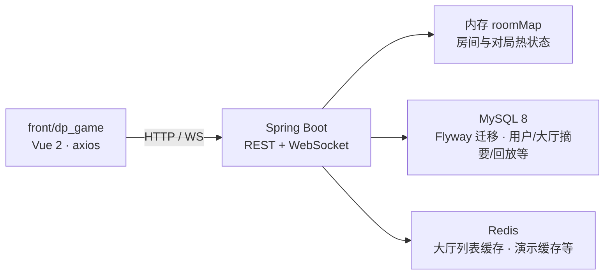
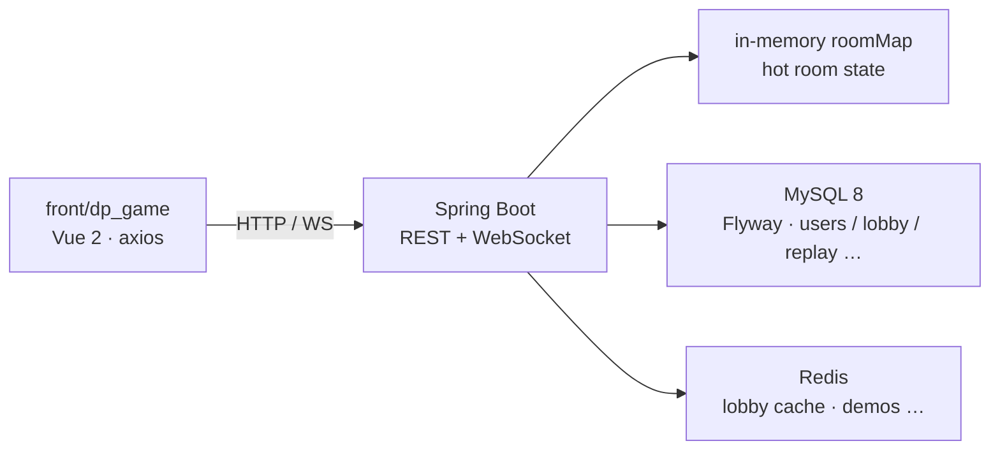

# MGDemoPlus（前瞻版本）

基于 **Spring Boot 3** 的 Web 演示项目：多人实时房间、卡牌对战流程、AI / 可选大模型玩家、对局回放与大厅匹配。前端 **`front/dp_game`**（**Vue 2** + **Vue Router** + **Vuex** + **Element UI** + **axios**）可由 **[`Dockerfile`](Dockerfile)** 多阶段构建打进后端 JAR（`npm ci` → `dist` → `src/main/resources/static` → `mvn package`），与 REST、WebSocket **同端口**发布。

**运维与迭代长说明：** 中文 **[README.ch.md](README.ch.md)** · 英文 **[README.en.md](README.en.md)**（同结构对照）。**本文与长文若与仓库内 Java/YAML/迁移/Flyway/Compose/前端实现不一致，以本仓库当前实现与脚本为准；专题文档可能滞后。**

---

## 给代码评审

- **项目是什么**：端到端演示「注册登录 → **大厅** / **快匹** → 进房 → **对局页** WebSocket + 轮询驱动的对局」，含规则型 NPC、可选方舟兼容接口的 LLM 座位、手牌历史落库与列表。
- **能演示什么**：Docker 一键起栈后对局走通；快匹建房 / 大厅分页 / JWT 防护 / 房间内推送；点开代码可看 `DpRoomServiceImpl`、`JoinableQuickMatchRoomIndex`、`DpQuickMatchPairingCoordinator`、NPC 引擎与 **Flyway `V1__init_schema.sql`** 初始化库表。
- **启动与配置**：`com.example.mgdemoplus.MgDemoPlusApplication` 启动前 **`LocalDotenvLoader`** 加载根目录 **`.env`** → **`System.setProperty`**，便于本地与容器注入（与 Spring **`application.yml`** 占位符配合）。
- **技术栈一句话**：Java 17、Spring Boot **3.5.11**（[`pom.xml`](pom.xml) parent）、Security/WebSocket、MyBatis-Plus、MySQL 8 + **Flyway**（[`pom.xml`](pom.xml) `flyway-core` / `flyway-mysql`）、Lettuce/Redis、Vue 2 前端。
- **后端包一览（一句）**：**`controller.dp`**（房间/用户/牌谱/曲库/好友邮箱等 REST）、**`dp.quickmatch` / `dp.quickmatch.pairing`**（可进房索引与配对协调）、**`dp.presence`**（在线/观战等）、**`websocket`**（对局房与快匹长连）、**`service.serviceImpl.dp.npc`**（规则 Bot 与 LLM 调用）、**`scheduler`**（如大厅 DB 与内存对齐，可条件开启）。
- **单实例房间模型（免责）**：**房间与对局热状态在 JVM 内存 `roomMap`**，默认可横向扩展不与 Redis 同步；多实例需要自行设计会话粘滞或共享状态（见 [docs/WEBSOCKET.md](docs/WEBSOCKET.md)）。**`mgdemoplus.dp-lobby-reconcile-enabled`** 多实例下需谨慎（每节点 `roomMap` 不一致时不宜强行对齐 DB 摘要）。
- **更深细节**：专题说明在 **[docs/README.md](docs/README.md)**。

---

## 怎么跑（最短路径）

仓库根目录：

```bash
docker compose up --build
```

- **经 Nginx**：[`docker/nginx/default.conf`](docker/nginx/default.conf) 对 **`server_name catandppoker.asia`**：监听 **80** 跳转 **HTTPS**，**443 ssl** 反代到 **`app:8088`**；本地对照 [`docker-compose.yml`](docker-compose.yml) 文件头注释使用 **`https://localhost`**（证书 **CN/SAN** 与 **server_name** 可能不一致，浏览器会告警；也可在 hosts 中把域名指向本机后访问）。专题说明仍见 [docs/NGINX.md](docs/NGINX.md)（可能与当前 Compose/Nginx 细节不完全同步）。
- **直连应用**：端口 **`8088`** 见 [`src/main/resources/application.yml`](src/main/resources/application.yml)。根目录 **`docker compose up --build`** 使用 [`docker-compose.yml`](docker-compose.yml) 时，**`app` 的 `8088:8088` 映射默认注释**，宿主机 **`http://localhost:8088` 通常不可达**——取消注释其中 **`ports`**，或改用 [`docker-compose.hub.yml`](docker-compose.hub.yml)（**`${APP_HOST_PORT:-8088}:8088`**）；本机 **`mvn spring-boot:run`** 可直接 **[http://localhost:8088](http://localhost:8088)**（**hash 路由**，如 **`/#/login`**——Vue Router 未显式 `history` 模式时为默认 hash）。

本机前后端分离、`.env`、Hub 镜像与 Flyway 注意点见 **[快速开始](#quick-start)**。

---

## 一张图读懂目录



---

## 项目一览

### 对局与房间

- 服务端实现完整回合流与结算（入口如 `DpRoomServiceImpl`）；多房间状态在 **`ConcurrentHashMap`（`roomMap`）**；房内写路径大量 **`synchronized (DpRoomBO)`**（房间对象监视器）串行化。
- 建房、密码、初始分、踢人批量等见 [docs/DPGAME.md](docs/DPGAME.md) 与 [docs/RoomUi.md](docs/RoomUi.md)。
- 大厅公开房列表以 **`dp_room_lobby`** 为权威摘要（表在 **Flyway V1** 中建），分页带 Redis 版本缓存（细节 [README.ch.md](README.ch.md) / [docs/Redis.md](docs/Redis.md)）。
- 对局可落库与按用户分页查询（概览 [docs/DP_PERSISTENCE_README.md](docs/DP_PERSISTENCE_README.md)）。**牌谱、好友、Shark 记忆（`dp_shark_opponent_profile`）、曲库元数据等均在 [`V1__init_schema.sql`](src/main/resources/db/migration/V1__init_schema.sql) 中定义**——当前仓库**仅有 V1** 迁移脚本，后续变更需新增 `V*__*.sql`。

### 主要 REST 前缀（实现核对）

| 前缀 | 说明 |
| ---- | ---- |
| **`/dpRoom`** | 建房、进退房、快匹、准备、下注、踢人、机器人生成、大厅列表等（[`DpRoomController`](src/main/java/com/example/mgdemoplus/controller/dp/DpRoomController.java)）。 |
| **`/dpUser`** | 注册、登录、资料（[`DpUserController`](src/main/java/com/example/mgdemoplus/controller/dp/DpUserController.java)）。 |
| **`/dp`** | 好友、邮箱、进房邀请、跟随观战等（[`DpFriendMailboxController`](src/main/java/com/example/mgdemoplus/controller/dp/DpFriendMailboxController.java)）。站点在线：`POST /dp/presence/site-heartbeat`（JWT）刷新 `last_seen_site`；`GET /dp/friends` 各行 `presence` 为 `OFFLINE` / `IDLE` / `IN_GAME`（房内态优先）。TTL：`mgdemoplus.dp-site-presence-ttl-ms`（默认 90s， env `MGDEMOPLUS_DP_SITE_PRESENCE_TTL_MS`）。兼容旧路径 `POST /dp/siteHeartbeat`。 |
| **`/dpHandHistory`** | 手牌历史列表/详情等。 |
| **`/dpMusic`** | 曲库上传/列表。 |
| **`/demo/*`、`/student`、`/movie`、`/upload`** | 示例与 Redis Lab（生产环境宜收紧或鉴权）。 |

白名单与 JWT 链见 [docs/JWT.md](docs/JWT.md)；**`permitAll`** 含 `` `/ws/**` ``（对局 WS 握手匿名；**快匹 WS** 在 Handler 内自行校验 **token + nickname**，见下）。

### 实时与匹配

- **对局页** WebSocket：**`/ws/dp-game?roomId=…`**；**可选查询参数 `nickname=`**（观战/视角快照等，服务端按实现过滤）。下行 JSON 与 **`GET /dpRoom/getNowRoom`** 同类摘要；上行支持 **`chatSend`**、**`roomMusicSync`** 等（以 [`DpGameRoomWebSocketHandler`](src/main/java/com/example/mgdemoplus/websocket/DpGameRoomWebSocketHandler.java) 为准）。
- **快匹** WebSocket：**`/ws/dp-quick-match?nickname=…&token=…`**（**必填**；握手内 **`JwtTokenService` 校验**，subject 须与 nickname 一致）。说明见 [docs/WEBSOCKET.md](docs/WEBSOCKET.md)。注册见 [`WebSocketGameRoomConfig`](src/main/java/com/example/mgdemoplus/config/WebSocketGameRoomConfig.java)（**`allowedOriginPatterns("*")`** 为演示便利，生产请收紧）。
- 大厅相关 REST：控制器 **`@RequestMapping("/dpRoom")`**，含 **`quickMatch2`** / **`quickMatchCancel2`** / **`publicRooms`** / **`publicRooms/query`**（[`DpRoomController.java`](src/main/java/com/example/mgdemoplus/controller/dp/DpRoomController.java)）。
- 快匹消费逻辑：**先**尝试将队列头玩家**冲刷进已有可加入公开房**；**若无桌且队列 ≥2 且队头两名昵称不同**，则 **`DpQuickMatchPairingCoordinator#attemptPairing`** 可 **`poll` 至多 `min(MAX_NEW_ROOM_BATCH, 队列人数)` 人**进**同一新房**并开局（`MAX_NEW_ROOM_BATCH` 不超过最大座位数）——而非仅「每次刚好两人一桌」的口语描述。
- **并发**：**`dpQuickMatchAssignmentLock`** 仍包裹 `DpRoomServiceImpl` 中整次 **`attemptQuickMatchPairing()` → `attemptPairing()`**；协调器与 **`JoinableQuickMatchRoomIndex`** 另有 **`defaultQmLock` / `indexLock`** 等，与单房监视器配合。详见 [docs/dp-quick-match-concurrency.md](docs/dp-quick-match-concurrency.md)（若文档写「旧锁已废弃」，以代码为准）。
- 大厅快匹 `quickMatch2` / 取消与流程说明见 [docs/dp-quick-match-flow.md](docs/dp-quick-match-flow.md)。
- 快匹队列单条等待超时约 **3 分钟**（`DEFAULT_QM_WAIT_MS`）；周期性清理间隔 **`mgdemoplus.dp-quick-match-prune-ms`**（默认 **30s**，[`DpRoomServiceImpl`](src/main/java/com/example/mgdemoplus/service/serviceImpl/dp/DpRoomServiceImpl.java)）。

### 账号与社交

- **Spring Security + JWT**（白名单见 [docs/JWT.md](docs/JWT.md)）；密码 **bcrypt** 摘要入库（**`CryptoUtil.bcryptEncode` / `bcryptMatches`**，与 [docs/DpUserPassword.md](docs/DpUserPassword.md) 应以**实现**对齐——若该文仍写 MD5，视为过期）。
- **主配置文件**为 **[`src/main/resources/application.yml`](src/main/resources/application.yml)**（无 **`application.properties`**）；环境变量映射见 [docs/ENV_README.md](docs/ENV_README.md)（文中若仍写 `application.properties`，以 **yml** 为准）。
- 好友与进房邀请邮箱 MVP：[docs/dp_friend_mailbox_mvp.md](docs/dp_friend_mailbox_mvp.md)。

### 前端（`front/dp_game`）要点

- **路由**：默认 **hash**（如 **`/#/home`**、**`#/game/:roomId`**）；主要页面在 **`src/components/`**（如 **`game.vue`**、**`home.vue`**）；**无路由级 `beforeEach`**，**401** 由 **`main.js`** 中 axios 响应拦截统一 **`router.replace('/login')`**。
- **HTTP**：开发 **`axios.defaults.baseURL = '/dev-api'`**（[`main.js`](front/dp_game/src/main.js)），**[`vue.config.js`](front/dp_game/vue.config.js)** 将 **`/dev-api`** 转发后端并 **`pathRewrite` 剥前缀**；生产 **`baseURL` 为空**，与后端静态资源同域。房间/快匹等多为组件内 **`this.$http('/dpRoom/…')`**；**`/dp` 好友/邮箱** 封装在 **[`src/api/api.dpSocial.js`](front/dp_game/src/api/api.dpSocial.js)**，由 **`Vuex` 模块 `dpMailbox`** 使用；对局房间状态主要在 **`dpGame`**（**无 `actions`**，由 **`game.vue`** 等 **`commit`**）。**站点心跳**：已登录且非登录/注册页时 **`main.js`** 经 **`syncDpSiteHeartbeat`** 定时 **`POST /dp/presence/site-heartbeat`**（与 **`POST /dpRoom/heartbeat`** 并行）；间隔可 **`GET /dp/presence/site-heartbeat/config`**（匿名）读取，与 **`mgdemoplus.dp-site-presence-ttl-ms`** 对齐。
- **WebSocket**：开发环境用 **`/dp-ws/dp-game`**、**`/dp-ws/dp-quick-match`** 代理到后端 **`/ws/...`**，避免与 dev server HMR 的 **`/ws`** 冲突；生产直连 **`/ws/dp-game`**、**`/ws/dp-quick-match`**。对局 WS 含**指数退避重连**（见 `game.vue`）。
- **嵌入 JAR**：以 **[`Dockerfile`](Dockerfile)** 多阶段 **`COPY dist → src/main/resources/static`** 为准；**`pom.xml` 未使用** `frontend-maven-plugin` 一类自动打前端——本地纯 **`mvn package`** 若无手工拷贝则不一定含最新 `dist`。

### AI 与曲库

- 规则型 NPC 引擎与模块说明：[docs/ai/npc-engine/README.md](docs/ai/npc-engine/README.md)；翻前统一决策流：[docs/ai/npc-preflop-unified-decision-flow.md](docs/ai/npc-preflop-unified-decision-flow.md)。
- 可选 **`BOT_LLM`**（方舟兼容 Chat API）：**`dp.llm.ark.*`** / 环境变量 **`ARK_*`** 见 [docs/ENV_README.md](docs/ENV_README.md)、[README.en.md](README.en.md) 中大模型小节。
- 曲库 BGM 上传/列表与对局内同步见 [docs/DpMusicWebPath.md](docs/DpMusicWebPath.md)；Redis 用途（含非房间共享状态说明）见 [docs/Redis.md](docs/Redis.md)。

---

## 技术栈

| 层级       | 技术 |
| ---------- | ---- |
| 后端       | Java **17**、**Spring Boot 3.5.11**（[`pom.xml`](pom.xml)）、Spring Web / Security / WebSocket、**MyBatis-Plus**、**PageHelper**、**Druid**、MySQL 驱动、**Lettuce**（Redis）、**JJWT** |
| 前端（游戏） | **Vue 2**、Vue Router（默认 **hash**）、**Vuex**（**`dpGame`、`dpMailbox`**）、**Element UI**、axios（**`front/dp_game`**） |
| 数据       | **MySQL 8**（默认库 `school_db`）、**Redis 7**、**Flyway**（`classpath:db/migration`；当前基线为 **[`V1__init_schema.sql`](src/main/resources/db/migration/V1__init_schema.sql)**；依赖为 **`flyway-core`** / **`flyway-mysql`**，无单独 **`spring-boot-starter-flyway`**，见 [`pom.xml`](pom.xml)） |
| 构建与部署 | **Maven**、**Docker** / **Docker Compose**（[`Dockerfile`](Dockerfile) 多阶段含 **Node 20** 构建前端）、**Nginx**（[`Dockerfile.nginx`](Dockerfile.nginx) + [`docker/nginx/default.conf`](docker/nginx/default.conf)） |

对局页布局与 CSS 分层等实现细节见 [front/dp_game/docs/GAME_LAYOUT_TUNING_README.md](front/dp_game/docs/GAME_LAYOUT_TUNING_README.md)。**界面主题与「猫咪派对」展示文案**（仅前端）见 [front/dp_game/docs/README.md](front/dp_game/docs/README.md) 与同目录主题说明。前端专题索引用 **[`front/dp_game/docs/README.md`](front/dp_game/docs/README.md)**（**`front/dp_game` 根目录无 README** 时以该索引为准）。

---

## 环境要求

- **JDK 17**、**Maven 3.6+**
- 开发前端：**Node.js**（与 `front/dp_game/package.json` 中 Vue CLI 5 兼容；**Docker 构建**使用 **Node 20**，见 [`Dockerfile`](Dockerfile)）
- 可选：**Docker 20+**、**Docker Compose 2+**

---

<a id="quick-start"></a>

## 快速开始

### 1. 克隆与配置

```bash
git clone <你的仓库地址> MGDemoPlus
cd MGDemoPlus
copy .env.example .env
# 编辑 .env：MYSQL_ROOT_PASSWORD、REDIS_PASSWORD、JWT_SECRET、ARK_* 等（勿提交含真实密钥的 .env）
```

环境变量与 **[src/main/resources/application.yml](src/main/resources/application.yml)**（Spring Boot relaxed binding）的映射见 **[docs/ENV_README.md](docs/ENV_README.md)**。

### 2. Docker 一键（推荐）

在**仓库根目录**执行：

```bash
.\build-push-hub.ps1
docker compose -f docker-compose.hub.yml up -d
```

或本机构建：

```bash
docker compose up --build
```

Hub 镜像与 GitHub Actions 发布说明见 **[docs/DOCKER.md](docs/DOCKER.md)**；工作流 **`on.push.branches`** 当前为 **`desensitization-pre`**（见 [.github/workflows/docker-publish.yml](.github/workflows/docker-publish.yml)）。**[`docker-compose.hub.yml`](docker-compose.hub.yml)** 可能注入 **`ARK_RESPONSE_JSON_OBJECT`** 等额外环境变量；**[`docker-compose.yml`](docker-compose.yml)** 未逐项等价——以各文件及运行容器 `env` 为准。

- **数据库（Compose + Flyway）**：[`docker-compose.yml`](docker-compose.yml) 中 **`SPRING_DATASOURCE_URL`** 指向 **`jdbc:mysql://mysql:3306/school_db...`**，MySQL 服务仅 **`MYSQL_DATABASE: school_db`** + 命名卷 **`mysql_data`**，**无** `./docker-entrypoint-initdb.d` 类 SQL init；**表结构在应用启动时由 Flyway** 执行 `classpath:db/migration`（**当前为 V1 全库初始化**）。若本地旧数据卷与 **V1** 冲突，开发机可对 `mysql_data` 执行 `docker compose down -v` 删卷重来（**清空数据**；生产须另做备份与迁移）。
- **经 Nginx**：同上「怎么跑」——**`https://localhost`**（[`docker-compose.yml`](docker-compose.yml) 注释）、[`docker/nginx/default.conf`](docker/nginx/default.conf)。
- **直连应用**：同上——[`docker-compose.yml`](docker-compose.yml) **默认不映射宿主 8088**；[`docker-compose.hub.yml`](docker-compose.hub.yml) **默认映射 `${APP_HOST_PORT:-8088}:8088`**；本机 **`mvn`** 直连 **[http://localhost:8088](http://localhost:8088)**。

默认 MySQL / Redis 宿主机端口等见 **[docs/DOCKER.md](docs/DOCKER.md)**。本机 **`docker-compose.yml`** 与 Hub 编排的**卷**差异（bind mount **`./docker-data/uploads`** vs 命名卷 **`mgdemo_uploads`**）见 [docs/DOCKER.md](docs/DOCKER.md)。

### 3. 本机开发（后端 + 前端分离）

**后端**（工作目录为**仓库根目录**，以便加载根目录 `.env`）：

```bash
mvn spring-boot:run
# 或
mvn -q -DskipTests package && java -jar target/MGDemoPlus-0.0.1-SNAPSHOT.jar
```

**前端**：

```bash
cd front/dp_game
npm install
npm run dev
```

**开发代理**：以 **[`front/dp_game/vue.config.js`](front/dp_game/vue.config.js)** 为准——**`/dev-api` → 后端**（常 **8088**）、**`/dp-ws` → `/ws`**（避免 HMR 与对局 WS 路径冲突）。大厅/对局主题与 `localStorage` 键说明见 **[front/dp_game/docs/THEME_BINDING_README.md](front/dp_game/docs/THEME_BINDING_README.md)**。

---

## 测试（抽查）

与 **dp** 相关的单元/组件测试（**非** HTTP/WS 端到端）包括但不限于：`JoinableQuickMatchRoomIndexTest`、`DpQuickMatchPairingCoordinatorTest`、`DpFriendSocialServiceFollowSpectateTest`、`DpFriendPresenceServiceTest` 等；**`MgDemoPlusApplicationTests`** 做 Spring 上下文加载。**`DpRoomController` / 公共 WS 的集成级用例较少**——以代码与需求为准逐步补全。

---

## 仓库结构（概览）

```
MGDemoPlus/
├── src/main/java/com/example/mgdemoplus/   # Spring Boot 主工程
├── front/dp_game/                          # 游戏前端（Vue CLI）
├── docker/                                 # Nginx 等配置
├── docker-data/
├── docker-compose.yml
├── docker-compose.hub.yml
├── Dockerfile / Dockerfile.nginx
├── pom.xml
├── README.md                               # 本文件：中英对照主入口（上半中文 · 下半 English 同级结构）
├── README.ch.md                            # 中文长说明（可能滞后，以代码为准）
├── README.en.md                            # 英文长说明（可能滞后，以代码为准）
└── docs/                                   # 专题文档；总索引 docs/README.md
```

---

## 文档索引

- **文档总导航**：[docs/README.md](docs/README.md)
- **前端专题索引**：[front/dp_game/docs/README.md](front/dp_game/docs/README.md)
- **环境与变量**：[docs/ENV_README.md](docs/ENV_README.md)
- **Docker**：[docs/DOCKER.md](docs/DOCKER.md)
- **维护级长说明**：[README.ch.md](README.ch.md)（中文）· [README.en.md](README.en.md)（英文）

---

## 许可证与声明

**本项目仅为计算机技术学习与演示使用，采用虚拟积分，不涉及真实货币交易，不包含任何赌博相关功能。**

若本短版与**当前仓库实现**不一致，以 **Java/YAML 源码、`db/migration`、Compose/Dockerfile、`front/dp_game` 行为**为准，并优先修正长文档与 `docs/`，而非相反。

---

## English

**Spring Boot** demo focused on **multiplayer online strategy card play**: multi-room sessions, real-time battle flow, AI rule bots and optional Ark-compatible LLM seats, replay persistence, lobby matching. Frontend **`front/dp_game`** is **Vue 2 + Vue Router (default **hash**) + Vuex (`dpGame`, `dpMailbox`) + Element UI + axios**; production builds embed into the backend JAR via **[`Dockerfile`](Dockerfile)** (**Node build → `dist` → `src/main/resources/static` → Maven package**), same port as REST and WebSocket.

**Long-form ops notes:** **[README.ch.md](README.ch.md)** · **[README.en.md](README.en.md)**. **If this file or long reads disagree with the repo’s current Java/YAML, Flyway, Compose, or frontend code, trust the implementation first; topic docs may lag.**

### For reviewers / interviewers

- **What it is**: End-to-end demo from auth → **lobby** / **quick match** → room → **battle screen** (WebSocket + polling); JWT security; NPC + optional LLM; hand history persistence.
- **What to demo**: After `docker compose up --build`, play through a match; **quick-match room creation**, **lobby paging**, **JWT**, **in-room pushes**. If [`docker-compose.yml`](docker-compose.yml) **`app` `8088:8088`** stays commented, use **`https://localhost`** ([`docker/nginx/default.conf`](docker/nginx/default.conf)), [`docker-compose.hub.yml`](docker-compose.hub.yml), or uncomment **`8088:8088`** before **`http://localhost:8088/#/login`**. Code: `DpRoomServiceImpl`, `JoinableQuickMatchRoomIndex`, **`DpQuickMatchPairingCoordinator`**, NPC engine, **Flyway `V1__init_schema.sql`**.
- **Bootstrap**: `MgDemoPlusApplication` runs **`LocalDotenvLoader`** so root **`.env`** can set **`System` properties** before Spring starts.
- **Stack**: Java 17, Spring Boot **3.5.11** ([`pom.xml`](pom.xml)), Security/WebSocket, MyBatis-Plus, MySQL + Flyway (`flyway-core` / `flyway-mysql` in [`pom.xml`](pom.xml)), Redis (cache/login JTI, etc.), Vue 2 UI.
- **Single-instance caveat**: **Hot room state lives in JVM memory (`roomMap`)**; not Redis-shared by default—see **[docs/WEBSOCKET.md](docs/WEBSOCKET.md)** for scale-out notes. **Lobby reconcile scheduler** (`mgdemoplus.dp-lobby-reconcile-enabled`) is risky in multi-node setups if each node’s `roomMap` diverges.

### Shortest path to run

```bash
docker compose up --build
```

- Via Nginx: **`https://localhost`** per [`docker-compose.yml`](docker-compose.yml) header — [`docker/nginx/default.conf`](docker/nginx/default.conf) (`server_name catandppoker.asia`, **80→HTTPS**, **443** → `app:8088`; expect cert / hostname warnings unless you match `server_name` / hosts). See also [docs/NGINX.md](docs/NGINX.md) (may lag Compose/nginx details).
- Direct app: **`server.port` 8088** in [`src/main/resources/application.yml`](src/main/resources/application.yml). With root [`docker-compose.yml`](docker-compose.yml), **`app` port `8088:8088` is commented out** by default — **`http://localhost:8088` is usually unreachable** until you uncomment **`ports`**, switch to [`docker-compose.hub.yml`](docker-compose.hub.yml) (`${APP_HOST_PORT:-8088}:8088`), or run **`mvn spring-boot:run`** and open **[http://localhost:8088](http://localhost:8088)** (**hash** routes, e.g. **`/#/login`**).

Full steps below under **Quick start**.

### Architecture at a glance

Same diagram as Chinese section:



### Project overview

#### Rooms & gameplay

- Full server-side turns/settlement (`DpRoomServiceImpl`); **`ConcurrentHashMap` (`roomMap`)** holds sessions; many writes under **`synchronized (DpRoomBO)`**.
- Room creation, passwords, scores, bulk kicks — [docs/DPGAME.md](docs/DPGAME.md), [docs/RoomUi.md](docs/RoomUi.md) (**battle-screen** seat layout).
- Public lobby list SSOT **`dp_room_lobby`** (created in **Flyway V1**), Redis-backed paging cache — [README.en.md](README.en.md) / [docs/Redis.md](docs/Redis.md). **Shark profile table `dp_shark_opponent_profile`** and other MVP tables live in **[`V1__init_schema.sql`](src/main/resources/db/migration/V1__init_schema.sql)** — **only `V1` migration exists** in this repo today.
- Replay persistence — [docs/DP_PERSISTENCE_README.md](docs/DP_PERSISTENCE_README.md).

#### Main REST prefixes (as implemented)

| Prefix | Notes |
| ------ | ----- |
| **`/dpRoom`** | Rooms, quick match, lobby, bots — [`DpRoomController`](src/main/java/com/example/mgdemoplus/controller/dp/DpRoomController.java). |
| **`/dpUser`** | Auth/profile — [`DpUserController`](src/main/java/com/example/mgdemoplus/controller/dp/DpUserController.java). |
| **`/dp`** | Friends, mailbox, invites, spectate follow — [`DpFriendMailboxController`](src/main/java/com/example/mgdemoplus/controller/dp/DpFriendMailboxController.java). |
| **`/dpHandHistory`**, **`/dpMusic`** | Replay APIs, music library. |

JWT whitelist — [docs/JWT.md](docs/JWT.md). Handshake paths under `` `/ws/` `` are **`permitAll`**; **quick-match WS** still validates **JWT + nickname** inside [`DpQuickMatchWebSocketHandler`](src/main/java/com/example/mgdemoplus/websocket/DpQuickMatchWebSocketHandler.java).

#### Realtime & quick match / lobby

- **Battle WebSocket** **`/ws/dp-game?roomId=…`** with **optional `nickname=`** for spectator/view behavior — [`DpGameRoomWebSocketHandler`](src/main/java/com/example/mgdemoplus/websocket/DpGameRoomWebSocketHandler.java).
- **Quick-match WebSocket** **`/ws/dp-quick-match?nickname=&token=`** (required) — JWT verified in handler ([`WebSocketGameRoomConfig`](src/main/java/com/example/mgdemoplus/config/WebSocketGameRoomConfig.java)).
- Lobby REST **`@RequestMapping("/dpRoom")`**: **`quickMatch2`**, **`quickMatchCancel2`**, **`publicRooms`**, **`publicRooms/query`** ([`DpRoomController.java`](src/main/java/com/example/mgdemoplus/controller/dp/DpRoomController.java)).
- Pairing: flush into joinable public rooms first; if none and queue ≥2 with two distinct nicknames at head, coordinator may seat **up to `min(MAX_NEW_ROOM_BATCH, queue size)` players in one new table** (bounded by max seats)—not only “exactly two per new room” colloquially.
- **Concurrency**: **`dpQuickMatchAssignmentLock`** still wraps each **`attemptPairing()`** from the service; inner locks (`defaultQmLock`, `indexLock`, …) apply per [docs/dp-quick-match-concurrency.md](docs/dp-quick-match-concurrency.md) (**code wins** if docs say old locks are gone).
- Flow — [docs/dp-quick-match-flow.md](docs/dp-quick-match-flow.md); queue wait ~**3 min** + periodic prune **`mgdemoplus.dp-quick-match-prune-ms`**.

#### Accounts & social

- Spring Security + JWT — [docs/JWT.md](docs/JWT.md); **bcrypt** passwords (**`CryptoUtil`**) — if [docs/DpUserPassword.md](docs/DpUserPassword.md) still mentions MD5, treat as stale.
- **Spring config file is [`application.yml`](src/main/resources/application.yml)** (no `application.properties`). Env mapping — [docs/ENV_README.md](docs/ENV_README.md).
- Friends + invite mailbox MVP — [docs/dp_friend_mailbox_mvp.md](docs/dp_friend_mailbox_mvp.md).

#### Frontend (`front/dp_game`)

- **Default hash routing**; no global **`beforeEach`**; **401** → login via axios in [`main.js`](front/dp_game/src/main.js). Main pages under **`src/components/`** (e.g. **`game.vue`**, **`home.vue`**).
- **Dev** `axios` **`baseURL` `/dev-api`** + **`vue.config.js`** proxy; **prod** empty **`baseURL`**. Social APIs in **[`api.dpSocial.js`](front/dp_game/src/api/api.dpSocial.js)** + **`dpMailbox`**; many room calls are inline **`$http('/dpRoom/…')`**. **Vuex**: **`dpGame`** (no actions), **`dpMailbox`**.
- **WebSocket**: dev uses **`/dp-ws/...`** proxy to **`/ws/...`** (see [`vue.config.js`](front/dp_game/vue.config.js)); prod uses **`/ws/dp-game`** / **`/ws/dp-quick-match`**.

#### AI & music

- Rules NPC engine — [docs/ai/npc-engine/README.md](docs/ai/npc-engine/README.md); unified preflop flow — [docs/ai/npc-preflop-unified-decision-flow.md](docs/ai/npc-preflop-unified-decision-flow.md).
- Optional **`BOT_LLM`** (Ark-compatible Chat API) — **`dp.llm.ark.*`** / **`ARK_*`** — [docs/ENV_README.md](docs/ENV_README.md), LLM section in [README.en.md](README.en.md).
- BGM upload/list/sync — [docs/DpMusicWebPath.md](docs/DpMusicWebPath.md); Redis usage — [docs/Redis.md](docs/Redis.md).

UI/theme (“猫咪派对” copy is frontend-only) — **[front/dp_game/docs/README.md](front/dp_game/docs/README.md)** (use as **front/dp_game** doc index if no root README there).

### Stack

| Layer | Tech |
| ----- | ---- |
| Backend | Java **17**, **Spring Boot 3.5.11** ([`pom.xml`](pom.xml)), Web / Security / WebSocket, **MyBatis-Plus**, **PageHelper**, **Druid**, MySQL driver, **Lettuce** (Redis), **JJWT** |
| Frontend | **Vue 2**, Vue Router (**hash**), **Vuex** (`dpGame`, `dpMailbox`), **Element UI**, axios (`front/dp_game`) |
| Data | **MySQL 8** (default `school_db`), **Redis 7**, **Flyway** (`classpath:db/migration`; **[`V1__init_schema.sql`](src/main/resources/db/migration/V1__init_schema.sql)** baseline today; **`flyway-core`** / **`flyway-mysql`**, no **`spring-boot-starter-flyway`** — [`pom.xml`](pom.xml)) |
| Build / Ops | **Maven**, **Docker** / **Compose** ([`Dockerfile`](Dockerfile) frontend stage uses **Node 20**), **Nginx** |

Battle-screen layout/CSS layering — [front/dp_game/docs/GAME_LAYOUT_TUNING_README.md](front/dp_game/docs/GAME_LAYOUT_TUNING_README.md). **Theme & “猫咪派对” UI copy** (frontend-only) — [front/dp_game/docs/README.md](front/dp_game/docs/README.md) and sibling theme docs there.

### Requirements

- **JDK 17**, **Maven 3.6+**
- Frontend dev: **Node.js** compatible with Vue CLI 5 in `front/dp_game` (**Docker build** uses **Node 20** per [`Dockerfile`](Dockerfile))
- Optional: **Docker 20+**, **Compose 2+**

### Quick start

#### 1. Clone and env

```bash
git clone <your-repo-url> MGDemoPlus
cd MGDemoPlus
cp .env.example .env
# Edit .env — do not commit secrets
```

See [docs/ENV_README.md](docs/ENV_README.md) for mapping env vars to **[src/main/resources/application.yml](src/main/resources/application.yml)** (Spring Boot relaxed binding).

#### 2. Docker (recommended)

From repo root (PowerShell):

```powershell
.\build-push-hub.ps1
docker compose -f docker-compose.hub.yml up -d
```

Or local build:

```bash
docker compose up --build
```

GitHub Actions / Hub flows: **[docs/DOCKER.md](docs/DOCKER.md)**; workflow **`on.push.branches`** is **`desensitization-pre`** ([.github/workflows/docker-publish.yml](.github/workflows/docker-publish.yml)). **[`docker-compose.hub.yml`](docker-compose.hub.yml)** may add env such as **`ARK_RESPONSE_JSON_OBJECT`** not present in **[`docker-compose.yml`](docker-compose.yml)**—compare files.

- **DB (Compose + Flyway)**: [`docker-compose.yml`](docker-compose.yml) sets **`SPRING_DATASOURCE_URL`** to **`jdbc:mysql://mysql:3306/school_db...`**, MySQL has **`MYSQL_DATABASE: school_db`** + **`mysql_data`** volume only (**no** host-mounted `./docker-entrypoint-initdb.d` SQL init); **tables applied at app startup via Flyway** `classpath:db/migration` (**currently all in `V1`**). Old volumes conflicting with **V1**: dev reset `docker compose down -v` (**data loss**).
- **Via Nginx**: same as **Shortest path** — **`https://localhost`** ([`docker-compose.yml`](docker-compose.yml)), [`docker/nginx/default.conf`](docker/nginx/default.conf).
- **Direct app**: same — root Compose **does not publish host 8088 by default**; **hub** compose maps **`${APP_HOST_PORT:-8088}:8088`** ([`docker-compose.hub.yml`](docker-compose.hub.yml)); local **`mvn`** → **[http://localhost:8088](http://localhost:8088)**.

Ports and compose/hub volume differences — **[docs/DOCKER.md](docs/DOCKER.md)**.

#### 3. Local dev (split)

Backend (from repo root):

```bash
mvn spring-boot:run
```

Frontend:

```bash
cd front/dp_game
npm install
npm run dev
```

Theme/dev proxy: **[front/dp_game/docs/THEME_BINDING_README.md](front/dp_game/docs/THEME_BINDING_README.md)**, **[`front/dp_game/vue.config.js`](front/dp_game/vue.config.js)** (`/dev-api`, `/dp-ws`).

### Tests (spot-check)

Unit/component tests around dp include `JoinableQuickMatchRoomIndexTest`, `DpQuickMatchPairingCoordinatorTest`, `DpFriendSocialServiceFollowSpectateTest`, …; **`MgDemoPlusApplicationTests`** loads the Spring context. **Full HTTP/WS integration coverage for rooms is thin**—extend as needed.

### Repo layout (overview)

```
MGDemoPlus/
├── src/main/java/com/example/mgdemoplus/
├── front/dp_game/
├── docker/
├── docker-data/
├── docker-compose.yml
├── docker-compose.hub.yml
├── Dockerfile / Dockerfile.nginx
├── pom.xml
├── README.md
├── README.ch.md
├── README.en.md
└── docs/
```

### Documentation

- **Index:** **[docs/README.md](docs/README.md)**
- **Frontend index:** **[front/dp_game/docs/README.md](front/dp_game/docs/README.md)**
- **Env:** [docs/ENV_README.md](docs/ENV_README.md)
- **Docker:** [docs/DOCKER.md](docs/DOCKER.md)
- **Long-form:** [README.ch.md](README.ch.md) (Chinese) · [README.en.md](README.en.md) (English) — **may lag code**

### Statement

**This project is for technical learning and demonstration only. It uses virtual points, involves no real currency, and does not provide gambling-related functionality.**

If this overview disagrees with the current repo, trust the implementation, `db/migration`, Compose/Dockerfile, and `front/dp_game` behavior, and update long docs and `docs/` accordingly.
