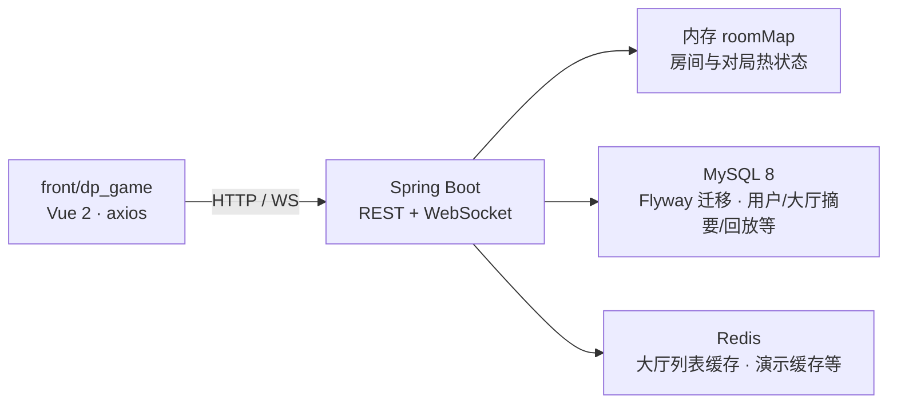
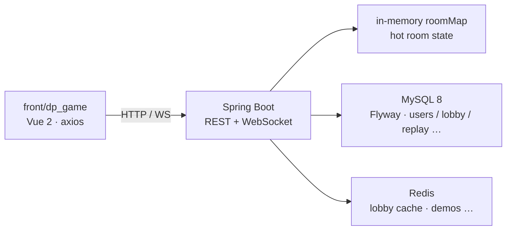

# MGDemoPlus（NPC 前瞻演示）

基于 **Spring Boot 3** 的 Web 演示项目：多人实时房间、卡牌对战流程、AI / 可选大模型玩家、对局回放与大厅匹配。前端 **`front/dp_game`**（Vue 2 + Vuex + Element UI）可由 **`Dockerfile`** 打进后端 JAR，与 REST、WebSocket **同端口**发布。

**运维与迭代长说明：** 中文 **[README.ch.md](README.ch.md)** · 英文 **[README.en.md](README.en.md)**（同结构对照）。

---

## 给代码评审

- **项目是什么**：端到端演示「注册登录 → **大厅** / **快匹** → 进房 → **对局页** WebSocket + 轮询驱动的对局」，含规则型 NPC、可选方舟兼容接口的 LLM 座位、手牌历史落库与列表。
- **能演示什么**：Docker 一键起栈后对局走通；快匹建房 / 大厅分页 / JWT 防护 / 房间内推送；点开代码可看 `DpRoomServiceImpl`、`JoinableQuickMatchRoomIndex`、NPC 引擎与 Flyway 初始化库表。
- **技术栈一句话**：Java 17、Spring Boot **3.5.11**（[`pom.xml`](pom.xml) parent）、Security/WebSocket、MyBatis-Plus、MySQL 8 + **Flyway**（[`pom.xml`](pom.xml) `flyway-core` / `flyway-mysql`）、Lettuce/Redis、Vue 2 前端。
- **单实例房间模型（免责）**：**房间与对局热状态在 JVM 内存 `roomMap`**，默认可横向扩展不与 Redis 同步；多实例需要自行设计会话粘滞或共享状态（见 [docs/WEBSOCKET.md](docs/WEBSOCKET.md)）。
- **更深细节**：专题说明在 **[docs/README.md](docs/README.md)**；与本文冲突时以代码与 `docs/`、长版 README 为准。

---

## 怎么跑（最短路径）

仓库根目录：

```bash
docker compose up --build
```

- **经 Nginx**：[`docker/nginx/default.conf`](docker/nginx/default.conf) 对 **`server_name catandppoker.asia`**：监听 **80** 跳转 **HTTPS**，**443 ssl** 反代到 **`app:8088`**；本地对照 [`docker-compose.yml`](docker-compose.yml) 文件头注释使用 **`https://localhost`**（自签证书浏览器会告警）。专题说明仍见 [docs/NGINX.md](docs/NGINX.md)（可能与当前 Compose/Nginx 细节不完全同步）。
- **直连应用**：端口 **`8088`** 见 [`src/main/resources/application.yml`](src/main/resources/application.yml)。根目录 **`docker compose up --build`** 使用 [`docker-compose.yml`](docker-compose.yml) 时，**`app` 的 `8088:8088` 映射默认注释**，宿主机 **`http://localhost:8088` 通常不可达**——取消注释其中 **`ports`**，或改用 [`docker-compose.hub.yml`](docker-compose.hub.yml)（**`${APP_HOST_PORT:-8088}:8088`**）；本机 **`mvn spring-boot:run`** 可直接 **[http://localhost:8088](http://localhost:8088)**（hash 路由如 **`/#/login`**）。

本机前后端分离、`.env`、Hub 镜像与 Flyway 注意点见 **[快速开始](#quick-start)**。

---

## 一张图读懂目录



---

## 项目一览

### 对局与房间

- 服务端实现完整回合流与结算（入口如 `DpRoomServiceImpl`）；多房间状态在 **`ConcurrentHashMap`（`roomMap`）**。
- 建房、密码、初始分、踢人批量等见 [docs/DPGAME.md](docs/DPGAME.md) 与 [docs/RoomUi.md](docs/RoomUi.md)。
- 大厅公开房列表以 `dp_room_lobby` 为权威摘要，分页带 Redis 版本缓存（细节 [README.ch.md](README.ch.md) / [docs/Redis.md](docs/Redis.md)）。
- 对局可落库与按用户分页查询（概览 [docs/DP_PERSISTENCE_README.md](docs/DP_PERSISTENCE_README.md)）。

### 实时与匹配

- **对局页** WebSocket：**`/ws/dp-game`**；**快匹**队列：**`/ws/dp-quick-match`**（[`WebSocketGameRoomConfig.java`](src/main/java/com/example/mgdemoplus/config/WebSocketGameRoomConfig.java)）；说明见 [docs/WEBSOCKET.md](docs/WEBSOCKET.md)。
- 大厅相关 REST：控制器 **`@RequestMapping("/dpRoom")`**，含 **`quickMatch2`** / **`quickMatchCancel2`** / **`publicRooms`** / **`publicRooms/query`**（[`DpRoomController.java`](src/main/java/com/example/mgdemoplus/controller/dp/DpRoomController.java)）。
- 大厅快匹 `quickMatch2` / 取消与「满两人自动建房」流程见 [docs/dp-quick-match-flow.md](docs/dp-quick-match-flow.md)。
- 单 JVM 内并发与锁策略见 [docs/dp-quick-match-concurrency.md](docs/dp-quick-match-concurrency.md)。
- 快匹队列单条等待超时约 **3 分钟**（`DEFAULT_QM_WAIT_MS`，[`DpRoomServiceImpl.java`](src/main/java/com/example/mgdemoplus/service/serviceImpl/dp/DpRoomServiceImpl.java)）。

### 账号与社交

- **Spring Security + JWT**（白名单见 [docs/JWT.md](docs/JWT.md)）；密码 **bcrypt** 入库（[docs/DpUserPassword.md](docs/DpUserPassword.md)）。
- 好友与进房邀请邮箱 MVP：[docs/dp_friend_mailbox_mvp.md](docs/dp_friend_mailbox_mvp.md)。

### AI 与曲库

- 规则型 NPC 引擎与模块说明：[docs/ai/npc-engine/README.md](docs/ai/npc-engine/README.md)；翻前统一决策流：[docs/ai/npc-preflop-unified-decision-flow.md](docs/ai/npc-preflop-unified-decision-flow.md)。
- 可选 **`BOT_LLM`**（方舟兼容 Chat API）：变量与约束见 [docs/ENV_README.md](docs/ENV_README.md)、[README.en.md](README.en.md) 中大模型小节。
- 曲库 BGM 上传/列表与对局内同步见 [docs/DpMusicWebPath.md](docs/DpMusicWebPath.md)；Redis 用途（含非房间共享状态说明）见 [docs/Redis.md](docs/Redis.md)。

---

## 技术栈

| 层级       | 技术 |
| ---------- | ---- |
| 后端       | Java **17**、**Spring Boot 3.5.11**（[`pom.xml`](pom.xml)）、Spring Web / Security / WebSocket、**MyBatis-Plus**、**PageHelper**、**Druid**、MySQL 驱动、**Lettuce**（Redis）、**JJWT** |
| 前端（游戏） | **Vue 2**、Vue Router、**Vuex**、**Element UI**、axios（`front/dp_game`） |
| 数据       | **MySQL 8**（默认库 `school_db`）、**Redis 7**、**Flyway**（`classpath:db/migration`；依赖为 **`flyway-core`** / **`flyway-mysql`**，无单独 **`spring-boot-starter-flyway`**，见 [`pom.xml`](pom.xml)） |
| 构建与部署 | **Maven**、**Docker** / **Docker Compose**、**Nginx**（反向代理与 WS 转发） |

对局页布局与 CSS 分层等实现细节见 [front/dp_game/docs/GAME_LAYOUT_TUNING_README.md](front/dp_game/docs/GAME_LAYOUT_TUNING_README.md)。**界面主题与「猫咪派对」展示文案**（仅前端）见 [front/dp_game/docs/README.md](front/dp_game/docs/README.md) 与同目录主题说明。

---

## 环境要求

- **JDK 17**、**Maven 3.6+**
- 开发前端：**Node.js**（与 `front/dp_game/package.json` 中 Vue CLI 5 兼容）
- 可选：**Docker 20+**、**Docker Compose 2+**

---

<a id="quick-start"></a>

## 快速开始

### 1. 克隆与配置

```bash
git clone <你的仓库地址> MGDemoPlus
cd MGDemoPlus
copy .env.example .env
# 编辑 .env：MYSQL_ROOT_PASSWORD、REDIS_PASSWORD、JWT_SECRET、ARK_* 等（勿提交含真实密钥的 .env）
```

环境变量与 **[src/main/resources/application.yml](src/main/resources/application.yml)**（Spring Boot relaxed binding）的映射见 **[docs/ENV_README.md](docs/ENV_README.md)**。

### 2. Docker 一键（推荐）

在**仓库根目录**执行：

```bash
.\build-push-hub.ps1
docker compose -f docker-compose.hub.yml up -d
```

或本机构建：

```bash
docker compose up --build
```

Hub 镜像与 GitHub Actions 发布说明见 **[docs/DOCKER.md](docs/DOCKER.md)**；工作流 **`on.push.branches`** 当前为 **`desensitization-pre`**（见 [.github/workflows/docker-publish.yml](.github/workflows/docker-publish.yml)）。

- **数据库（Compose + Flyway）**：[`docker-compose.yml`](docker-compose.yml) 中 **`SPRING_DATASOURCE_URL`** 指向 **`jdbc:mysql://mysql:3306/school_db...`**，MySQL 服务仅 **`MYSQL_DATABASE: school_db`** + 命名卷 **`mysql_data`**，**无** `./docker-entrypoint-initdb.d` 类 SQL init；**表结构在应用启动时由 Flyway** 执行 `classpath:db/migration`。若本地旧数据卷与 **V1** 冲突，开发机可对 `mysql_data` 执行 `docker compose down -v` 删卷重来（**清空数据**；生产须另做备份与迁移）。
- **经 Nginx**：同上「怎么跑」——**`https://localhost`**（[`docker-compose.yml`](docker-compose.yml) 注释）、[`docker/nginx/default.conf`](docker/nginx/default.conf)。
- **直连应用**：同上——[`docker-compose.yml`](docker-compose.yml) **默认不映射宿主 8088**；[`docker-compose.hub.yml`](docker-compose.hub.yml) **默认映射 `${APP_HOST_PORT:-8088}:8088`**；本机 **`mvn`** 直连 **[http://localhost:8088](http://localhost:8088)**。

默认 MySQL / Redis 宿主机端口等见 **[docs/DOCKER.md](docs/DOCKER.md)**。

### 3. 本机开发（后端 + 前端分离）

**后端**（工作目录为**仓库根目录**，以便加载根目录 `.env`）：

```bash
mvn spring-boot:run
# 或
mvn -q -DskipTests package && java -jar target/MGDemoPlus-0.0.1-SNAPSHOT.jar
```

**前端**：

```bash
cd front/dp_game
npm install
npm run dev
```

开发环境代理与接口前缀以 `vue.config.js` 为准（常见为 `dev-api` 转发到后端）。大厅/对局主题与 `localStorage` 键说明见 **[front/dp_game/docs/THEME_BINDING_README.md](front/dp_game/docs/THEME_BINDING_README.md)**。

---

## 仓库结构（概览）

```
MGDemoPlus/
├── src/main/java/com/example/mgdemoplus/   # Spring Boot 主工程
├── front/dp_game/                          # 游戏前端（Vue CLI）
├── docker/                                 # Nginx 等配置
├── docker-data/
├── docker-compose.yml
├── docker-compose.hub.yml
├── Dockerfile / Dockerfile.nginx
├── pom.xml
├── README.md                               # 本文件：中英对照主入口（上半中文 · 下半 English 同级结构）
├── README.ch.md                            # 中文长说明
├── README.en.md                            # 英文长说明
└── docs/                                   # 专题文档；总索引 docs/README.md
```

---

## 文档索引

- **文档总导航**：[docs/README.md](docs/README.md)
- **环境与变量**：[docs/ENV_README.md](docs/ENV_README.md)
- **Docker**：[docs/DOCKER.md](docs/DOCKER.md)
- **维护级长说明**：[README.ch.md](README.ch.md)（中文）· [README.en.md](README.en.md)（英文）

---

## 许可证与声明

**本项目仅为计算机技术学习与演示使用，采用虚拟积分，不涉及真实货币交易，不包含任何赌博相关功能。**

若本短版与代码不一致，以 **[README.ch.md](README.ch.md)** / **[README.en.md](README.en.md)** 与 **[docs/README.md](docs/README.md)** 为准。

---

## English

**Spring Boot** demo focused on **multiplayer online strategy card play**: multi-room sessions, real-time battle flow, AI rule bots and optional Ark-compatible LLM seats, replay persistence, lobby matching. Frontend **`front/dp_game`** is **Vue 2 + Vue Router + Vuex + Element UI**; production builds embed into the backend JAR via **`Dockerfile`**, same port as REST and WebSocket.

**Long-form ops notes:** **[README.ch.md](README.ch.md)** · **[README.en.md](README.en.md)**.

### For reviewers / interviewers

- **What it is**: End-to-end demo from auth → **lobby** / **quick match** → room → **battle screen** (WebSocket + polling); JWT security; NPC + optional LLM; hand history persistence.
- **What to demo**: After `docker compose up --build`, play through a match; **quick-match room creation**, **lobby paging**, **JWT**, **in-room pushes**. If [`docker-compose.yml`](docker-compose.yml) **`app` `8088:8088`** stays commented, use **`https://localhost`** ([`docker/nginx/default.conf`](docker/nginx/default.conf)), [`docker-compose.hub.yml`](docker-compose.hub.yml), or uncomment **`8088:8088`** before **`http://localhost:8088/#/login`**. Code: `DpRoomServiceImpl`, `JoinableQuickMatchRoomIndex`, NPC engine, Flyway migrations.
- **Stack**: Java 17, Spring Boot **3.5.11** ([`pom.xml`](pom.xml)), Security/WebSocket, MyBatis-Plus, MySQL + Flyway (`flyway-core` / `flyway-mysql` in [`pom.xml`](pom.xml)), Redis (cache), Vue 2 UI.
- **Single-instance caveat**: **Hot room state lives in JVM memory (`roomMap`)**; not Redis-shared by default—see **[docs/WEBSOCKET.md](docs/WEBSOCKET.md)** for scale-out notes.

### Shortest path to run

```bash
docker compose up --build
```

- Via Nginx: **`https://localhost`** per [`docker-compose.yml`](docker-compose.yml) header — [`docker/nginx/default.conf`](docker/nginx/default.conf) (`server_name catandppoker.asia`, **80→HTTPS**, **443** → `app:8088`; self-signed cert warnings expected). See also [docs/NGINX.md](docs/NGINX.md) (may lag Compose/nginx details).
- Direct app: **`server.port` 8088** in [`src/main/resources/application.yml`](src/main/resources/application.yml). With root [`docker-compose.yml`](docker-compose.yml), **`app` port `8088:8088` is commented out** by default — **`http://localhost:8088` is usually unreachable** until you uncomment **`ports`**, switch to [`docker-compose.hub.yml`](docker-compose.hub.yml) (`${APP_HOST_PORT:-8088}:8088`), or run **`mvn spring-boot:run`** and open **[http://localhost:8088](http://localhost:8088)** (hash routes, e.g. **`/#/login`**).

Full steps below under **Quick start**.

### Architecture at a glance

Same diagram as Chinese section:



### Project overview

#### Rooms & gameplay

- Full server-side turns/settlement (`DpRoomServiceImpl`); **`ConcurrentHashMap` (`roomMap`)** holds sessions.
- Room creation, passwords, scores, bulk kicks — [docs/DPGAME.md](docs/DPGAME.md), [docs/RoomUi.md](docs/RoomUi.md) (**battle-screen** seat layout).
- Public lobby list SSOT `dp_room_lobby`, Redis-backed paging cache — [README.en.md](README.en.md) / [docs/Redis.md](docs/Redis.md).
- Replay persistence — [docs/DP_PERSISTENCE_README.md](docs/DP_PERSISTENCE_README.md).

#### Realtime & quick match / lobby

- **Battle screen** WebSocket **`/ws/dp-game`**; **quick match** **`/ws/dp-quick-match`** ([`WebSocketGameRoomConfig.java`](src/main/java/com/example/mgdemoplus/config/WebSocketGameRoomConfig.java)) — [docs/WEBSOCKET.md](docs/WEBSOCKET.md).
- Lobby REST **`@RequestMapping("/dpRoom")`**: **`quickMatch2`**, **`quickMatchCancel2`**, **`publicRooms`**, **`publicRooms/query`** ([`DpRoomController.java`](src/main/java/com/example/mgdemoplus/controller/dp/DpRoomController.java)).
- **`quickMatch2`** / cancel / auto room when two players — [docs/dp-quick-match-flow.md](docs/dp-quick-match-flow.md); concurrency — [docs/dp-quick-match-concurrency.md](docs/dp-quick-match-concurrency.md).
- Queue wait ~**3 min** (`DEFAULT_QM_WAIT_MS`, [`DpRoomServiceImpl.java`](src/main/java/com/example/mgdemoplus/service/serviceImpl/dp/DpRoomServiceImpl.java)).

#### Accounts & social

- Spring Security + JWT — [docs/JWT.md](docs/JWT.md); bcrypt passwords — [docs/DpUserPassword.md](docs/DpUserPassword.md).
- Friends + invite mailbox MVP — [docs/dp_friend_mailbox_mvp.md](docs/dp_friend_mailbox_mvp.md).

#### AI & music

- Rules NPC engine — [docs/ai/npc-engine/README.md](docs/ai/npc-engine/README.md); unified preflop flow — [docs/ai/npc-preflop-unified-decision-flow.md](docs/ai/npc-preflop-unified-decision-flow.md).
- Optional **`BOT_LLM`** (Ark-compatible Chat API) — [docs/ENV_README.md](docs/ENV_README.md), LLM section in [README.en.md](README.en.md).
- BGM upload/list/sync — [docs/DpMusicWebPath.md](docs/DpMusicWebPath.md); Redis usage — [docs/Redis.md](docs/Redis.md).

UI/theme (“猫咪派对” copy is frontend-only) — **[front/dp_game/docs/README.md](front/dp_game/docs/README.md)** and **[front/dp_game/docs/](front/dp_game/docs/)**.

### Stack

| Layer | Tech |
| ----- | ---- |
| Backend | Java **17**, **Spring Boot 3.5.11** ([`pom.xml`](pom.xml)), Web / Security / WebSocket, **MyBatis-Plus**, **PageHelper**, **Druid**, MySQL driver, **Lettuce** (Redis), **JJWT** |
| Frontend | **Vue 2**, Vue Router, **Vuex**, **Element UI**, axios (`front/dp_game`) |
| Data | **MySQL 8** (default `school_db`), **Redis 7**, **Flyway** (`classpath:db/migration`; **`flyway-core`** / **`flyway-mysql`**, no **`spring-boot-starter-flyway`** — [`pom.xml`](pom.xml)) |
| Build / Ops | **Maven**, **Docker** / **Compose**, **Nginx** |

Battle-screen layout/CSS layering — [front/dp_game/docs/GAME_LAYOUT_TUNING_README.md](front/dp_game/docs/GAME_LAYOUT_TUNING_README.md). **Theme & “猫咪派对” UI copy** (frontend-only) — [front/dp_game/docs/README.md](front/dp_game/docs/README.md) and sibling theme docs there.

### Requirements

- **JDK 17**, **Maven 3.6+**
- Frontend dev: **Node.js** compatible with Vue CLI 5 in `front/dp_game`
- Optional: **Docker 20+**, **Compose 2+**

### Quick start

#### 1. Clone and env

```bash
git clone <your-repo-url> MGDemoPlus
cd MGDemoPlus
cp .env.example .env
# Edit .env — do not commit secrets
```

See [docs/ENV_README.md](docs/ENV_README.md) for mapping env vars to **[src/main/resources/application.yml](src/main/resources/application.yml)** (Spring Boot relaxed binding).

#### 2. Docker (recommended)

From repo root (PowerShell):

```powershell
.\build-push-hub.ps1
docker compose -f docker-compose.hub.yml up -d
```

Or local build:

```bash
docker compose up --build
```

GitHub Actions / Hub flows: **[docs/DOCKER.md](docs/DOCKER.md)**; workflow **`on.push.branches`** is **`desensitization-pre`** ([.github/workflows/docker-publish.yml](.github/workflows/docker-publish.yml)).

- **DB (Compose + Flyway)**: [`docker-compose.yml`](docker-compose.yml) sets **`SPRING_DATASOURCE_URL`** to **`jdbc:mysql://mysql:3306/school_db...`**, MySQL has **`MYSQL_DATABASE: school_db`** + **`mysql_data`** volume only (**no** host-mounted `./docker-entrypoint-initdb.d` SQL init); **tables applied at app startup via Flyway** `classpath:db/migration`. Old volumes conflicting with **V1**: dev reset `docker compose down -v` (**data loss**).
- **Via Nginx**: same as **Shortest path** — **`https://localhost`** ([`docker-compose.yml`](docker-compose.yml)), [`docker/nginx/default.conf`](docker/nginx/default.conf).
- **Direct app**: same — root Compose **does not publish host 8088 by default**; **hub** compose maps **`${APP_HOST_PORT:-8088}:8088`** ([`docker-compose.hub.yml`](docker-compose.hub.yml)); local **`mvn`** → **[http://localhost:8088](http://localhost:8088)**.

Ports: **[docs/DOCKER.md](docs/DOCKER.md)**.

#### 3. Local dev (split)

Backend (from repo root):

```bash
mvn spring-boot:run
```

Frontend:

```bash
cd front/dp_game
npm install
npm run dev
```

Theme/dev proxy: **[front/dp_game/docs/THEME_BINDING_README.md](front/dp_game/docs/THEME_BINDING_README.md)**, `vue.config.js`.

### Repo layout (overview)

```
MGDemoPlus/
├── src/main/java/com/example/mgdemoplus/
├── front/dp_game/
├── docker/
├── docker-data/
├── docker-compose.yml
├── docker-compose.hub.yml
├── Dockerfile / Dockerfile.nginx
├── pom.xml
├── README.md
├── README.ch.md
├── README.en.md
└── docs/
```

### Documentation

- **Index:** **[docs/README.md](docs/README.md)**
- **Env:** [docs/ENV_README.md](docs/ENV_README.md)
- **Docker:** [docs/DOCKER.md](docs/DOCKER.md)
- **Long-form:** [README.ch.md](README.ch.md) (Chinese) · [README.en.md](README.en.md) (English)

### Statement

**This project is for technical learning and demonstration only. It uses virtual points, involves no real currency, and does not provide gambling-related functionality.**

If this overview disagrees with code, trust **[README.ch.md](README.ch.md)** / **[README.en.md](README.en.md)** and **[docs/README.md](docs/README.md)**.
