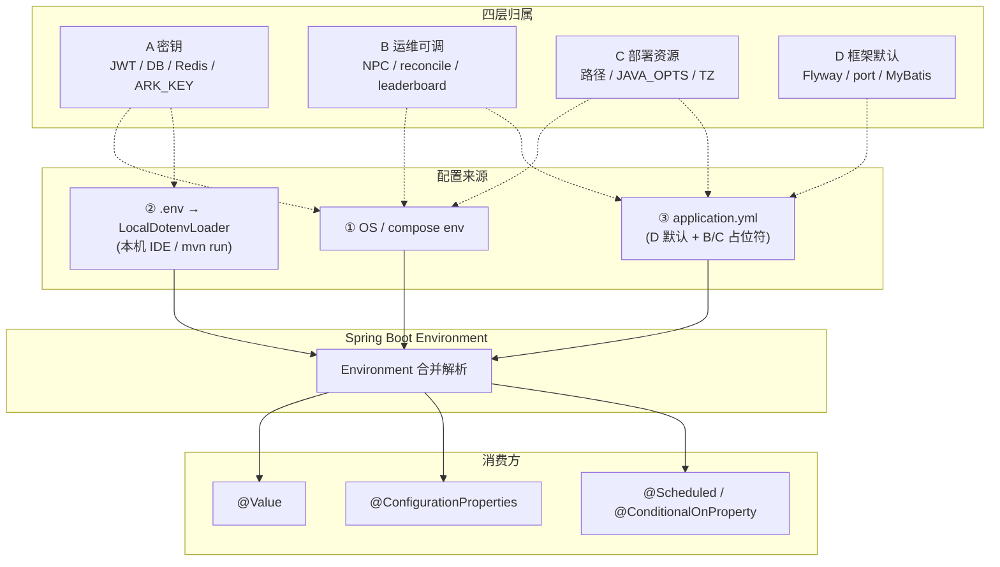

# MGDemoPlus 配置分层规范

> **文档性质**：方案 Agent 交付；**不写业务 Java、不 git commit/push**。  
> **实现方**：Agent-2 按本文拆分 `application.yml`、`.env.example`、`docker-compose*.yml`。  
> **扫描基准**：仓库当前 `application.yml` + Java `@Value` / `@ConfigurationProperties` + compose（2026-05-24）。

---

## 1. 四层定义

| 层 | 名称 | 存放真值 | 典型内容 | 进 Git？ |
|----|------|----------|----------|----------|
| **A** | 密钥 | 仅 **env**（`.env` / compose `environment`） | JWT、DB/Redis 口令、方舟 `ARK_API_KEY` 等 | **否**（仅 `.env.example` 空占位） |
| **B** | 运维开关 / 可调 | env 可覆盖；yml 保留 `${ENV:默认}` | NPC 桌边话、规则思考延时、大厅 reconcile、排行榜同步、站点在线 TTL 等 | yml **结构+默认** 进 Git；生产值在 env |
| **C** | 部署路径 / 资源 | **compose 为主** + env 传入容器 | 上传目录、JVM、`TZ`、日志路径、Docker 内 JDBC/Redis 主机名 | compose 模板进 Git；路径/口令按环境在 compose 或 env |
| **D** | 产品 / 框架默认 | **`application.yml` 写死或弱默认** | Flyway、MyBatis、port、multipart、JWT 过期时长、PageHelper 等 | **是** |

### 1.1 读取顺序（优先级从高到低）

```text
① 操作系统 / docker compose 注入的环境变量（System.getenv）
② 根目录 .env → LocalDotenvLoader → System.setProperty（仅当 ① 未设置同名键）
③ application.yml 中的字面默认值或 ${ENV:default} 的 default 段
```

实现见 `src/main/java/com/example/mgdemoplus/config/LocalDotenvLoader.java`、`MgDemoPlusApplication.main`。

**Docker 生产**：镜像内**不依赖**磁盘 `.env`；宿主机 compose 读 `.env` 后通过 `environment:` 注入进程环境变量（与 LocalDotenvLoader 无关）。

### 1.2 示意图



### 1.3 改某类配置要不要 rebuild 镜像？

| 变更类型 | 本地 `mvn spring-boot:run` | Docker 生产（`image:` 拉取/构建） |
|----------|---------------------------|-----------------------------------|
| **A** 密钥（env / compose） | 改 `.env` 或 IDE 环境变量 → **重启进程** | 改 compose / 宿主机 `.env` → **`docker compose up -d` 重建 app 容器**；**不需 rebuild 镜像** |
| **B** 运维开关（env 覆盖 yml） | 改 env → **重启** | 改 compose env → **重启 app 容器**；**不需 rebuild** |
| **C** 路径 / JVM / TZ / 卷 | 改 env 或 compose volumes → **重启** | 改 compose `environment` / `volumes` → **重启**；**不需 rebuild** |
| **D** yml 字面量（port、Flyway、JWT expiration 等） | 保存 yml → **重启**（classpath 热读） | yml 打进 jar → **必须 `docker build` / CI 推新镜像** 后部署 |
| **D** 仅注释掉的 `logging:` 块启用 | 同 D | 同 D（需新镜像） |
| compose 中 **mysql/redis 口令**（非 app） | N/A | 改 env → **重启对应服务**；数据卷内口令已初始化时需额外迁移策略 |

**经验法则**：凡只动 **环境变量 / compose**，不动 jar 内 `application.yml` → **不 rebuild**。凡改 `src/main/resources/application.yml` 且生产用预构建镜像 → **要 rebuild + 换 tag**。

---

## 2. 分文件存放规范

### 2.1 `src/main/resources/application.yml`

**职责**：结构骨架 + **D 层默认** + 全部 **B/C 的 `${ENV:default}`** 占位符 + 分层注释模板。

**目标形态（Agent-2 落地，本文不直接改文件）**：

```yaml
# =============================================================================
# D — 产品/框架默认（改这里 → Docker 需 rebuild 镜像）
# =============================================================================
spring:
  application:
    name: MGDemoPlus
  flyway:
    locations: classpath:db/migration
    baseline-on-migrate: true
  # ... datasource 结构见下 B/C ...
  servlet:
    multipart:
      max-file-size: 80MB
      max-request-size: 80MB
  mvc:
    async:
      request-timeout: -1

server:
  port: 8088

mybatis-plus:
  mapper-locations: classpath*:mapper/**/*.xml
  configuration:
    log-impl: org.apache.ibatis.logging.slf4j.Slf4jImpl

pagehelper:
  helper-dialect: mysql
  reasonable: true
  support-methods-arguments: true

mgdemoplus:
  jwt:
  expiration:
    time: 259200000   # D：约 3 天，产品默认

# =============================================================================
# A — 密钥（yml 仅 ${ENV:弱默认}，真值在 .env / compose，勿提交）
# =============================================================================
  jwt:
    secret: ${JWT_SECRET:abcdefghhgfedcbaabcdefghhgfedcba}

spring:
  datasource:
    url: ${SPRING_DATASOURCE_URL:jdbc:mysql://localhost:3307/school_db?...}
    username: ${SPRING_DATASOURCE_USERNAME:root}
    password: ${SPRING_DATASOURCE_PASSWORD:mgdemo_root}
  data:
    redis:
      host: ${SPRING_DATA_REDIS_HOST:127.0.0.1}
      port: ${SPRING_DATA_REDIS_PORT:6380}
      password: ${SPRING_DATA_REDIS_PASSWORD:mgdemo_redis}

dp:
  llm:
    ark:
      api-key: ${ARK_API_KEY:}
      endpoint-id: ${ARK_ENDPOINT_ID:}
      base-url: ${ARK_BASE_URL:}

# =============================================================================
# B — 运维开关/可调（env 可覆盖；见 §3 标准环境变量名）
# =============================================================================
mgdemoplus:
  dp-lobby-reconcile-enabled: ${MGDEMOPLUS_DP_LOBBY_RECONCILE_ENABLED:true}
  dp-lobby-reconcile-ms: ${MGDEMOPLUS_DP_LOBBY_RECONCILE_MS:60000}
  # ... 其余 B 项 ...

dp:
  npc:
    table-talk:
      enabled: ${DP_NPC_TABLE_TALK_ENABLED:true}
    rule-think:
      enabled: ${DP_NPC_RULE_THINK_ENABLED:true}

# =============================================================================
# C — 部署路径/资源（compose 为主；本机可 .env 覆盖）
# =============================================================================
mgdemoplus:
  time-zone: ${MGDEMOPLUS_TIME_ZONE:Asia/Shanghai}
  images:
    file-location: ${MGDEMOPLUS_IMAGES_FILE_LOCATION:file:P:/javaworkspace/DPGameFiles/}
  music:
    file-location: ${MGDEMOPLUS_MUSIC_FILE_LOCATION:file:P:/javaworkspace/DPGameFiles/music/}

# logging:（当前整段注释 — 启用后 C 层 LOG_FILE）
#   file:
#     name: ${LOG_FILE:logs/mgdemoplus.log}
```

### 2.2 `.env.example`（仓库根目录）

**职责**：**A + B** 示例键名，**空值或占位**，分组注释；**勿含真实密钥**。

```dotenv
# =============================================================================
# A — 密钥（复制为 .env 后填写；勿提交 .env）
# =============================================================================
JWT_SECRET=
SPRING_DATASOURCE_PASSWORD=
SPRING_DATA_REDIS_PASSWORD=
ARK_API_KEY=
ARK_ENDPOINT_ID=
ARK_BASE_URL=

# =============================================================================
# B — 运维可调（可选；不填则用 application.yml 默认）
# =============================================================================
# MGDEMOPLUS_DP_LOBBY_RECONCILE_ENABLED=true
# MGDEMOPLUS_DP_LOBBY_RECONCILE_MS=60000
# DP_NPC_TABLE_TALK_ENABLED=true
# DP_NPC_RULE_THINK_ENABLED=true
# ARK_REASONING_EFFORT=
# ARK_THINKING_TYPE=
# ARK_RESPONSE_JSON_OBJECT=true

# =============================================================================
# C — 本机路径（Docker 开发 compose 通常已在 yml 注入，可不填）
# =============================================================================
# MGDEMOPLUS_IMAGES_FILE_LOCATION=file:P:/javaworkspace/DPGameFiles/
# MGDEMOPLUS_MUSIC_FILE_LOCATION=file:P:/javaworkspace/DPGameFiles/music/
# MGDEMOPLUS_TIME_ZONE=Asia/Shanghai
# LOG_FILE=logs/mgdemoplus.log
```

### 2.3 `docker-compose.yml` / `docker-compose-prod.yml`

**职责**：**C 为主** + 生产 **A/B 注入模板**；分组注释。

**app 服务 `environment` 目标分组**：

```yaml
environment:
  # --- C: JVM / 时区 ---
  JAVA_OPTS: "-Xms256m -Xmx800m"
  TZ: Asia/Shanghai

  # --- C: 容器内路径（配合 volumes mgdemo_uploads:/data/mgdemo-files）---
  MGDEMOPLUS_IMAGES_FILE_LOCATION: file:/data/mgdemo-files/
  MGDEMOPLUS_MUSIC_FILE_LOCATION: file:/data/mgdemo-files/music/
  MGDEMOPLUS_TIME_ZONE: Asia/Shanghai

  # --- C: Docker 网络内 JDBC / Redis（主机名 mysql / redis）---
  SPRING_DATASOURCE_URL: jdbc:mysql://mysql:3306/school_db?...
  SPRING_DATASOURCE_USERNAME: root
  SPRING_DATASOURCE_PASSWORD: mgdemo_root          # A：生产应换强口令
  SPRING_DATA_REDIS_HOST: redis
  SPRING_DATA_REDIS_PORT: "6379"
  SPRING_DATA_REDIS_PASSWORD: mgdemo_redis         # A

  # --- B: 运维可调（按需追加）---
  # MGDEMOPLUS_DP_LOBBY_RECONCILE_ENABLED: "true"
  # DP_NPC_RULE_THINK_ENABLED: "true"

  # --- A: 方舟 LLM（宿主机 .env 代入）---
  ARK_API_KEY: ${ARK_API_KEY:-}
  ARK_ENDPOINT_ID: ${ARK_ENDPOINT_ID:-}
  ARK_BASE_URL: ${ARK_BASE_URL:-}
  ARK_REASONING_EFFORT: ${ARK_REASONING_EFFORT:-}
  ARK_THINKING_TYPE: ${ARK_THINKING_TYPE:-}
  ARK_RESPONSE_JSON_OBJECT: ${ARK_RESPONSE_JSON_OBJECT:-true}

  # --- A: JWT（生产强烈建议显式设置）---
  # JWT_SECRET: ${JWT_SECRET:-}
```

**差异备忘**：`docker-compose.yml` 本地常用 `build: .`；`docker-compose-prod.yml` 用 `image: 1933886418/dpgame:v*`，并启用 `nginx`。监控栈（cadvisor/prometheus/grafana）仅 dev compose 存在。

---

## 3. JWT_SECRET 说明

| 项 | 说明 |
|----|------|
| yml 键 | `mgdemoplus.jwt.secret: ${JWT_SECRET:abcdefghhgfedcbaabcdefghhgfedcba}` |
| 可不填？ | **可以**。未设 `JWT_SECRET` 时使用 yml 弱默认（与 `JwtTokenService` 内 `DEV_FALLBACK_SECRET` 一致）。 |
| 长度 | UTF-8 **至少 32 字节**；不足时 `JwtTokenService` 构造器回退到开发用固定串（见 `security/JwtTokenService.java`）。 |
| 公网生产 | **强烈建议**单独设置 `JWT_SECRET`（≥32 随机字符），经 compose 注入；**不要**依赖 Git 内默认串。 |
| 轮换 | 轮换后已签发 token 全部失效；需通知用户重新登录。Redis `mgdemo:cache:login:{nickname}` jti 与 JWT 同 TTL。 |
| 层 | **A** — 仅 env / compose；yml 只保留占位与开发弱默认。 |

---

## 4. B/C 层标准环境变量名

Spring Boot **relaxed binding**：yml 中的 `kebab-case` / 点号路径 ↔ 环境变量 `UPPER_SNAKE_CASE`。

| yml 键 | 标准环境变量 | 层 | 当前 yml 默认 | 消费位置 |
|--------|--------------|-----|---------------|----------|
| `mgdemoplus.time-zone` | `MGDEMOPLUS_TIME_ZONE` | C | `Asia/Shanghai` | `AppTimeZoneConfig`, 排行榜周界 |
| `mgdemoplus.images.file-location` | `MGDEMOPLUS_IMAGES_FILE_LOCATION` | C | `file:P:/javaworkspace/DPGameFiles/` | `WebConfig`, `UploadController` |
| `mgdemoplus.music.file-location` | `MGDEMOPLUS_MUSIC_FILE_LOCATION` | C | `file:.../music/` | `WebConfig`, `DpMusicController` |
| `spring.datasource.url` | `SPRING_DATASOURCE_URL` | C/A | localhost:3307 | Spring DataSource |
| `spring.datasource.username` | `SPRING_DATASOURCE_USERNAME` | A/C | `root` | Spring DataSource |
| `spring.datasource.password` | `SPRING_DATASOURCE_PASSWORD` | A | `mgdemo_root` | Spring DataSource |
| `spring.data.redis.host` | `SPRING_DATA_REDIS_HOST` | C | `127.0.0.1` | Spring Redis |
| `spring.data.redis.port` | `SPRING_DATA_REDIS_PORT` | C | `6380` | Spring Redis |
| `spring.data.redis.password` | `SPRING_DATA_REDIS_PASSWORD` | A | `mgdemo_redis` | Spring Redis |
| `mgdemoplus.jwt.secret` | `JWT_SECRET` | A | 弱默认串 | `JwtTokenService` |
| `mgdemoplus.cache.music-list-ttl-seconds` | `MGDEMOPLUS_CACHE_MUSIC_LIST_TTL_SECONDS` | B | `300` | `DpRedisListCacheServiceImpl` |
| `mgdemoplus.cache.dp-room-public-rooms-ttl-seconds` | `MGDEMOPLUS_CACHE_DP_ROOM_PUBLIC_ROOMS_TTL_SECONDS` | B | `120`（代码默认） | `DpRoomHallServiceImpl` — **建议补 yml** |
| `mgdemoplus.dp-site-presence-ttl-ms` | `MGDEMOPLUS_DP_SITE_PRESENCE_TTL_MS` | B | `90000` | `DpSitePresenceService` |
| `mgdemoplus.dp-lobby-reconcile-enabled` | `MGDEMOPLUS_DP_LOBBY_RECONCILE_ENABLED` | B | `true` | `DpRoomLobbyReconcileScheduler` |
| `mgdemoplus.dp-lobby-reconcile-ms` | `MGDEMOPLUS_DP_LOBBY_RECONCILE_MS` | B | `60000` | `DpRoomLobbyReconcileScheduler` |
| `mgdemoplus.dp-quick-match-prune-ms` | `MGDEMOPLUS_DP_QUICK_MATCH_PRUNE_MS` | B | `30000` | `DpRoomServiceImpl` |
| `mgdemoplus.leaderboard.sync-enabled` | `MGDEMOPLUS_LEADERBOARD_SYNC_ENABLED` | B | `true` | `DpLeaderboardWeeklyRedisSyncScheduler` |
| `mgdemoplus.leaderboard.sync-interval-ms` | `MGDEMOPLUS_LEADERBOARD_SYNC_INTERVAL_MS` | B | `60000` | 同上 |
| `mgdemoplus.leaderboard.redis-ttl-days` | `MGDEMOPLUS_LEADERBOARD_REDIS_TTL_DAYS` | B | `14` | `DpLeaderboardRedisRepository` |
| `mgdemoplus.settle-persist.async-enabled` | `MGDEMOPLUS_SETTLE_PERSIST_ASYNC_ENABLED` | B | `true` | `DpSettlePersistenceDispatcher` |
| `mgdemoplus.settle-persist.queue-capacity` | `MGDEMOPLUS_SETTLE_PERSIST_QUEUE_CAPACITY` | B | `256` | `DpSettlePersistenceExecutorConfig` |
| `dp.npc.table-talk.enabled` | `DP_NPC_TABLE_TALK_ENABLED` | B | `true` | `DpNpcTableTalkProperties` |
| `dp.npc.table-talk.speak-probability` | `DP_NPC_TABLE_TALK_SPEAK_PROBABILITY` | B | （yaml 内未写，用 npc-lines） | `DpNpcTableTalkProperties` |
| `dp.npc.table-talk.settle-speak-probability` | `DP_NPC_TABLE_TALK_SETTLE_SPEAK_PROBABILITY` | B | （Java 默认 null） | `DpNpcTableTalkProperties` |
| `dp.npc.table-talk.min-interval-ms` | `DP_NPC_TABLE_TALK_MIN_INTERVAL_MS` | B | yml `2500` | `DpNpcTableTalkProperties` |
| `dp.npc.rule-think.enabled` | `DP_NPC_RULE_THINK_ENABLED` | B | `true` | `DpNpcRuleThinkProperties` |
| `dp.npc.rule-think.snap-probability` | `DP_NPC_RULE_THINK_SNAP_PROBABILITY` | B | `0.18` | `DpNpcRuleThinkProperties` |
| `dp.npc.rule-think.max-ms` | `DP_NPC_RULE_THINK_MAX_MS` | B | `4000` | 同上 |
| `dp.npc.rule-think.fast-min-ms` | `DP_NPC_RULE_THINK_FAST_MIN_MS` | B | `500` | 同上 |
| `dp.npc.rule-think.fast-max-ms` | `DP_NPC_RULE_THINK_FAST_MAX_MS` | B | `2000` | 同上 |
| `dp.npc.rule-think.fast-weight` | `DP_NPC_RULE_THINK_FAST_WEIGHT` | B | `0.70` | 同上 |
| `dp.npc.rule-think.slow-min-ms` | `DP_NPC_RULE_THINK_SLOW_MIN_MS` | B | `2000` | 同上 |
| `dp.npc.rule-think.slow-max-ms` | `DP_NPC_RULE_THINK_SLOW_MAX_MS` | B | `4000` | 同上 |
| `dp.npc.rule-think.slow-weight` | `DP_NPC_RULE_THINK_SLOW_WEIGHT` | B | `0.30` | 同上 |
| `dp.llm.ark.api-key` | `ARK_API_KEY` 或 `DP_LLM_ARK_API_KEY` | A | 空 | `DpLlmNpcDecisionService` |
| `dp.llm.ark.endpoint-id` | `ARK_ENDPOINT_ID` | A | 空 | 同上 |
| `dp.llm.ark.base-url` | `ARK_BASE_URL` | A | 空 | 同上 |
| `dp.llm.ark.reasoning-effort` | `ARK_REASONING_EFFORT` | B | 空 | 同上 |
| `dp.llm.ark.thinking-type` | `ARK_THINKING_TYPE` | B | 空 | 同上 |
| `dp.llm.ark.response-json-object` | `ARK_RESPONSE_JSON_OBJECT` | B | `true` | 同上 |
| `logging.file.name`（注释块） | `LOG_FILE` | C | `logs/mgdemoplus.log` | Spring Boot logging（当前未启用） |
| （compose 专有，yml 无） | `JAVA_OPTS` | C | `-Xms256m -Xmx800m` | `docker/docker-entrypoint-app.sh` |
| （compose 专有） | `TZ` | C | `Asia/Shanghai` | 容器 OS + entrypoint |

**Compose 基础设施（非 Spring，但属 A/C）**：

| 键 | 层 | 说明 |
|----|-----|------|
| `MYSQL_ROOT_PASSWORD` | A | mysql 服务 |
| `redis-server --requirepass` | A | redis 服务 command |
| `GF_SECURITY_ADMIN_PASSWORD` | A | grafana（仅 dev compose） |

---

## 5. 全量配置清单（摘要）

完整表格见 [`docs/refactor/config-inventory.md`](refactor/config-inventory.md)。以下为按块的层归属速查。

### 5.1 `application.yml` 每一键

| 路径 | 层 | env 占位 | 备注 |
|------|-----|----------|------|
| `spring.application.name` | D | — | `MGDemoPlus` |
| `spring.flyway.locations` | D | — | |
| `spring.flyway.baseline-on-migrate` | D | — | |
| `spring.autoconfigure.exclude` | D | — | 禁用默认 UserDetailsService |
| `spring.datasource.type` | D | — | Druid |
| `spring.datasource.driver-class-name` | D | — | |
| `spring.datasource.url` | C | `SPRING_DATASOURCE_URL` | |
| `spring.datasource.username` | A/C | `SPRING_DATASOURCE_USERNAME` | |
| `spring.datasource.password` | A | `SPRING_DATASOURCE_PASSWORD` | |
| `spring.datasource.druid.enable` | D | — | |
| `spring.devtools.restart.additional-paths` | D | — | 开发 |
| `spring.servlet.multipart.max-file-size` | D | — | 80MB |
| `spring.servlet.multipart.max-request-size` | D | — | 80MB |
| `spring.data.redis.host` | C | `SPRING_DATA_REDIS_HOST` | |
| `spring.data.redis.port` | C | `SPRING_DATA_REDIS_PORT` | |
| `spring.data.redis.password` | A | `SPRING_DATA_REDIS_PASSWORD` | |
| `spring.data.redis.database` | D | — | `0` |
| `spring.data.redis.timeout` | D | — | 3000ms |
| `spring.mvc.async.request-timeout` | D | — | `-1` SSE |
| `mgdemoplus.time-zone` | C | `MGDEMOPLUS_TIME_ZONE` | |
| `mgdemoplus.jwt.secret` | A | `JWT_SECRET` | |
| `mgdemoplus.jwt.expiration.time` | D | — | 259200000 ms |
| `mgdemoplus.cache.music-list-ttl-seconds` | B | `MGDEMOPLUS_CACHE_MUSIC_LIST_TTL_SECONDS` | |
| `mgdemoplus.dp-lobby-reconcile-enabled` | B | 建议补 `MGDEMOPLUS_DP_LOBBY_RECONCILE_ENABLED` | 当前 yml 字面量 |
| `mgdemoplus.dp-lobby-reconcile-ms` | B | 建议补占位 | |
| `mgdemoplus.dp-quick-match-prune-ms` | B | 建议补占位 | |
| `mgdemoplus.dp-site-presence-ttl-ms` | B | `MGDEMOPLUS_DP_SITE_PRESENCE_TTL_MS` | |
| `mgdemoplus.images.file-location` | C | `MGDEMOPLUS_IMAGES_FILE_LOCATION` | |
| `mgdemoplus.music.file-location` | C | `MGDEMOPLUS_MUSIC_FILE_LOCATION` | |
| `mgdemoplus.leaderboard.sync-interval-ms` | B | 建议补占位 | |
| `mgdemoplus.leaderboard.sync-enabled` | B | 建议补占位 | |
| `mgdemoplus.leaderboard.redis-ttl-days` | B | 建议补占位 | |
| `mgdemoplus.settle-persist.async-enabled` | B | `MGDEMOPLUS_SETTLE_PERSIST_ASYNC_ENABLED` | |
| `mgdemoplus.settle-persist.queue-capacity` | B | `MGDEMOPLUS_SETTLE_PERSIST_QUEUE_CAPACITY` | |
| `mybatis-plus.*` | D | — | |
| `pagehelper.*` | D | — | |
| `server.port` | D | — | 8088 |
| `dp.npc.table-talk.*` | B | `DP_NPC_TABLE_TALK_*` | 见 inventory |
| `dp.npc.rule-think.*` | B | `DP_NPC_RULE_THINK_*` | 见 inventory |
| `dp.llm.ark.*` | A/B | `ARK_*` | 见 §3 |
| `# logging:` 整块 | C/D | `LOG_FILE` | **当前注释**；启用后属 C |

### 5.2 代码有、yml 缺失

| 键 | 层 | 代码默认 | 建议 |
|----|-----|----------|------|
| `mgdemoplus.cache.dp-room-public-rooms-ttl-seconds` | B | `120`（`@Value` 默认） | **建议补 yml** + `${MGDEMOPLUS_CACHE_DP_ROOM_PUBLIC_ROOMS_TTL_SECONDS:120}` |
| `dp.npc.table-talk.settle-speak-probability` | B | null | 可选补 yml |
| `dp.npc.table-talk.speak-probability` | B | null（yml 注释示例） | 保持注释或 env 即可 |
| `SPRING_DATASOURCE_DRIVER_CLASS_NAME` | C | — | 仅 compose 注入，Spring Boot 通常可省略 |

### 5.3 `@ConfigurationProperties` 字段

**`DpNpcTableTalkProperties`**（`dp.npc.table-talk`）— `npc/tabletalk/DpNpcTableTalkConfig.java` 启用：

| 字段 | yml 键 | Java 默认 | 层 |
|------|--------|-----------|-----|
| `enabled` | `enabled` | `true` | B |
| `speakProbability` | `speak-probability` | null | B |
| `settleSpeakProbability` | `settle-speak-probability` | null | B |
| `minIntervalMs` | `min-interval-ms` | **8000**（Java）；yml 写 **2500** 以 yml 为准 | B |

**`DpNpcRuleThinkProperties`**（`dp.npc.rule-think`）— `npc/rulethink/DpNpcRuleThinkConfig.java` 启用：

| 字段 | yml 键 | 默认 | 层 |
|------|--------|------|-----|
| `enabled` | `enabled` | true | B |
| `snapProbability` | `snap-probability` | 0.18 | B |
| `maxMs` | `max-ms` | 4000 | B |
| `fastMinMs` / `fastMaxMs` / `fastWeight` | `fast-*` | 500/2000/0.70 | B |
| `slowMinMs` / `slowMaxMs` / `slowWeight` | `slow-*` | 2000/4000/0.30 | B |

---

## 6. 生产迁移 checklist（xftp 更新 prod compose）

负责人通过 xftp 更新服务器上 `docker-compose-prod.yml` / `.env` 时：

1. **备份**：当前 compose、`.env`、nginx 证书目录；记录正在运行的 **镜像 tag**（`1933886418/dpgame:v*`）。
2. **A 密钥**：确认 `JWT_SECRET`、`SPRING_DATASOURCE_PASSWORD`、`SPRING_DATA_REDIS_PASSWORD`、`ARK_*` 已在宿主机 `.env` 或 compose `environment`；**勿**把含真值的 `.env` 提交 Git。
3. **C 路径**：`MGDEMOPLUS_*_FILE_LOCATION` 与卷 `mgdemo_uploads:/data/mgdemo-files` 一致；xftp 上传的文件应落在该卷对应宿主路径（若 bind mount 则对齐路径）。
4. **C 网络**：`SPRING_DATASOURCE_URL` 主机名必须为 **`mysql`**（compose 服务名），Redis 为 **`redis`**；端口容器内 3306/6379，**不要**写宿主 3307/6380。
5. **B 多实例**：若未来多副本，部署前设 `MGDEMOPLUS_DP_LOBBY_RECONCILE_ENABLED=false`，避免幽灵房清理误删他节点大厅行（见 `README.md` / `docs/WEBSOCKET.md`）。
6. **JWT 轮换**：改 `JWT_SECRET` 会导致全员登出；选低峰期并通知。
7. **仅 env 变更**：`docker compose -f docker-compose-prod.yml up -d` 重建 **app** 即可，**无需** rebuild 镜像。
8. **yml 变更（D 层）**：需 CI 或本地 **build 新镜像** → 更新 compose `image:` tag → `pull` + `up -d`。
9. **Flyway**：新镜像若含更高 `V*.sql`，启动时自动迁移；**禁止**改已应用过的旧迁移脚本。
10. **验证**：`curl` 8088 健康、`/dpMusic/list`、登录 JWT、Redis/MySQL 连通；BOT_LLM 需 ARK 五项非空。
11. **回滚**：保留上一版 compose + 上一镜像 tag；`image:` 改回 + `up -d`。
12. **日志**：若启用 `logging.file.name`，宿主机需可写目录或通过 `LOG_FILE` 指到挂载卷。

---

## 7. P0 验收标准

| # | 验收项 | 通过条件 |
|---|--------|----------|
| 1 | 四层文档 | 本文 + `config-inventory.md` 覆盖 yml 全键与全部 `@Value` / `@ConfigurationProperties` |
| 2 | 读取顺序 | 文档与 `LocalDotenvLoader` 行为一致；Docker 不依赖镜像内 `.env` |
| 3 | A 不进 Git 真值 | `.env.example` 仅空占位；compose 生产口令可模板化但文档标明须换强口令 |
| 4 | B 可 env 覆盖 | inventory 中每个 B 项有标准 env 名；Agent-2 落地后 yml 为 `${ENV:default}` |
| 5 | C compose 模板 | prod/dev compose 注释分组含 JAVA_OPTS、TZ、路径、JDBC/Redis 主机名 |
| 6 | D 稳定默认 | Flyway/port/multipart/JWT expiration 等仍在 yml，改 D 文档明确需 rebuild |
| 7 | 缺失项 | `mgdemoplus.cache.dp-room-public-rooms-ttl-seconds` 标记「建议补 yml」 |
| 8 | JWT_SECRET | 文档说明可不填、生产建议单独设置 |
| 9 | rebuild 矩阵 | §1.3 与负责人对齐，无歧义 |
| 10 | 迁移 checklist | §6 可用于 xftp 生产更新 SOP |

---

## 8. 相关文件索引

| 文件 | 作用 |
|------|------|
| `src/main/resources/application.yml` | 当前唯一 Spring 配置 |
| `.env.example` | compose 用 ARK 五项模板（待 Agent-2 扩展 A/B） |
| `docker-compose.yml` / `docker-compose-prod.yml` | C + A/B 注入 |
| `src/main/java/com/example/mgdemoplus/config/LocalDotenvLoader.java` | 本机 .env → System.setProperty |
| `docker/docker-entrypoint-app.sh` | `JAVA_OPTS`、`TZ`、上传目录权限 |
| `docs/ENV_README.md` | 旧版 env 说明（可逐步指向本文） |
| `docs/refactor/config-inventory.md` | 全量参数表 |

---

## 变更说明（本次交付）

| 项 | 内容 |
|----|------|
| 新增 | `docs/CONFIG_LAYERS.md`（本文件） |
| 新增 | `docs/refactor/config-inventory.md` |
| 修改代码 / yml / compose | **无**（留给 Agent-2） |
