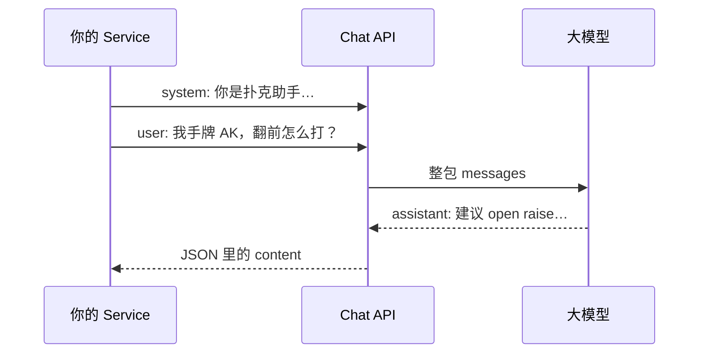

# 01 · LLM 与 Chat API 基础

> **写给谁**：AI 零基础，但会 Java、调过 HTTP 接口  
> **读完能做什么**：知道大模型是什么、Chat API 怎么对话、三种角色各干什么、token 和幻觉是啥，并能和「调 REST 接口」类比

---

## 1. LLM 是什么？（用一句话）

**LLM（Large Language Model，大语言模型）** 是一个 **读过海量文字、学会按概率接话** 的程序。

你可以把它想成：

- **不是** 查数据库返回固定答案  
- **不是** 真正「理解」世界像人一样  
- **而是** 根据你给的上下文，**续写最像合理回答的下一段文字**

所以它特别擅长：总结、翻译、写说明、按格式输出、扮演角色（例如扑克教练）。  
它不擅长：保证 100% 事实正确、精确数学（大数）、访问你服务器上 **没告诉它的** 私有数据。

---

## 2. Chat API：和 Java 调 REST 是一回事

MGDemoPlus 里调模型 **没有魔法**，就是 **HTTPS + JSON**，和你调 `/dpRoom/create` 一样：


| 你熟悉的 REST                             | Chat API                                |
| ------------------------------------- | --------------------------------------- |
| `POST` + JSON body                    | `POST` + JSON body                      |
| Header 里带 `Authorization: Bearer xxx` | 同样（API Key 当 Bearer token）              |
| 返回 JSON，你解析字段                         | 返回 JSON，解析 `choices[0].message.content` |
| 超时、4xx/5xx 要处理                        | 同样要设 timeout、看 status code              |


仓库里的 `OpenAiCompatibleChatClient` 就是用 JDK `HttpClient` 发请求，核心就三步：

1. 拼 JSON：`model`、`messages`（谁说了什么）
2. `POST` 到厂商 URL（默认火山方舟 OpenAI 兼容地址）
3. 从响应里取出 assistant 的回复文字

```java
// 概念上等价于（简化示意）
HttpRequest request = HttpRequest.newBuilder()
    .uri(URI.create("https://.../chat/completions"))
    .header("Authorization", "Bearer " + apiKey)
    .header("Content-Type", "application/json")
    .POST(HttpRequest.BodyPublishers.ofString(jsonBody))
    .build();
```

**结论**：会写 Spring Controller 调第三方 API，就已经具备调 LLM 的 80% 技能；剩下 20% 是 **messages 怎么组织**（下一篇 02 专讲）。

---

## 3. 三种角色：system / user / assistant

Chat API 用 **消息列表** 模拟对话，每条消息有一个 **role（角色）**：


| 角色            | 谁写的                | 干什么                                |
| ------------- | ------------------ | ---------------------------------- |
| **system**    | 你的 Java 代码         | **总说明书**：身份、纪律、输出格式。用户一般看不见        |
| **user**      | 用户输入，或你代码构造的「局面描述」 | **本轮要问的事**                         |
| **assistant** | 模型上一次回复            | **历史记录**；多轮对话时要把之前的 assistant 也发回去 |





**类比 MGDemoPlus**：

- **system** ≈ 游戏规则 + API 文档里写死的「接口契约」  
- **user** ≈ 前端这次 POST 的 body  
- **assistant** ≈ 上次接口返回，下次要带上的「会话状态」（若要做连续对话）

---

## 4. 本仓库已有例子：`DpLlmNpcDecisionService`

项目里 **已经在用 Chat API** 的地方：牌桌上的 **LLM 机器人**（`BOT_LLM` / `BOT_LLM_GLOBAL`）。

类路径：`src/main/java/com/example/mgdemoplus/npc/llm/DpLlmNpcDecisionService.java`

它做的事（用 01 的词汇描述）：

1. **system prompt** 很长：规定「你是 NLHE 决策引擎、必须输出一行 JSON、禁止 markdown…」
2. **user 消息** 不是人类打字，而是服务端生成的 **局面快照**（`LlmNpcUserSnapshot`：底池、跟注额、胜率估计等）
3. 调用 `OpenAiCompatibleChatClient.chatMessagesDetailed(...)` 发 HTTP
4. 解析 assistant 返回的 JSON → 转成 `FOLD` / `RAISE` 等游戏动作

所以：**LLM NPC 就是「用 Chat API 做结构化决策」的最小样本**。  
你学 Agent，可以先把它当成「只有一个 user 回合、输出 JSON 的聊天程序」。

`BOT_LLM_GLOBAL` 还会在同一手牌里保留 **多轮 user/assistant 历史**（见 `LlmNpcGlobalHandConversationStore`），那是 02 里「多轮对话」的实战版。

---

## 5. Token 是什么？

**Token** 可以粗理解为模型 **计费、限长的「字数块」**（不严格等于一个汉字或一个英文单词）。

你需要知道的 practical 事实：


| 概念           | 说明                                                 |
| ------------ | -------------------------------------------------- |
| **输入 token** | system + 全部历史 user/assistant + 本轮 user，**加在一起**算长度 |
| **输出 token** | 模型生成的 assistant 内容                                 |
| **上下文窗口**    | 一次请求能塞进去的 token 上限（常见 8K～128K，看模型）                 |
| **费用**       | 多数按「输入 + 输出」token 数计费                              |


**和 MGDemoPlus 的关系**：

- `DpLlmNpcDecisionService` 的 system prompt 很长 → 每次决策都占不少输入 token  
- 若将来做「项目文档助手 Agent」，把整本 `DPGAME.md` 塞进 prompt 会 **爆窗口、烧钱** → 所以要 RAG（03）只塞相关段落

**入门习惯**：开发时先看厂商控制台里的 token 用量；prompt 能短则短，重复纪律别写三遍。

---

## 6. 幻觉（Hallucination）

**幻觉** = 模型 **自信地编造** 不存在或错误的内容。

常见表现：

- 瞎编 API 路径（「快匹是 `GET /match`」—— 实际是 `POST /dpRoom/quickMatch2`）  
- 编造库表字段、编造你项目里没有的类名  
- 数学口算错，但语气像对的

**为什么会这样？**  
模型目标是「像合理文本」，不是「只说有据可查的事实」。没给资料时，它会 **猜**。

**怎么减轻？**（后面篇章细讲，这里先建立直觉）


| 手段                     | 作用                |
| ---------------------- | ----------------- |
| 写清 system：「不知道就说不知道」   | 降低瞎编勇气            |
| RAG：先检索文档再答（03）        | 给「开卷」材料           |
| Tool：查 MySQL 拿真实牌谱（04） | 事实由代码查，不由模型编      |
| 要求 JSON + schema 校验    | 格式错了就重试或 fallback |


---

## 7. 一次完整请求长什么样？（JSON 直觉）

OpenAI 兼容格式（与 `OpenAiCompatibleChatClient` 发出的一致）：

```json
{
  "model": "你的接入点模型 ID",
  "temperature": 0.2,
  "messages": [
    { "role": "system", "content": "你是 MGDemoPlus 学习助手，回答要简短。" },
    { "role": "user", "content": "WebSocket 游戏地址路径是什么？" }
  ]
}
```

响应里你主要关心：

```json
{
  "choices": [
    {
      "message": {
        "role": "assistant",
        "content": "根据文档，对局 WebSocket 路径是 /ws/dp-game …"
      }
    }
  ]
}
```

**Java 侧**：用 Jackson 读 `choices[0].message.content` 即可；NPC 代码还会处理 `reasoning_content` 等扩展字段（视厂商而定）。

---

## 8. 本地最小实验（可选）

1. 在 `.env` 或环境变量里配置 LLM Key 与 model id（与 `application.yml` 里 NPC 配置同源，见 `docs/ENV_README.md`）。
2. 写个 main 方法或单元测试，构造 `OpenAiCompatibleChatClient`，发一条 system + 一条 user。
3. 故意问：「MGDemoPlus 快匹接口的完整 URL 和方法？」—— 看模型是否幻觉；再对比 `docs/DPGAME.md` 里的真实定义。

这一步不需要改游戏逻辑，只是 **确认你能打通 HTTP**。

---

## 记忆小口诀

> **大模型接话茬，HTTP 调它不用怕；**  
> **system 定规矩，user 问本轮话；**  
> **assistant 是回音，历史多轮要带上；**  
> **token 算长度，幻觉靠查资料挡。**

---

**下一篇**：[02-prompt-engineering-basics.md](./02-prompt-engineering-basics.md) — 怎么写 system prompt、约束输出 JSON、扑克助手示例。