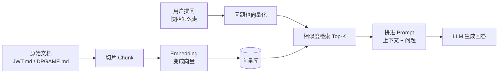

# 03 · RAG：让 AI 先查资料再回答

> **写给谁**：会 Java、会调 LLM API，但还没做过「知识库问答」的同学  
> **读完能做什么**：理解 RAG 解决什么问题、流程怎么走、和数据库怎么分工、在 MGDemoPlus 里怎么落地

---

## 1. RAG 解决什么问题？

大模型（LLM）有两个常见毛病：

| 问题 | 表现 | 例子 |
|------|------|------|
| **幻觉** | 没把握也编得像真的 | 问「快匹接口路径是什么」，它瞎编 `/dpRoom/match` |
| **不知道你的项目** | 训练数据里没有 MGDemoPlus 内部文档 | 问「JWT 白名单有哪些」，它只能猜 Spring Security 通用说法 |

**RAG（Retrieval-Augmented Generation，检索增强生成）** 的思路很简单：

> **先在你的文档里搜相关段落，再把搜到的内容塞进 prompt，让模型「开卷考试」。**

这样模型回答「快匹怎么走」时，依据的是 `docs/DPGAME.md`、`docs/dp-quick-match-flow.md` 里的真实文字，而不是凭空想象。

---

## 2. 完整流程（5 步）



### 2.1 切片（Chunk）

把长文档切成小段，每段几百字左右。

- 太大：检索不精准，塞进 prompt 浪费 token  
- 太小：上下文断裂，「接口 + 参数 + 备注」被拆散  

**MGDemoPlus 例子**：把 `docs/DPGAME.md` 里「REST 映射」表格、`docs/dp-quick-match-flow.md` 里「业务目标」各切成独立 chunk。

### 2.2 Embedding（向量化）

用 **Embedding 模型**（如 OpenAI `text-embedding-3-small`、国产大厂的 embedding 接口）把每段文字变成一串数字（向量，常见 768～1536 维）。

语义相近的句子，向量距离更近。  
「快速匹配怎么进房」和「quickMatch2 接口流程」会被搜到一起。

### 2.3 向量库检索

用户提问也先变成向量，在向量库里找 **最相似的 Top-K 段**（K 通常 3～8）。

### 2.4 塞进 Prompt

典型 prompt 结构：

```text
你是 MGDemoPlus 助手。请仅根据以下资料回答，资料不足就说「文档里没写」。

【检索到的资料】
--- chunk 1 ---
POST /dpRoom/quickMatch2 → quickMatchJoinQueueOrImmediate ...
--- chunk 2 ---
WebSocket /ws/dp-quick-match，握手需 nickname + token ...

【用户问题】
快匹怎么走？
```

### 2.5 LLM 回答

模型基于你给的资料组织自然语言答案，而不是只靠预训练记忆。

---

## 3. RAG 和数据库有什么区别？

很多人第一次会把 RAG 当成「又一个数据库」。其实分工不同：

| 维度 | RAG（向量库 + 文档） | 数据库（MySQL 等） |
|------|----------------------|-------------------|
| **存什么** | 说明书、流程、规则、FAQ | 实时业务数据 |
| **怎么查** | 语义相似（「快匹」≈「quickMatch2」） | 精确条件（`user_id = ? AND date = ?`） |
| **数据会不会变** | 文档更新不频繁，改了要重新索引 | 每局下注、每手牌谱都在变 |
| **典型用途** | 「这个功能怎么用？」「JWT 白名单有哪些？」 | 「我昨天赢了几局？」「当前房间还剩几个空位？」 |

**一句话**：RAG 管 **知识**；数据库管 **事实与状态**。

MGDemoPlus 里：

- 问「快匹 API 路径、WS 地址」→ **RAG** 查 `docs/DPGAME.md`  
- 问「我 2026-06-01 打了多少手牌」→ **Tool + 数据库**（见下一篇 `04-tool-function-calling.md`），不是 RAG

---

## 4. MGDemoPlus 实战例子

### 4.1 索引哪些文档？

入门阶段建议先索引 **稳定、只读** 的专题文档：

| 文档 | 能回答的问题 |
|------|--------------|
| `docs/JWT.md` | 怎么取当前用户、哪些路径要登录、WS 怎么验 token |
| `docs/DPGAME.md` | 房间 REST 列表、生命周期、快匹入口 `quickMatch2` |
| `docs/dp-quick-match-flow.md` | 快匹完整流程：先找公开房 → 入队 → 配对 → 跳转对局页 |

### 4.2 用户问：「快匹怎么走？」

**没有 RAG 时**，模型可能胡编接口或漏掉 WebSocket 步骤。

**有 RAG 时**，检索可能命中：

1. `DPGAME.md`：`POST /dpRoom/quickMatch2` → `quickMatchJoinQueueOrImmediate`  
2. `dp-quick-match-flow.md`：优先进已有公开房；没有则 FIFO 队列；满两人自动建房  
3. `dp-quick-match-flow.md`：大厅连 `/ws/dp-quick-match`，匹配成功后进 `/game/{roomId}`，再连 `/ws/dp-game`

模型据此组织答案，并可以提醒：HTTP 快匹需 JWT，且 **token 里的昵称要和参数 nickname 一致**（见 `JWT.md`）。

### 4.3 Java 侧最小实现思路（伪代码）

你会 Java 调 API，落地时可以这样想：

```java
// 1. 离线/启动时：读 md 文件 → 切片 → 调 embedding API → 存向量库
void indexDoc(Path mdFile) { ... }

// 2. 在线问答
String ask(String question) {
    List<String> chunks = vectorStore.search(embedding(question), topK=5);
    String prompt = buildPrompt(chunks, question);
    return llmClient.chat(prompt);
}
```

索引脚本可以做成 Maven 模块或 `@PostConstruct` 定时任务；问答接口挂在一个 `@RestController` 上即可。

---

## 5. 向量库选型（入门向）

| 方案 | 适合场景 | 优点 | 注意 |
|------|----------|------|------|
| **内存 Map** | 本地 demo、文档 < 几百段 | 零依赖，5 分钟跑通 | 重启要重建；不能多实例共享 |
| **Redis + 向量模块** | 项目已有 Redis（MGDemoPlus 已用 Redis 做大厅缓存） | 运维熟悉，延迟低 | 需 Redis Stack 或 RediSearch 向量能力；大规模要调参 |
| **PostgreSQL + pgvector** | 希望向量和业务 SQL 放一起 | 一个库搞定，事务友好 | 要额外装 pg；MGDemoPlus 主库是 MySQL，等于多一个组件 |

**建议路径**：

1. **第一周**：内存 + 几个 md 文件，验证「问快匹能答对」  
2. **文档变多**：迁 Redis 或 pgvector  
3. **别一上来就上复杂方案**——RAG 的效果 70% 来自「文档写得好 + 切片合理」，不是向量库品牌

---

## 6. 常见坑（提前知道少踩雷）

1. **只索引不更新**：改了 `JWT.md` 忘了重建索引，答案还是旧的  
2. **chunk 切太碎**：表格行和说明文字分开，检索到的只有半张表  
3. **不设边界**：prompt 里没写「资料不足就说不知道」，模型仍会幻觉  
4. **用 RAG 查实时数据**：「现在有几个公开房」应查 `DpRoomHallService` / 内存 `roomMap`，不是搜文档  

---

## 记忆小口诀

> **文档先切片，变成小向量；**  
> **问题来检索，相似段顶上；**  
> **知识开卷答，事实查库帮；**  
> **幻觉少一半，项目说得详。**

---

**下一篇**：[04-tool-function-calling.md](./04-tool-function-calling.md) — 当 RAG 只能「讲流程」，Tool 才能「帮你查牌谱、跳转页面」。
