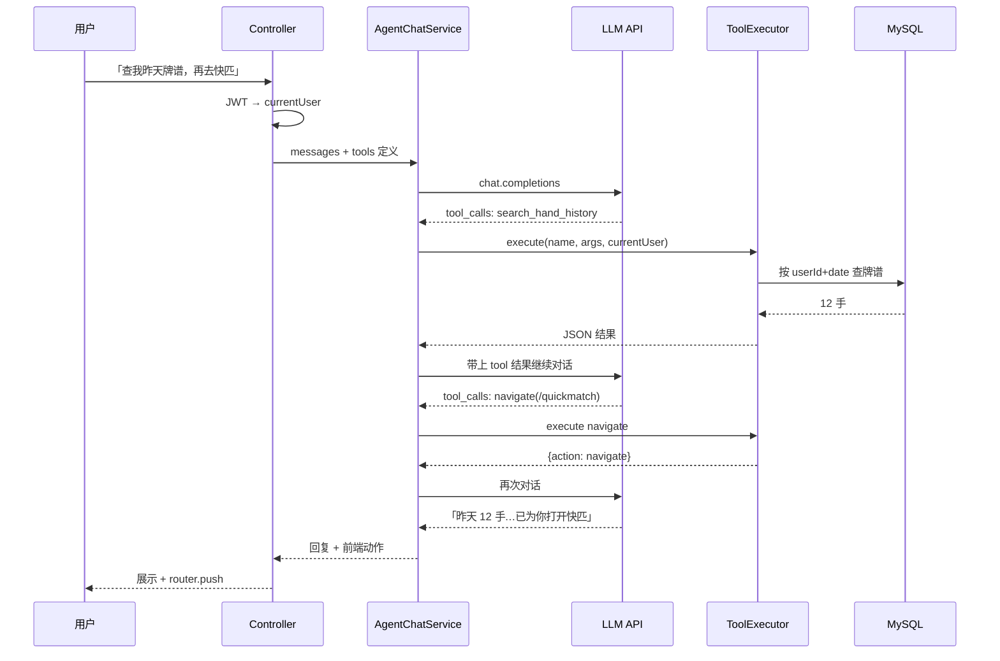

# 04 · Tool / Function Calling：给模型一双手

> **写给谁**：会 Java、会调 LLM API，想知道「模型说帮我查数据」时代码里谁真正执行  
> **前置阅读**：[03-rag-retrieval-augmented-generation.md](./03-rag-retrieval-augmented-generation.md)

---

## 1. Tool 是什么？

可以把 LLM 想成一个 **只会说话的大脑**。  
它知道很多通用知识，但 **不能直接**：

- 查你 MySQL 里的牌谱  
- 读当前 JWT 是谁  
- 让前端跳转到快匹页面  

**Tool（工具）就是模型的「手」**：模型决定「该调用哪个工具、传什么参数」，**真正干活的还是你的 Java 代码**。

```
用户：「帮我查昨天打了几手牌，然后带我去快匹」
        ↓
   LLM 思考（不执行 SQL）
        ↓
   返回：我要调用 search_hand_history 和 navigate
        ↓
   你的 Spring Service 执行查询 + 返回跳转指令
        ↓
   结果塞回 LLM → 组织成人话回复用户
```

---

## 2. Function Calling 长什么样？（JSON 格式）

主流 API（OpenAI 兼容格式）里，你会先 **注册工具清单**，模型在回复里可能带上 **tool_calls**。

### 2.1 注册工具（发给 API 的 tools 数组）

```json
{
  "type": "function",
  "function": {
    "name": "search_hand_history",
    "description": "按日期查询当前登录用户的牌谱数量与摘要，日期格式 yyyy-MM-dd",
    "parameters": {
      "type": "object",
      "properties": {
        "date": {
          "type": "string",
          "description": "要查询的日期，例如 2026-06-01"
        }
      },
      "required": ["date"]
    }
  }
}
```

```json
{
  "type": "function",
  "function": {
    "name": "navigate",
    "description": "建议前端跳转到指定页面路径（仅允许白名单路径）",
    "parameters": {
      "type": "object",
      "properties": {
        "path": {
          "type": "string",
          "description": "前端路由，例如 /quickmatch"
        }
      },
      "required": ["path"]
    }
  }
}
```

### 2.2 模型返回 tool_calls（你要解析并执行）

```json
{
  "role": "assistant",
  "tool_calls": [
    {
      "id": "call_abc123",
      "type": "function",
      "function": {
        "name": "search_hand_history",
        "arguments": "{\"date\":\"2026-06-01\"}"
      }
    }
  ]
}
```

### 2.3 你把执行结果塞回去（tool 角色消息）

```json
{
  "role": "tool",
  "tool_call_id": "call_abc123",
  "content": "{\"handCount\":12,\"summary\":\"共12手，净赢+340\"}"
}
```

然后 **再调一次 LLM**，它才会用自然语言总结：「你 6 月 1 日打了 12 手……」

---

## 3. Java 里谁执行 Tool？

**永远是你的后端代码，通常是 Spring `@Service`。**

推荐结构（和 MGDemoPlus 现有分层一致）：

```text
Controller（接收聊天请求，取 JWT 用户）
    ↓
DpAgentChatService（拼 messages、调 LLM、解析 tool_calls 循环）
    ↓
DpAgentToolExecutor（根据 name 分发到具体 Tool）
    ↓
已有业务 Service（DpHandHistoryServiceImpl、路由白名单校验…）
```

### 3.1 伪代码：Tool 分发

```java
@Service
public class DpAgentToolExecutor {

    @Autowired
    private DpHandHistoryService handHistoryService;
    @Autowired
    private DpCurrentUserSupport currentUserSupport;

    public String execute(String toolName, String argumentsJson, DpUser currentUser) {
        return switch (toolName) {
            case "search_hand_history" -> searchHandHistory(argumentsJson, currentUser);
            case "navigate" -> navigate(argumentsJson);
            default -> throw new IllegalArgumentException("未知工具: " + toolName);
        };
    }

    private String searchHandHistory(String argsJson, DpUser user) {
        String date = parseDate(argsJson); // 只解析 date，不解析 userId
        int userId = user.getId();         // 用户身份来自 JWT，不是模型
        // 调用 DpHandHistoryServiceImpl 按日期查牌谱…
        return toJson(result);
    }
}
```

**要点**：

- LLM 只负责 **选工具 + 填业务参数**（如 `date`）  
- **用户是谁** 由 `DpCurrentUserSupport.requireUser()` 从 JWT 拿，**不要**让模型传 `userId`

---

## 4. 安全：JWT 当前用户，禁止模型传 userId

这是 Agent 接入 MGDemoPlus 的 **红线**。

| 做法 | 是否安全 | 说明 |
|------|----------|------|
| Tool 参数里让模型传 `userId` | ❌ 危险 | 恶意用户可 prompt 注入：「查 userId=1 的牌谱」 |
| Controller 从 JWT 解析用户，Tool 内部只用 `currentUser.getId()` | ✅ 正确 | 与现有 `JWT.md` 约定一致 |
| `navigate` 只允许白名单路径 | ✅ 必须 | 禁止模型跳转到 `/admin` 或外链 |
| 牌谱、好友、私信类 Tool | ✅ 要鉴权 | 走已有 Service，复用业务权限检查 |

MGDemoPlus 已在 REST 层统一：**操作者身份仅从 JWT 解析，不信任请求参数里的 nickname / userId**（见 `docs/JWT.md`）。  
Agent 的 Tool 层必须 **同样遵守**。

### 4.1 navigate 白名单示例

```java
private static final Set<String> ALLOWED_PATHS = Set.of(
    "/quickmatch",
    "/lobby",
    "/game"  // 实际跳转可能还要带 roomId，由业务 Tool 单独处理
);

private String navigate(String argsJson) {
    String path = parsePath(argsJson);
    if (!ALLOWED_PATHS.contains(path)) {
        return "{\"error\":\"不允许跳转该路径\"}";
    }
    return "{\"action\":\"navigate\",\"path\":\"" + path + "\"}";
}
```

前端收到 `action: navigate` 后执行 `router.push(path)`。

---

## 5. MGDemoPlus Tool 例子

### 5.1 `search_hand_history(date)`

| 项 | 说明 |
|----|------|
| **用户说** | 「我昨天打了多少手？」 |
| **模型调用** | `search_hand_history({ "date": "2026-06-11" })` |
| **Java 执行** | `DpHandHistoryServiceImpl` + `DpHandHistoryQueryMapper`，`userId` 来自 JWT |
| **返回** | 手数、输赢摘要（JSON 给模型二次总结） |

这是 **查事实**，不是 RAG 查文档。

### 5.2 `navigate(/quickmatch)`

| 项 | 说明 |
|----|------|
| **用户说** | 「我想快匹，带我去」 |
| **模型调用** | `navigate({ "path": "/quickmatch" })` |
| **Java 执行** | 校验白名单，返回前端可执行的跳转指令 |
| **前端** | 进入大厅快匹 UI → 连 `/ws/dp-quick-match` → `POST /dpRoom/quickMatch2`（流程见 `docs/dp-quick-match-flow.md`） |

RAG 可以 **解释** 快匹怎么走；Tool 可以 **帮用户点过去**。

---

## 6. RAG 和 Tool 分工表

| 用户意图 | 用 RAG | 用 Tool | 说明 |
|----------|:------:|:-------:|------|
| 「快匹接口叫什么？」 | ✅ | ❌ | 答案在 `DPGAME.md` 文档里 |
| 「JWT 怎么取当前用户？」 | ✅ | ❌ | 答案在 `JWT.md` |
| 「我昨天赢了多少？」 | ❌ | ✅ | 要查 MySQL 牌谱表 |
| 「带我去快匹」 | ❌ | ✅ | 要触发前端路由 |
| 「快匹流程是什么，然后帮我开始匹配」 | ✅ | ✅ | 先 RAG 讲流程，再 Tool 跳转 + 可选调 `quickMatch2` |
| 「现在有几个公开房？」 | ❌ | ✅ | 实时数据，查 `DpRoomHallService` 或内存房间 |

**简单记**：

- **讲清楚、查文档** → RAG  
- **查数据、做动作** → Tool  

---

## 7. 一次完整对话的时序（含 Tool）



---

## 8. 入门实现 checklist

- [ ] 定义 Tool JSON schema（name / description / parameters）  
- [ ] `DpAgentToolExecutor` 白名单分发，**禁止**模型传 `userId`  
- [ ] Tool 循环：有 `tool_calls` 就执行，直到模型返回普通文本  
- [ ] `navigate` 路径白名单  
- [ ] 日志记录：谁调了什么 Tool、参数是什么（便于审计）  
- [ ] 敏感 Tool（删好友、踢人）**不要**开放给通用 Agent  

---

## 记忆小口诀

> **模型出主意，Java 动手脚；**  
> **用户 JWT 定，别让 AI 报 userId；**  
> **文档 RAG 讲，查数 Tool 跑；**  
> **跳转白名单，安全第一条。**

---

**相关文档**：`docs/JWT.md` · `docs/DPGAME.md` · `docs/dp-quick-match-flow.md` · [03-rag-retrieval-augmented-generation.md](./03-rag-retrieval-augmented-generation.md)
