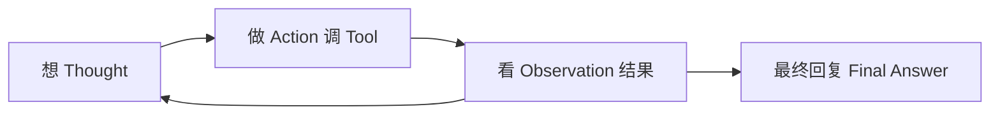

# 05 · Agent 编排：不止聊天，还要「办事」

> **前置**：[03-rag](./03-rag-retrieval-augmented-generation.md) · [04-tool](./04-tool-function-calling.md)  
> **读完能做什么**：区分 Chatbot 和 Agent；理解 ReAct；懂钉钉式客服在工程里是什么

---

## 1. Chatbot vs Agent

| | Chatbot（聊天） | Agent（智能体） |
|--|----------------|-----------------|
| 典型行为 | 问一句答一句 | **多步** 完成目标 |
| 会用工具吗 | 常常不会 | **会** 调 Tool / API |
| 例子 | 「解释一下 JWT」 | 「查我昨天牌谱，并带我去快匹」 |

**Agent = LLM 大脑 + RAG 眼睛（文档） + Tool 手（查库/跳转） + 循环（想→做→看）**

---

## 2. ReAct：想 → 做 → 看

**ReAct**（Reason + Act）是最常见的 Agent 模式：

**例子**：

1. **想**：用户要昨天牌谱，需要 `search_hand_history`  
2. **做**：Java 执行 Tool，返回 12 手  
3. **看**：有数据了  
4. **想**：用户还要快匹，调用 `navigate`  
5. **最终**：「昨天 12 手，已为你打开快匹页」

框架（Spring AI / LangChain4j）会帮你 **循环**，直到模型不再调 Tool。

---

## 3. 钉钉式客服 = 四段流水线（不是魔法）

用户说：「帮我查 6 月 1 号牌谱，再打开快匹」

| 步骤 | 技术名 | 干什么 |
|------|--------|--------|
| 1 | **意图识别** | 查牌谱 + 导航 |
| 2 | **槽位抽取** | `date=2026-06-01` |
| 3 | **Tool 执行** | Java 调 Service |
| 4 | **呈现** | 自然语言 + 前端 `{action:navigate, path:'/quickmatch'}` |

**LLM 可以同时做 1+2**（理解中文）；**3 必须是 Java**；**4 可以 LLM 润色**。

---

## 4. 参数不全时：Agent 要会追问

用户：「帮我查一下那天的牌谱」

- **Chatbot** 可能瞎猜日期  
- **Agent** 应问：「你要查哪一天？格式 yyyy-MM-dd」

这是 **多轮 Agent** 的日常——在 messages history 里保留上下文。

---

## 5. 失败与重试

| 情况 | Agent 该怎么做 |
|------|----------------|
| Tool 返回 0 条牌谱 | 告诉用户「没有记录」，别编造 |
| Tool 报错 | 记录日志，回复「系统繁忙」 |
| 模型选错 Tool | System prompt 写清 Tool 列表 + 用 RAG 补说明 |

---

## 6. 和 MGDemoPlus 的边界

| 适合做 Agent | 不适合交给 LLM 直接干 |
|--------------|----------------------|
| 查牌谱、解释规则、导航 | 改 `roomMap` 下注、结算 |
| 读 docs 答 FAQ | 验密码、签发 JWT |
| 建议「去快匹」 | 代替 WebSocket 推对局状态 |

**对局核心仍走现有 room 服务**；Agent 是 **外围 Copilot**。

---

## 记忆小口诀

> Chat 只会聊，Agent 多步跑；  
> 想完做一做，结果看一看；  
> 意图加槽位，Tool 真干活；  
> 对局核心服，助手在外绕。

---

**下一篇**：[06-java-stack-spring-ai.md](./06-java-stack-spring-ai.md)
