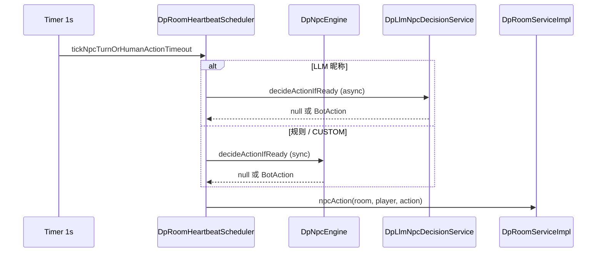

# NPC 引擎总览：规则 Bot 从心跳到 `BotAction`

> **核对日期**：2026-05-25  
> **权威来源**：`DpNpcEngine`、`DpRoomHeartbeatScheduler`、`DpRoomServiceImpl`  
> **Status**: maintained

## 1. 六档规则 archetype

| 昵称前缀 | `BotType` | 翻前 | 翻后 |
|----------|-----------|------|------|
| `BOT_FISH` | FISH | `DpNpcUnifiedPreflopStrategy` | `DpNpcFishStrategy` |
| `BOT_CALL` | CALL | 同上 | `DpNpcCallStrategy` |
| `BOT_LAG` | LAG | 同上 | `DpNpcLagStrategy` |
| `BOT_TAG` | TAG | 同上 | `DpNpcTagStrategy`（含 HandPlan） |
| `BOT_NIT` | NIT | 同上 | `DpNpcNitStrategy` |
| `BOT_MANIAC` | MANIAC | 同上 | `DpNpcManiacStrategy`（引擎内联大段逻辑） |
| `BOT_CUSTOM` | — | 自定义配置档 | `decideCustomBotAction` |

**遗留昵称**（无 `_seq` 的固定串）：`BOT_Shark`、`BOT_Tag`、`BOT_Fish`、`BOT_Maniac` → 分别映射 TAG / TAG / FISH / MANIAC（见 `LEGACY_*` 常量）。

`StyleProfile` 由 `STYLE_PROFILE_MAP` 提供 `vpip`、`pfr`、`callStation`、`foldToPressure` 等；翻前 **只** 消费其中四旋钮 + `BotType` 的 `rangeLevelBonus`。

---

## 2. 调用链

1. **`decideActionIfReady`**：校验行动位、未 fold/all-in/离桌；LLM 昵称直接 `return null`。
2. **`dp.npc.rule-think`**：`nextBotActionTime==0` 时采样延时并返回 `null`；未到点返回 `null`；到点后决策并清零 deadline。
3. **`decideBotAction`** 或 **`decideCustomBotAction`**。
4. 房间服务把 `BotAction` 映射为 fold/call/raise/all-in。

---

## 3. `decideBotAction` 骨架

| 阶段 | 行为 |
|------|------|
| 翻前 `preflop` | **仅** `DpNpcUnifiedPreflopStrategy.decide(...)`；非 null 即返回 |
| 翻后 | `estimateCurrentStrength` + `buildSmartContext`（按类型选用）→ `switch (BotType)` 委托策略类 |

全局开关：

| 配置 / 常量 | 默认 | 含义 |
|------|------|------|
| `dp.npc.mood.enabled`（`DP_NPC_MOOD_ENABLED`） | `true` | 结算更新 mood；台词按 mood 分桶（TAG 除外）。**决策不使用 mood** |
| `DpNpcEngine.NPC_HAND_SEED_FOR_DECISIONS` | `true` | `handSeed ^ 座位` 固定 RNG |

---

## 4. 核心类

| 类 | 职责 |
|----|------|
| `DpNpcEngine` | 入口、Bot 识别、翻前路由、SmartContext、HandPlan 框架 |
| `DpNpcUnifiedPreflopStrategy` | G1–G8 + 13×13 矩阵 |
| `DpNpc*Strategy` | 各 archetype 翻后 |
| `DpUtilHandEvaluator` | `SimpleStrength` / `HandStrength` |
| `DpUtilSmartContext` | 翻后 DTO |
| `DpLlmNpcDecisionService` | LLM（见 npc-llm 分册） |

下一篇：[02_normal_npc_implementation.md](02_normal_npc_implementation.md)。
