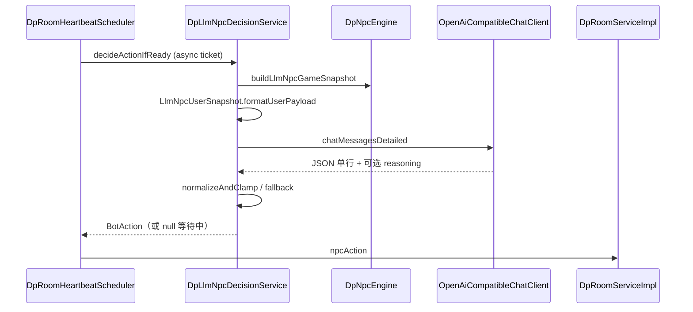

# 大模型 NPC（`BOT_LLM` / `BOT_LLM_GLOBAL`）：类关系与调用链

> **核对日期**：2026-05-25  
> **权威来源**：`DpLlmNpcDecisionService`、`DpNpcEngine`、`OpenAiCompatibleChatClient`、`application.yml` 之 `dp.llm.ark.*`  
> **Status**: maintained

规则 Bot 分册：[npc-engine/README.md](../npc-engine/README.md)。环境变量见 [ENV_README.md](../../ENV_README.md)。

---

## 1. 核心类

| 类 | 包路径 | 职责 |
|----|--------|------|
| `DpNpcEngine` | `npc.engine` | 识别 LLM 昵称；`buildLlmNpcGameSnapshot`；**不**处理 LLM 的 `decideActionIfReady` |
| `DpLlmNpcDecisionService` | `npc.llm` | 异步方舟请求、快照校验、JSON 解析、`normalizeAndClamp`、兜底 |
| `LlmNpcUserSnapshot` | `npc.llm` | 固定键表 + `----` + 值行的 user 正文（`v1\|BOT_LLM\|snap` / `GLOBAL` 头） |
| `LlmNpcGameContext` | `npc.llm` | 快照字段 DTO（由引擎上下文填充） |
| `LlmNpcGlobalHandConversationStore` | `npc.llm` | `BOT_LLM_GLOBAL` 每手多轮 messages 存档 |
| `OpenAiCompatibleChatClient` | `llm` | HTTP Chat Completions（方舟兼容） |

**无** `DpLlmNpcContextMapper` / `LlmNpc` 类；旧路径 `service/serviceImpl/dp/` 已废弃。

---

## 2. 昵称与前缀

| 前缀 | 行为 |
|------|------|
| `BOT_LLM` / `BOT_LLM_<seq>` | 单轮：每行动一次 API，system=`LLM_SYSTEM_PROMPT` |
| `BOT_LLM_GLOBAL` / `BOT_LLM_GLOBAL_<seq>` | 多轮：同 `handSeed` 内累积 user/assistant；system=`LLM_GLOBAL_SYSTEM_PROMPT`，输出含 `plan_next` |

`DpNpcEngine.isLlmBotNickname` / `isGlobalLlmBotNickname` 在心跳层与规则 Bot 分岔。

---

## 3. 端到端调用链

1. **1s 心跳**轮到 LLM 座位 → `DpLlmNpcDecisionService.decideActionIfReady`（规则引擎对该昵称返回 `null`）。
2. 构建快照；发起请求前可用 **in-flight key** 防重入；`PRE_API_DELAY_MS = 0`（无额外人为拖延，耗时主要在 API）。
3. **回包校验**：房间阶段 / 行动位 / 快照代数过期则丢弃，避免过期动作落地。
4. 解析失败或超时 → **`fallback`**（本地 fold/check 等），保证对局不卡死。
5. **`table_talk`**：解析后由桌边话服务推送（配置 `dp.npc.table-talk`）。

---

## 4. 配置要点

| 键 | 说明 |
|----|------|
| `dp.llm.ark.api-key` / `ARK_*` | 未配置时走兜底，不阻塞房间 |
| `dp.llm.ark.base-url`、`model` | 方舟兼容端点 |
| `logging.level.com.example.mgdemoplus.BotLlmReasoning` | 可选单独看 reasoning |

固定线程池 **4** 线程（`dp-llm-npc`）；多 Bot 同桌会排队，尾延迟叠加。

---

## 5. 与规则 Bot 的边界

| 维度 | 规则 NPC | LLM NPC |
|------|----------|---------|
| 入口 | `DpNpcEngine.decideActionIfReady` | `DpLlmNpcDecisionService` |
| `nextBotActionTime` | `dp.npc.rule-think` 采样延时 | 异步 ticket / 完成后再清零 |
| 翻前 | `DpNpcUnifiedPreflopStrategy` | 模型 JSON |
| 配置 | `dp.npc.rule-think.*` | `dp.llm.ark.*` |

**勿写**「思考延迟已移除」：规则路径 **已实现** `rule-think`；LLM 路径从未使用该采样器。
