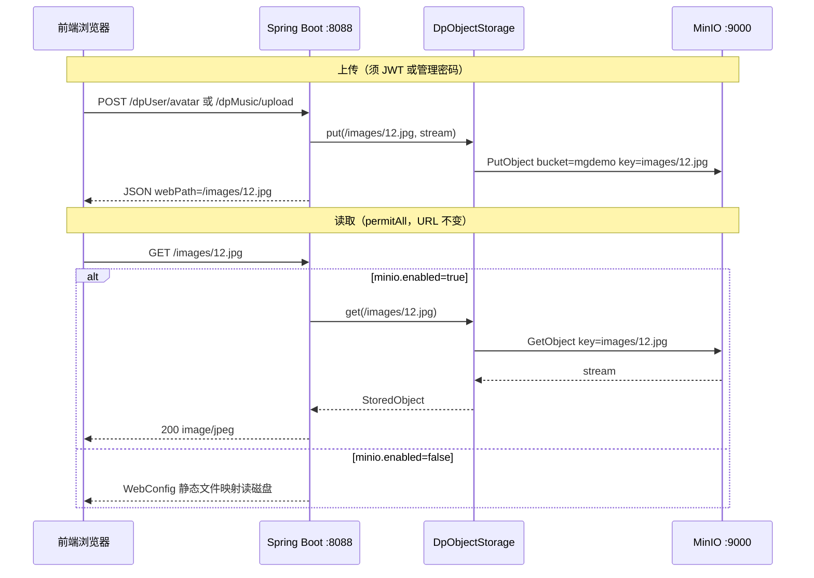
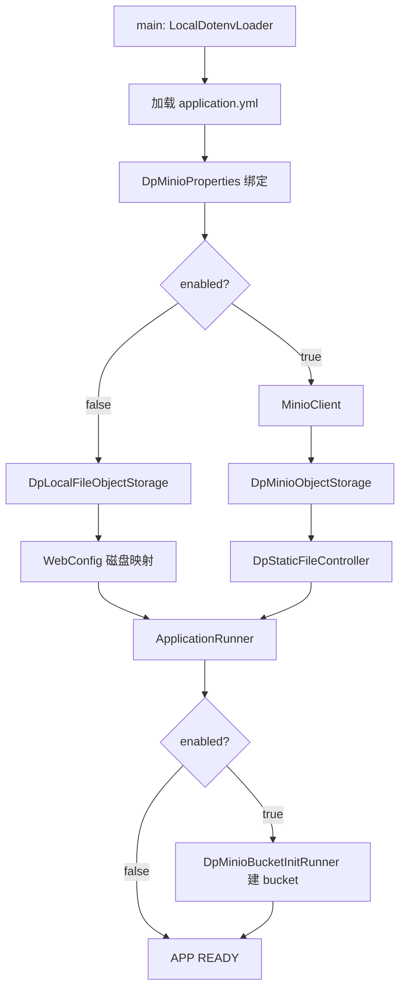
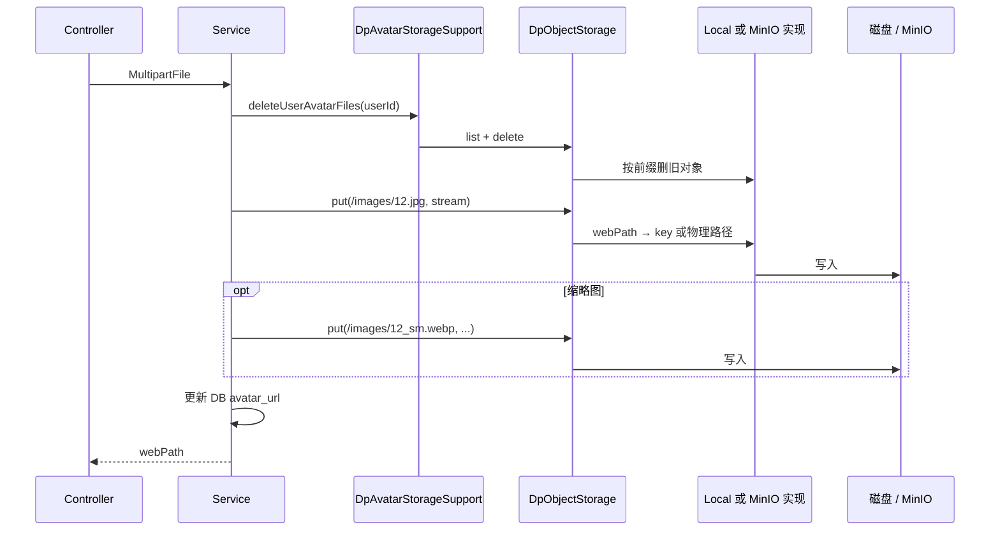
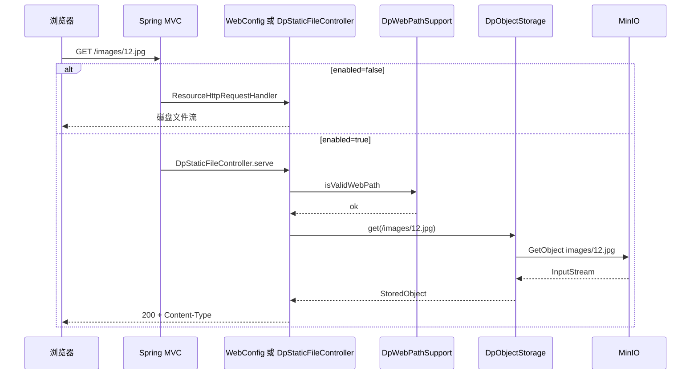

# MinIO 对象存储接入说明

> **核对日期**：2026-06-11  
> **权威来源**：`src/main/java/com/example/mgdemoplus/storage/**`、`config/Dp*Minio*`、`application.yml`  
> **适用场景**：本机跑 app / MySQL / Redis / 前端，`docker compose` **只启动 MinIO** 服务

---

## 1. 最简接入（3 步）

### 1.1 Maven 依赖

项目已内置 MinIO Java SDK（无需额外加依赖）：

```xml
<dependency>
    <groupId>io.minio</groupId>
    <artifactId>minio</artifactId>
    <version>8.5.17</version>
</dependency>
```

仅在 `mgdemoplus.minio.enabled=true` 时才会创建 `MinioClient` 并走 MinIO 读写；`false`（默认）时 jar 在 classpath 中但不参与业务。

### 1.2 只启动 MinIO 容器

在项目根目录执行（**不要**起 `app` / `mysql` / `redis`）：

```bash
docker compose up minio -d
```

`docker-compose.yml` 中 MinIO 服务要点：

| 项 | 值 |
|----|-----|
| 镜像 | `minio/minio:latest` |
| API 端口 | `9000` → 本机 `http://127.0.0.1:9000` |
| Console | `9001` → 本机 `http://127.0.0.1:9001` |
| 默认账号 | `minioadmin` / `minioadmin`（`MINIO_ROOT_USER` / `MINIO_ROOT_PASSWORD`） |
| 数据卷 | `minio_data:/data` |

### 1.3 打开 MinIO 并启动后端

1. 复制 `.env.example` 为 `.env`，填写 MinIO 相关变量（见第 2 节）。
2. 本机照常启动 MySQL、Redis、前端、`mvn spring-boot:run`（或 IDE）。
3. 应用启动时 `DpMinioBucketInitRunner` 会自动创建 bucket（默认 `mgdemo`）。

---

## 2. 配置清单

### 2.1 `application.yml`（`mgdemoplus.minio` 段）

```yaml
mgdemoplus:
  minio:
    enabled: ${MGDEMOPLUS_MINIO_ENABLED:false}
    endpoint: ${MGDEMOPLUS_MINIO_ENDPOINT:http://127.0.0.1:9000}
    access-key: ${MGDEMOPLUS_MINIO_ACCESS_KEY:}
    secret-key: ${MGDEMOPLUS_MINIO_SECRET_KEY:}
    bucket: ${MGDEMOPLUS_MINIO_BUCKET:mgdemo}
```

磁盘目录配置（`images` / `music` / `files` 的 `file-location`）在 **MinIO 关闭时** 供 `WebConfig` + `DpLocalFileObjectStorage` 使用；**MinIO 开启时** 上传/下载不再读这些路径，但 yml 中仍保留（见「已知限制」）。

### 2.2 `.env` 变量（本机开发）

| 环境变量 | 说明 | 示例 |
|----------|------|------|
| `MGDEMOPLUS_MINIO_ENABLED` | 是否启用 MinIO | `true` |
| `MGDEMOPLUS_MINIO_ENDPOINT` | MinIO API 地址（本机 compose 映射） | `http://127.0.0.1:9000` |
| `MGDEMOPLUS_MINIO_ACCESS_KEY` | 访问密钥 | `minioadmin` |
| `MGDEMOPLUS_MINIO_SECRET_KEY` | 秘密密钥 | `minioadmin` |
| `MGDEMOPLUS_MINIO_BUCKET` | 桶名（可选，默认 `mgdemo`） | `mgdemo` |

`.env.example` 中已有 MinIO 示例块，可直接取消注释并赋值。

**读取顺序**（与项目其它配置一致）：OS 环境变量 → 根目录 `.env`（`LocalDotenvLoader`）→ `application.yml` 默认值。详见 [SpringBoot配置链路-本地与Docker的env传递原理.md](SpringBoot配置链路-本地与Docker的env传递原理.md)。

### 2.3 Docker Compose：只起 MinIO

典型本机开发拓扑：

```
本机 Windows
├── MySQL / Redis / 前端 dev-server  ← 本机进程
├── Spring Boot :8088                  ← mvn spring-boot:run
└── Docker: minio :9000 / :9001        ← docker compose up minio -d
```

**不要**修改 compose 里的 `app` 服务来配合 MinIO 测试；`app` 容器内的 endpoint 应是 `http://minio:9000`，那是全栈 Docker 部署场景。本机跑 app 时 endpoint 必须是 `http://127.0.0.1:9000`。

---

## 3. 怎么写入（Upload）

### 3.1 统一抽象：`DpObjectStorage`

```java
void put(String webPath, InputStream data, long size, String contentType);
Optional<StoredObject> get(String webPath);
boolean exists(String webPath);
void delete(String webPath);
List<String> listObjectKeysByPrefix(String keyPrefix);
```

- **webPath**：对外 URL 路径，形如 `/images/12.jpg`。
- **MinIO object key**：webPath 去掉 leading `/`，例如 `/images/12.jpg` → `images/12.jpg`（见 `DpWebPathSupport.webPathToObjectKey`）。

### 3.2 webPath / object key 规则

| 前缀 | 用途 | 文件名规则 | 示例 webPath | MinIO key |
|------|------|------------|--------------|-----------|
| `/images/` | 头像等图片 | `{userId}.{ext}` 原图；`{userId}_sm.webp` 缩略图 | `/images/12.jpg` | `images/12.jpg` |
| `/music/` | BGM 曲库 | `{uuid}.{ext}` | `/music/a1b2....mp3` | `music/a1b2....mp3` |
| `/files/` | 下载中心 | `{uuid}.{ext}` | `/files/c3d4....zip` | `files/c3d4....zip` |

校验（`DpWebPathSupport.isValidWebPath`）：

- 必须以 `/images/`、`/music/`、`/files/` 之一开头；
- 前缀后**仅允许单层文件名**（ remainder 中不能再有 `/`）；
- 禁止 `..`、反斜杠。

### 3.3 上传 API 与调用链

| 业务 | HTTP | 写入类 | webPath 生成 |
|------|------|--------|--------------|
| 用户头像 | `POST /dpUser/avatar`（JWT） | `DpUserServiceImpl` | `/images/{userId}{ext}` + `/images/{userId}_sm.webp` |
| OAuth 头像 | OAuth 回调内 | `DpOAuthService` | `/images/{userId}.png` + 缩略图 |
| BGM 上传 | `POST /dpMusic/upload` | `DpMusicController` | `/music/{uuid}{ext}` |
| 下载中心 | `POST /dpDownload/upload`（JWT + 管理密码） | `DpDownloadController` | `/files/{uuid}{ext}` |

删除头像：`DpAvatarStorageSupport` → `objectStorage.delete` / `listObjectKeysByPrefix`（按 `images/{userId}.` 前缀扫原图 + 删 `_sm.webp`）。

**写入流程（以头像为例）**：

1. Controller 收 `MultipartFile`；
2. Service 删旧文件 → 写 temp → `objectStorage.put(webPath, ...)`；
3. 可选写缩略图 `put(thumbPath, ...)`；
4. 数据库保存 **webPath**（如 `dp_user.avatar_url`），不是 MinIO 内部 key。

---

## 4. 怎么取出（GET，前端 URL 不变）

前端始终使用相对路径，例如：

- `http://localhost:8088/images/12.jpg`
- `http://localhost:8088/music/xxx.mp3`
- `http://localhost:8088/files/xxx.zip`

**不**暴露 MinIO 直链；MinIO 仅在后端内网/本机访问。

### 4.1 `enabled=false`（默认，本地磁盘）

`WebConfig`（`@ConditionalOnProperty(..., havingValue = "false", matchIfMissing = true)`）注册 Spring MVC 静态资源：

- `/images/**` → `mgdemoplus.images.file-location`
- `/music/**` → `mgdemoplus.music.file-location`
- `/files/**` → `mgdemoplus.files.file-location`

由容器/操作系统直接读磁盘文件。

### 4.2 `enabled=true`（MinIO）

`WebConfig` **不加载**；`DpStaticFileController` 接管：

- `@GetMapping("/images/**")` / `/music/**` / `/files/**`
- 从 request URI 得到 webPath → `objectStorage.get(webPath)` → 流式返回
- `/images/**` 带 `Cache-Control: max-age=31536000`（与磁盘模式一致）

路径仍在 `JwtSecurityConstants.PERMIT_ALL` 白名单，无需 JWT。

### 4.3 请求链路（Mermaid）



---

## 5. 执行顺序与生命周期

本节按**时间线**说明 MinIO 相关类在 Spring 启动与 HTTP 请求中的先后关系。开关 `mgdemoplus.minio.enabled` 决定走哪条分支。

### 5.1 启动阶段（按时间顺序）

1. **`main()` 前**：`MgDemoPlusApplication.main()` 调用 `LocalDotenvLoader.load()`，把根目录 `.env` 写入 JVM 环境（已有 OS 环境变量不覆盖）。
2. **配置加载**：`SpringApplication.run()` 读取 `application.yml`；`mgdemoplus.minio.*` 占位符由 OS 环境变量 / `.env` / yml 默认值解析（见第 2 节）。
3. **`DpMinioProperties` 绑定**：`DpMinioConfig` 上的 `@EnableConfigurationProperties(DpMinioProperties.class)` 把 `mgdemoplus.minio` 段绑定为 Bean（**无论 enabled 真假都会绑定**）。
4. **`MinioClient` 注册**（仅 `enabled=true`）：`DpMinioConfig.dpMinioClient()` 用 endpoint / access-key / secret-key 构建 SDK 客户端。
5. **`DpObjectStorage` 二选一**（`DpObjectStorageConfig`）：
   - `enabled=false`（默认）→ `DpLocalFileObjectStorage`（读 `images` / `music` / `files` 的 `file-location`）；
   - `enabled=true` → `DpMinioObjectStorage`（依赖上一步 `MinioClient` + `DpMinioProperties.bucket`）。
6. **GET 路由注册（互斥）**：
   - `enabled=false` → `WebConfig` 作为 Bean 加载，`addResourceHandlers` 把 `/images|music|files/**` 映射到磁盘目录；
   - `enabled=true` → `WebConfig` **整类跳过**；`DpStaticFileController` 注册 `@GetMapping("/images|music|files/**")`。
7. **其它 Bean**：`DpAvatarStorageSupport`（依赖 `DpObjectStorage`）、业务 Controller/Service 注入同一 `DpObjectStorage` 接口。
8. **嵌入式容器就绪**：Tomcat 监听、MVC 映射表定稿。
9. **`ApplicationRunner` 阶段**（Context 已刷新、应用即将对外服务）：
   - `enabled=true` → `DpMinioBucketInitRunner`：`bucketExists` → 不存在则 `makeBucket`（日志 `minio bucket created/ready`）。



### 5.2 写入请求顺序（上传）

以头像 `POST /dpUser/avatar` 为例；BGM / 下载中心结构相同，仅入口 Controller 不同。

1. **HTTP 入口**：JWT 过滤器鉴权 → `DpUserController` → `DpUserServiceImpl.uploadAvatar`（OAuth 走 `DpOAuthService`，BGM 走 `DpMusicController`，下载走 `DpDownloadController`）。
2. **删旧文件**：`DpAvatarStorageSupport.deleteUserAvatarFiles` → `objectStorage.listObjectKeysByPrefix` + `delete`（MinIO 按 key 前缀扫；本地按目录扫）。
3. **写临时文件 / 生成缩略图**：Service 层落盘 temp，可选生成 `{userId}_sm.webp`。
4. **存储抽象**：`objectStorage.put(webPath, InputStream, size, contentType)`。
5. **实现分支**：
   - **本地**：`DpLocalFileObjectStorage` → `DpWebPathSupport.isValidWebPath` → 解析物理路径 → `Files.copy`；
   - **MinIO**：`DpMinioObjectStorage` → `DpWebPathSupport.webPathToObjectKey`（如 `/images/12.jpg` → `images/12.jpg`）→ `MinioClient.putObject(bucket, key, stream)`。
6. **可选第二次 put**：缩略图 webPath（`/images/{userId}_sm.webp`）。
7. **落库**：数据库保存 **webPath**（如 `dp_user.avatar_url`），不存 MinIO 内部 key。



### 5.3 读取请求顺序（GET）

前端 URL 始终为 `http://host:8088/images/12.jpg` 等形式；路径在 `JwtSecurityConstants.PERMIT_ALL`，**无需 JWT**。

**`enabled=false`（默认，本地磁盘）**

1. `GET /images/12.jpg` 进入 Spring MVC。
2. 无 Controller 匹配；命中 `WebConfig` 注册的 `ResourceHttpRequestHandler`。
3. `/images/**` → `mgdemoplus.images.file-location` 对应目录；余下路径 `12.jpg` 拼成物理文件。
4. 容器/OS 读盘返回；`/images/**` 带 `Cache-Control: max-age=31536000`。

**`enabled=true`（MinIO 代理）**

1. `GET /images/12.jpg` → `DpStaticFileController.serveImages`（`/music/**`、`/files/**` 同理）。
2. `request.getRequestURI()` 得到 webPath（如 `/images/12.jpg`）。
3. `DpWebPathSupport.isValidWebPath` 校验前缀与防穿越；非法 → 400。
4. `objectStorage.get(webPath)` → `DpMinioObjectStorage`：`statObject` + `getObject`。
5. 不存在 → 404；存在 → `ResponseEntity` + `InputStreamResource` 流式响应，images 同样长缓存。



### 5.4 新增文件清单与链路位置

| 文件 | 唯一职责 | 链路位置 |
|------|----------|----------|
| `config/DpMinioProperties.java` | 绑定 `mgdemoplus.minio.*` 配置项 | **启动①** 配置绑定（始终） |
| `config/DpMinioConfig.java` | `@EnableConfigurationProperties`；条件注册 `MinioClient` | **启动②** SDK 客户端（仅 enabled=true） |
| `config/DpObjectStorageConfig.java` | 按开关注册 `DpLocalFileObjectStorage` 或 `DpMinioObjectStorage` | **启动③** 存储实现 Bean |
| `config/DpMinioBucketInitRunner.java` | 启动后确保 bucket 存在 | **启动④** ApplicationRunner（仅 enabled=true） |
| `config/WebConfig.java` | 磁盘静态资源 `ResourceHandler` | **启动③** GET 路由（仅 enabled=false） |
| `controller/DpStaticFileController.java` | 代理 GET `/images|music|files/**` | **启动③** GET 路由（仅 enabled=true）；**读取**入口 |
| `storage/DpObjectStorage.java` | 存储统一接口 put/get/delete/list | **上传/读取** 抽象层 |
| `storage/DpWebPathSupport.java` | webPath ↔ object key、路径校验、Content-Type | **上传/读取** 路径转换与校验 |
| `storage/impl/DpLocalFileObjectStorage.java` | 本地磁盘读写实现 | **上传/读取** 实现（enabled=false） |
| `storage/impl/DpMinioObjectStorage.java` | MinIO SDK 读写实现 | **上传/读取** 实现（enabled=true） |
| `storage/DpAvatarStorageSupport.java` | 按 userId 删头像原图 + 缩略图 | **上传前** 清理旧文件 |

**改动但非 MinIO 专属、仍参与链路**：`DpUserServiceImpl` / `DpOAuthService` / `DpMusicController` / `DpDownloadController`（上传调用 `objectStorage.put`）。

---

## 6. 本地磁盘 + MinIO 双模式实现

通过 **`mgdemoplus.minio.enabled` 单开关** 切换，业务代码只依赖 `DpObjectStorage` 接口。

### 6.1 组件对照

| 组件 | `enabled=false`（默认） | `enabled=true` |
|------|-------------------------|----------------|
| `DpObjectStorage` Bean | `DpLocalFileObjectStorage` | `DpMinioObjectStorage` |
| `MinioClient` | 不创建 | `DpMinioConfig` |
| Bucket 初始化 | 无 | `DpMinioBucketInitRunner` |
| GET 静态资源 | `WebConfig` 磁盘映射 | `DpStaticFileController` 代理 |
| 物理路径配置 | **生效** | **不参与读写** |

条件装配入口：

- `DpObjectStorageConfig` — 二选一注册 `DpLocalFileObjectStorage` / `DpMinioObjectStorage`
- `WebConfig` — `@ConditionalOnProperty(..., false, matchIfMissing = true)`
- `DpStaticFileController` — `@ConditionalOnProperty(..., true)`
- `DpMinioConfig` / `DpMinioBucketInitRunner` — 仅 `true`

### 6.2 行为对比摘要

**`enabled=false`**

- 上传：`objectStorage.put` 写到 `MGDEMOPLUS_*_FILE_LOCATION` 对应目录；头像上传时同步生成 `{userId}_sm.webp` 缩略图。
- 下载：Spring 直接把 URL 映射到磁盘，不经 Controller。

**`enabled=true`**

- 上传/删除：全部走 MinIO bucket（单 bucket，key 带 `images/`、`music/`、`files/` 前缀区分逻辑目录）。
- 下载：必须经过 `DpStaticFileController` 从 MinIO 取流。
- 磁盘 `file-location` 配置被忽略（除非另有工具手动读盘）。

切换开关后需 **重启应用**；无热切换。

---

## 7. 最小验证命令

### 7.1 确认 MinIO 已启动

```bash
docker compose ps minio
curl -s -o /dev/null -w "%{http_code}" http://127.0.0.1:9000/minio/health/live
# 期望 200
```

浏览器打开 Console：`http://127.0.0.1:9001`，登录后应能看到 bucket `mgdemo`（首次启动 app 后自动创建）。

### 7.2 确认后端走 MinIO 模式

启动日志中应出现：

```text
minio bucket created: mgdemo
# 或
minio bucket ready: mgdemo
```

且 **不应** 注册 `WebConfig` 的静态 handler（可通过上传后磁盘目录无新文件侧面验证）。

### 7.3 上传 + 读取（需有效 JWT）

```bash
# 1. 登录拿 token（示例，按项目实际登录接口调整）
# 2. 上传头像
curl -X POST "http://127.0.0.1:8088/dpUser/avatar" \
  -H "Authorization: Bearer YOUR_JWT" \
  -F "file=@test.jpg"

# 响应 data 中含 webPath，例如 /images/1.jpg

# 3. 匿名 GET（与白名单一致）
curl -I "http://127.0.0.1:8088/images/1.jpg"
# 期望 200，Content-Type: image/jpeg
```

在 MinIO Console → bucket `mgdemo` 中应看到 object `images/1.jpg`（及可选 `images/1_sm.webp`）。

### 7.4 切回磁盘模式

`.env` 中设 `MGDEMOPLUS_MINIO_ENABLED=false`（或删除该行），重启 app；新上传会写回 `DPGameFiles` 目录，`WebConfig` 重新生效。

---

## 8. 已知限制

1. **无自动迁移**：从磁盘切到 MinIO 后，**不会**把历史磁盘文件同步到 bucket；旧 URL 若仍指向仅存在于磁盘的文件，在 MinIO 模式下 GET 会 404。需自行批量上传或写一次性迁移脚本。
2. **历史磁盘文件**：启用 MinIO 前已落在 `DPGameFiles/images|music|other` 的数据不会自动出现在 MinIO；数据库里的 `webPath` 不变，但存储后端已换，需运维侧处理数据对齐。
3. **单 bucket 多前缀**：MinIO 模式下 images/music/files 共用一个 bucket，靠 object key 前缀区分；不是三个独立 bucket。
4. **endpoint 与部署拓扑**：本机 app + Docker MinIO 必须用 `http://127.0.0.1:9000`；全 Docker 栈中 app 容器应使用 `http://minio:9000`（compose 服务名）。

---

## 9. 相关源码索引

| 文件 | 职责 |
|------|------|
| `storage/DpObjectStorage.java` | 存储接口 |
| `storage/impl/DpLocalFileObjectStorage.java` | 磁盘实现 |
| `storage/impl/DpMinioObjectStorage.java` | MinIO 实现 |
| `storage/DpWebPathSupport.java` | webPath ↔ key、校验、Content-Type |
| `storage/DpAvatarStorageSupport.java` | 头像删除 |
| `config/DpObjectStorageConfig.java` | 条件 Bean |
| `config/DpMinioProperties.java` | 配置绑定 |
| `config/DpMinioConfig.java` | `MinioClient` |
| `config/DpMinioBucketInitRunner.java` | 启动建 bucket |
| `config/WebConfig.java` | 磁盘静态资源（MinIO 关） |
| `controller/DpStaticFileController.java` | MinIO 读代理（MinIO 开） |
