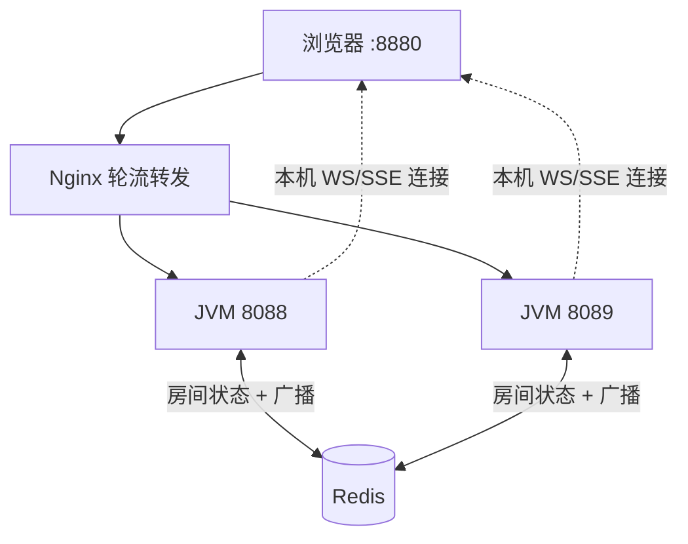

# 多实例本地开发说明（通俗版）

> 写给第一次接触「两台后端 + Nginx + Redis」的同学。  
> 重点：**怎么起**、**Nginx 怎么分流**、**Redis 怎么帮 WebSocket / SSE 跨机器通信**。  
> 房间玩法、私信规则等业务逻辑 **没有改**，只是把「单台 JVM 里的内存」换成了「多台 JVM 共用的 Redis」。

---

## 一、整体长什么样？

你可以把整个系统想成三层：

```
浏览器  →  Nginx（8880 端口）  →  后端 JVM（8088 / 8089）
                ↓
           静态网页（Vue 打包后的 dist）
                ↓
         API / WebSocket / SSE 请求被「轮流」转发到某一台 JVM

两台 JVM 共用：
  - MySQL（玩家、大厅表等）
  - Redis（房间状态、跨实例广播）
  - MinIO（图片、音乐等文件，由 JVM 代读）
```

**为什么要两台？**  
模拟线上「同一个游戏跑在多台机器上」。用户从 `8880` 进来，每次请求可能被分到 8088 或 8089——**我们故意不做「粘在同一台」**，靠 Redis 保证大家看到的房间状态一致。

---

## 二、多实例怎么起？（按顺序做）

### 0. 前置条件

本机已准备好：

- MySQL（库名 `school_db`）
- Redis（默认 `127.0.0.1:6379`，密码见 `.env` 里 `SPRING_DATA_REDIS_PASSWORD`）
- Java / Maven、Node（构建前端用）

复制环境变量：`cp .env.example .env`（Windows 手动复制即可）。

### 1. 构建前端（只做一次，改 UI 后重做）

Nginx 直接托管 **打包好的网页**，不是 `npm run dev`。

```powershell
cd front/dp_game
npm install
npm run build
cd ../..
```

### 2. 启动 Docker：Nginx + MinIO

```powershell
docker compose up -d
```

或：

```powershell
.\scripts\run-multi-instance.ps1 -DepsOnly
```

此时可用：

| 地址 | 用途 |
|------|------|
| http://localhost:8880 | **推荐**：浏览器入口（经 Nginx） |
| http://localhost:9001 | MinIO 控制台（minioadmin / minioadmin） |

### 3. 启动两个后端 JVM（各开一个终端）

```powershell
mvn spring-boot:run "-Dspring-boot.run.arguments=--server.port=8088 --mgdemoplus.instance-id=8088"
```

```powershell
mvn spring-boot:run "-Dspring-boot.run.arguments=--server.port=8089 --mgdemoplus.instance-id=8089"
```

`instance-id` 建议和端口一致，方便看日志区分是哪台机器。

### 4. 自检

```powershell
curl -s http://localhost:8088/dp/dev/ping
curl -s http://localhost:8089/dp/dev/ping
curl -s http://localhost:8880/dp/dev/ping
```

经 Nginx 的 ping 多敲几次，`port` 会在 8088 / 8089 之间轮换，说明负载均衡在工作。

### 5. 停止

```powershell
docker compose down
```

两个 JVM 终端里 `Ctrl+C` 停掉即可。

---

## 三、Nginx 怎么做多实例负载？

### 3.1 Nginx **不会**自动「注册机器」

和 Nacos 不同：Nginx **不会**等 JVM 启动了自己加进列表。  
**哪些 IP、端口能接流量，是你写在配置文件里的。**

配置文件：`docker/nginx/default.conf`

```nginx
upstream mgdemo_backend {
    server host.docker.internal:8088;
    server host.docker.internal:8089;
    # 若某台没启动，不要写在这里，否则会偶发连不上、变慢
}

location ^~ /dpRoom/ {
    proxy_pass http://mgdemo_backend;
    ...
}
```

| 名字 | 是什么 |
|------|--------|
| `mgdemo_backend` | 只是配置里的 **组名**，不是真域名 |
| `host.docker.internal:8088` | Docker 里的 Nginx 访问 **宿主机** 上 8088 的方式 |
| `proxy_pass http://mgdemo_backend` | 把请求转给上面那一组机器 |

### 3.2 默认怎么分流？——轮流发（轮询）

没写特殊指令时，Nginx **按顺序轮流**：

```
第 1 个请求 → 8088
第 2 个请求 → 8089
第 3 个请求 → 8088
…
```

所以：

- 点「大厅列表」可能打到 8088  
- 下一次刷新可能打到 8089  
- **这是正常的**，业务数据在 Redis 里，不依赖「总打同一台」。

### 3.3 哪些走 Nginx 后端？哪些不走？

| 类型 | 谁处理 | 例子 |
|------|--------|------|
| 网页、js、css | Nginx 本地读 `dist` | `/`、`/index.html` |
| 接口 | 转给 JVM | `/dpRoom/`、`/dpUser/`、`/dp/` |
| 对局 WebSocket | 转给 JVM | `/ws/` |
| 社交通知 SSE | 转给 JVM | `/dp/social/stream` |
| 图片/音乐 | 转给 JVM（JVM 再去 MinIO 取） | `/images/`、`/music/` |

SSE、WebSocket 在 Nginx 里配了 **长连接、关缓冲**，避免消息卡在网关里出不来。

### 3.4 常见坑

1. **upstream 里写了没启动的端口**  
   轮询轮到它会失败，Nginx 会暂时跳过几分钟再试，表现为 **偶尔很慢或报错**。  
   → 没起的实例就从 `upstream` 里删掉，然后 `docker compose exec nginx nginx -s reload`。

2. **只改了前端没 `npm run build`**  
   8880 看到的还是旧页面。

3. **用 `npm run dev` 调试多实例**  
   开发服和 Nginx 路径不一致，容易和「8880 多实例」测混。多实例验收请统一走 **8880**。

更细的 Nginx 说明见 [docs/NGINX.md](../NGINX.md)、[docs/DOCKER.md](../DOCKER.md)。

---

## 四、难题：WebSocket / SSE 只能连在一台 JVM 上，怎么办？

### 4.1 问题从哪来？

- 浏览器的 **WebSocket**、**SSE** 是 **长连接**，连上 8089 就一直挂在 8089 的内存里。  
- 但用户 **点按钮、发私信** 的 HTTP 请求，可能被 Nginx **分到 8088**。  
- 8088 改完数据，如果只对 **自己内存** 里的连接广播，8089 上的那条 WS/SSE **收不到**。

单实例时没有这个问题——反正只有一台机器。

### 4.2 思路：Redis 当「大喇叭」

```
任意一台 JVM 改了数据
    → 往 Redis 喊一声（发布消息）
    → 所有 JVM 都听到（订阅）
    → 每台只问自己：「这个用户/房间的长连接在我这吗？」
    → 在就推给浏览器，不在就跳过
```

房间状态和通知内容仍以 **Redis / MySQL** 为准；Redis 广播只是 **「该刷新了」的铃声**，不是代替数据库存数据。

---

## 五、WebSocket（对局）怎么做的？

### 5.1 房间状态存在哪？

多台 JVM **共用一份房间状态**，在 Redis 里，例如：

- `dp:room:state:{房间id}` — 房间 JSON  
- `dp:room:index` — 当前有哪些房间 id  
- `dp:qm:join:room2bucket` / `dp:qm:join:bucket:{缺几人}` — 快匹可加入公开房索引（P2，全实例共享）

谁改房间（下注、准备、开局），都要 **先拿锁、改 Redis、再广播**。

相关代码（想了解可看）：

- `room/support/DpRedisRoomRegistry.java` — 读写 Redis  
- `room/support/DpRoomDistributedLock.java` — 防止两台同时改同一房间  

### 5.2 跨实例推送流程

```
8088：玩家 A 下注
  → 更新 Redis 里的房间
  → 向频道 dp:room:events 发一条短消息

8088、8089 都在听 dp:room:events
  → 8089 发现：这个房间在我这有 WebSocket 连接
  → 从 Redis 读出最新房间，推给浏览器

8088 上若也有该房间连接，同样会推；没有连接就什么都不做
```

相关代码：

| 角色 | 类 |
|------|-----|
| 发布 | `room/support/DpRoomEventPublisher.java` |
| 订阅 | `room/support/DpRoomEventSubscriber.java` |
| 推 WS | `websocket/DpGameRoomPushService.java` |
| 注册监听 | `config/DpRoomRedisPubSubConfig.java` |

### 5.3 还没走 Redis 广播的 WS 消息

**对局主快照**（牌桌状态）已跨实例。  
下面几类仍是 **本机直推**，多实例下可能漏（以后 P2 可补）：

- 房间内聊天  
- 房间 BGM  
- 部分 NPC 话术  

---

## 六、SSE（好友/邮箱通知）怎么做的？

以前：SSE 连接存在 **本机内存**，别的机器发私信，这边 **推不到**。  
现在：和 WS 房间 **同一套路**。

```
8088：有人给玩家 B 发私信
  → 写数据库
  → 向频道 dp:social:events 广播 { userId, kind: "notify" }

8089 听到广播
  → 查本机：玩家 B 的 SSE 连在我这吗？
  → 是：组装未读摘要，推 SSE
  → 否：忽略（玩家 B 的 SSE 可能在 8088，由那台推）
```

相关代码：

| 角色 | 类 |
|------|-----|
| 频道名 | `social/notify/SocialRedisKeys.java` → `dp:social:events` |
| 发布 | `social/notify/SocialEventPublisher.java` |
| 订阅 | `social/notify/SocialEventSubscriber.java` |
| 本机 SSE 表 | `social/notify/SocialSseHub.java` |

若 SSE 当时没连上，消息 **可能丢广播**（Redis 广播不存历史）；前端仍有 **轮询** `/dp/social/notify-summary` 兜底。

---

## 七、和 Nginx 非粘滞怎么配合？

| 机制 | 要不要「同一用户总打同一台」？ |
|------|--------------------------------|
| HTTP 读写在 Redis | **不要** |
| WebSocket / SSE 长连接 | 连上哪台是 Nginx 当时选的，**天然粘在那台** |
| 跨实例通知 | **靠 Redis 广播**，不靠 Nginx sticky |

所以设计是：**请求可以打散，状态和推送靠 Redis 对齐。**

---

## 八、自己排查的小命令

```powershell
# 哪台在处理（经 Nginx 多试几次）
curl -s http://localhost:8880/dp/dev/ping

# Redis 里还有哪些房间（需密码）
redis-cli -h 127.0.0.1 -p 6379 -a 你的密码 SMEMBERS dp:room:index

# 快匹可加入房索引（P2）
redis-cli -h 127.0.0.1 -p 6379 -a 你的密码 HLEN dp:qm:join:room2bucket
redis-cli -h 127.0.0.1 -p 6379 -a 你的密码 ZRANGE dp:qm:join:bucket:1 0 -1

# Nginx 日志
docker compose logs -f nginx
```

---

## 九、一张图总结



---

## 十、延伸阅读

- **SSE 单→多实例桥接（配置 + A 机推 B 机收 + 伪代码）**：[sse-multi-instance-bridge.md](./sse-multi-instance-bridge.md)  
- Docker 启动：[docs/DOCKER.md](../DOCKER.md)  
- Nginx 路径说明：[docs/NGINX.md](../NGINX.md)  
- 房间 Redis 迁移变更：[docs/refactor/CHANGELOG-redis-room-migration.md](../refactor/CHANGELOG-redis-room-migration.md)（若存在）  
- SSE Redis 变更：[docs/refactor/CHANGELOG-sse-redis-pubsub.md](../refactor/CHANGELOG-sse-redis-pubsub.md)（若存在）  

---

*文档随项目演进可更新；若 upstream 增删实例，记得改 `docker/nginx/default.conf` 并重载 Nginx。*
