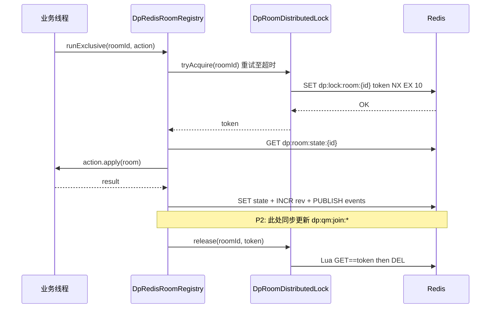
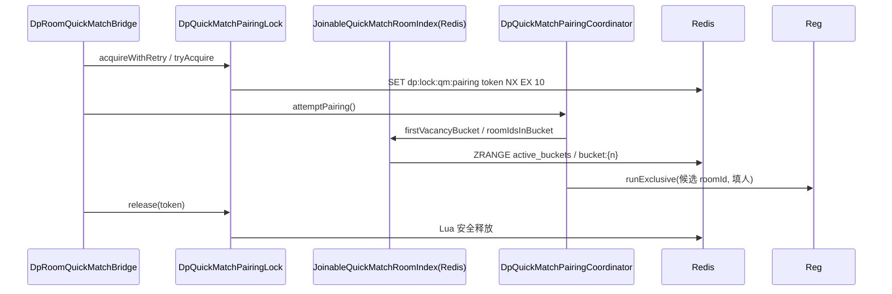

# P2 概要设计：快匹可加入房间索引迁入 Redis

> **阶段**：P2（在 P0 快匹 Redis 迁移 — 等待队列、配对锁、房间 SSOT — 已完成之后）  
> **目标**：把 `JoinableQuickMatchRoomIndex` 从「每台 JVM 一份内存副本」改为「全集群共享的 Redis 索引」，与 `dp:qm:wait` 同级。  
> **本文只做设计，不写实现代码。**

---

## 1. 为什么要把索引迁到 Redis（对比当前 pub/sub 刷新方案）

### 1.1 当前做法（P0 之后）

P0 已完成：

| 组件 | 存储 | 说明 |
|------|------|------|
| 等待队列 `DpQuickMatchWaitQueue` | Redis `dp:qm:wait` | 全实例共享 |
| 配对锁 `DpQuickMatchPairingLock` | Redis `dp:lock:qm:pairing` | 全实例共享 |
| 房间状态 `DpRedisRoomRegistry` | Redis `dp:room:state:*` | 全实例共享 |
| **可加入房间索引** `JoinableQuickMatchRoomIndex` | **每台 JVM 内存** | 各实例各自维护 |

房间每次变更时，`DpRedisRoomRegistry.saveAfterMutation` 会向 `dp:room:events` 发 pub/sub；**每台** JVM 的 `DpRoomEventSubscriber` 收到消息后，在本机内存里调用 `addOrRefresh` / `remove` 刷新索引。

### 1.2 问题：队列全局、索引本地

可以把快匹想象成「全局排队区 + 全局可选桌子列表」：

```
玩家 A（8088）入队 ──► Redis 队列 dp:qm:wait
玩家 B（8089）入队 ──► 同一个队列

8088 上的配对器读索引 ──► 只有 8088 本地索引里有的 roomId
8089 上的配对器读索引 ──► 只有 8089 本地索引里有的 roomId
```

**等待队列已经是全局的**，但「哪张桌子还能快匹加入」仍按实例分裂。结果是：

1. **漏桌 / 慢匹配**：在 8088 创建或变满的可加入公开房，若 pub/sub 到 8089 有延迟或丢消息，8089 上的配对器看不到这张桌，只能等 fallback 全表扫描（`DpRoomQuickMatchBridge.orderedQuickMatchJoinCandidates` 里的 drift repair）。
2. **重复维护成本**：N 台实例 = N 份索引 + N 次 pub/sub 刷新，逻辑相同却各跑一遍。
3. **与 SSOT 不一致的风险**：房间状态以 Redis 为准，索引却以各 JVM 内存为准；两者靠事件链最终一致，中间窗口期配对行为不确定。
4. **测试与运维难**：`redis-cli` 只能看队列和房间，看不到「当前有哪些快匹可加入房」，排障靠猜。

### 1.3 迁到 Redis 后的收益

- **一份索引，全员可见**：任意实例在持有 `dp:lock:qm:pairing` 时，`firstVacancyBucket` / `roomIdsInBucket` 读到相同数据。
- **写路径可收敛**：在**真正改房间的那台实例**上，于 `saveAfterMutation` 同一逻辑事务内更新 Redis 索引；pub/sub 订阅方**不再**维护本地索引，只负责 WebSocket 推送（职责更清晰）。
- **可观测**：`redis-cli ZRANGE dp:qm:join:bucket:1 0 -1` 即可核对「缺 1 人的公开房有哪些」。
- **与 P0 架构对齐**：队列、锁、房间、索引四层都在 Redis，多实例行为可预期。

---

## 2. Redis Key 设计

在 `QuickMatchRedisKeys` 中新增常量（命名风格与 `dp:qm:wait` 一致）。

### 2.1 Key 一览

| Key | 类型 | 含义 |
|-----|------|------|
| `dp:qm:join:room2bucket` | HASH | 反向表：`roomId → shortage`（缺几人，整数 1～maxSeatCount） |
| `dp:qm:join:bucket:{shortage}` | ZSET | 该缺额桶内所有 `roomId`；**score 固定为 0**，利用 ZSET「同分按 member 字典序」与现 `TreeSet` 行为一致 |
| `dp:qm:join:active_buckets` | ZSET | 非空桶集合；member 与 score 均为 `shortage`，用于 O(log N) 取「最小缺额」 |

示例（缺 1 人的三间房，roomId 字典序 a3 < m2 < z1）：

```
HGETALL dp:qm:join:room2bucket
  → a3 → "1", m2 → "1", z2 → "1"

ZRANGE dp:qm:join:bucket:1 0 -1
  → a3, m2, z1

ZRANGE dp:qm:join:active_buckets 0 0 WITHSCORES
  → 1, (score) 1.0
```

### 2.2 与内存结构的对应关系

| 现 `JoinableQuickMatchRoomIndex` | Redis |
|----------------------------------|-------|
| `TreeMap<Integer, NavigableSet<String>> byShortage` | `dp:qm:join:bucket:{shortage}` + `dp:qm:join:active_buckets` |
| `Map<String, Integer> roomIdToShortage` | `dp:qm:join:room2bucket` |
| `indexLock`（JVM 锁） | 写路径由 **房间变更的调用方** + **配对读路径的 pairing lock** 保证；桶内迁移用 **Lua 脚本** 保证原子性 |

### 2.3 桶键与收录规则（不变）

语义仍完全委托 `DpQuickMatchRoomSemantics`：

- `shouldIndexPublicQuickMatchRoom(room, nowMs)` — 无密码、有空位、非超员
- `vacancyBucketKeyForIndex(room, nowMs)` — 桶键 = 缺几人 ∈ [1, maxSeatCount]

**不**在 Redis 里存 `DpRoomBO` JSON；索引只存 `roomId` 与 `shortage`，读时再用 `DpRoomRegistry.get(roomId)` 取权威房态做二次校验（与现 `pollBestCandidate` 一致）。

### 2.4 原子迁移脚本（addOrRefresh / remove 核心）

单次 `addOrRefresh(roomId, shortage)` 或 `remove(roomId)` 应用 **一段 Lua** 完成：

1. `HGET room2bucket roomId` 得旧桶 `oldS`
2. 若 `oldS` 存在：`ZREM bucket:oldS roomId`；若桶空则 `ZREM active_buckets oldS`
3. 若新 `shortage > 0`：`HSET room2bucket`、`ZADD bucket:shortage 0 roomId`、`ZADD active_buckets shortage shortage`
4. 若不应收录：`HDEL room2bucket`（步骤 2 已清理旧桶）

这样避免「先从旧桶删了、新桶还没加」的中间态被另一实例读到。

### 2.5 `QuickMatchRedisKeys` 扩展示例

```java
// 拟新增（实现阶段写入 QuickMatchRedisKeys.java）
public static final String JOIN_ROOM2BUCKET = "dp:qm:join:room2bucket";
public static final String JOIN_ACTIVE_BUCKETS = "dp:qm:join:active_buckets";
public static final String JOIN_BUCKET_PREFIX = "dp:qm:join:bucket:";

public static String joinBucketKey(int shortage) {
    return JOIN_BUCKET_PREFIX + shortage;
}
```

---

## 3. 分布式锁专题（科普向）

多实例下，**同一份 Redis 数据**会被多台 JVM 同时读写。锁的作用：同一时刻只有一个执行者能改「队列 + 索引 + 配对逻辑」或「单个房间状态」，避免踩脚。

项目里已有两种 Redis 锁 + 一种 JVM 锁，层次不同。

### 3.1 房间级锁：`DpRoomDistributedLock`

每个房间一把锁，key 为 `dp:lock:room:{roomId}`（见 `DpRoomRedisKeys.lockKey`）。

**加锁**：`SET key token NX EX 10` — 只有 key 不存在才写入，并 10 秒自动过期（防止死锁）。

**令牌 token**：随机 UUID，表示「谁持有锁」。

**释放**：Lua 脚本 — 先 `GET` 比对 token，一致才 `DEL`；避免误删别人刚抢到的锁。

```java
// DpRoomDistributedLock.java（节选）
public String tryAcquire(String roomId) {
    String token = UUID.randomUUID().toString();
    Boolean ok = stringRedisTemplate.opsForValue()
            .setIfAbsent(DpRoomRedisKeys.lockKey(roomId), token, LOCK_TTL);
    return Boolean.TRUE.equals(ok) ? token : null;
}

private static final DefaultRedisScript<Long> RELEASE_SCRIPT = new DefaultRedisScript<>(
    "if redis.call('get', KEYS[1]) == ARGV[1] then return redis.call('del', KEYS[1]) else return 0 end",
    Long.class);
```

**续期 `renew`**：持锁期间若业务较慢，可延长 TTL（仍校验 token）。

### 3.2 快匹全局配对锁：`DpQuickMatchPairingLock`

一把**全局**锁 `dp:lock:qm:pairing`，保护：

- `dp:qm:wait` 队列的入队 / 出队 / 修剪
- （P2 后）对 `dp:qm:join:*` 索引的 `pollBestCandidate` 等**与配对同路径**的读改写

API 与房间锁相同模式：`tryAcquire` / `acquireWithRetry` / `release` / `renew`。

```java
// DpQuickMatchPairingLock.java（节选）
public String tryAcquire() {
    String token = UUID.randomUUID().toString();
    Boolean ok = stringRedisTemplate.opsForValue()
            .setIfAbsent(QuickMatchRedisKeys.PAIRING_LOCK, token, LOCK_TTL);
    return Boolean.TRUE.equals(ok) ? token : null;
}
```

`DpRoomQuickMatchBridge` 用 `ThreadLocal` 做**同线程嵌套**（与房间锁的嵌套类似）：外层 REST 入队已持 pairing lock，内层 `attemptPairing` 不再重复抢锁。

### 3.3 房间变更：`DpRedisRoomRegistry.runExclusive`

业务代码不直接调 `DpRoomDistributedLock`，而是：

```java
registry.runExclusive(roomId, room -> {
    // 在锁内读 room、改字段
    return result;
});
// finally：若仍 contains(roomId)，则 saveAfterMutation → 写 Redis 房态 + pub/sub
```

要点：

1. **抢锁**：`acquireWithRetry(roomId)`，最多约 5 秒。
2. **同线程重入**：`ThreadLocal<Map<roomId, Holder>>` 记录 depth；嵌套调用（如心跳 → fold → exitRoom）只加 depth，最外层才 `release`。
3. **mutation 后保存**：`saveAfterMutation` 递增 `storageVersion`、写 `dp:room:state:*`、更新 `dp:room:index`、发 `dp:room:events`。

P2 建议在 `saveAfterMutation` 末尾（或紧邻的 hook）调用 Redis 索引的 `addOrRefresh` / `remove`，保证**改房与改索引在同一持锁窗口**内完成（见第 4 节）。

### 3.4 加锁 / 释放时序（Mermaid）

**房间锁 `runExclusive`：**



**快匹配对锁 + 读索引：**



### 3.5 何时用 Redis 锁 vs `synchronized`

| 场景 | 推荐 | 原因 |
|------|------|------|
| 改**单个房间**状态（进房、出牌、退桌） | `runExclusive`（Redis 房间锁） | 房间 SSOT 在 Redis，多实例必须互斥 |
| 改**等待队列**或**跑一轮配对** | `DpQuickMatchPairingLock` | 全局 FIFO 与配对原子性 |
| P2：读/写 **join 索引** 且与配对同路径 | 在 **已持 pairing lock** 下调用索引 API | 与 `DpQuickMatchWaitQueue` 契约一致（方法名 `*WhileLocked`） |
| 单 JVM 内 **ThreadLocal 嵌套计数** | `synchronized` 或 ThreadLocal depth | 仅协调同进程重入，不跨机器 |
| 纯本地、无 Redis 的单测 | `new JoinableQuickMatchRoomIndex()` 内存版或 Testcontainers Redis | 不引入 Redis 锁 |

**不要**在持 `synchronized(DpRoomBO)` 时再去抢 pairing lock 或索引锁 — 现网已改为 `runExclusive`，顺序应为：**pairing lock → runExclusive(room) → 释放 room lock → 释放 pairing lock**（或 room 锁仅在 runExclusive 块内）。

**不要**用 JVM 的 `indexLock` 保护 Redis 索引 — P2 删除 `indexLock`；跨实例一致性靠 Redis 锁 + Lua。

---

## 4. 写路径：房间变更时原子更新 Redis 索引

### 4.1 推荐主路径：mutation 持锁内更新

在 **`DpRedisRoomRegistry.saveAfterMutation`**（或 `DpRoomLobbySync.afterRoomMutation` 的 INDEX 分支）中：

```
runExclusive(roomId) {
    ... 改 DpRoomBO ...
} 
→ saveAfterMutation
    → 写 dp:room:state:*
    → 计算 shouldIndex / vacancyBucketKey（DpQuickMatchRoomSemantics）
    → Lua 更新 dp:qm:join:*
    → publish dp:room:events
```

**优点**：写索引的实例 = 写房态的实例，无 pub/sub 延迟；pairing 读到的是最新 shortage。

**仅当 `registry.isRedisBacked()` 为 true 时**写 Redis 索引；单测内存 Registry 可保留纯内存实现或跳过。

### 4.2 订阅方 `DpRoomEventSubscriber` 的调整

现逻辑（P0）：

```java
// DpRoomEventSubscriber.refreshJoinableQuickMatchIndex — 刷新本机内存索引
joinableQuickMatchRoomIndex.addOrRefresh(roomId, live, now);
```

P2 后：

- **删除**订阅方对 join 索引的 refresh（索引已在 Redis，subscriber 再写是重复且可能竞态）。
- **保留** `roomRemoved` 时 WS 清理、`broadcastIfSubscribed` 等推送逻辑。

若担心极端情况下 mutation 路径漏更新索引，可保留 **best-effort 补偿**：subscriber 收到事件后调用 Redis 索引的 `addOrRefresh`（幂等 Lua），但**不能**作为唯一写路径。

### 4.3 触发 INDEX 刷新的业务事件（不变）

与现 `JoinableQuickMatchRoomIndex` 类注释一致，下列变更仍应导致索引更新或移除：

- 进退房、候补 `waitNextHand`、心跳离线、改密、改 `maxSeatCount`、房间销毁

`DpRoomMutationEffect.INDEX` / `BOTH` 的调用点保持不变，只是底层从内存 `TreeMap` 改为 Redis Lua。

### 4.4 房间删除

`tryUnregisterEmptyRoomAssumeLocked` / `finalizeHallAfterRoomRemoved`：

1. 删 `dp:room:state:*`
2. **Lua remove(roomId)** 清 join 索引
3. pub/sub `roomRemoved`

---

## 5. 读路径：在 pairing lock 下从 Redis 选候选

### 5.1 契约（与 `DpQuickMatchWaitQueue` 对齐）

索引的**变更型**读方法（如 `pollBestCandidate`）约定：**调用方已持有 `DpQuickMatchPairingLock`**，与 `pollHeadWhileLocked` 相同。

只读诊断方法（`indexedRoomCount`、`roomIdsInBucket`）也建议在持锁下调用，避免与配对交错产生误导快照；测试可直连 Redis。

### 5.2 `firstVacancyBucket`

```
ZRANGE dp:qm:join:active_buckets 0 0 WITHSCORES
```

取 score 最小即「最满」桶（缺人数最少）。无 member 则 empty。

### 5.3 `roomIdsInBucket(shortage)`

```
ZRANGE dp:qm:join:bucket:{shortage} 0 -1
```

字典序与现 `TreeSet` 一致。

### 5.4 `pollBestCandidate(roomById, rule)`

算法与现内存版相同，仅存储换 Redis：

1. 从最小 shortage 桶开始遍历（可迭代 `active_buckets` 或 1..MAX_SEAT）
2. 每桶内按 ZRANGE 顺序取 `roomId`
3. `roomById.apply(roomId)` 为 null → `remove(roomId)` 清脏数据
4. `rule.test(room)` 通过 → `remove(roomId)` 并从索引摘下（避免重复匹配），返回 `Optional.of(roomId)`
5. 进房失败时由调用方再次 `addOrRefresh`（与现注释一致）

### 5.5 与 `DpQuickMatchPairingCoordinator` 的配合

协调器 today 流程（不变）：

1. `flushQueuedWaitersIntoJoinablePublicRooms`
2. `firstVacancyBucket` → `roomIdsInBucket` → 对每个 roomId `fillHeadIntoJoinableRoom`（内部 `runExclusiveRoom`）
3. 无桌则 `drainBatchNewRoomWhenNoJoinableTable`

P2 仅保证步骤 2 的 index 来自 Redis；**配对规则、批次大小、建房逻辑不改**。

### 5.6 `orderedQuickMatchJoinCandidates` fallback

`DpRoomQuickMatchBridge` 的全表扫描 fallback **保留**作为 drift 最后防线，但 Redis 索引正确时 `fallbackAdds` 应长期为 0；可在验收测试中断言。

---

## 6. 从现 `JoinableQuickMatchRoomIndex.java` 迁移：删什么、改什么

### 6.1 删除 / 不再使用

| 项 | 说明 |
|----|------|
| `private final Object indexLock` | Redis + pairing lock 替代 |
| `TreeMap<Integer, NavigableSet<String>> byShortage` | → Redis ZSET |
| `Map<String, Integer> roomIdToShortage` | → Redis HASH |
| `removeUnderLock` / `addOrRefreshUnderLock` 内存实现 | → Lua 或 Redis 命令封装 |
| `DpRoomEventSubscriber` 内 INDEX refresh | 见 4.2 |
| 依赖「每 JVM 独立索引」的假设 | 文档与注释更新 |

### 6.2 保留（接口签名可不变）

| 方法 | 说明 |
|------|------|
| `addOrRefresh(roomId, room, nowMs)` | 内部改 Redis |
| `remove(roomId)` | 内部改 Redis |
| `pollBestCandidate(...)` | 读 Redis，持 pairing lock |
| `firstVacancyBucket()` | 读 `active_buckets` |
| `roomIdsInBucket(shortage)` | 读 bucket ZSET |
| `indexedRoomCount()` | `HLEN room2bucket` |
| `rebuildAll(roomMap, nowMs)` | 运维/测试：清空 join keys 后遍历 roomMap 重建 |

### 6.3 类职责变化

- **之前**：Spring `@Component` 纯内存索引 + JVM 锁。
- **之后**：`@Component`，注入 `StringRedisTemplate`；**无**本地 `TreeMap`；可选注入 `ObjectMapper`（若 Lua 参数需序列化，通常不需要）。

### 6.4 测试迁移

| 测试 | 调整 |
|------|------|
| `JoinableQuickMatchRoomIndexTest` | 改为嵌入式 Redis / Testcontainers / 或项目现有 Redis 测试配置 |
| `DpQuickMatchPairingCoordinatorTest` | StubHost 的 index 仍可用，但需 Redis 或 mock `StringRedisTemplate` |
| 新增 `JoinableQuickMatchRoomIndexRedisTest` | 覆盖 Lua 迁移、多桶、poll 顺序、remove 幂等 |

`DpRoomTestSupport.joinableQuickMatchRoomIndex()` 若用于内存 Registry 单测，可继续 `new JoinableQuickMatchRoomIndex()` — 实现内部检测无 Redis 时 no-op 或内存 fallback **非 P2 必须**，更简单是单测也连 test Redis。

---

## 7. P2 范围：交付物、验收、明确不改什么

### 7.1 交付物

1. `QuickMatchRedisKeys` 增加 join 相关 key 常量与 helper。
2. `JoinableQuickMatchRoomIndex` Redis 实现 + Lua 脚本（或 `DefaultRedisScript` 注册）。
3. 写路径接入 `saveAfterMutation` / `DpRoomLobbySync`（INDEX 效应）。
4. `DpRoomEventSubscriber` 移除本地索引 refresh。
5. 单元 / 集成测试 + 更新 [CHANGELOG-quickmatch-redis-migration.md](../refactor/CHANGELOG-quickmatch-redis-migration.md) 的 P2 小节。
6. 本文档作为 SSOT 设计说明。

### 7.2 验收标准

**自动化：**

```bash
mvn test -Dtest=JoinableQuickMatchRoomIndexTest,DpQuickMatchPairingCoordinatorTest,DpRoomCreateRoomQuickMatchPairingTest
```

- 同缺额多房间不互覆盖；桶内字典序与现测试一致。
- `pollBestCandidate` 先满后空、脏 roomId 自动剔除。

**手工（双实例 8088 + 8089 + nginx 8880，见多实例指南）：**

1. 在实例 A 创建公开快匹房（缺 1 人）。
2. 实例 B 上玩家入队配对。
3. **期望**：B 能匹配进 A 创建的房（不依赖 fallback 扫描）。
4. `redis-cli HLEN dp:qm:join:room2bucket` 与 `ZRANGE dp:qm:join:bucket:1 0 -1` 与游戏内空位一致。
5. 满员或加密码后，对应 roomId 从 join keys 消失。

### 7.3 明确不在 P2 改动（ gameplay 冻结 ）

- `DpQuickMatchRoomSemantics` 人数/空位计算公式
- `DpQuickMatchPairingCoordinator` 配对策略（先填桌再 batch 建房）
- 前端快匹 UI、WebSocket 消息格式
- NPC、出牌、结算、盲注结构
- `dp:qm:wait` 队列结构与 prune 规则
- 房间 `DpRoomBO` JSON  schema

P2 **仅**替换索引存储与写读路径，属于基础设施层。

---

## 8. 实现任务拆分（给编码 Agent 的有序步骤）

1. **Keys & 脚本**  
   在 `QuickMatchRedisKeys` 添加常量；编写 `joinIndexUpsert.lua` / `joinIndexRemove.lua`（或单脚本多命令），本地 `redis-cli EVAL` 自测。

2. **Redis 版 `JoinableQuickMatchRoomIndex`**  
   替换字段为 `StringRedisTemplate`；实现 `addOrRefresh` / `remove` / `rebuildAll`；删除 `indexLock` 与 `TreeMap`/`HashMap`。

3. **只读 API**  
   实现 `firstVacancyBucket`、`roomIdsInBucket`、`indexedRoomCount`（纯 Redis 读）。

4. **pollBestCandidate**  
   持 pairing lock 前提下移植现循环逻辑；脏数据 `remove`。

5. **写路径挂钩**  
   在 `DpRedisRoomRegistry.saveAfterMutation` 或 `DpRoomLobbySync.refreshJoinableQuickMatchIndexRoom` 中调用 index（仅 `isRedisBacked()`）；保证 `roomRemoved` 清索引。

6. **Subscriber 瘦身**  
   删除 `DpRoomEventSubscriber.refreshJoinableQuickMatchIndex` 中对 index 的调用；保留 WS。

7. **测试**  
   迁移 `JoinableQuickMatchRoomIndexTest`；补多实例场景集成测试（可选 `@Tag("redis")`）。

8. **文档 & CHANGELOG**  
   更新 `CHANGELOG-quickmatch-redis-migration.md`；手工验收清单增加 join key 检查。

9. **观测（可选）**  
   `log.debug` 在 fallback scan 命中时打 WARN，便于确认索引生效。

---

## 9. 相关文档索引

| 文档 | 路径 | 关联 |
|------|------|------|
| P0 快匹 Redis 迁移变更说明 | [docs/refactor/CHANGELOG-quickmatch-redis-migration.md](../refactor/CHANGELOG-quickmatch-redis-migration.md) | 队列、配对锁、WS fan-out；P2 在本基础上的索引补全 |
| 多实例本地开发（通俗版） | [docs/notes/multi-instance-dev-guide.md](./multi-instance-dev-guide.md) | 8088/8089/nginx 手工验收环境 |
| SSE 跨实例桥接 | [docs/notes/sse-multi-instance-bridge.md](./sse-multi-instance-bridge.md) | 同类 pub/sub 模式参考 |
| Docker 部署 | [docs/DOCKER.md](../DOCKER.md) | Redis / 多实例 compose |
| Nginx 分流 | [docs/NGINX.md](../NGINX.md) | 无粘滞会话下的验收 |

**源码锚点（实现时对照）：**

| 类 | 路径 |
|----|------|
| 现内存索引 | `src/main/java/com/example/mgdemoplus/quickmatch/JoinableQuickMatchRoomIndex.java` |
| Redis key（快匹） | `src/main/java/com/example/mgdemoplus/quickmatch/QuickMatchRedisKeys.java` |
| 等待队列（Redis 范例） | `src/main/java/com/example/mgdemoplus/quickmatch/DpQuickMatchWaitQueue.java` |
| 配对锁 | `src/main/java/com/example/mgdemoplus/quickmatch/DpQuickMatchPairingLock.java` |
| 房间锁 | `src/main/java/com/example/mgdemoplus/room/support/DpRoomDistributedLock.java` |
| 房间 mutation | `src/main/java/com/example/mgdemoplus/room/support/DpRedisRoomRegistry.java` |
| 订阅刷新（P2 删 INDEX 分支） | `src/main/java/com/example/mgdemoplus/room/support/DpRoomEventSubscriber.java` |
| 空位语义 | `src/main/java/com/example/mgdemoplus/quickmatch/DpQuickMatchRoomSemantics.java` |

---

## 附录：数据流总览（P2 目标态）

```
                    ┌─────────────────────────────────────┐
                    │           Redis 集群共享             │
                    │  dp:qm:wait          (等待队列)      │
                    │  dp:lock:qm:pairing  (配对锁)        │
                    │  dp:qm:join:*        (可加入索引) ◄── P2 新增
                    │  dp:room:state:*     (房间 SSOT)     │
                    │  dp:room:events      (变更通知)      │
                    └─────────────────────────────────────┘
                           ▲                    │
              saveAfterMutation + join 更新      │ pub/sub（仅 WS）
                           │                    ▼
              ┌────────────┴────────────┐  ┌────────────┐
              │ JVM 8088                │  │ JVM 8089   │
              │ runExclusive / pairing  │  │ 同上       │
              └─────────────────────────┘  └────────────┘
```

---

*文档版本：P2 概要设计 v1 · 与 P0 CHANGELOG 对齐 · **P2 已实现**（Redis 索引 + Lua 迁移 + saveAfterMutation 写路径）。*
