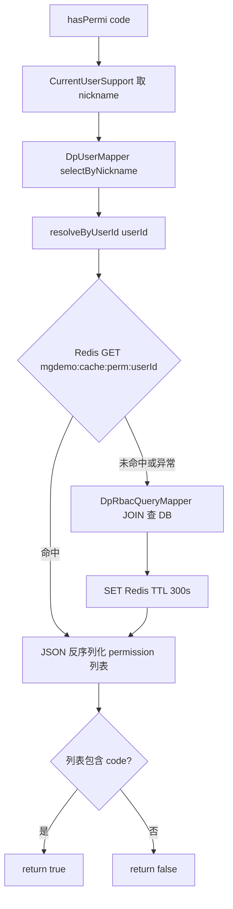
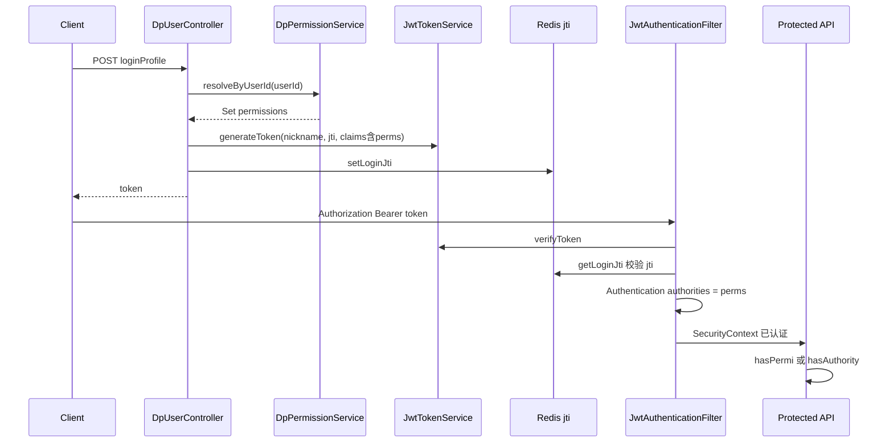

# RBAC 权限接入指南

> **核对日期**：2026-06-20  
> **权威来源**：`src/main/java/com/example/mgdemoplus/rbac/**`、`SecurityConfig`、`JwtAuthenticationFilter`  
> **相关设计**：`docs/design/rbac-p0.md`（P0 概要；本文对齐当前 **单参数** `hasPermi(String code)` API）

面向需要在 MGDemoPlus 中新增「按权限开关功能」的后端/全栈开发者。示例与类名均来自仓库现状，勿照搬过期双参数 `hasPermi(nickname, code)` 写法。

---

## 目录

1. [概述](#1-概述)
2. [依赖与前置条件](#2-依赖与前置条件)
3. [核心类地图](#3-核心类地图)
4. [接入步骤（标准流程）](#4-接入步骤标准流程)
5. [三种实现变种](#5-三种实现变种)
6. [@PreAuthorize SpEL 备忘](#6-preauthorize-spel-备忘)
7. [测试指南](#7-测试指南)
8. [验收 checklist](#8-验收-checklist)
9. [与 rbac-p0 的差异说明](#9-与-rbac-p0-的差异说明)

---

## 1. 概述

### 1.1 本项目的 RBAC 长什么样

MGDemoPlus 采用轻量 **角色 → 权限** 模型：

| 层级 | 存储 | 说明 |
|------|------|------|
| 用户 | `dp_user` | 业务用户表 |
| 角色 | `dp_role` | 如 `PLAYER`、`ADMIN` |
| 权限 | `dp_permission` | 字符串 code，如 `game:hole_cards:view` |
| 用户-角色 | `dp_user_role` | 多对多 |
| 角色-权限 | `dp_role_permission` | 多对多 |

**权限展开**：`DpRbacQueryMapper.selectPermissionCodesByUserId` 通过 JOIN 查出某用户全部 permission code。

**JWT 只携带昵称**：`JwtTokenService.generateToken` 的 `subject` = 用户昵称，`jti` 用于 Redis 单点登录校验。**Token 内不写 permissions 列表**（当前实现）。

**Redis 可选缓存**：`DpPermissionServiceImpl` 将「用户 → permission codes」缓存到 Redis（TTL 300s），角色/权限变更时 `evict`。

**运行时判定入口**：`DpPermissionService.hasPermi(String code)` — 从 `SecurityContext` 取当前昵称 → `userId` → 权限集合 → `contains(code)`。

### 1.2 何时用哪种方式

| 方式 | 适用场景 | 后端是否强制 | 示例 |
|------|----------|--------------|------|
| `@PreAuthorize` | REST 整接口需要权限 | 是 | `DpNpcDecisionTraceController` 三个 GET |
| Service 内 `hasPermi` | 同一接口内分支、非 Controller 层（快照脱敏、业务子路径） | 是 | `DpRoomSnapshotSupport`、`DpRoomServiceImpl` 实验排牌 |
| 前端权限列表 only | 按钮/菜单显隐，**不能替代后端** | 否（仅 UX） | `v-hasPermi`、`dpAuth/hasPerm` |

原则：**凡涉及数据泄露或越权操作，后端必须校验**；前端权限仅改善体验。

`hasPermi` 始终针对 **当前 JWT 对应用户**（`SecurityContext`），不接受「替别人查权限」的 nickname 参数。旁观/快照场景下，调用方应保证「viewer = 当前登录用户」。

---

## 2. 依赖与前置条件

### 2.1 Maven（已在 `pom.xml`）

| 依赖 | 用途 |
|------|------|
| `spring-boot-starter-security` | 过滤器链、`@EnableMethodSecurity` |
| `spring-boot-starter-data-redis` | 权限缓存、登录 jti 缓存 |
| `jjwt` 0.13.0 | JWT 签发/校验 |
| `mybatis-plus-spring-boot3-starter` | RBAC 实体 Mapper |
| `flyway-core` / `flyway-mysql` | 表结构与种子数据 |

无需为 RBAC 单独加依赖。

### 2.2 数据库（Flyway）

| 版本 | 文件 | 内容 |
|------|------|------|
| V26 | `V26__rbac_init.sql` | 四张 RBAC 表、`PLAYER`/`ADMIN` 角色、`game:hole_cards:view`、存量用户绑 `PLAYER` |
| V27 | `V27__rbac_experimental_deck_preset.sql` | `game:experimental_deck_preset` |
| V28 | `V28__rbac_npc_decision_trace.sql` | `game:npc_decision_trace`，并赋给 `ADMIN` 角色 |

**新权限**必须新建递增脚本，例如 `V29__rbac_my_feature.sql`。**禁止修改已应用的旧脚本**。

### 2.3 Spring Security 配置

`SecurityConfig` 已启用方法级安全：

```java
@EnableMethodSecurity(prePostEnabled = true)
```

- 非白名单请求：`anyRequest().authenticated()`（有合法 JWT 即可，**不**按角色区分）
- 白名单：`JwtSecurityConstants.PERMIT_ALL`
- `/dp/admin/**`、`/dpUser/permissions` **不在**白名单，需 JWT

管理 API 在 P0 仅要求「已登录 + 前端密码门闸」，**未**要求 `ADMIN` 角色（P1 规划项，见 `rbac-p0.md`）。

### 2.4 运行环境

- MySQL：`school_db`，Flyway 自动迁移
- Redis：权限缓存与 `DpRedisLoginCacheService`（登录 jti）共用；Redis 不可用时会降级读 DB（见 `DpPermissionServiceImpl` 的 warn 日志）

---

## 3. 核心类地图

### 3.1 权限服务

| 类 | 路径 | 职责 |
|----|------|------|
| `DpPermissionService` | `rbac/DpPermissionService.java` | 接口：`hasPermi`、`resolveByUserId`、`resolveByNickname`、`evictUser`、`evictAll` |
| `DpPermissionServiceImpl` | `rbac/impl/DpPermissionServiceImpl.java` | Bean 名 **`dpPermissionService`**（供 SpEL）；Redis 缓存 + DB 回源 |
| `DpPermissionCodes` | `rbac/support/DpPermissionCodes.java` | 权限 code 常量，避免魔法字符串 |
| `DpRbacQueryMapper` | `rbac/mapper/DpRbacQueryMapper.java` | `selectPermissionCodesByUserId`（JOIN 查询） |

**Redis 键**：`mgdemo:cache:perm:{userId}`，值为 JSON 数组字符串，TTL **300 秒**（`TTL_SECONDS`）。

### 3.2 角色/权限管理

| 类 | 路径 | 职责 |
|----|------|------|
| `DpRbacService` / `DpRbacServiceImpl` | `rbac/DpRbacService.java`、`impl/` | 角色列表、用户列表、替换角色权限/用户角色；变更后 evict |
| `DpAdminRbacController` | `controller/DpAdminRbacController.java` | `/dp/admin/**` 管理 REST |
| `DpRole`、`DpPermission` | `rbac/entity/` | MyBatis-Plus 实体 |
| `DpRoleMapper`、`DpPermissionMapper`、`DpRolePermissionMapper`、`DpUserRoleMapper` | `rbac/mapper/` | CRUD / 关联查询 |

**缓存失效**：

- `replaceUserRoles` → `evictUser(userId)`
- `replaceRolePermissions` → `evictAll()`
- `bindPlayerRole`（注册/OAuth）→ `evictUser(userId)`

### 3.3 安全与身份

| 类 | 路径 | 职责 |
|----|------|------|
| `DpCurrentUserSupport` | `security/DpCurrentUserSupport.java` | 从 `SecurityContext` 解析昵称 / `DpUser` / `userId` |
| `JwtAuthenticationFilter` | `security/JwtAuthenticationFilter.java` | Bearer JWT → `UsernamePasswordAuthenticationToken(principal=nickname)`；校验 Redis jti |
| `JwtTokenService` | `security/JwtTokenService.java` | 签发/校验 JWT（subject=昵称，id=jti） |
| `JwtAuthenticationEntryPoint` | `security/JwtAuthenticationEntryPoint.java` | 未认证 → **401** JSON |
| `SecurityConfig` | `config/SecurityConfig.java` | 过滤器链、`@EnableMethodSecurity` |

### 3.4 对外暴露权限列表

| 端点 | 类 | 说明 |
|------|-----|------|
| `GET /dpUser/permissions` | `DpUserController#currentUserPermissions` | 当前用户全部 permission codes |
| `GET /dp/admin/permissions` | `DpAdminRbacController` | 管理页：全部权限定义（id/code/name） |

### 3.5 现有接入示例

| 场景 | 位置 | 方式 |
|------|------|------|
| NPC 决策追踪 API | `DpNpcDecisionTraceController` | `@PreAuthorize` + `GAME_NPC_DECISION_TRACE` |
| 看别人底牌 | `DpRoomSnapshotSupport#sanitizeHoleCardsForViewer` | `permissionService.hasPermi(GAME_HOLE_CARDS_VIEW)` |
| 实验排牌 | `DpRoomServiceImpl#authorizeExperimentalDeckPreset` | `hasPermi(GAME_EXPERIMENTAL_DECK_PRESET)` |

### 3.6 前端（Vue 2）

| 文件 | 职责 |
|------|------|
| `front/dp_game/src/features/auth/store/dpAuth.js` | Vuex：`permissions`、`hasPerm` getter、`fetchPermissions` → `/dpUser/permissions` |
| `front/dp_game/src/directives/hasPermi.js` | `v-hasPermi="'game:hole_cards:view'"` |
| `front/dp_game/src/features/admin/` | 管理页角色/权限勾选 |

---

## 4. 接入步骤（标准流程）

以新增权限 `game:my_feature` 为例。

### Step 1：常量

在 `DpPermissionCodes` 增加：

```java
public static final String GAME_MY_FEATURE = "game:my_feature";
```

前端可同步在 `dpAuth.js` 增加 `DP_PERM_MY_FEATURE`（可选，便于 getter）。

### Step 2：Flyway 种子

新建 `src/main/resources/db/migration/V29__rbac_my_feature.sql`：

```sql
INSERT INTO dp_permission (code, name) VALUES
    ('game:my_feature', '我的功能');

-- 可选：默认赋给 ADMIN
INSERT INTO dp_role_permission (role_id, permission_id)
SELECT r.id, p.id
FROM dp_role r
CROSS JOIN dp_permission p
WHERE r.code = 'ADMIN'
  AND p.code = 'game:my_feature'
  AND NOT EXISTS (
      SELECT 1 FROM dp_role_permission rp
      WHERE rp.role_id = r.id AND rp.permission_id = p.id
  );
```

启动应用或 `mvn flyway:migrate` 后确认 `dp_permission` 有记录。

### Step 3：赋权

任选其一：

- 管理页 `/admin/roles` 勾选权限（需 JWT + 前端 `sessionStorage` 密码门闸）
- SQL：向 `dp_role_permission` 或给用户绑带该权限的角色
- 给用户绑角色：`PUT /dp/admin/users/{userId}/roles`

### Step 4：后端保护

**方式 A — Controller 整接口**（推荐用于独立 REST）：

```java
@GetMapping("/myFeature")
@PreAuthorize("@dpPermissionService.hasPermi(T(com.example.mgdemoplus.rbac.support.DpPermissionCodes).GAME_MY_FEATURE)")
public ResultUtil myFeature() {
  // ...
}
```

**方式 B — Service / 快照内分支**：

```java
if (!dpPermissionService.hasPermi(DpPermissionCodes.GAME_MY_FEATURE)) {
    return ResultUtil.error().data("message", "无权限");
}
```

### Step 5：暴露给前端（可选）

已有 `GET /dpUser/permissions`，登录后调用即可，无需新接口。用户重新拉取或 TTL 过期后会看到新 code。

### Step 6：前端门闸（可选）

```javascript
// 登录后（见 App 初始化或登录成功回调）
store.dispatch('dpAuth/fetchPermissions', { http })

// 模板
<button v-hasPermi="'game:my_feature'">我的功能</button>

// 或
if (this.$store.getters['dpAuth/hasPerm']('game:my_feature')) { ... }
```

**再次强调**：隐藏按钮不等于安全，Step 4 不可省略。

---

## 5. 三种实现变种

### 5.1 最小实现（无 Redis）

**思路**：每次 `resolveByUserId` 直接查 DB，不写 Redis。

简化类草图：

```java
@Service("dpPermissionService")
public class DpPermissionServiceDbOnly implements DpPermissionService {

    @Autowired private DpRbacQueryMapper rbacQueryMapper;
    @Autowired private DpUserMapper dpUserMapper;
    @Autowired private DpCurrentUserSupport currentUserSupport;

    @Override
    public boolean hasPermi(String code) {
        String nickname = currentUserSupport.requireNickname();
        if (nickname == null || code == null || code.isBlank()) return false;
        DpUser user = dpUserMapper.selectByNickname(nickname.trim());
        if (user == null) return false;
        return resolveByUserId(user.getId()).contains(code);
    }

    @Override
    public Set<String> resolveByUserId(int userId) {
        List<String> loaded = rbacQueryMapper.selectPermissionCodesByUserId(userId);
        return loaded == null ? Set.of() : new LinkedHashSet<>(loaded);
    }

    @Override public void evictUser(int userId) { /* no-op */ }
    @Override public void evictAll() { /* no-op */ }
    // resolveByNickname 同现实现
}
```

**需调整**：

- 移除或 `@Autowired(required = false)` `StringRedisTemplate`（当前实现为强依赖）
- `evict*` 可留空；`DpRbacServiceImpl` 仍可调用，无副作用

| 优点 | 缺点 |
|------|------|
| 无缓存一致性问题 | 每次 `hasPermi` 至少 1 次 DB（nickname→user + JOIN 权限） |
| 部署简单（仅 MySQL） | 高 QPS 快照/WS 场景 DB 压力更大 |
| 权限变更立即生效 | 与登录 jti 仍可能依赖 Redis（若保留单点登录） |

适合：本地开发、集成测试、无 Redis 的极简环境。

### 5.2 扩展 A：Redis 缓存权限（**本项目当前做法**）



**失效时机**：

| 操作 | 方法 | 效果 |
|------|------|------|
| 修改某用户角色 | `replaceUserRoles` | `evictUser(userId)` |
| 修改角色权限 | `replaceRolePermissions` | `evictAll()` |
| 新用户绑 PLAYER | `bindPlayerRole` | `evictUser(userId)` |
| TTL 到期 | — | 自动回源 DB |

注意：`evictAll` 使用 `keys mgdemo:cache:perm:*`，大规模部署可考虑 SCAN + 按 role 精确 evict（当前未实现）。

### 5.3 扩展 B：JWT 内嵌权限列表（**未实现，扩展设计**）

在登录签发 Token 时把 permissions 写入 claim，过滤器载入 `Authentication`。



**签发示例（示意）**：

```java
Jwts.builder()
    .subject(nickname)
    .id(jti)
    .claim("perms", permissionCodes)  // 新增
    .signWith(secretKey)
    .compact();
```

**过滤器**：从 claims 读取 `perms`，构造 `SimpleGrantedAuthority("perm:game:...")` 或自定义 `DpUserDetails`。

| 对比 | JWT 内嵌 | Redis/DB（当前） |
|------|----------|------------------|
| 每次请求 DB/Redis | 否（仅解析 JWT） | 是（或读 Redis） |
| Token 体积 | 权限多时变大 | 小 |
| 权限变更生效 | 需重登或短 TTL + 刷新 Token | evict 或等 TTL |
| 撤销权限 | 难（除非 jti 黑名单） | evict 即可 |

**权限变更策略**：管理端改角色后调用 `evict` **不够**；需强制下线（删 jti）或下发 refresh，否则旧 Token 内 perms 仍有效。

---

## 6. @PreAuthorize SpEL 备忘

### 6.1 本项目标准写法

```java
@PreAuthorize("@dpPermissionService.hasPermi(T(com.example.mgdemoplus.rbac.support.DpPermissionCodes).GAME_NPC_DECISION_TRACE)")
```

| SpEL 片段 | 含义 |
|-----------|------|
| `@dpPermissionService` | 调用 Spring Bean `dpPermissionService`（`@Service("dpPermissionService")`） |
| `.hasPermi(...)` | 单参数方法，内部用当前登录用户 |
| `T(...)` | 引用 Java 类，访问 `public static final` 常量 |
| `.GAME_NPC_DECISION_TRACE` | 常量值 `"game:npc_decision_trace"` |

也可用字符串字面量（不推荐，易与 DB code 不一致）：

```java
@PreAuthorize("@dpPermissionService.hasPermi('game:npc_decision_trace')")
```

### 6.2 401 vs 403

| 情况 | 典型状态码 | 说明 |
|------|------------|------|
| 无 Token / Token 无效 / jti 不匹配 | **401** | `JwtAuthenticationFilter` 或 `JwtAuthenticationEntryPoint` |
| 已登录但 `@PreAuthorize` 失败 | **403** | Spring Security 默认 `AccessDeniedException`（项目未自定义 `AccessDeniedHandler`，响应体可能非 `ResultUtil` 格式） |
| Service 内 `hasPermi` 为 false | 业务自定义 | 多为 `ResultUtil.error()`（HTTP 200 + `success:false`），见实验排牌 |

联调时注意区分：**401 重新登录**，**403 权限不足**。

### 6.3 常见坑

- Bean 名必须是 `dpPermissionService`，与 `@Service("dpPermissionService")` 一致。
- `@EnableMethodSecurity(prePostEnabled = true)` 未开则 `@PreAuthorize` 不生效。
- `hasPermi` 依赖 `SecurityContext`；异步线程需手动传递上下文。
- 白名单路径带无效 Token 时按匿名访问，不会 401。

---

## 7. 测试指南

### 7.1 单元测试 `DpPermissionServiceImpl`

参考 `src/test/java/com/example/mgdemoplus/rbac/impl/DpPermissionServiceImplTest.java`：

- Mock：`DpCurrentUserSupport`、`DpUserMapper`、`DpRbacQueryMapper`、`StringRedisTemplate`、`ObjectMapper`
- 覆盖：Redis 命中、`resolveByUserId` DB 回源并 `set` 缓存、`evictUser`

```bash
mvn test -Dtest=DpPermissionServiceImplTest
```

### 7.2 业务层 Mock `hasPermi`

| 测试类 | 场景 |
|--------|------|
| `DpRbacHoleCardsTest` | 快照脱敏：有/无 `GAME_HOLE_CARDS_VIEW` |
| `DpRbacExperimentalDeckPresetTest` | 实验排牌授权 |

模式：

```java
when(permissionService.hasPermi(eq(DpPermissionCodes.GAME_HOLE_CARDS_VIEW))).thenReturn(true);
```

```bash
mvn test -Dtest=DpRbacHoleCardsTest
mvn test -Dtest=DpRbacExperimentalDeckPresetTest
```

### 7.3 批量 RBAC 相关测试

```bash
mvn test -Dtest=DpPermissionServiceImplTest,DpRbacHoleCardsTest,DpRbacExperimentalDeckPresetTest
```

### 7.4 前端 E2E（可选）

- `front/dp_game/e2e/rbac-hole-cards.spec.js`
- `front/dp_game/e2e/rbac-npc-decision-trace.spec.js`
- Mock 助手：`front/dp_game/e2e/helpers/rbacMocks.js`

---

## 8. 验收 checklist

| 场景 | 预期 | 如何验证 |
|------|------|----------|
| Flyway 新脚本 | `dp_permission` 有新 code | 查库或 `/dp/admin/permissions` |
| 无权限用户调 REST | `@PreAuthorize` → 403；或业务 error 消息 | curl/浏览器带该用户 JWT |
| 赋权后 | `GET /dpUser/permissions` 含新 code | 管理页赋权 → 重新 `fetchPermissions` |
| Redis 缓存 | 首次 DB，300s 内 Redis 命中 | 日志或 Redis `GET mgdemo:cache:perm:{id}` |
| 改用户角色 | 该用户缓存被删 | 赋权后立即生效（或等 TTL） |
| 改角色权限 | 全量 perm 缓存清空 | `evictAll` 后所有用户下次回源 |
| 看牌权限 | 非房主有 `game:hole_cards:view` 可见他人底牌 | 单测 / 对局手动 |
| 仅前端隐藏 | 直接调 API 仍被拒绝 | 无权限用户 curl 接口 |
| 未登录 | 401 | 不带 Authorization |
| 注册新用户 | 自动 `PLAYER` 角色 | 注册后查 `dp_user_role` |

---

## 9. 与 rbac-p0 的差异说明

`docs/design/rbac-p0.md` 中部分设计与当前代码已不一致，接入时以 **源码** 为准：

| rbac-p0 文档 | 当前实现 |
|--------------|----------|
| `DpPermissionResolver` / 双参数 `hasPermi(nickname, code)` | 已合并为 `DpPermissionService.hasPermi(String code)` |
| `GET /dp/auth/permissions` | `GET /dpUser/permissions` |
| Filter 加载 `GrantedAuthority` 列表 | Filter 仅设 `principal=nickname`，权限走 Service |
| 房主 + RBAC 看牌 | `DpRoomSnapshotSupport` 仅用 `hasPermi`（房主摊牌逻辑见 `revealOthers` 分支） |

---

## 附录：当前已注册权限码

| 常量 | code | 迁移 |
|------|------|------|
| `GAME_HOLE_CARDS_VIEW` | `game:hole_cards:view` | V26 |
| `GAME_EXPERIMENTAL_DECK_PRESET` | `game:experimental_deck_preset` | V27 |
| `GAME_NPC_DECISION_TRACE` | `game:npc_decision_trace` | V28（默认 ADMIN 角色） |

---

*文档维护：新增权限或变更缓存策略时请同步更新本节与 Flyway 版本表。*
---
# 手写接入画廊权限
