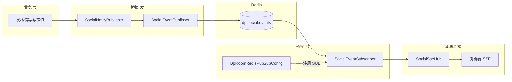
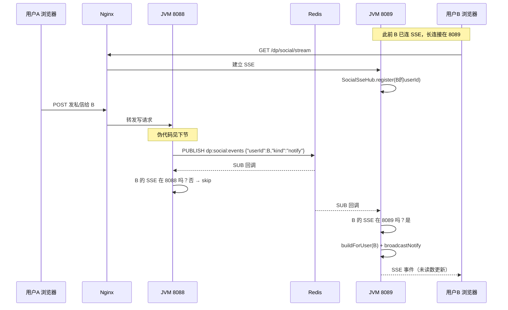

# SSE 从单实例到多实例：桥接实现说明

> 本文只讲 **SSE 社交通知** 这一条线，把「单 JVM 直推」改成「Redis 广播 + 各机本地推」时，**要配什么、桥接代码写在哪、A 机业务怎么触达 B 机上的 SSE 连接**。  
> 业务细节用伪代码；**配置与桥接类名与本仓库一致**，可直接对照源码。

---

## 1. 单实例时怎么工作（改造前）

```
用户 B 打开页面
  → GET /dp/social/stream
  → SocialSseHub 把 SseEmitter 放进内存 Map：userId → 连接

用户 A 给 B 发私信（HTTP 落在同一台 JVM）
  → 写数据库
  → SocialNotifyPublisher.notifyUser(B的userId)
  → SocialSseHub.broadcastNotify(B)   // 直接推，因为连接在本机
```

**痛点：** 只有一台机器时没问题。Nginx 把 A 的请求分到 **8088**，B 的 SSE 长连接却在 **8089** 时，8088 内存里 **没有 B 的连接**，推送被跳过。

---

## 2. 多实例思路（改造后）

**数据仍写 MySQL；SSE 连接仍只能在本机内存。**

中间加一层 **Redis 大喇叭**：

```
任意 JVM 写完业务
  → 不直接推 SSE（或不再只推本机）
  → Redis PUBLISH 频道 dp:social:events  （消息很短，只含 userId + 类型）

每一台 JVM 都 SUBSCRIBE 这个频道
  → 收到广播后问：userId 的 SSE 在我这台吗？
  → 在 → 查库组 payload → SocialSseHub 推给浏览器
  → 不在 → 忽略（别的机器会推）
```

**不需要**在 Redis 里配置「8088 对应谁、8090 对应谁」。  
**只按 userId 判断本机有没有 SSE**，和端口无关。

---

## 3. Redis 要配什么？

### 3.1 没有单独的「推送配置文件」

Pub/Sub **不需要**在 `redis.conf` 里建队列。  
只要 Spring Boot **能连上 Redis**，代码里 `convertAndSend(频道名, 字符串)` 即可。

本仓库连接在 `application.yml`（或 `.env` 覆盖）：

```yaml
spring:
  data:
    redis:
      host: ${SPRING_DATA_REDIS_HOST:127.0.0.1}
      port: ${SPRING_DATA_REDIS_PORT:6379}
      password: ${SPRING_DATA_REDIS_PASSWORD:ruoyi123}
```

多实例时：**8088、8089 连同一个 Redis**（同一 host/port/password）。

### 3.2 频道名（代码常量）

| 用途 | 常量位置 | 频道字符串 |
|------|----------|------------|
| SSE 社交通知 | `SocialRedisKeys.EVENTS_CHANNEL` | `dp:social:events` |

（对局 WebSocket 用另一条：`dp:room:events`，本文不展开。）

### 3.3 消息长什么样

发布的是 **JSON 字符串**，尽量短，**不塞整份未读列表**（订阅方会再查库）：

```json
{ "userId": 123, "kind": "notify" }
```

其他 kind：`presence`、`achievement` 会多几个字段，见 `SocialEventPublisher.SocialEventMessage`。

---

## 4. 桥接要写的四块（对照本仓库）

可以把桥接想成 **「发广播 / 听广播 / 注册监听 / 本机推浏览器」**。



| 块 | 类 | 职责 |
|----|-----|------|
| **① 业务入口** | `SocialNotifyPublisher` | 写库成功后 **只** 调 `socialEventPublisher.publish(...)`，不再直接 `sseHub.broadcast` |
| **② 发广播** | `SocialEventPublisher` | `stringRedisTemplate.convertAndSend("dp:social:events", json)` |
| **③ 听广播** | `SocialEventSubscriber` | 实现 `MessageListener.onMessage`，解析 JSON |
| **④ 注册监听** | `DpRoomRedisPubSubConfig` | 创建 `RedisMessageListenerContainer`，把 ③ 绑到频道上 |
| **⑤ 本机 SSE** | `SocialSseHub` | 内存 `userId → SseEmitter`；`hasLocalSubscribers` / `broadcastNotify` |

`SocialRedisPubSubConfig` 只负责把 ③ 注册成 Spring Bean；**真正挂到 Redis 的是 `DpRoomRedisPubSubConfig`**（与房间 WS 共用同一个 Listener 容器）。

---

## 5. 桥接代码要点（真实片段）

### 5.1 发：Publisher

```java
// SocialEventPublisher.java
stringRedisTemplate.convertAndSend(SocialRedisKeys.EVENTS_CHANNEL, payload);
// SocialRedisKeys.EVENTS_CHANNEL == "dp:social:events"
```

### 5.2 听：Subscriber 核心逻辑

```java
// SocialEventSubscriber.onMessage
SocialEventMessage evt = objectMapper.readValue(body, ...);

// 关键：没有本地 SSE 就不干活
if (!socialSseHub.hasLocalSubscribers(evt.userId())) {
    return;
}

// 有连接：再查库组装完整 payload，推 SSE
SocialNotifyPayload payload = summaryService.buildForUser(evt.userId());
socialSseHub.broadcastNotify(evt.userId(), payload);
```

### 5.3 注册：Spring 监听容器

```java
// DpRoomRedisPubSubConfig.java
RedisMessageListenerContainer container = new RedisMessageListenerContainer();
container.setConnectionFactory(connectionFactory);

MessageListenerAdapter socialAdapter =
    new MessageListenerAdapter(socialEventSubscriber, "onMessage");
container.addMessageListener(
    socialAdapter,
    new ChannelTopic(SocialRedisKeys.EVENTS_CHANNEL));  // dp:social:events
```

每台 JVM 启动时都会执行上面这段 → **每台都会订阅**。

### 5.4 本机连接表

```java
// SocialSseHub.java
ConcurrentHashMap<Integer, Set<SseEmitter>> emittersByUser;

// GET /dp/social/stream 时
public SseEmitter connect(int userId, ...) {
    register(userId, emitter);  // 只存在本机内存
}

public boolean hasLocalSubscribers(int userId) {
    Set<SseEmitter> set = emittersByUser.get(userId);
    return set != null && !set.isEmpty();
}
```

---

## 6. 完整故事：A 机在 8088 发私信，B 的 SSE 在 8089



---

## 7. 业务层伪代码（你要改的只有「通知方式」）

### 7.1 单实例（旧）

```text
function 用户A发私信(接收方 userIdB, 内容):
    数据库.insert(私信)
    payload = 查询未读摘要(userIdB)
    sseHub.broadcastNotify(userIdB, payload)   // 假设连接在本机
```

### 7.2 多实例（新）

```text
function 用户A发私信(接收方 userIdB, 内容):
    数据库.insert(私信)
    socialNotifyPublisher.notifyUser(userIdB)
        → socialEventPublisher.publish(userIdB, "notify")
        → Redis PUBLISH dp:social:events

// 下面不在业务里写，由 SocialEventSubscriber 自动做：
function onRedisMessage(userIdB):
    if not sseHub.hasLocalSubscribers(userIdB):
        return
    payload = 查询未读摘要(userIdB)
    sseHub.broadcastNotify(userIdB, payload)
```

**业务规则（谁发给谁、写哪张表）不变**；变的只是最后一行从「直推 Hub」变成「发 Redis 事件」。

---

## 8. HTTP / Nginx 这一层

| 请求 | 说明 |
|------|------|
| `GET /dp/social/stream` | 建立 SSE，Nginx **轮询**到某一台 JVM，连接就粘在那台 |
| `POST /dp/...` 写操作 | 可能落在 **另一台** JVM |
| 因此 | 必须 Redis 广播，不能假设写请求和 SSE 同机 |

Nginx 对 SSE 需关缓冲（本仓库 `docker/nginx/default.conf`）：

```nginx
location = /dp/social/stream {
    proxy_pass http://mgdemo_backend;
    proxy_buffering off;
    gzip off;
    proxy_read_timeout 86400s;
    ...
}
```

---

## 9. 从单实例迁移 checklist

| 步骤 | 做什么 |
|------|--------|
| 1 | 定频道名常量，如 `dp:social:events` |
| 2 | 写 `SocialEventPublisher`（convertAndSend） |
| 3 | 写 `SocialEventSubscriber`（onMessage + hasLocalSubscribers） |
| 4 | 在 `RedisMessageListenerContainer` 里 **addMessageListener** 绑频道 |
| 5 | 所有原先 `sseHub.broadcast*` 的 **业务入口** 改为 `publish` |
| 6 | `SocialSseHub` 保留 connect / broadcast，加 `hasLocalSubscribers` |
| 7 | 保留 `GET /notify-summary` 轮询兜底 |
| 8 | 双 JVM + Nginx 联调：写在一台、SSE 在另一台仍能收到 |

**不要做的：**

- 不要按 `8088/8089` 端口路由 Redis 消息  
- 不要在 Pub/Sub  payload 里塞巨大 JSON（订阅方查库即可）  
- 不要业务层既 `publish` 又直接 `sseHub.broadcast`（会重复推，发布机推两次）

---

## 10. 限制与兜底

| 点 | 说明 |
|----|------|
| Redis Pub/Sub **不存历史** | 广播时 B 没连 SSE → 这条实时通知丢，靠轮询补 |
| 轮询兜底 | `GET /dp/social/notify-summary` |
| 单机也要能跑 | 8088 自己 publish，自己的 Subscriber 也会收到，逻辑统一 |

---

## 11. 和 WebSocket 房间对比（便于记忆）

| | SSE 社交通知 | WS 对局快照 |
|--|--------------|-------------|
| 频道 | `dp:social:events` | `dp:room:events` |
| 广播键 | `userId` | `roomId` |
| 本机连接表 | `SocialSseHub` | `DpGameRoomPushService` |
| 发 | `SocialEventPublisher` | `DpRoomEventPublisher` |
| 收 | `SocialEventSubscriber` | `DpRoomEventSubscriber` |
| 状态 SSOT | MySQL + 摘要查库 | Redis `dp:room:state:{roomId}` |

**同一套模式：** Redis 只负责 **喊「该推了」**；**连在谁机上谁推**。

---

## 12. 源码索引

| 文件 |
|------|
| `social/notify/SocialRedisKeys.java` |
| `social/notify/SocialEventPublisher.java` |
| `social/notify/SocialEventSubscriber.java` |
| `social/notify/SocialNotifyPublisher.java` |
| `social/notify/SocialSseHub.java` |
| `config/SocialRedisPubSubConfig.java` |
| `config/DpRoomRedisPubSubConfig.java` |
| `controller/DpSocialController.java` |

整体启动与环境见 [multi-instance-dev-guide.md](./multi-instance-dev-guide.md)。
