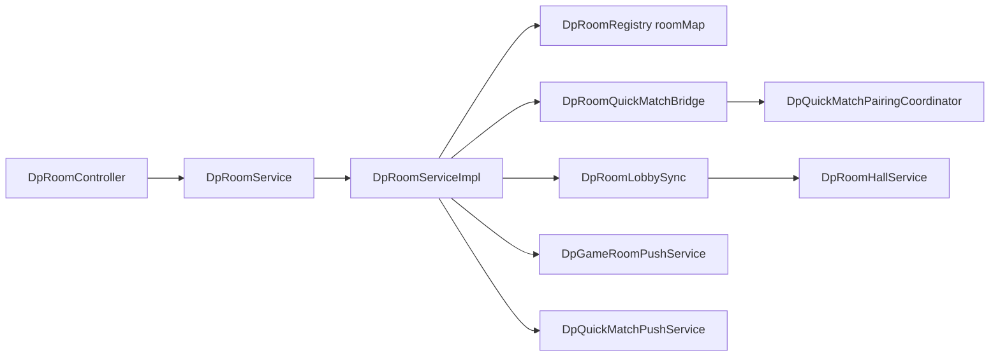

# MGDemoPlus 包结构与对局域架构

> 扫描日期：2026-05-22 · 范围：对局/大厅/快匹/WS · 覆盖重写

基包：`com.example.mgdemoplus`。主源码约 **142** 个 `.java`（含 `MgDemoPlusApplication`）。与代码不一致时以仓库实现为准。

## 迁移后布局概览

HTTP 与横切能力仍在 **功能模块包之外** 的全局层；业务按 **功能域子包** 组织（`room/`、`lobby/`、`quickmatch/` 等），已删除旧扁平包 `entity/`、`mapper/`、`bo/`、`service/`、`service/serviceImpl/`。

| 层级 | 职责 |
|------|------|
| 全局 `controller/` | REST 路由，参数校验，不写业务 |
| 功能域 `{feature}/` | 接口、impl、entity、mapper、bo、vo、support、pairing 等 |
| `common/` | 跨 ≥2 模块共享的类型 |
| 全局 `websocket/` | 对局推送与快匹推送（内存会话表） |

## 全局层（与本扫描相关部分）

| 包 | 关键类型 | 说明 |
|----|----------|------|
| `(root)` | `MgDemoPlusApplication` | `@MapperScan` 扫描各模块 `*.mapper`；`@EnableScheduling` |
| `controller/` | `DpRoomController` | 前缀 `/dpRoom`：建房、对局、快匹 REST、大厅列表 |
| `config/` | `WebSocketGameRoomConfig` | 注册 `/ws/dp-game`、`/ws/dp-quick-match` |
| `config/` | `SecurityConfig` | 与 `JwtSecurityConstants.PERMIT_ALL` 配合 |
| `security/` | `JwtAuthenticationFilter`, `JwtTokenService`, `JwtSecurityConstants` | JWT；`/ws/**` 白名单，WS 内自行验 token |
| `websocket/` | 见下文「WebSocket 分工」 | 单机内存 `ConcurrentHashMap` 维护订阅 |
| `utils/` | `ResultUtil`, `DpUtilHandEvaluator` 等 | 统一 REST 包装与牌力工具 |
| `llm/` | `OpenAiCompatibleChatClient` | LLM Bot 共用 HTTP 客户端（对局内 NPC 调用链经 `npc/`） |

### `@MapperScan`（启动类）

```text
common.mapper, history.mapper, lobby.mapper, music.mapper,
roomchat.mapper, social.mapper, user.mapper
```

`room` / `quickmatch` / `websocket` **无** MyBatis Mapper——热状态在内存。

## `common/`（房间/玩家）

| 路径 | 类型 | 用途 |
|------|------|------|
| `common/bo/DpRoomBO.java` | BO | 运行时房间聚合（座位、底池、阶段、候补等） |
| `common/entity/DpRoom.java` | 行模型 | 大厅摘要 `dp_room_lobby` 映射字段 |
| `common/entity/DpPlayer.java` | 实体 | 桌上玩家状态 |
| `common/entity/DpPot.java` | 实体 | 底池 |
| `common/entity/DpUser.java` | 实体 | 用户（JWT subject = nickname） |
| `common/mapper/DpUserMapper.java` | Mapper | `selectByNickname` 等 |

规则：多模块引用放 `common/`；对局逻辑仍在 `room.impl.DpRoomServiceImpl`，不迁入 `common`。

## 功能模块树（全仓库 + 本域展开）

```
com.example.mgdemoplus
├── MgDemoPlusApplication.java
├── common/           # 见上表
├── controller/       # DpRoomController, DpUserController, …
├── config/           # SecurityConfig, WebSocketGameRoomConfig, …
├── security/
├── websocket/
├── utils/
├── llm/
├── room/                    ★ 对局热状态
│   ├── DpRoomService.java
│   ├── KickPlayersBatchResult.java
│   ├── impl/
│   │   └── DpRoomServiceImpl.java    # roomMap、快匹队列、@Scheduled 修剪
│   └── support/
│       ├── DpRoomRegistry.java       # ConcurrentHashMap roomId → DpRoomBO
│       ├── DpRoomLobbySync.java      # 快匹索引 + dp_room_lobby 同步
│       ├── DpRoomQuickMatchBridge.java
│       ├── DpRoomQuickMatchPairingHost.java
│       ├── DpRoomServiceCallbacks.java
│       ├── DpRoomSnapshotSupport.java
│       ├── DpRoomHumanCounts.java
│       └── DpRoomHeartbeatScheduler.java
├── lobby/                   ★ 大厅 DB 镜像
│   ├── DpRoomHallService.java
│   ├── DpRoomLobbyReconcileScheduler.java
│   ├── impl/DpRoomHallServiceImpl.java
│   ├── entity/DpRoomLobby.java
│   ├── mapper/DpRoomLobbyMapper.java, DpRoomLobbyMpMapper.java
│   ├── bo/DpRoomLobbySearchParamBO.java
│   └── vo/DpRoomPublicRoomsPageVO.java
├── quickmatch/              ★ 快匹语义与配对
│   ├── DpQuickMatchRoomSemantics.java
│   ├── JoinableQuickMatchRoomIndex.java
│   └── pairing/
│       ├── DpQuickMatchPairingCoordinator.java
│       ├── DpQuickMatchPairingHost.java
│       └── DpQuickMatchWaitEntry.java
├── roomchat/                # 局内聊天缓冲与落库（摘房时 flush）
├── npc/                     # 规则/LLM Bot（对局内出手）
├── history/, social/, presence/, user/, music/, moderation/
└── …
```

### `room/` 关键类关系



- **单实例 `roomMap`**：`DpRoomRegistry` 内 `ConcurrentHashMap<String, DpRoomBO>`；`DpRoomServiceImpl` 保留 `roomMap` 字段指向同一 Map（测试反射兼容）。
- **房间锁**：写路径对 **单个** `DpRoomBO` 实例 `synchronized(r)`；空房摘除须在持锁下调用 `DpRoomRegistry.tryUnregisterEmptyRoomAssumeLocked`。
- **多实例风险**：各 JVM 独立 `roomMap` 与 WS 会话表；`DpRoomLobbyReconcileScheduler` 用本进程 `getRoomIdsInMemory()` 清 DB 幽灵房——**多实例开启 reconcile 会误删其他节点仍存在的房**。生产多副本应设 `mgdemoplus.dp-lobby-reconcile-enabled=false` 或引入分布式房间注册。

### `lobby/`

| 类 | 角色 |
|----|------|
| `DpRoomHallService` / `DpRoomHallServiceImpl` | `dp_room_lobby` upsert/delete、分页列表、Redis 缓存 rev |
| `DpRoomLobbyReconcileScheduler` | 启动 + 定时对齐 DB 与内存 roomId 集合 |
| `DpRoomLobby` + `DpRoomLobbyMapper` | MyBatis 摘要表 |
| `DpRoomLobbyMpMapper` | MyBatis-Plus 条件查询（`publicRooms/query`） |

### `quickmatch/`

| 类 | 角色 |
|----|------|
| `DpQuickMatchRoomSemantics` | 公开房空位、是否可入索引的**唯一权威**语义 |
| `JoinableQuickMatchRoomIndex` | 按「缺人数」分桶的 `TreeMap`，避免全表扫 `roomMap` |
| `DpQuickMatchPairingCoordinator` | `attemptPairing()`：先填已有桌，再无桌批量建房 |
| `DpQuickMatchPairingHost` | 由 `DpRoomQuickMatchPairingHost` 实现，桥接 `DpRoomQuickMatchBridge` |

**快匹三句话（流程）：**

1. **REST 入队**：`POST /dpRoom/quickMatch2` → `quickMatchJoinQueueOrImmediate` 入 FIFO（默认盲注 5/10、9 人桌），并触发 `attemptPairing()`。
2. **配对**：`JoinableQuickMatchRoomIndex` 优先把队列头填入已有公开空桌；若无合适桌且队列 ≥2 人，则批量出队建新公开房并 `startGame`。
3. **推送**：排队/匹配状态经 `/ws/dp-quick-match` 由 `DpQuickMatchPushService` 推送 `WAITING` / `MATCHED` / `IDLE`（REST 仅触发，不替代 WS）。

### `websocket/`（对局域）

| 类 | 路径 | 职责 |
|----|------|------|
| `DpGameRoomWebSocketHandler` | `/ws/dp-game?roomId=&nickname=` | 订阅房间；初始快照同 `getNowRoom` JSON |
| `DpGameRoomPushService` | — | `roomId → Set<WebSocketSession>`；状态变更广播 |
| `DpQuickMatchWebSocketHandler` | `/ws/dp-quick-match?nickname=&token=` | 握手校验 JWT subject == nickname |
| `DpQuickMatchPushService` | — | `nickname → sessions`；快匹状态推送 |

配置类：`config/WebSocketGameRoomConfig.java`（`setAllowedOrigins("*")`）。

## 子包命名约定

| 子包 | 用途 |
|------|------|
| `impl/` | `@Service` 实现 |
| `entity/` / `mapper/` | DB |
| `bo/` / `vo/` | 业务对象 / 列表视图 |
| `support/` | 房间编排、注册表、心跳、快匹桥接（`room` 专用） |
| `pairing/` | 快匹协调器与 Host 契约（`quickmatch`） |

## Flyway（本域相关表名）

完整版本号见 Agent 3；本域涉及：

| 表 | 用途 |
|----|------|
| `dp_room_lobby` | 公开房大厅摘要（V1） |
| `dp_room_invite` | 房间邀请（V1，社交进房） |
| `dp_room_chat_message` | 局内聊天归档（V2/V3） |

## `application.yml`（`mgdemoplus.*` 本域）

| 配置项 | 默认 | 说明 |
|--------|------|------|
| `dp-lobby-reconcile-enabled` | `true` | 单机房对齐 `dp_room_lobby` 与 `roomMap` |
| `dp-lobby-reconcile-ms` | `60000` | 对齐间隔；启动后也会跑一轮 |
| `dp-quick-match-prune-ms` | `30000` | 快匹队列超时/已在房 prune（`DpRoomServiceImpl` `@Scheduled`） |
| `cache.dp-room-public-rooms-ttl-seconds` | `120` | 大厅列表 Redis 缓存 TTL（`DpRoomHallServiceImpl`） |

## 相关测试（列举）

| 测试类 | 覆盖 |
|--------|------|
| `JoinableQuickMatchRoomIndexTest` | 快匹房间索引桶 |
| `DpQuickMatchPairingCoordinatorTest` | 配对协调器 |
| `DpRoomDesertedRoomCleanupTest` | 空房清理 |

## README 建议修订点

- 对局热状态在 [`DpRoomRegistry`](src/main/java/com/example/mgdemoplus/room/support/DpRoomRegistry.java) / [`DpRoomServiceImpl`](src/main/java/com/example/mgdemoplus/room/impl/DpRoomServiceImpl.java) 的 **`roomMap`（单机内存）**，不在 Redis；多实例需粘滞会话或分布式房间方案。
- 大厅镜像表 **`dp_room_lobby`** 由 [`DpRoomLobbySync`](src/main/java/com/example/mgdemoplus/room/support/DpRoomLobbySync.java) + [`DpRoomHallServiceImpl`](src/main/java/com/example/mgdemoplus/lobby/impl/DpRoomHallServiceImpl.java) 维护；幽灵房清理见 [`DpRoomLobbyReconcileScheduler`](src/main/java/com/example/mgdemoplus/lobby/DpRoomLobbyReconcileScheduler.java)（多实例默认应关闭 reconcile）。
- 快匹核心：[`JoinableQuickMatchRoomIndex`](src/main/java/com/example/mgdemoplus/quickmatch/JoinableQuickMatchRoomIndex.java) + [`DpQuickMatchPairingCoordinator`](src/main/java/com/example/mgdemoplus/quickmatch/pairing/DpQuickMatchPairingCoordinator.java) + [`DpRoomQuickMatchBridge`](src/main/java/com/example/mgdemoplus/room/support/DpRoomQuickMatchBridge.java)。
- WebSocket：对局 [`/ws/dp-game`](src/main/java/com/example/mgdemoplus/websocket/DpGameRoomWebSocketHandler.java)，快匹 [`/ws/dp-quick-match`](src/main/java/com/example/mgdemoplus/websocket/DpQuickMatchWebSocketHandler.java)（配置 [`WebSocketGameRoomConfig`](src/main/java/com/example/mgdemoplus/config/WebSocketGameRoomConfig.java)）。
- 删除 README 中 `service.serviceImpl.*`、`entity.*` 等旧包路径；NPC 策略类应在 `npc/strategy/` 下链到具体 `.java`。
- `@MapperScan` 列表以 [`MgDemoPlusApplication`](src/main/java/com/example/mgdemoplus/MgDemoPlusApplication.java) 为准，`room` 模块无 Mapper。
