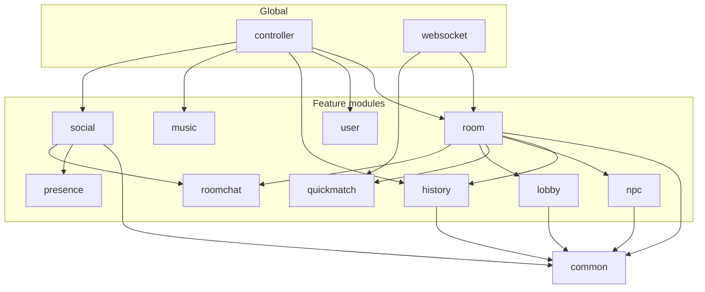

# MGDemoPlus package architecture

> Final layout after modular migration (2026-05-18). Base package: `com.example.mgdemoplus`.  
> **127** main-source `.java` files under `src/main/java/.../mgdemoplus/` (+ `MgDemoPlusApplication` at root).

## Global layer (unchanged location)

HTTP and cross-cutting code stay at the repository root of the Java tree — not feature modules.

| Package | Role | Key types |
|---------|------|-----------|
| `(root)` | Boot | `MgDemoPlusApplication` — `@MapperScan` lists module `*.mapper` packages |
| `controller/` | REST | `DpRoomController`, `DpUserController`, `DpHandHistoryController`, `DpMusicController`, `DpFriendMailboxController`, `DpSocialController`, `UploadController` |
| `config/` | Spring | `SecurityConfig`, `WebSocketGameRoomConfig`, `MybatisPlusConfig`, `CorsConfig`, `LocalDotenvLoader`, `WebConfig` |
| `security/` | JWT | `JwtTokenService`, `JwtAuthenticationFilter`, `JwtSecurityConstants`, `JwtAuthenticationEntryPoint` |
| `websocket/` | Push / WS | `DpGameRoomWebSocketHandler`, `DpGameRoomPushService`, `DpQuickMatchWebSocketHandler`, `DpQuickMatchPushService` |
| `utils/` | Shared helpers | `ResultUtil`, `ResultCode`, `CryptoUtil`, `DpUtilHandEvaluator`, `DpUtilNpcDisplayNickname`, `DpUtilSmartContext` |
| `llm/` | HTTP client | `OpenAiCompatibleChatClient` |

Controllers depend on **module services** (`room`, `user`, `history`, …), never on `*Impl` types directly except where legacy wiring still uses concrete classes (e.g. `DpRoomController` → `DpRoomService`).

## Feature modules

Each feature uses a consistent subpackage vocabulary:

| Subpackage | Convention |
|------------|------------|
| `(module root)` | Public **service interfaces** and small coordinators (`DpRoomHallService`, `DpHandHistoryService`, …) |
| `impl/` | `@Service` implementations |
| `entity/` | MyBatis / DB row models for this module |
| `mapper/` | MyBatis mapper interfaces (**must** appear in `@MapperScan`) |
| `bo/` | In-memory or API business objects |
| `vo/` | Controller-facing view objects |
| `buffer/`, `pairing/`, `engine/`, `strategy/`, `llm/`, `notify/`, `cache/`, `support/` | Domain-specific sub-areas |

### Module tree (current)

```
com.example.mgdemoplus
├── MgDemoPlusApplication.java
├── common/                    # shared across ≥2 modules
│   ├── bo/          DpRoomBO
│   ├── entity/      DpUser, DpPlayer, DpPlayerStats, DpPot, DpRoom
│   └── mapper/      DpUserMapper
├── user/
│   ├── DpUserService, UploadService
│   ├── impl/        DpUserServiceImpl, UploadServiceImpl
│   └── mapper/      UploadMapper
├── music/
│   ├── DpMusicService
│   ├── impl/, entity/, mapper/
├── history/
│   ├── DpHandHistoryService, DpHandHistoryObservedService, DpHandHistoryPersistService
│   ├── impl/, entity/, mapper/, bo/, vo/, types/
├── social/
│   ├── impl/        DpFriendSocialService, DpFriendChatService
│   ├── entity/, mapper/, notify/
├── presence/
│   ├── DpSitePresenceService, DpFriendPresenceService, DpFriendPresenceState
│   └── cache/       DpRedisLoginCacheService, DpRedisListCacheService (+ impl/)
├── lobby/
│   ├── DpRoomHallService, DpRoomLobbyReconcileScheduler
│   ├── impl/, entity/, mapper/, bo/, vo/
├── roomchat/
│   ├── DpRoomChatPersistenceService
│   ├── buffer/, entity/, mapper/
├── quickmatch/
│   ├── DpQuickMatchRoomSemantics, JoinableQuickMatchRoomIndex
│   └── pairing/
├── room/
│   ├── DpRoomService, KickPlayersBatchResult
│   ├── impl/        DpRoomServiceImpl
│   └── support/     DpRoomRegistry, DpRoomLobbySync, DpRoomSnapshotSupport, …
├── npc/
│   ├── engine/      DpNpcEngine, DpNpcStreetActionLog
│   ├── strategy/    rule-bot strategies
│   ├── llm/         DpLlmNpcDecisionService, LlmNpcGameContext, …
│   └── entity/      DpSharkOpponentProfile (unused persistence stub)
└── [global packages above]
```

**Removed flat packages** (no longer in `src/main/java`): `entity/`, `mapper/`, `bo/`, `vo/`, `types/`, `service/`, `service/serviceImpl/`. Empty `scheduler/` directory may remain on disk; scheduling lives in `lobby/DpRoomLobbyReconcileScheduler`.

### `@MapperScan` (boot)

```text
common.mapper, history.mapper, lobby.mapper, music.mapper,
roomchat.mapper, social.mapper, user.mapper
```

Room/NPC/quickmatch mappers are absent — those modules use in-memory state or types in other modules.

## `common/` rules

| Rule | Detail |
|------|--------|
| **When** | Type is referenced from **two or more** feature modules (e.g. `DpRoomBO` by room, quickmatch, lobby, history, npc, websocket). |
| **Layout** | `common.entity.*`, `common.mapper.*`, `common.bo.*` (optional `common.vo.*` if needed later). |
| **Imports** | Always `com.example.mgdemoplus.common.entity.DpUser`, never `com.example.mgdemoplus.entity.DpUser`. |
| **Room aggregate** | `DpRoomBO` lives in `common.bo`; runtime room logic stays in `room.impl.DpRoomServiceImpl`. |

## Naming rules

| Element | Pattern | Example |
|---------|---------|---------|
| Module | lowercase domain noun | `history`, `roomchat`, `quickmatch` |
| Service API | `Dp{Domain}{Role}Service` | `DpHandHistoryService` |
| Implementation | `{Name}Impl` in `impl/` | `DpHandHistoryServiceImpl` |
| DB row | `Dp{Table}` or `Dp{Table}Row` | `DpFriendLinkRow` |
| Mapper | `Dp{Entity}Mapper` | `DpObservedHandHistoryMapper` |
| BO / VO | `Dp{Name}BO` / `Dp{Name}VO` | `DpRoomLobbySearchParamBO` |
| Controllers | `Dp{Area}Controller` in global `controller/` | `DpRoomController` |
| Prefix | `Dp` = demo-plus product namespace | consistent across modules |

**Do not** add new classes under deleted flat `service.serviceImpl` or `entity` packages.

## Dependency sketch



## Related docs

| Doc | Purpose |
|-----|---------|
| [MIGRATION_MANIFEST.md](MIGRATION_MANIFEST.md) | Wave plan, class-level manifest, acceptance |
| [README.md](README.md) | readme-scan index |
| [controllers.md](controllers.md) | REST surface |
| [services.md](services.md) | Service layer (update paths if stale) |
