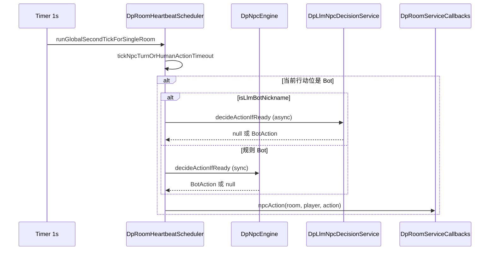

> 扫描日期：2026-05-22 · 范围：AI/infra/DB · 覆盖重写

# AI / NPC / LLM

## 概览

对局 Bot 分两类：**规则 NPC**（本地概率与牌力引擎）与 **大模型 NPC**（方舟兼容 Chat Completions，异步 HTTP）。入口类在 `npc/` 与 `llm/`；与 `room` 的衔接由 **1 秒全局 Timer** 驱动（见下文「与 room 的调用时机」）。

| 类别 | 昵称模式 | 决策入口 | 同步/异步 |
|------|----------|----------|-----------|
| 规则 NPC | `BOT_{LAG,TAG,NIT,FISH,CALL,MANIAC}_<seq>` | `DpNpcEngine.decideActionIfReady` | 同步，当 tick 返回非 null 即执行 |
| LLM 单轮 | `BOT_LLM` 或 `BOT_LLM_<seq>` | `DpLlmNpcDecisionService.decideActionIfReady` | 异步：首 tick 发起 HTTP，后续 tick 轮询 `CompletableFuture` |
| LLM 全局叙事 | `BOT_LLM_GLOBAL` 或 `BOT_LLM_GLOBAL_<seq>` | 同上 + `LlmNpcGlobalHandConversationStore` | 同上；同一 `handSeed` 内保留多轮 user/assistant |

未配置 `ARK_API_KEY` / `ARK_ENDPOINT_ID` 时，LLM Bot 走本地兜底（有跟注则 call，否则 check；筹码不足则 fold）。

---

## 包结构

```
com.example.mgdemoplus
├── llm/
│   └── OpenAiCompatibleChatClient.java    # 与业务无关的 OpenAI 兼容 HTTP 客户端
└── npc/
    ├── engine/
    │   ├── DpNpcEngine.java               # 规则 Bot 核心：识别、翻前路由、翻后分策略、上下文构建
    │   └── DpNpcStreetActionLog.java      # 本街行动日志（供 LLM 快照等）
    ├── strategy/
    │   ├── DpNpcUnifiedPreflopStrategy.java   # 六档规则 Bot 共用翻前（G1–G8 + 13×13 查表）
    │   ├── DpNpcRuleDecisionParams.java
    │   ├── DpNpcFishStrategy / DpNpcCallStrategy / DpNpcLagStrategy
    │   ├── DpNpcManiacStrategy / DpNpcTagStrategy / DpNpcNitStrategy
    │   └── …
    ├── llm/
    │   ├── DpLlmNpcDecisionService.java       # Spring @Service；异步决策与 JSON 解析
    │   ├── LlmNpcGameContext.java             # 局面摘要 BO（由 DpNpcEngine 构建）
    │   ├── LlmNpcUserSnapshot.java            # 固定键表 user 载荷（v1|BOT_LLM|snap）
    │   └── LlmNpcGlobalHandConversationStore.java  # GLOBAL 多轮会话（按 room|nick|handSeed）
    └── entity/
        └── DpSharkOpponentProfile.java        # 表仍在 V1；**当前无服务读写**（遗留）
```

---

## `DpNpcEngine`（规则 NPC）

**路径：** `npc/engine/DpNpcEngine.java`（纯静态工具类，无 Spring Bean）。

### 规则 Bot 昵称前缀

| 常量 | 前缀 | `BotType` |
|------|------|-----------|
| `PREFIX_BOT_LAG` | `BOT_LAG` | LAG |
| `PREFIX_BOT_TAG` | `BOT_TAG` | TAG |
| `PREFIX_BOT_NIT` | `BOT_NIT` | NIT |
| `PREFIX_BOT_FISH` | `BOT_FISH` | FISH |
| `PREFIX_BOT_CALL` | `BOT_CALL` | CALL |
| `PREFIX_BOT_MANIAC` | `BOT_MANIAC` | MANIAC |

- 多实例：`{PREFIX}_<房间序号>`，序号由 `DpRoomBO.allocateBotNicknameSeqBatch` 分配。
- **兼容旧前端固定昵称**（映射到 TAG/FISH/MANIAC）：`BOT_Shark`、`BOT_Tag`、`BOT_Fish`、`BOT_Maniac`（`LEGACY_*` 常量）。

工厂方法：`ruleBotNickname(BotType, seq)`、`ruleBotNicknameForKey(String archetypeKey, seq)`（`archetypeKey` 可为 `TAG` 或 `BOT_TAG` 等）。

### LLM Bot 类型

| 常量 | 模式 | 说明 |
|------|------|------|
| `PREFIX_BOT_LLM` | `BOT_LLM` / `BOT_LLM_<seq>` | 每行动作单轮 user 快照 |
| `PREFIX_BOT_LLM_GLOBAL` | `BOT_LLM_GLOBAL` / `BOT_LLM_GLOBAL_<seq>` | 同一手牌内多轮对话；前缀须长于 `BOT_LLM` 以免误匹配 |

判定：`isBotNickname` / `isLlmBotNickname` / `isGlobalLlmBotNickname`；规则 Bot 的 `getBotTypeByNickname` 对 LLM 昵称返回 `null`。

### 决策流水线（规则）

1. **`decideActionIfReady(room, bot)`** — 校验 `currentActorIndex`、未 fold/all-in/离桌后调用 `decideBotAction`。
2. **翻前** — 仅 `DpNpcUnifiedPreflopStrategy.decide(...)`，风格参数来自 `STYLE_PROFILE_MAP`（`vpip/pfr/callStation/foldToPressure` 等）。
3. **翻后** — `buildSmartContext` 打包对手档位、底池赔率、equity 桶、筹码深度等 → 按 `BotType` 分派到 Fish/Call/LAG/Maniac/TAG/Nit 策略类。
4. **HandPlan** — flop 首次行动可为 TAG/NIT/LAG 等生成 `HandPlanType`（VALUE/BLUFF/POT_CONTROL/GIVE_UP）与 barrel 计数；turn/river 可 `updateHandPlanForLaterStreetIfNeeded` 纠正过保守计划。

### 可调开关（代码常量）

| 常量 | 当前默认 | 含义 |
|------|----------|------|
| `NPC_MOOD_ENABLED` | `false` | 关闭 mood 对决策与延迟的影响 |
| `NPC_SOFT_NOISE_ENABLED` | `false` | 关闭概率软噪声 |
| `NPC_HAND_SEED_FOR_DECISIONS` | `true` | 抽样使用 `currentHandSeed ^ 座位` 固定种子 |

LLM 快照：`buildLlmNpcGameSnapshot` → `LlmNpcGameContext.map(...)`（**不**进入 `decideBotAction`）。

---

## `DpLlmNpcDecisionService`（LLM NPC）

**路径：** `npc/llm/DpLlmNpcDecisionService.java`。

- 构造器注入 `dp.llm.ark.*`，内部 `new OpenAiCompatibleChatClient(...)`。
- **线程池：** 固定 4 线程 `dp-llm-npc`（daemon）；`@PreDestroy` 关闭。
- **在途键：** `roomId|botNickname`；`LlmActionTicket` 校验 `handSeed/stage/actorIndex/betToCall`；局面变化则 cancel 并丢弃结果。
- **超时：** `CompletableFuture.orTimeout(125, SECONDS)`。
- **PRE_API_DELAY_MS：** `0`（不人为拖慢；`nextBotActionTime` 几乎立即允许发起请求）。
- **桌上仅 1 名未离桌玩家：** 不请求模型，直接本地兜底。
- 解析：单行 JSON `{action,chips_to_add,brief_reason[,plan_next,follow_up]}`；`normalizeAndClamp` 对齐最小加注/全下/跟注额。

日志 Logger：

- 流程：`com.example.mgdemoplus.npc.llm.DpLlmNpcDecisionService`
- 思考链：`com.example.mgdemoplus.BotLlmReasoning`（非独立类名）

---

## `OpenAiCompatibleChatClient`

**路径：** `llm/OpenAiCompatibleChatClient.java`。

- JDK `HttpClient` POST OpenAI 兼容 `chat/completions`。
- 默认 URL：`https://ark.cn-beijing.volces.com/api/v3/chat/completions`（可被 `base-url` 覆盖）。
- 请求体：`model`、`temperature=0.2`、可选 `reasoning_effort`、`thinking.type`（`enabled`/`disabled`/`auto`）、可选 `response_format.type=json_object`。
- `thinking-type=disabled` 时不写入 `reasoning_effort`。
- `isConfigured()`：`apiKey` 与 `endpointModelId` 均非空。

---

## 配置：`dp.llm.ark.*` 与环境变量

`application.yml`（无 Spring profiles）：

| 配置键 | 环境变量 | 说明 |
|--------|----------|------|
| `dp.llm.ark.api-key` | `ARK_API_KEY` | 方舟 API Key |
| `dp.llm.ark.endpoint-id` | `ARK_ENDPOINT_ID` | 接入点 / model id |
| `dp.llm.ark.base-url` | `ARK_BASE_URL` | 留空则用默认火山方舟 URL |
| `dp.llm.ark.reasoning-effort` | `ARK_REASONING_EFFORT` | 如 `medium` / `high`；留空用服务商默认 |
| `dp.llm.ark.thinking-type` | `ARK_THINKING_TYPE` | `enabled` / `disabled` / `auto` |
| `dp.llm.ark.response-json-object` | `ARK_RESPONSE_JSON_OBJECT` | 默认 `true`；HTTP 400 时可设 `false` |

本机：仓库根 `.env`（见 `.env.example` 五项 ARK_*）经 `LocalDotenvLoader` 在 Spring 启动前写入 `System.setProperty`（**不覆盖**已存在的环境变量）。Docker：`docker-compose.yml` 将宿主 `.env` 注入 `app` 容器。

详见 [docs/ENV_README.md](../ENV_README.md)（注意：仓库主配置为 **`application.yml`**，非 `application.properties`）。

可选日志（`application.yml` 注释块）：调高 `BotLlmReasoning` / `DpLlmNpcDecisionService` 级别。

---

## 与 room 的调用时机



- **调度器：** `room/support/DpRoomHeartbeatScheduler` — `java.util.Timer`，周期 **1000 ms**，遍历 `DpRoomRegistry` 内存房间。
- **Bot 入座：** `room/impl/DpRoomServiceImpl` — `add*BotToNextHand` / `addLlmBotToNextHand` / `addGlobalLlmBotToNextHand` / `addRuleNpcBatchToNextHand` 等，经 `readyNextHand` 写入 `waitNextHand`。
- **执行动作：** `DpRoomServiceImpl.npcAction` 将 `BotAction` 转为 fold/call/raise/all-in 与房间状态机交互。

规则 Bot 在 `decideActionIfReady` 内用 `nextBotActionTime` 做思考排期（配置 `dp.npc.rule-think`，默认开启）；LLM Bot 用同字段 + `inflightByKey` 控制「发起请求 → 等待完成」两阶段。心跳层已按昵称分岔，互不干扰。

---

## REST：添加 Bot（交叉引用）

Bot 相关 HTTP 在 **`DpRoomController`**（`/dpRoom`），详见 [controllers.md](controllers.md) 房间章节；本扫描不展开 REST 表。

| 端点 | 效果 |
|------|------|
| `POST /dpRoom/addFishBot` … `addManiacBot` | 各档规则 Bot 下一局入座 |
| `POST /dpRoom/addRuleNpcBatch` | 批量同档位（`archetype` + `count`） |
| `POST /dpRoom/addLlmBot` | `BOT_LLM_<seq>` |
| `POST /dpRoom/addLlmGlobalBot` | `BOT_LLM_GLOBAL_<seq>` |
| `POST /dpRoom/readyNextHand` | 房主/玩家带 Bot 昵称预约下一手 |

均需 JWT（`/dpRoom/**` 除大厅只读白名单外）；添加 LLM Bot 前须配置 ARK 密钥与接入点。

---

## 延伸阅读

- [docs/ai/npc-engine/README.md](../ai/npc-engine/README.md) — 规则引擎专题（部分路径仍写旧包名，以 `npc.engine` 为准）
- [docs/ai/npc-llm/](../ai/npc-llm/) — LLM 流程笔记
- [docs/ENV_README.md](../ENV_README.md) — JWT / `.env` / ARK

---

## README 建议修订点

| 项 | 代码事实 | 建议 |
|----|----------|------|
| NPC 包路径 | `npc.engine` / `npc.strategy` / `npc.llm`；`llm.OpenAiCompatibleChatClient` | 根 README 技术栈/结构勿再写 `service.serviceImpl.npc` |
| 密码 | `DpUserServiceImpl` 使用 `CryptoUtil.bcryptEncode` / `bcryptMatches` | `CLAUDE.md`、部分 `docs/DpUserPassword.md` 仍写 MD5，应改为 bcrypt |
| Flyway | 当前 **V1–V6**（含 `dp_user_stats` 与倍数列 V5/V6） | 与根 README 一致即可；勿写「仅 V1–V3」 |
| LLM 配置文档 | 主配置为 `application.yml` 的 `dp.llm.ark` | `docs/ENV_README.md` 标题若只写 `application.properties` 宜注明 yml |
| `docs/ai/npc-engine/*` | 类路径 `com.example.mgdemoplus.npc.engine.DpNpcEngine` | 批量替换旧 `service.serviceImpl.dp` 引用 |
