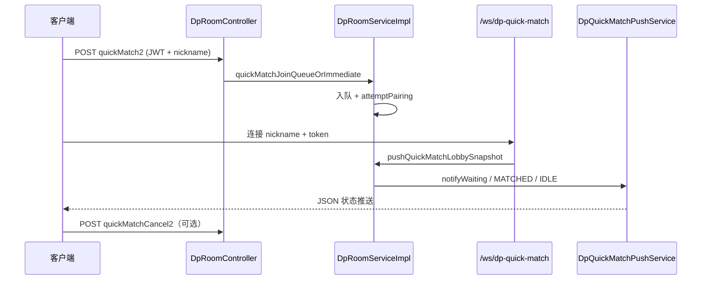

# 扫描：Controller — `/dpRoom` 专篇

> 扫描日期：2026-05-22 · 范围：对局/大厅/快匹/WS · 覆盖重写

本文档**仅**覆盖 [`DpRoomController`](src/main/java/com/example/mgdemoplus/controller/DpRoomController.java)（`@RequestMapping("/dpRoom")`）。其它 Controller 见仓库其它扫描产出。

统一响应：多数写操作返回 `"ok"` / `"fail"` 字符串；`joinRoom2`、`quickMatch2`、聊天、批量踢人等返回 [`ResultUtil`](src/main/java/com/example/mgdemoplus/utils/ResultUtil.java)。

---

## JWT 与 nickname 约束

| 层级 | 行为 |
|------|------|
| 全局过滤器 | [`JwtAuthenticationFilter`](src/main/java/com/example/mgdemoplus/security/JwtAuthenticationFilter.java) 解析 `Authorization: Bearer`，subject 写入 `SecurityContext`（= 用户 **nickname**） |
| 白名单 | [`JwtSecurityConstants.PERMIT_ALL`](src/main/java/com/example/mgdemoplus/security/JwtSecurityConstants.java)：`/dpRoom/getNowRoom`、`/dpRoom/getAllRooms2`、**未**包含 `publicRooms`（需 JWT）；`/ws/**` 全放行 |
| 强校验端点 | `joinRoom2`、`quickMatch2`、`quickMatchCancel2`：`auth.getName()` 必须 **等于** 请求参数 `nickname`，否则 `token 与当前昵称不一致` |
| 需登录读聊天 | `GET /{roomId}/chat/recent`：`requireCurrentUser()` → `dpUserMapper.selectByNickname(auth.getName())` |
| 弱约束端点 | `createRoom`、`joinRoom`、`toggleReady` 等：仅依赖全局 JWT（若未在白名单则须登录），**不**强制 param nickname == token subject |

WebSocket 快匹：不在此 Controller；握手见 [`DpQuickMatchWebSocketHandler`](src/main/java/com/example/mgdemoplus/websocket/DpQuickMatchWebSocketHandler.java)（query `token` + `nickname` 一致）。

---

## 端点一览

| 路径 | 方法 | 要点 | 源码 |
|------|------|------|------|
| `/dpRoom/createRoom` | POST | 建房；`maxSeatCount` 2～9；可选密码 | `createRoom` → `DpRoomService.createRoom` |
| `/dpRoom/{roomId}/chat/recent` | GET | 最近局内聊天；须登录 | `listRecentRoomChat` |
| `/dpRoom/getNowRoom` | GET | 房间快照（可观战裁剪）；**permitAll** | `getRoomSnapshotForViewer` |
| `/dpRoom/joinRoom` | POST | 进房；返回字符串 outcome | `joinRoom` |
| `/dpRoom/joinRoom2` | POST | 同 joinRoom；**JWT nickname 一致**；`ResultUtil` | `joinRoom2` |
| `/dpRoom/quickMatch2` | POST | 默认快匹入队；**JWT nickname 一致**；排队状态靠 WS | `quickMatchJoinQueueOrImmediate` |
| `/dpRoom/quickMatchCancel2` | POST | 取消默认快匹队列；**JWT nickname 一致** | `cancelDefaultQuickMatchWait` |
| `/dpRoom/toggleReady` | POST | 准备/取消准备 | `toggleReady` |
| `/dpRoom/exitRoom` | POST | 退房 | `exitRoom` |
| `/dpRoom/startGame` | POST | 房主开局 | `startGame` |
| `/dpRoom/newHand` | POST | 新一手（参数 ownerNickname 传入但未用于鉴权） | `newHand` |
| `/dpRoom/bet` | POST | 下注 | `bet` |
| `/dpRoom/fold` | POST | 弃牌 | `fold` |
| `/dpRoom/kickPlayer` | POST | 踢至观众席 | `kickPlayer` |
| `/dpRoom/kickPlayersBatch` | POST | 批量踢人；`nicknames` 逗号分隔 | `kickPlayersBatch` |
| `/dpRoom/heartbeat` | POST | 座位心跳 | `heartbeat` |
| `/dpRoom/readyNextHand` | POST | 观战预约下一局 | `readyNextHand` |
| `/dpRoom/cancelReadyNextHand` | POST | 取消预约 | `cancelReadyNextHand` |
| `/dpRoom/rebuy` | POST | 筹码归零补码 | `rebuy` |
| `/dpRoom/addDemoBot` | POST | 鱼式 NPC `BOT_FISH_*` | `addDemoBotToNextHand` |
| `/dpRoom/addManiacBot` | POST | `BOT_MANIAC_*` | `addManiacBotToNextHand` |
| `/dpRoom/addSharkBot` | POST | 兼容旧 `BOT_Shark` | `addSharkBotToNextHand` |
| `/dpRoom/addTagBot` | POST | `BOT_TAG_*` | `addTagBotToNextHand` |
| `/dpRoom/addLagBot` | POST | `BOT_LAG_*` | `addLagBotToNextHand` |
| `/dpRoom/addNitBot` | POST | `BOT_NIT_*` | `addNitBotToNextHand` |
| `/dpRoom/addCallStationBot` | POST | `BOT_CALL_*` | `addCallStationBotToNextHand` |
| `/dpRoom/addRuleNpcBatch` | POST | 批量规则 NPC；`archetype` + `count` | `addRuleNpcBatchToNextHand` |
| `/dpRoom/addLlmBot` | POST | `BOT_LLM_*`；需 ARK 环境变量 | `addLlmBotToNextHand` |
| `/dpRoom/addLlmGlobalBot` | POST | `BOT_LLM_GLOBAL_*` | `addGlobalLlmBotToNextHand` |
| `/dpRoom/transferOwner` | POST | 移交房主 | `transferOwner` |
| `/dpRoom/getAllRooms2` | GET | 内存房列表投影；**permitAll** | `getAllRooms2` |
| `/dpRoom/publicRooms` | GET | 大厅分页；查 DB+缓存；**需 JWT** | `DpRoomHallService.getPublicRoomsPage` |
| `/dpRoom/publicRooms/query` | GET | 筛选/精确房号；MyBatis-Plus；**需 JWT** | `queryPublicRoomsFromDb` |

注入：`DpRoomService`、`DpRoomHallService`、`DpUserMapper`（聊天与潜在扩展用）。

---

## 快匹 REST 与 WebSocket 关系

| 步骤 | 说明 |
|------|------|
| 1 | `quickMatch2` 将玩家放入默认 FIFO（小盲 5 / 大盲 10 / 9 人桌），并触发内存配对。 |
| 2 | 客户端应维持 `/ws/dp-quick-match` 订阅；REST 响应含 `queued`/`WAITING`，**详细队列位与匹配成功由 WS 推送**。 |
| 3 | `quickMatchCancel2` 仅取消排队；已在房内无需调用。 |

对局内状态同步使用 **`/ws/dp-game?roomId=`**（[`DpGameRoomWebSocketHandler`](src/main/java/com/example/mgdemoplus/websocket/DpGameRoomWebSocketHandler.java)），与快匹 WS **分离**。

---

## 大厅端点说明

- `publicRooms` / `publicRooms/query`：**只读 MySQL** `dp_room_lobby`，不经 `roomMap` 直出；与内存房可能存在短暂不一致，由 reconcile 定时对齐幽灵行。
- `getNowRoom` / `getAllRooms2`：直接读 **内存**（`roomMap`），适合分享链接旁观或未登录拉快照。

---

## README 建议修订点

- `/dpRoom` 入口统一指向 [`DpRoomController.java`](src/main/java/com/example/mgdemoplus/controller/DpRoomController.java)；`joinRoom2` / `quickMatch2` / `quickMatchCancel2` 必须 **JWT subject == nickname**。
- 快匹：**REST 入队**（`quickMatch2`）+ **WS 收状态**（[`DpQuickMatchWebSocketHandler`](src/main/java/com/example/mgdemoplus/websocket/DpQuickMatchWebSocketHandler.java)）；勿写「仅 REST 即可完成匹配」。
- 对局推送：**`/ws/dp-game`**（[`DpGameRoomWebSocketHandler`](src/main/java/com/example/mgdemoplus/websocket/DpGameRoomWebSocketHandler.java)），payload 与 `getNowRoom` 一致。
- 白名单仅 [`getNowRoom`](src/main/java/com/example/mgdemoplus/security/JwtSecurityConstants.java)、`getAllRooms2`；`publicRooms*` **需要登录**（注释掉的 permitAll 勿当事实）。
- `getNowRoom` 读单机 [`roomMap`](src/main/java/com/example/mgdemoplus/room/support/DpRoomRegistry.java)；多实例无粘滞时链接可能指向错误节点。
- 大厅表 [`dp_room_lobby`](src/main/resources/db/migration/V1__init_schema.sql) 由 [`DpRoomHallService`](src/main/java/com/example/mgdemoplus/lobby/DpRoomHallService.java) 提供 REST，与内存 reconcile 配置 `mgdemoplus.dp-lobby-reconcile-enabled` 一并说明。
