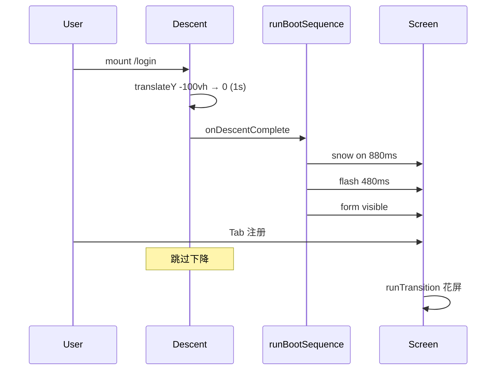

# 登录/注册：长廊透视 + 线条风终端

> 状态：已实现（`DpAuthStage.vue` + `dp-auth-shell.css` + `dp-depth-tokens.css` auth 段）  
> 非目标：不改后端 API；不扩展忘记密码；一般不动 `dpAuthEnterLobby` / `DpCrtFullscreenOverlay`。

## 1. 视觉方向

| 项 | 说明 |
|---|---|
| 画风 | lo-fi **简约线条**（描边为主，无厚重 skeuomorphism / 照片质感） |
| 场景 | **长廊透视**：地板透视线汇聚于远方灭点，近大远小 |
| 入场 | 电脑整机从**画面顶部** `transform` 下降至站位（默认 **1.0s**，`cubic-bezier(0.22, 1, 0.36, 1)`） |
| 终端 | **主题绑定电子风**：深屏底 + 随 `--dp-accent` 的字/描边/微光（默认灰青，草莓粉等） |
| 表单 | 仍在 `.dp-auth-stage__content`（显示器内） |

## 2. 长廊透视结构（ASCII）

```
                    [ 灭点 VP · 微光 ]
                           |
          天花板 ══════════╪══════════ 顶灯线条
                 \         |         /
    左墙 ║        \        |        /        ║ 右墙
                 \       |       /
                  \      |      /
                   \     |     /
    ─────────────────\────|────/─────────────────  地平线
                     \   |   /
                      \  |  /   ← 地板透视线（近疏远密）
                       \ | /
                        \|/
                    [ 观者 ]
                         │
                    ┌────┴────┐
                    │ 显示器  │  ← 下降落点（近景最大）
                    │ stand   │
                    └─────────┘
```

DOM 层级：`__corridor`（fixed 全屏背板）→ `__rig`（前景电脑，带下降动画）→ `__monitor` → `__screen`（花屏 + 表单）。

## 3. 动画时序

```
进入 /login 或 /register（组件 mount）
│
├─ [A] 电脑下降 0–1000ms（eco / prefers-reduced-motion：0ms，直接 landed）
│
└─ [B] runBootSequence()（原有契约，不改 keyframes 时序）
      ├─ bootStatic 880ms：snowActive，screenOff，content hidden
      ├─ bootFlash 480ms：flashPulse
      └─ settle：snowOff，screenOn，contentVisible → interactive +80ms

Tab 切换 login ↔ register
└─ runTransition() only（**不**重复 [A] 下降；bootDone 后仅花屏转场）
```



## 4. 主题绑定（CSS 变量）

定义位置：`front/dp_game/src/styles/dp-depth-tokens.css` 中 `body[data-dp-game-theme] #app.app--auth { … }`；消费方：`DpAuthStage.vue`、`dp-auth-shell.css`。

| 机制 | 说明 |
|---|---|
| 数据流 | 顶栏 `DpThemePicker` → Vuex `gameUiTheme` → `body[data-dp-game-theme]`（`dpBodyGameTheme.js`）→ `#app.app--auth` 继承 `--dp-auth-*` |
| 即时切换 | 仅改 CSS 变量，**无需刷新**；`snowActive` / `runBootSequence` / `runTransition` 时序不变 |
| 默认 `default` | 长廊/外壳/边框为中性暗灰；屏内 **8bit 荧光绿终端**（`#4AF626` 亮字 + `#0A1A0A` 深绿屏底），无横线电子叠字 |
| 其它预设 | 屏内主色 `color-mix(--dp-accent, white)` 提亮；屏级主题横线（`__scanlines`，无 blend）；长廊仍偏暗灰 |
| 花屏层 | `--dp-auth-snow-base` / `--dp-auth-snow-base-alt` 随主题微调底色；噪点/横纹 keyframes 未改 |

### Token 一览

| Token | 用途 |
|---|---|
| `--dp-auth-corridor-bg` / `--dp-auth-corridor-line` | 长廊底色与透视线 |
| `--dp-auth-corridor-vp-glow` | 灭点微光（含 accent 微量） |
| `--dp-auth-corridor-ceiling-tint` / `wall-tint` / `floor-tint` | 顶/墙/地渐变（替代硬编码 hex） |
| `--dp-auth-bezel-stroke` / `--dp-auth-bezel-inner` / `--dp-auth-rig-fill` | 电脑外壳与内框 |
| `--dp-auth-terminal-text`（=`--dp-auth-phosphor`） | 屏内标题、Tab、表单字/描边 |
| `--dp-auth-phosphor-dim` | 次要文字、占位符 |
| `--dp-auth-screen-bg` / `--dp-auth-screen-off` | 亮屏 / 关机屏底 |
| `--dp-auth-screen-glow` | 屏内发光、焦点环、Tab 激活阴影 |
| `--dp-auth-flash-tint` | 开机闪白首帧（`dp-auth-flash-pulse`） |
| `--dp-auth-snow-base` / `--dp-auth-snow-base-alt` | 花屏容器底色 mix |
| `--dp-auth-text-glow` | 屏内磷光外发光（标题 / Tab / 表单 `text-shadow`） |
| `--dp-auth-text-shadow` | 屏内统一磷光字阴影（表单 / Tab；标题可用 `--dp-auth-text-shadow-title`） |
| `--dp-auth-text-scanline` | 主题色横线（非 default 画于 `.dp-auth-stage__scanlines` 背景层） |
| `--dp-auth-content-electron` | `1` 加强屏级横线不透明度；`default` 为 `0`（沿用暗色 scanlines） |
| `--dp-auth-vignette-strength` | 屏内暗角强度（越小屏区越亮） |

详见 `front/dp_game/docs/THEME_BINDING_README.md` §7 登录注册段。

## 5. 花屏保留契约

| 项 | 约定 |
|---|---|
| DOM | `.dp-auth-stage__snow` + `__snow-noise` / `__snow-bars` / `__snow-bright` 仍在 `__screen` 内 |
| 状态 | `snowActive` 由 `runBootSequence` / `runTransition` 驱动，逻辑未改 |
| z-index | snow **5**，scanlines **2**，vignette **3**，content **4**，flash **6** |
| 时序 | `TIMING` / `TIMING_ECO` 毫秒值不变 |
| keyframes | `dp-auth-crt-jitter`、`dp-auth-noise-flicker`、`dp-auth-roll-bars`、`dp-auth-bright-bar`、`dp-auth-flash-pulse` 等保持 |
| 降级 | `ecoMode` + `body[data-dp-fluidity='eco']` + `@media (prefers-reduced-motion)` 块保留 |
| 微调 | 新 bezel 更薄时 snow `inset` 可由 `-8%` 改为 `-6%`（仅视觉对齐，时序不变） |

## 6. 桌面验收（≥5）

1. 打开 `http://localhost:8080/login`（或 dev 代理端口）：先见长廊透视线，电脑从顶部落至中央，再花屏 → 闪白 → 登录表单可点。
2. 登录 Tab ↔ 注册 Tab：仅有花屏转场，**无**第二次电脑下降。
3. 直链 `/register`：仍有一次下降 + boot，表单为注册。
4. 系统「减少动态效果」或开启 eco：下降与花屏动画缩短/静态化，表单仍可完成登录。
5. 浏览器窗口 ≥1280×720：灭点、地板线、显示器描边清晰，表单不溢出屏幕区（可纵向滚动）。
6. 顶栏切换主题（如 明亮经典 → 草莓甜心）：屏内标题/Tab/表单描边即时变色，长廊仍暗灰；花屏 boot 与 Tab 转场正常。
7. `cd front/dp_game && npm run build` 零错误。

## 7. 屏内亮度与电子字

| 维度 | `default` 明亮经典 | 其它主题（gothic / strawberry / halloween / custom） |
|---|---|---|
| 屏底 | 深绿 `#0A1A0A`，关机 `#051005` | `color-mix(corridor-bg, accent)` 略提亮 |
| 主字色 | 荧光绿 `#4AF626`，次要 `#72F052` | `color-mix(accent 76%, white 24%)` 更亮 |
| 发光 | `--dp-auth-screen-glow` / `--dp-auth-text-glow` 加强 | 同左 + 更强磷光外晕 |
| 电子感 | **无**主题横线（`--dp-auth-content-electron: 0`，沿用暗色 scanlines） | 主题色横线画在 `__scanlines`（z-index 2，低于 content），**无** `mix-blend-mode` |
| 暗角 | `--dp-auth-vignette-strength: 0.2` | `0.2`（与 default 对齐，避免边缘过暗） |
| 切换 | 顶栏改 `body[data-dp-game-theme]` 后 token 即时生效 | 同左 |

实现位置：`dp-depth-tokens.css`（token）、`dp-auth-shell.css`（表单磷光 + 屏级主题横线）、`DpAuthStage.vue`（亮屏 inset glow、vignette、Tab 激活光）。`prefers-reduced-motion` / eco 下横线为静态，不新增动画。

## 8. 屏内发糊：原因与修复（2025-05）

**根因**：非 default 曾在 `.dp-auth-stage__content::before` 上叠主题横线 + `mix-blend-mode: soft-light`（`z-index: 2` 高于子元素 `z-index: 1`），blend 与文字同层合成，磷光外晕再叠一层，导致草莓等主题字缘发糊、对比度下降；default 因 `--dp-auth-content-electron: 0` 无此层故最清晰。

**修复**：

1. 删除 `content::before` 叠字与 `soft-light`；电子横线改画 `.dp-auth-stage__scanlines`（屏背景 z-index 2，content z-index 4，不压字）。
2. 非 default 收紧 `--dp-auth-text-shadow`（5px/1px glow），default 保留原 8bit 标题三层阴影（`--dp-auth-text-shadow-title`）。
3. content 区 `-webkit-font-smoothing: antialiased`；vignette 统一 `0.2`。
4. 花屏 DOM / `snowActive` / keyframes **未改**。

**验收**：切换 明亮经典 ↔ 草莓甜心，屏内标题/Tab/输入框应同样锐利可读；草莓仍有主题粉字 + 屏内淡横线电子感。

## 9. 宽屏曲面（左右直 + 顶凸底凹，桌面 ≥1280px）

**目标**：电脑端显示器明显更大、正面外轮廓为 **竖直侧棱 + 顶边中间拱起（凸）+ 底边中间内收（凹）** 的消费级宽屏曲面造型；**禁止** 左右 Q 内弯（沙漏/掐腰）、**禁止** 四边同时内弯的旧 clip、**禁止** 大角度 `rotateX` 透视梯形。花屏 / boot / transition / 主题 token / 下降 / 长廊透视逻辑不变。

### 尺寸（前后对比）

| 维度 | 改前（通用） | 改后（≥1280px） |
|---|---|---|
| 舞台 `.dp-auth-stage` max-width | `42rem`（672px） | `58rem`（928px） |
| 舞台 min-height | `clamp(420px, 72vh, 640px)` | `clamp(520px, 80vh, 860px)` |
| 显示器 `.dp-auth-stage__monitor` 宽 | `100%` 舞台宽 | `min(100%, 85%)`，`max-width: 52rem` |
| 屏区 `.dp-auth-stage__screen` min-height | `clamp(248px, 47vw, 308px)` | `clamp(340px, 36vw, 500px)` |
| `#app.app--auth .app-container` max-width | `42rem` | `58rem`（与舞台对齐） |
| 花屏 `__snow` inset | `-6%` | `-7%`（仅对齐更厚 bezel，时序不变） |

未加小屏专项 media；`<1280px` 仍沿用原 clamp。

### 曾错做法 vs 现顶凸底凹（实现对比）

| 维度 | 曾错做法（四边 clip 沙漏） | 现做法（横向凹面） |
|---|---|---|
| 轮廓几何 | SVG `clipPath` 四边 **同时内弯**：顶/底中心 y 内收 + 左右中段 x 内收 → **沙漏/对折** 形 | 外壳 `__monitor-frame` / `__bezel` 为 **规整圆角矩形**，上下边直、无左右掐腰 |
| 凹面感来源 | 误以为四边 clip = 曲面 | **仅横向**：`__curve-shade` 左右线性暗角 + 中心径向微亮；`inset` 阴影只收 **左右** |
| 3D 透视 | 整框 clip 变形 | `__monitor-curve` 设 `perspective`；**仅** `__screen` 极小 `rotateX(2.8°~3.2°)`（顶边远、底边近），frame/bezel **不** rotate，避免梯形 |
| 内容布局 | 表单偏上 | `__content` `justify-content: center`；`__form-panel` 不再 `flex:1` 顶对齐 |

**沙漏 clip 根因**（已删除 `#dp-auth-concave-*`）：顶边 `Q 0.5,0.078` 使中心 y **大于** 角点（顶边下凹）；底边对称上凹；右边 `Q … 0.962,0.5` 使 x **小于** 1（左右中段内收）——四边合力呈 **沙漏**，并非消费级显示器「仅左右方向凹弧」。

### 曲面实现手法

| 层 | 手法 |
|---|---|
| `__monitor-body` / `__bezel` / `__screen` | 上表 clip-path；`overflow: hidden` |
| `__monitor-curve` | `perspective: 1400px`；`rotateX(1°)`（大屏 `1.5°`） |
| `__curve-shade` | `180deg` 顶亮底深 + 顶部径向微亮；亮屏 / 花屏 / 灭屏 **同一曲面轴向** |
| `inset box-shadow` | 顶侧浅高光、底侧收暗；**无** 左右 `inset … 32px 0` |
| `__vignette` / scanlines（花屏期） | 椭圆 / mask 沿 **上下** 轴，不做 90° 左右 pincushion |
| 屏内 `__content` | flex 垂直居中 |

DOM / `snowActive` / `TIMING` / keyframes / z-index 栈（snow 5、flash 6、content 4）未改逻辑。

### 大屏验收补充

8. `≥1280×720`：显示器占舞台约 **72–85%** 宽；正面 **左右直**、**顶中拱**、**底中收**（无沙漏）；顶凸底凹纵深感可辨；表单 **垂直居中**；键盘 `min(72%, 440px)` 不抢戏。
9. 花屏 boot、Tab 转场、主题切换与 §6 其余项仍通过。
10. **花屏 shading**：`__snow--active` 或 `__screen:not(--on)` 时，`__curve-shade` / `__vignette` / `__scanlines` 与亮屏同为 **顶亮底深**；`__snow` 仅纵向 jitter、`inset` 横向不外扩（`auto 0`）。

## 10. 屏内表单放大（曲面 content 区更饱满）

**目标**：登录/注册标题、Tab、输入框、主按钮在曲面屏 `__content` 内更易读易点；优先放大 typography + 控件，**未**对 content 做 `transform: scale`（避免糊字）；花屏 DOM / 时序 / 顶凸底凹 clip / 长廊 / 下降不变。

| 维度 | 改前（通用） | 改后（通用） | 改后（≥1280px） |
|---|---|---|---|
| `__content` padding | `8–12px` / `10–14px` 横 | `10–14px` / `12–18px` 横 | `14–20px` / `18–26px` 横 |
| `__title` font-size | `clamp(1.05rem, 3.8vw, 1.4rem)` | `clamp(1.2rem, 4.4vw, 1.55rem)` | `clamp(1.35rem, 1.9vw, 1.75rem)` |
| `__tab` font-size / padding | `12–13px`；`6–8px`×`10–14px` | `13–15px`；`8–10px`×`12–16px` | `15px`；`10px`×`18px` |
| `__tab` max-width | `8.5rem` | `9.5rem` | `11rem` |
| 表单 `max-width` | `22rem` | `24rem` | `28rem` |
| 表单项 label 宽 / 字号 | `40–44px` / `12–13px` | `44–48px` / `13–14px` | `52px` / `15px` |
| 输入框 height / 字号 | `34–38px` / `13–14px` | `38–42px` / `14–15px` | `44px` / `15px` |
| 登录/注册按钮 height / 字号 | `36–40px` / `13–14px` | `40–44px` / `14–15px` | `46px` / `15px` |
| 提示文案 hint 字号 | `11–12px` | `12–13px` | `13px` |

**验收**：`/login`、`/register` 表单项明显更大；无曲面 bezel 横向滚动条；花屏 Tab 主题切换仍正常。

## 11. 文件清单

| 文件 | 变更 |
|---|---|
| `front/dp_game/src/components/DpAuthStage.vue` | 长廊 + 线条电脑 + 下降；花屏/ boot / transition 逻辑保留；大屏曲面与尺寸 |
| `front/dp_game/src/styles/dp-auth-shell.css` | 屏内 Tab/表单，引用 `--dp-auth-*`；≥1280px 容器加宽；§10 表单放大 |
| `front/dp_game/src/styles/dp-depth-tokens.css` | `#app.app--auth` 主题绑定 `--dp-auth-*` |
