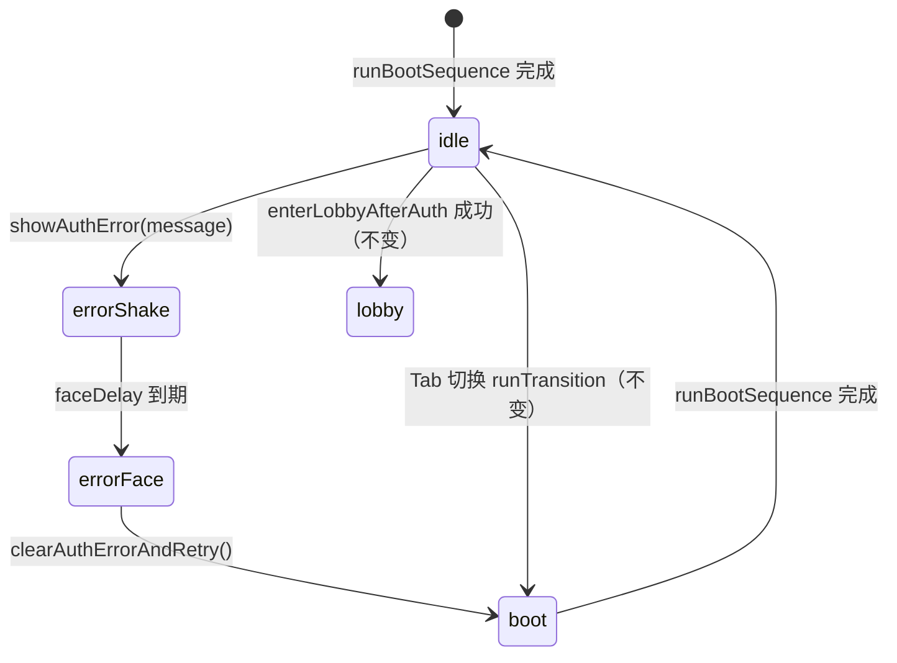

# 登录/注册统一报错演出（8bit 哭脸）

## 背景

登录与注册页原先使用 `alert()` 弹出失败信息，与终端 CRT 舞台视觉割裂。本方案在 `DpAuthStage` 屏内统一演出：**震颤 → 闪白 → 8bit 哭脸 + 文案 + 重试 → 花屏开机回到表单**。

## 涉及文件

| 文件 | 变更 |
|------|------|
| `front/dp_game/src/components/DpAuthStage.vue` | 状态、演出方法、哭脸 DOM/CSS、震颤 keyframes |
| `front/dp_game/src/components/login.vue` | 所有失败路径 → `showAuthError()` |
| `front/dp_game/src/components/register.vue` | 同上 |
| `front/dp_game/src/styles/dp-auth-shell.css` | 哭脸文案/重试按钮磷光字与 hover |

## 状态机



### 状态字段（`DpAuthStage` data）

| 字段 | 类型 | 说明 |
|------|------|------|
| `authError` | `{ message: string } \| null` | 当前错误文案 |
| `showErrorFace` | `boolean` | 是否显示哭脸层 |
| `authErrorShaking` | `boolean` | 整机震颤 class 开关 |
| `phase` | `'boot' \| 'idle' \| 'transition'` | 原有阶段；花屏时哭脸隐藏 |

### 时序（标准 / eco·reduced-motion）

| 步骤 | 标准 (ms) | eco / reduced-motion (ms) |
|------|-----------|---------------------------|
| 震颤 | 420 | 80 |
| 闪白（震颤中段） | 280 | 0（跳过） |
| 哭脸出现 | 400 | 60 |
| 重试短闪 | 120 | 0（直接 boot） |

## 演出流程

1. **子组件失败**（前端校验 / 接口 `ok:false` / 网络 catch）调用 `this.dpAuthStage.showAuthError(message)`（`provide/inject`）。
2. **震颤**：根节点 `dp-auth-stage--auth-error-shake`，动画作用于 `__monitor`。
3. **闪白**：复用 `__flash--pulse`（z-index 6）。
4. **哭脸层**：`showErrorFace=true`，z-index 5（高于 content 4，低于 flash 6）；16×16 SVG 像素哭脸放大 + 居中 monospace 文案 + `--dp-auth-phosphor` 重试按钮。
5. **重试**：`clearAuthErrorAndRetry()` → 清空 error → 短闪 → **`runBootSequence()`**（不走 `runTransition`）→ 当前 `authMode` / 路由 Tab 不变。

## 对外 API

```js
// DpAuthStage（provide 为 dpAuthStage）
showAuthError(message: string): void
clearAuthErrorAndRetry(): void

// login.vue / register.vue
inject: { dpAuthStage: { default: null } }
this.dpAuthStage.showAuthError('登录失败：…')
```

## 硬约束遵守

- 花屏逻辑仅复用现有 `runBootSequence()`，未改 DOM/时序实现。
- 成功路径仍 `enterLobbyAfterAuth`。
- 外壳 clip-path（顶凸底凹）未改动。
- 全项目 auth 页无 `alert()`。

## 验收清单

- [ ] 登录错密码：震 + 闪 + 8bit 哭脸 + 后端 message + 重试 → 花屏 → 登录表单
- [ ] 注册空昵称 / 纯数字昵称 / 接口失败 / 网络异常：同上演出
- [ ] 重试后 Tab 仍在 `/login` 或 `/register`（与失败前一致）
- [ ] eco 模式或 `prefers-reduced-motion: reduce`：震颤缩短，哭脸与文案仍显示
- [ ] 浏览器无原生 `alert` 弹出
- [ ] `npm run build` 通过

## 手动验证步骤

1. `cd front/dp_game && npm run serve`
2. 打开 `/login`，故意输错密码点登录 → 观察震颤/哭脸/重试/花屏
3. 切到注册 Tab（或 `/register`），空昵称提交 → 同上
4. 开 eco 或系统减少动效，重复 2–3
5. 正确账号登录 → 仍进入大厅（成功路径不受影响）
