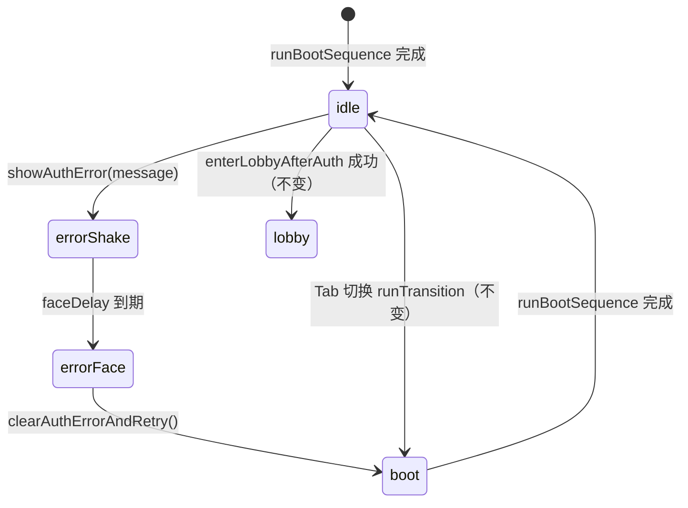

# 登录/注册统一报错演出（8bit 哭脸）

## 背景

登录与注册页原先使用 `alert()` 弹出失败信息，与终端 CRT 舞台视觉割裂。本方案在 `DpAuthStage` 屏内统一演出：**震颤 → 闪白 → 8bit 哭脸 + 文案 + 重试 → 花屏开机回到表单**。

## 涉及文件

| 文件 | 变更 |
|------|------|
| `front/dp_game/src/components/DpAuthStage.vue` | 状态、演出方法、哭脸 DOM/CSS、震颤 keyframes |
| `front/dp_game/src/components/login.vue` | 所有失败路径 → `showAuthError()` |
| `front/dp_game/src/components/register.vue` | 同上 |
| `front/dp_game/src/styles/dp-auth-shell.css` | 哭脸文案/重试按钮磷光字与 hover |

## 状态机



### 状态字段（`DpAuthStage` data）

| 字段 | 类型 | 说明 |
|------|------|------|
| `authError` | `{ message: string } \| null` | 当前错误文案 |
| `showErrorFace` | `boolean` | 是否显示哭脸层 |
| `authErrorShaking` | `boolean` | 整机震颤 class 开关 |
| `phase` | `'boot' \| 'idle' \| 'transition'` | 原有阶段；花屏时哭脸隐藏 |

### 时序（标准 / eco·reduced-motion）

| 步骤 | 标准 (ms) | eco / reduced-motion (ms) |
|------|-----------|---------------------------|
| 震颤 | 420 | 80 |
| 闪白（震颤中段） | 280 | 0（跳过） |
| 哭脸出现 | 400 | 60 |
| 重试短闪 | 120 | 0（直接 boot） |

## 演出流程

1. **子组件失败**（前端校验 / 接口 `ok:false` / 网络 catch）调用 `this.dpAuthStage.showAuthError(message)`（`provide/inject`）。
2. **震颤**：根节点 `dp-auth-stage--auth-error-shake`，动画作用于 `__monitor`。
3. **闪白**：复用 `__flash--pulse`（z-index 6）。
4. **哭脸层**：`showErrorFace=true`，z-index 5（高于 content 4，低于 flash 6）；16×16 SVG 像素哭脸（八形眼+U 嘴，**无眉、无泪**）放大至屏宽 25–35% + 可选 `ERROR` 辅标 + 居中 monospace 文案 + `--dp-auth-phosphor` 重试按钮。
5. **重试**：`clearAuthErrorAndRetry()` → 清空 error → 短闪 → **`runBootSequence()`**（不走 `runTransition`）→ 当前 `authMode` / 路由 Tab 不变。

## 对外 API

```js
// DpAuthStage（provide 为 dpAuthStage）
showAuthError(message: string): void
clearAuthErrorAndRetry(): void

// login.vue / register.vue
inject: { dpAuthStage: { default: null } }
this.dpAuthStage.showAuthError('登录失败：…')
```

## 硬约束遵守

- 花屏逻辑仅复用现有 `runBootSequence()`，未改 DOM/时序实现。
- 成功路径仍 `enterLobbyAfterAuth`。
- 外壳 clip-path（顶凸底凹）未改动。
- 全项目 auth 页无 `alert()`。

## 哭脸规格

融合参考图：**八形斜眼（\ /，自鼻侧向外下斜，位于脸上方偏中）+ 厚倒 U 嘴（顶拱+左右竖边，开口朝下）**；**无眉、无泪痕**；占屏宽约 **25–35%**，单格放大后 **≥8px**。

| 项 | 规格 |
|----|------|
| 画布 | 内联 SVG `viewBox="0 0 16 16"`，`image-rendering: pixelated` |
| 屏内尺寸 | `width: clamp(128px, 32%, 224px)`（相对 `__screen`，约 25–35% 屏宽） |
| 单格像素 | 16 格均分宽度 → 最小 8px（128÷16），典型 10–14px |
| 眉 | **无**（已移除，避免顶上平横条与八形眼混淆） |
| 眼 | 八形 `\` `/`：各 **3 阶** 2 格粗斜线，位于脸上方偏中（左 `x=5→4→3, y=3→5`；右 `x=9→10→11, y=3→5`）；**禁止**平横条眼 |
| 泪 | **无**（已移除八字泪、滴落等所有 tear `<rect>`） |
| 嘴 | 厚倒 U（∩）：y=10–11 双层顶拱，y=12–13 左右各 2 格竖边，中间空、不收尖 |
| 辅标 | 脸下 `ERROR` 像素字（`letter-spacing: 0.38em`），主文案仍为中文 `authError.message` |
| 颜色 | `fill: currentColor` → `color: var(--dp-auth-phosphor)`；default 主题即 `#4AF626` 磷光 |
| 发光 | 三层 `drop-shadow`：`--dp-auth-phosphor` + `--dp-auth-screen-glow` + 45% 混色外晕 |
| DOM | `__error-face-art` 包裹 SVG + `__error-pixel-label`；z-index 5，低于 flash 6 |

### 结构示意（16×16，`.` 空 `X` 实心）

```
行  0123456789ABCDEF
 0  ....................   ← 无眉
 1  ....................
 2  ....................
 3  .....XX......XX.....   ← 八形眼顶（靠鼻侧）
 4  ....XX........XX....   ← 八形眼中
 5  ...XX..........XX...   ← 八形眼底（向外撇）
 6  ....................   ← 眼嘴间距
 7  ....................
 8  ....................
 9  ....................
10  ....########....     ← 嘴顶拱（厚）
11  ...##########...
12  ..##........##..     ← 左右竖边
13  ..##........##..
```

### 主要 `<rect>` 表

| 部位 | x | y | w | h | 备注 |
|------|---|---|---|---|------|
| 左眼 `\` | 5,4,3 | 3,4,5 | 2,2,2 | 1 | 八形三阶，x 递减 |
| 右眼 `/` | 9,10,11 | 3,4,5 | 2,2,2 | 1 | 八形三阶，x 递增 |
| 嘴拱 | 4,3 | 10,11 | 8,10 | 1 | 双层厚顶 |
| 嘴边 | 2,12 | 12,13 | 2,2 | 1 | 左右竖边 |

## 验收清单

- [ ] 登录错密码：震 + 闪 + **大号** 8bit 哭脸（八形眼/倒 U 嘴可辨，**无眉、无泪**）+ 后端 message + 重试 → 花屏 → 登录表单
- [ ] 注册空昵称 / 纯数字昵称 / 接口失败 / 网络异常：同上演出
- [ ] 重试后 Tab 仍在 `/login` 或 `/register`（与失败前一致）
- [ ] eco 模式或 `prefers-reduced-motion: reduce`：震颤缩短，哭脸与文案仍显示
- [ ] 浏览器无原生 `alert` 弹出
- [ ] `npm run build` 通过

## 手动验证步骤

1. `cd front/dp_game && npm run serve`
2. 打开 `/login`，故意输错密码点登录 → 观察震颤/哭脸（无泪、八形眼）/重试/花屏
3. 切到注册 Tab（或 `/register`），空昵称提交 → 同上
4. 开 eco 或系统减少动效，重复 2–3
5. 正确账号登录 → 仍进入大厅（成功路径不受影响）
