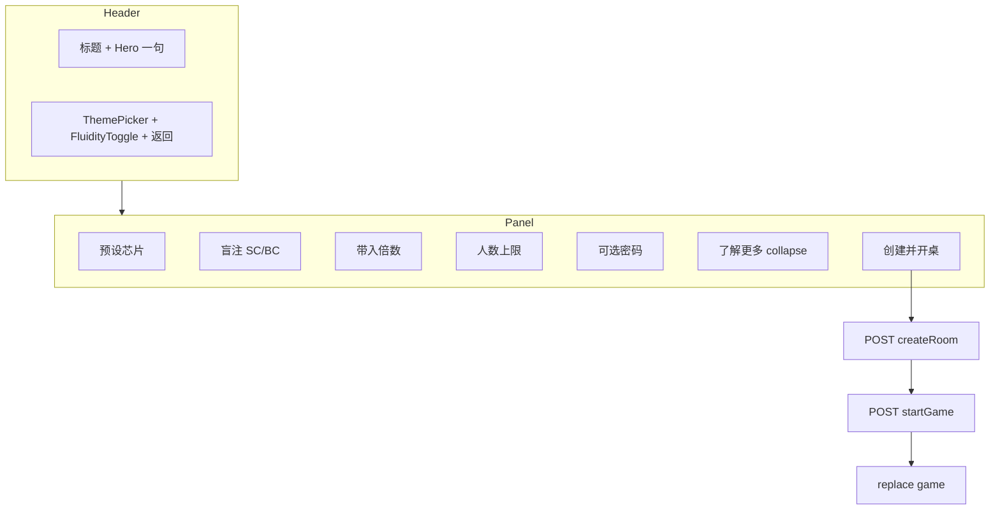

# CreateRoom 炫酷化重构 — UI 方案（一期）

| 项 | 值 |
|---|---|
| 目标文件 | `front/dp_game/src/components/CreateRoom.vue` |
| 路由 | `/create-room`（`route-create-room` chunk） |
| 方案版本 | 2025-05-28 |
| 用户已确认决策 | 视觉 C / 控件 B / 范围 B / 文案 B / 预设 B / 动效 A / 密码 A |
| **一期硬约束** | **仅验证 `default` 主题 + 默认布局**；多主题专项优化一律 **P1** |

---

## 0. 文档目的与范围

### 0.1 目的

将创建房间页从「原生表单 + 弱层级」升级为与 **Home 快捷卡片**、**LeaderboardPage 顶栏** 气质一致的轻度游戏感壳层；关键数字用 Element UI；业务与 API 行为 **零变更**。

### 0.2 一期（P0）包含

- `CreateRoom.vue` 模板 / 脚本反馈方式 / scoped 样式重构
- Header 对齐 `LeaderboardPage`（返回 + `dp-theme-picker` + `dp-fluidity-toggle`）
- 首屏一句 hero + 折叠「了解更多」
- 2～3 组预设芯片（仅改表单值，不改默认加载逻辑）
- 标准 stagger 入场；`eco` / `prefers-reduced-motion` 降级
- 密码仅 show/hide（`el-input` `show-password`）
- `alert` → `$message` 错误反馈
- **在 `data-dp-game-theme='default'` 下完成视觉与对比度验收**

### 0.3 一期（P0）明确不包含

- 为 `scifi` / `gothic` / `macau` / `midnight` / `forest` / `sunset` / `ink` / `strawberry` / `cotton` / `custom` 等做专项适配或回归
- 主题切换 UX 改版、`DpThemePicker` 行为变更
- 其他大厅子页（历史对局、曲库等）的统一改版
- 后端、`router`、`submit` 参数契约变更

### 0.4 设计系统脚本

仓库内 `.agents/skills/ui-ux-pro-max/scripts/` **无 `search.py` 可执行文件**（仅 SKILL 占位）。本节设计系统依据 **ui-ux-pro-max Quick Reference** + **frontend-design 五维** + 项目现有 `--dp-*` 令牌手写，见 §1。

---

## 1. 美学方向（frontend-design 五维）

### 1.1 Purpose / Tone / Differentiation

| 维度 | 定义 |
|------|------|
| **Purpose** | 登录用户在大厅外快速「自定义规则并立即开桌」；完成后直达对局页，可独自等待好友加入。 |
| **Tone** | **C — 轻度游戏感**：温暖、轻快、猫桌叙事（小鱼干 / 大猫小猫），但仍是工具型表单，非对局内霓虹重特效。 |
| **Differentiation** | 与 Home「创建房间」accent 卡片 **同色同源**（`--dp-accent` 渐变/描边），进入页后有 **hero 一句话 + 预设芯片一键填表**，形成「从卡片点进来 → 延续同一视觉语言」的连贯感。 |
| **Constraints** | Vue 2 + Element UI（已注册子集）；`dpLobbyThemeMixin` 保留；业务 clamp / API 顺序冻结。 |
| **一期主题** | 只保证 **`default`** 主题下对比度、边框、Element 覆盖样式正确；其他主题不阻塞一期合并。 |

### 1.2 五维执行要点

#### 字体（Typography）

- **沿用项目令牌**：`font-family: var(--dp-font-ui)`（`default` 为 Avenir / Helvetica / Arial 栈），不引入新 Web Font（避免 FOIT、与全站一致）。
- **层级**（建议 clamp，与 `lb-page` 对齐）：
  - 页标题 `h1`：`clamp(20px, 4.5vw, 26px)`，`font-weight: 700`
  - Hero 一句：`15–16px`，`--dp-text-secondary`，行高 1.5
  - 分组标题（「盲注」「带入」「人数」「进房」）：`13px`，`font-weight: 600`，`--dp-text-primary`，字间距可 `0.02em`
  - 字段标签：`14px`，`--dp-text-secondary`
  - 辅助 hint：`12px`，`--dp-text-muted`
  - 数字展示（BC 推导值）：`tabular-nums`（`font-variant-numeric: tabular-nums`）
- **禁止**：为「炫酷」引入 Inter/Roboto/Space Grotesk 等与全站脱节字体。

#### 色（Color）

- **只使用语义令牌**，禁止在组件内写死 `#1890ff` 等（`default` 主题已在 `dp-game-themes.css` 定义）：
  - 页面底：`--dp-game-bg`
  - 主面板：`--dp-panel-bg` + `--dp-panel-border` + `--dp-panel-shadow`
  - 子块/芯片底：`--dp-subpanel-bg` + `--dp-subpanel-border`
  - 主 CTA / 选中芯片：`--dp-accent`（与 `home-quick-card--accent` 一致）
  - 成功/次要：`--dp-success`（可选用于「标准桌」芯片描边，非必须）
  - 文案：`--dp-text-primary` / `secondary` / `muted`
  - 输入：`--dp-input-bg` / `--dp-input-border`（Element 覆盖见 `dp-game-element-ui.css`）
- **accent 用法**：hero 区可选极淡 `color-mix(in srgb, var(--dp-accent) 8%, transparent)` 背景条；主按钮可用 `dp-btn--primary` 或 `el-button type="primary"`（已有主题覆盖）。

#### 动效（Motion）

- **一处编排**：页面挂载时 **stagger 入场**（§5），不叠加多处装饰动画。
- **微交互**：芯片 hover 复用 home 卡片语义（`translateY(-2px)` + 边框 `accent`），时长 `0.22s`，`cubic-bezier(0.25, 0.46, 0.45, 0.94)`。
- **降级**：`body[data-dp-fluidity='eco']` 与 `prefers-reduced-motion: reduce` 关闭 stagger 与 hover 位移（§5）。

#### 构图（Spatial Composition）

- 外层：`dp-game-root` + `dp-lobby-inner`，**max-width: 720px**（与 `lb-page` 同宽），水平居中。
- 主内容：**单栏卡片** `dp-lobby-panel`，内部分 **预设区 → 分组表单 → 折叠说明 → 底部 CTA**；表单域 max-width **480px** 居中（比现 400px 略宽，适配 Slider）。
- Header：**左文右控**（与排行榜相反序但结构同型：标题区 vs `header-actions` 列）。

#### 背景（Background & Depth）

- 依赖 `dp-lobby-shell.css` 根节点 `min-height: 100dvh` + `var(--dp-game-bg)`，**不新增全屏插画**（一期不加大图以免多主题返工）。
- 面板内深度：面板阴影 + 分组之间 `16–24px` 间距；预设芯片使用与 `home-quick-card` 相同的 subpanel + hover 叠层（`::after` accent 淡染可选）。

### 1.3 ui-ux-pro-max 设计系统摘要（手写）

| 项 | 推荐 |
|----|------|
| 产品类型 | Entertainment / casual gaming lobby |
| 风格 | Soft game UI + card-based dashboard；与 Material「filled card」接近 |
| 对比度 | 正文 ≥ 4.5:1；hint ≥ 3:1（`default` 下用 DevTools 抽检） |
| 触控 | 芯片、按钮、InputNumber 触控高 ≥ 44px；芯片横向间距 ≥ 8px |
| 表单 | 可见标签；错误靠近操作（`$message` 顶栏）；渐进披露（了解更多折叠） |
| 反模式 | 禁止 emoji 当图标；禁止 placeholder 代替标签；禁止仅 hover 才可见关键操作 |

---

## 2. 布局线框

### 2.1 结构（文字）

1. **Header**（`cr-page__header`，对齐 `lb-page__header`）
   - 左：`h1`「创建房间」+ hero 一句（见 §2.3 文案）
   - 右：`cr-page__header-actions` 纵向堆叠 — `dp-theme-picker` + `dp-fluidity-toggle` +「返回大厅」按钮（样式对齐 `lb-page__back`）
2. **主面板**（`dp-lobby-panel cr-page__panel`，`v-loading` 保留）
   - **预设芯片行**（2～3 个，`role="group"` `aria-label="快捷预设"`）
   - **分组 A — 盲注**：小猫 SC（`el-input-number`）；大猫 BC（只读推导块，非输入）
   - **分组 B — 带入**：每人初始倍数（`el-slider` + `el-input-number` 联动，min 5）；下方一行 hint
   - **分组 C — 人数**：`el-input-number` 或 `el-slider`（min 2 max 9，整数步进）
   - **分组 D — 进房（可选）**：`el-input` + `show-password`；placeholder 保留语义
   - **折叠区**：「了解更多」展开后显示原 `create-room-panel__intro` 全文
   - **CTA 区**：主按钮「创建并开桌」；loading 文案与 `creating` 同步
3. **无侧栏、无步骤条**（单屏完成，符合决策 B）

### 2.2 ASCII 线框

```
┌──────────────────────────────────────────────────────────────────┐
│ 创建房间 (h1)                        [界面主题 ▼] [节能模式 ☐]   │
│ 自定义小猫小鱼干与人数，开桌后好友可从大厅加入。    [返回大厅]     │
├──────────────────────────────────────────────────────────────────┤
│ ╭────────────────────────────────────────────────────────────╮ │
│ │  [ 休闲桌 ]  [ 标准桌 ★ ]  [ 深筹桌 ]     ← 预设芯片        │ │
│ │ ── 盲注 ─────────────────────────────────────────────────  │ │
│ │  小猫 SC  [  5 ▲▼]     大猫 BC  [ 10 自动 ]                │ │
│ │ ── 带入 ─────────────────────────────────────────────────  │ │
│ │  每人初始（倍）  ═════●═════  [ 50 ]                        │ │
│ │  hint: 初始小鱼干 = 大猫 × 倍数 …                           │ │
│ │ ── 人数 ─────────────────────────────────────────────────  │ │
│ │  上限  ═════════●══  [ 9 ]                                  │ │
│ │ ── 进房（可选）──────────────────────────────────────────  │ │
│ │  密码  [ ••••••••  👁 ]                                     │ │
│ │  ▶ 了解更多                                                 │ │
│ │              ┌─────────────────────┐                        │ │
│ │              │   创建并开桌 (主 CTA) │                        │ │
│ │              └─────────────────────┘                        │ │
│ ╰────────────────────────────────────────────────────────────╯ │
└──────────────────────────────────────────────────────────────────┘
```

### 2.3 文案（决策 B）

| 位置 | 文案 |
|------|------|
| Hero（首屏常显） | **「自定义小猫小鱼干与人数，开桌后好友可从大厅加入。」** |
| 折叠标题 | **「了解更多」**（收起态 ▶ / 展开态 ▼，可用 CSS `::before` 或 `aria-expanded`） |
| 折叠正文 | 沿用现有长说明（小猫/大猫 2 倍、带入倍数、2～9 人、密码可选、创建后直接开桌） |
| CTA | 默认「创建并开桌」；`creating` 时「正在开局…」 |
| 返回 | 「返回大厅」（与排行榜一致，去掉「←」或保留统一图标二选一，**推荐纯文案与 lb 一致**） |

### 2.4 Mermaid（信息架构）



---

## 3. 组件选型表

| UI 区块 | 选型 | 说明 |
|---------|------|------|
| 页壳 | `dp-game-root` + `dpLobbyThemeMixin` | 保留 `data-dp-game-theme` / `customThemeInlineStyle` |
| Header 返回 | **原生 `button`** + `lb-page__back` 同类样式（新建 `cr-page__back` 复制 token） | 与 Leaderboard 一致 |
| 主题 / 节能 | **`dp-theme-picker`** + **`DpFluidityToggle`** | 需 `components: { DpFluidityToggle }` |
| 预设芯片 | **自定义 `button`** + home 卡片 CSS 变量 | 不引入 Chip 组件；样式 mirror `home-quick-card` |
| 小猫 SC | **`el-input-number`** | `min=1`，`:precision="0"`，`controls-position="right"` |
| 大猫 BC | **自定义只读块** | 显示 `computedBigBlindChips`；`title` 提示 2 倍 |
| 带入倍数 | **`el-slider`** + **`el-input-number`** | 双绑 `startingStackBb`，`min=5`，`max` 建议 200（UI 上限，submit 仍 `Math.max(5, …)`） |
| 人数上限 | **`el-input-number`**（推荐）或 `el-slider` | `min=2` `max=9`；与现逻辑一致 |
| 密码 | **`el-input`** `show-password` | 决策 A：仅显隐，无强度条 |
| 折叠说明 | **原生 `<details>/<summary>`** 或 `button` + `v-show` | **无需** `el-collapse` |
| CTA | **`el-button` `type="primary"`** 或 `dp-btn--primary` | `disabled=creating`；全宽 `max-width: 320px` |
| Loading | **`v-loading`** | 保留 `element-loading-text` / `background` |
| 错误反馈 | **`this.$message.error` / `.warning`** | 替代 `alert`；已全局注册 Message |

### 3.1 main.js Element 注册结论（P0）

**无需新增注册**。下列已存在于 `main.js`：`Form`, `FormItem`, `Input`, `InputNumber`, `Slider`, `Button`, `Loading`, `Message`。

| 若实现偏离本方案 | 须注册 |
|------------------|--------|
| 使用 `el-collapse` | `Collapse`, `CollapseItem` |
| 使用 `el-switch` 代替 `show-password` | `Switch` |
| 使用 `el-card` 包裹 | `Card` |
| 使用 `el-steps` | `Steps`, `Step` |

**推荐**：坚持上表「无需新增」路径。

---

## 4. 样式策略

### 4.1 组织方式

- **Scoped CSS** 为主，块前缀 **`cr-page`** / **`cr-preset`**（避免与 `create-room-*` 并存过长；迁移时整体替换 class）。
- **复用全局**：
  - `dp-lobby-shell.css` — 根布局、`dp-lobby-panel`、`dp-lobby-inner`
  - `dp-game-themes.css` — 全部颜色
  - `dp-game-element-ui.css` — InputNumber / Slider / Button 主题覆盖
  - `dp-motion-tokens.css` — 时长 token
  - `dp-interactive-hover.css` — 可选：为 `cr-preset` 增加与 `lb-page__tab` 类似的 eco 规则（实现时一行引用或复制 eco 块）
- **不抽离 home.scss**：一期在 `CreateRoom.vue` scoped 内 **复制必要片段**（预设芯片 ～40 行），注释 `/* mirror home-quick-card */`；二期再考虑共享 partial。

### 4.2 关键样式规则（实现清单）

```css
/* 示例：实现 Agent 参考，非最终代码 */
.cr-page { max-width: 720px; margin: 0 auto; padding: clamp(12px, 3vw, 24px) ... }
.cr-page__panel { position: relative; min-height: 280px; }
.cr-preset { /* 对齐 .home-quick-card 的 border-radius, subpanel bg, hover */ }
.cr-field-group + .cr-field-group { margin-top: 20px; }
.cr-page .el-input-number,
.cr-page .el-slider { width: 100%; max-width: 480px; }
```

- Element 表单项放在 `.dp-game-root` 内即可被 `body[data-dp-game-theme]` 覆盖；**一期仅在 `default` 下目测边框与文字对比度**。
- BC 推导块：虚线边框 + `opacity: 0.92`，与现 `create-room-fields__derived` 一致，改用 `cr-derived` class。

### 4.3 一期仅 default 主题（P0 验证）

实现完成后，测试账号在 **未改主题**（store `gameUiTheme === 'default'`）下验证：

- [ ] 面板与背景分离清晰
- [ ] `el-input-number` 增减按钮可辨
- [ ] `el-slider` 轨道/拇指与 accent 协调
- [ ] 主 CTA 与 `home-quick-card--accent` 色相一致
- [ ] Hero / hint 对比度合格

**不要求**：切换至 `midnight` 等时仍完美；若明显不可用，记录 issue 进 P1，**不阻塞 P0 合并**。

### 4.4 二期多主题 checklist（P1）

- [ ] 在 `scifi`, `gothic`, `macau`, `midnight`, `forest`, `sunset`, `ink`, `strawberry`, `cotton` 各截图对比
- [ ] `custom` + `customThemeOverrides` 下 accent 对比度
- [ ] `dp-game-element-ui.css` 是否需补充 `cr-page` 特化选择器
- [ ] 深色主题下 `box-shadow` 是否过重
- [ ] 预设芯片 hover `rgba(0,0,0,0.08)` 阴影在深色底是否发灰

---

## 5. 动效规格

### 5.1 Stagger 入场（标准档）

**触发**：`mounted` 后给面板子节点加 class `cr-stagger-in`（或用 `requestAnimationFrame` 防首帧闪动）。

| 序号 | 元素 | delay | 动画 |
|------|------|-------|------|
| 0 | Header 整体 | 0ms | fade + translateY(8px→0) |
| 1 | 预设芯片行 | 40ms | 同上 |
| 2 | 分组 A 盲注 | 80ms | 同上 |
| 3 | 分组 B 带入 | 120ms | 同上 |
| 4 | 分组 C 人数 | 160ms | 同上 |
| 5 | 分组 D 密码 | 200ms | 同上 |
| 6 | 了解更多 + CTA | 240ms | 同上 |

- **时长**：`280ms`（落在 ui-ux-pro-max 150–300ms 微交互区间）
- **缓动**：`cubic-bezier(0.22, 1, 0.36, 1)`（ease-out）
- **属性**：仅 `opacity` + `transform`（GPU 友好）
- **初始态**：`opacity: 0; transform: translateY(8px);`
- **终态**：`opacity: 1; transform: none;`

```css
@keyframes cr-stagger-rise {
  from { opacity: 0; transform: translateY(8px); }
  to { opacity: 1; transform: translateY(0); }
}
.cr-stagger-in {
  animation: cr-stagger-rise 280ms cubic-bezier(0.22, 1, 0.36, 1) both;
  animation-delay: var(--cr-stagger-delay, 0ms);
}
```

### 5.2 Eco 模式降级

当 `document.body.getAttribute('data-dp-fluidity') === 'eco'`（与 `dpBodyFluidity.js` / Vuex `ecoMode` 同步）：

```css
body[data-dp-fluidity='eco'] .cr-stagger-in {
  animation: none !important;
  opacity: 1 !important;
  transform: none !important;
}
body[data-dp-fluidity='eco'] .cr-preset:hover {
  transform: none;
}
```

### 5.3 prefers-reduced-motion

```css
@media (prefers-reduced-motion: reduce) {
  .cr-stagger-in { animation: none !important; opacity: 1 !important; transform: none !important; }
  .cr-preset { transition: none !important; }
  .cr-preset:hover { transform: none !important; }
}
```

### 5.4 路由过渡

`home ↔ create-room` 已配置 `dp-route-transition`（`dpRouteTransition.js`）；**页面内 stagger 与路由动画独立**，避免叠加过长；eco 下路由过渡已为 0，无需改。

---

## 6. Header 对齐 LeaderboardPage

### 6.1 目标结构（对齐模式）

参考 `LeaderboardPage.vue`：

```html
<header class="cr-page__header">
  <div class="cr-page__header-main">
    <h1 class="cr-page__title">创建房间</h1>
    <p class="cr-page__hero">…一句…</p>
  </div>
  <div class="cr-page__header-actions">
    <div class="dp-game-theme-row cr-page__theme-row">
      <span class="dp-game-theme-row__label">界面主题</span>
      <dp-theme-picker ... />
      <dp-fluidity-toggle />
    </div>
    <button type="button" class="cr-page__back" @click="goHome">返回大厅</button>
  </div>
</header>
```

### 6.2 与现 CreateRoom 差异

| 现状 | 目标 |
|------|------|
| 返回在左，主题在右 | 标题在左，**主题+节能+返回**在右列 |
| 无 `DpFluidityToggle` | **必须引入**（与 lb 一致） |
| 返回按钮 `dp-btn--ghost` | 改为 **`cr-page__back`**（边框按钮，复制 `lb-page__back` token） |
| 标题在 panel 内 | 标题提升到 **header** |

### 6.3 响应式

- `max-width: 640px`：`header-actions` 仍可全宽右对齐或换行；**主题行在返回按钮上方**（与 lb 相同 `flex-wrap`）。
- Safe area：依赖 `dp-lobby-shell` 根 padding，不额外裁切。

---

## 7. 预设芯片（决策 B）

### 7.1 预设定义（建议 3 组）

|  id（data） | 展示名 | smallBlind | startingStackBb | maxSeatCount | roomPassword |
|-------------|--------|------------|-----------------|--------------|--------------|
| `casual` | 休闲桌 | 2 | 40 | 6 | `''` |
| `standard` | 标准桌 | 5 | 50 | 9 | `''` |
| `deep` | 深筹桌 | 10 | 100 | 6 | `''` |

- **页面 `data()` 初始值不变**：仍为 `5 / 50 / 9 / ''`（与现网一致）。
- 点击芯片：**仅赋值**上述字段；**不自动 submit**。
- 选中态：`.cr-preset--active` 边框 `var(--dp-accent)` + 浅底 `color-mix(...)`。
- `standard` 芯片可与初始默认一致，标「默认」小字（可选）。

### 7.2 交互

- `aria-pressed` 反映当前是否匹配该预设（完全相等时为 true）
- 用户手动改数字后，若无预设完全匹配，**全部芯片非 active**

---

## 8. 业务冻结（禁止改动）

### 8.1 submit 流程与参数

顺序不变：`exitLobbyQuickMatchSilently` → `POST /dpRoom/createRoom` → `POST /dpRoom/startGame` → `$router.replace({ name: 'game', ... })`。

| 参数 | 规则 |
|------|------|
| `nickname` | `user.nickname` |
| `smallBlindChips` | `Math.max(1, Number(smallBlind) \|\| 5)` |
| `bigBlindChips` | `smallBlindChips * 2` |
| `startingStackBb` | `Math.max(5, Number(startingStackBb) \|\| 50)` |
| `maxSeatCount` | `round` 后 clamp `[2, 9]` |
| `roomPassword` | 仅当非空字符串时附带 |
| `userId` | 可选，逻辑不变 |

### 8.2 其他禁止项

- 不改 `router/index.js` chunk 名与 path
- 不改 `prefetchGameChunk` 调用时机
- 不改 `created` 登录校验 / `replace('/login')`
- 不把创建改为「只创建不开局」
- 不新增后端字段

### 8.3 错误反馈映射（替代 alert）

| 场景 | 现 alert | 改为 |
|------|----------|------|
| 无 roomId | `创建失败：未返回房间号` | `$message.error(...)` |
| startGame 非 ok | 长文案 + 仍跳转 game | `$message.warning(...)` + 保持跳转 |
| catch | `创建失败，请检查网络…` | `$message.error(...)` |

`creating` 复位逻辑保持不变。

---

## 9. P0 验收标准（可测试）

1. **路由**：登录态从 Home「创建房间」进入 `/create-room`，返回大厅回到 `/home`。
2. **Header**：可见「界面主题」、`DpThemePicker`、**节能模式**勾选、**返回大厅**；布局与排行榜页同一模式（右列 actions）。
3. **Hero + 折叠**：首屏仅一句 hero；点击「了解更多」展开/收起长说明，不影响表单提交。
4. **预设**：3 芯片点击后表单数值变化；刷新页面仍为默认 `5/50/9`；提交参数与改前手动输入同值时一致。
5. **控件**：SC/倍数/人数使用 Element 数字控件；BC 只读为 2×SC；密码可 show/hide。
6. **动效**：标准模式下有 stagger；开启节能或系统「减少动态效果」后无位移/无 stagger。
7. **开桌**：成功创建并进入对局；失败无 `alert` 弹窗（仅 Message）。
8. **主题（P0 范围）**：在 **`default` 主题** 下 UI 完整、可读；**不要求**其他主题通过。
9. **回归**：未登录仍跳转 login；`creating` 时 CTA disabled + loading 遮罩。

---

## 10. P1 二期 backlog

| 项 | 说明 |
|----|------|
| 多主题专项 | §4.4 checklist 全量回归 + 修 tokens |
| 共享预设芯片样式 | 抽 `dp-lobby-quick-chip` 到 `dp-lobby-shell.css` 供 Home / CreateRoom 共用 |
| 其他大厅子页壳层统一 | 历史对局、曲库、下载中心等 header 对齐 |
| 创建页深度动效 | 路由 shared-element、面板内 hero 插画（若产品要） |
| 表单校验增强 | blur 校验、字段级 `el-form-item` error（非本期必须） |
| i18n | 若未来中英切换，文案收拢 constants |

---

## 11. 风险与回滚

| 风险 | 影响 | 缓解 |
|------|------|------|
| Element 在部分主题对比度不足 | P0 后用户切主题体验差 | 一期只承诺 default；P1 修 `dp-game-element-ui.css` |
| Slider + InputNumber 双绑抖动 | 偶发循环更新 | 用 `:value` + `@input` 或单一 v-model 源 + computed |
| stagger 首帧闪烁 | CLS / 刺眼 | rAF 再加 class；eco/PRM 关闭 |
| 预设与手动值不一致 | 用户困惑哪组生效 | `aria-pressed` + 仅完全匹配高亮 |
| `$message` 被遮挡 | 看不到错误 | Message 挂 body，已有主题样式 |
| **范围蔓延** | 一期无法交付 | 严禁 P0 做非 default 主题适配 |

**回滚**：仅 revert `CreateRoom.vue`（及若实现的样式片段）即可恢复旧 UI；无 DB / API 变更。

---

## 12. 实现 Agent 交接清单

### 12.1 开始前必读

| 路径 | 用途 |
|------|------|
| `docs/refactor/create-room-ui-plan.md` | 本文 |
| `front/dp_game/src/components/CreateRoom.vue` | 改造目标 |
| `front/dp_game/src/components/LeaderboardPage.vue` | Header 对齐范本 |
| `front/dp_game/src/components/home.vue` | `home-quick-card` 样式范本（≈1651–1820 行） |
| `front/dp_game/src/components/DpFluidityToggle.vue` | 节能开关 |
| `front/dp_game/src/main.js` | Element 已注册列表 |
| `front/dp_game/src/styles/dp-game-element-ui.css` | Element 主题覆盖 |
| `front/dp_game/src/styles/dp-motion-tokens.css` | 动效 token |
| `CLAUDE.md` | 项目约定 |

### 12.2 预计修改文件

| 文件 | 操作 |
|------|------|
| `front/dp_game/src/components/CreateRoom.vue` | **主改**（template / script / style） |
| `front/dp_game/src/styles/dp-motion-tokens.css` | 可选：补充 `cr-stagger` eco 一行（非必须，可在 scoped 写） |
| `front/dp_game/src/styles/dp-interactive-hover.css` | 可选：`cr-preset:hover` eco |

**不改**：`router`、`controller`、后端、`main.js`（除非擅自选用未注册组件）。

### 12.3 禁止改动项

- submit 参数名、clamp、API 顺序
- 路由 path / chunk 名
- `dpLobbyThemeMixin` 契约
- 为一期做全主题 CSS 分叉

### 12.4 本地验证步骤（无需 commit）

```bash
cd front/dp_game && npm run serve
# 或项目根目录按现有文档启动后端 + 前端
```

1. 登录 → Home → 创建房间 → 检查 §9 全部 P0 条目  
2. 默认主题下截图留档  
3. 切换节能模式刷新页 → 无 stagger  
4. 提交一桌：参数与旧版相同预设时一致（可用 DevTools Network 看 query）  
5. 断网 submit → `$message` 报错，无 alert  

---

## 13. 附录：现网基线摘要

- 组件：无 props/emit；`mixins: [dpLobbyThemeMixin]`
- 默认值：`smallBlind: 5`, `startingStackBb: 50`, `maxSeatCount: 9`, `roomPassword: ''`
- 加载：`v-loading="creating"`
- 错误：`alert`（需替换）
- 样式：`scoped` + `--dp-*`；面板 `dp-lobby-panel`

---

*方案撰写：前端 UI 方案 Agent · 仅文档，不含实现代码*
