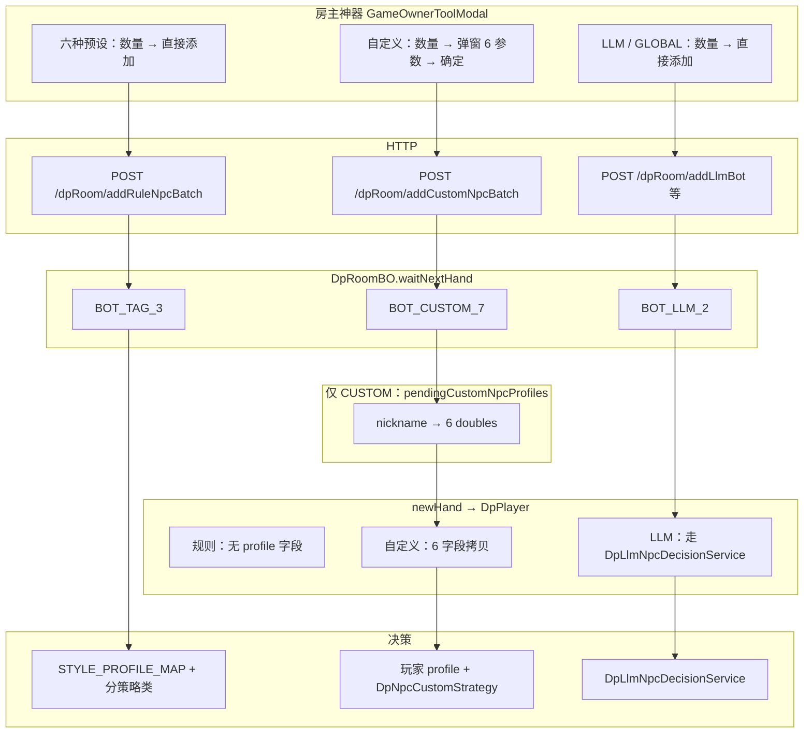

# 自定义 NPC 调参 — 实现方案（P0）

> **文档性质**：只读方案，供后端 / 前端实现 Agent 开工前必读。  
> **不写业务代码**；实现方禁止擅自 `git commit` / `push`。  
> **对齐来源**：产品决策 1～8（[对话定稿](57bcd910-f854-4d58-a521-4d6a9ca19cda)）；现状代码见文末「必读路径」。

---

## 变更说明（本次交付）

| 项 | 内容 |
|----|------|
| 新增文件 | `docs/refactor/custom-npc-tuning-plan.md`（本文件） |
| 修改代码 | 无 |
| 默认产品选择 | 同批多个 CUSTOM **共用一套** 6 参数（**9a**）；可扩展 **9b**（见 §4.4） |

---

## 1. 背景与目标

### 1.1 现状（大白话）

房主神器里已有 **6 种固定性格猫**（鱼、TAG、LAG 等）和 **大模型猫**。点「确认添加」时只选 **数量**，后端按昵称前缀认出是哪种猫，再用 **写死在代码里** 的 6 个数字打牌——**不能**按房主这次想试的参数来。

参考实现：

- 批量加规则 Bot：`DpRoomServiceImpl#addRuleNpcBatchToNextHand`（与 `addRuleNpcBatch` API 对齐）
- 认风格：`DpNpcEngine#resolveRuleBotType` + `STYLE_PROFILE_MAP`
- 前端：`GameOwnerToolModal.vue` → `game.vue#confirmAddOwnerNpcs` → `POST /dpRoom/addRuleNpcBatch`

### 1.2 目标（大白话）

在房主神器增加 **「自定义 NPC」** 一行：

1. 选数量 → 点添加 → **弹出参数表**（6 个滑条，默认等于 TAG 猫）  
2. 确定后，下一局加入 `BOT_CUSTOM_<序号>` 的猫  
3. 打牌时读 **本猫自己的 6 参数**；翻后走 **单独策略**，且参数对行为影响 **比六档预设更明显**，方便房主试参、日后反推平衡六档预设  
4. **上桌后不能改参**；要改只能踢掉再按新参数重新加  

### 1.3 已确认需求（决策 1～8 + 9）

| # | 决策 | 落地含义 |
|---|------|----------|
| 1 | **A** | 弹窗只调 6 项：`vpip`、`pfr`、`cbetFreq`、`bluffFreq`、`callStation`、`foldToPressure`，取值 **0～1** |
| 2 | **B** | 弹窗默认值 = **TAG 预设**（与 `StyleProfile.presetTag()` 一致，见 §6.3） |
| 3 | **A** | 六种预设仍 **数量 + 一键添加**，**不弹窗** |
| 4 | 上桌后不可改 | 无「局内改参」API；改参 = 踢出 + 重新 `addCustomNpcBatch` |
| 5 | 玩家侧 + 房间缓存 | `waitNextHand` 阶段只有昵称 → **`DpRoomBO` pending map**；`newHand` 入座时 **拷贝到 `DpPlayer` 六个字段** |
| 6 | 仅房主 | 与现有房主神器能力一致；服务端校验 `requesterNickname == room.owner` |
| 7 | 与规则 batch 一致 | `count` 1～9；空位 = `maxSeatCount − 桌上占席 − waitNextHand.size()`，超出部分截断 |
| 8 | 翻后独立分支 | 新建 `DpNpcCustomStrategy`；6 参数 **权重放大**（§6） |
| **9** | **9a（默认）** | 同一批 `count` 个 CUSTOM **共用** 弹窗里的一套 profile；**9b** 为 P1 扩展：每人一套数组 |

---

## 2. 三轨架构（规则 / 自定义 / LLM）

三条线 **并列**，不要混接口、不要塞进 `addRuleNpcBatch` 的 `archetype`。



| 轨道 | 昵称模式 | 风格参数来源 | 翻前 | 翻后 |
|------|----------|--------------|------|------|
| **规则预设** | `BOT_{FISH,TAG,LAG,NIT,CALL,MANIAC}_<seq>` | `DpNpcEngine.STYLE_PROFILE_MAP` | `DpNpcUnifiedPreflopStrategy` + 预设 `BotType` | `DpNpcFishStrategy` 等 |
| **自定义** | `BOT_CUSTOM_<seq>` | `DpPlayer` 上 6 字段（入座前 pending map） | 同上策略类，**数值来自玩家** | **`DpNpcCustomStrategy`（新）** |
| **LLM** | `BOT_LLM_*` / `BOT_LLM_GLOBAL_*` | 无 StyleProfile | 不走规则引擎 | `DpLlmNpcDecisionService` |

---

## 3. 昵称与识别

### 3.1 命名

- 前缀常量建议：`DpNpcEngine.PREFIX_BOT_CUSTOM = "BOT_CUSTOM"`
- 多实例：`BOT_CUSTOM_<seq>`，`seq` 由 `DpRoomBO#allocateBotNicknameSeqBatch` 分配（与规则/LLM **共用** 房间内递增序号，避免撞号）
- 工厂方法：`customBotNickname(int seq)`，校验 `seq > 0`

### 3.2 与 `isLlmBotNickname` 互斥

`isLlmBotNickname` 当前逻辑（`DpNpcEngine`）：

1. 先判 `BOT_LLM_GLOBAL`（前缀须长于 `BOT_LLM`，避免误匹配）  
2. 再判 `BOT_LLM` 或 `BOT_LLM_<seq>`

**自定义线要求**：

| 方法 | CUSTOM 行为 |
|------|-------------|
| `isLlmBotNickname` | 对 `BOT_CUSTOM_*` **恒 false**（不要以 `BOT_` 粗判进 LLM） |
| `isCustomBotNickname`（新） | `BOT_CUSTOM` 或 `startsWith("BOT_CUSTOM_")` |
| `isBotNickname` | 规则 **或** CUSTOM **或** LLM |
| `resolveRuleBotType` | 对 CUSTOM **返回 null**（不进六档 `BotType` 枚举） |
| `getBotTypeByNickname` | 对 CUSTOM **返回 null**；决策入口改走 `isCustomBotNickname` 分支 |

**解析顺序建议**（`decideActionIfReady` 内）：LLM → CUSTOM → 规则 `BotType`。

### 3.3 UI 短显

继续用 `DpUtilNpcDisplayNickname.shortenForUi`（前缀 + uuid 片段规则与现 Bot 一致）。

---

## 4. 数据模型

### 4.1 问题：为什么需要 pending map？

`waitNextHand` 仅是 `List<String>`（见 `DpRoomBO:96`）。候补阶段 **还没有** `DpPlayer`，无法在玩家对象上存 6 参数。  
因此：**加候补时** 写入房间级 map；**入座时** 拷贝到玩家；**踢出/取消候补** 时删除 map 项。

### 4.2 `DpRoomBO` — pending map（P0）

| 项 | 说明 |
|----|------|
| 字段名（建议） | `pendingCustomNpcProfiles`：`Map<String, CustomNpcStyleSnapshot>` |
| Key | 完整 nickname，如 `BOT_CUSTOM_12` |
| Value | 6 个 `double`，语义同 `StyleProfile`（§6.3） |
| 序列化 | **`@JsonIgnore`** 或不出现在房间 JSON——仅服务端决策用 |
| 写入时机 | `addCustomNpcBatchToNextHand` 每生成一个 nickname 写一条 |
| 删除时机 | 见 §4.5 |

`CustomNpcStyleSnapshot` 建议独立小类（`npc` 或 `common.bo` 包），带 `clamp01` 与静态 `fromTagPreset()`。

### 4.3 `DpPlayer` — 6 字段（入座拷贝）

在 `DpPlayer` 新增（命名可与实现对齐，文档统一如下）：

| 字段 | 含义 | 范围 |
|------|------|------|
| `npcStyleVpip` | 入池倾向 | [0, 1] |
| `npcStylePfr` | 翻前加注倾向 | [0, 1] |
| `npcStyleCbetFreq` | 持续下注倾向 | [0, 1] |
| `npcStyleBluffFreq` | 诈唬倾向 | [0, 1] |
| `npcStyleCallStation` | 跟注站倾向 | [0, 1] |
| `npcStyleFoldToPressure` | 面对压力弃牌倾向 | [0, 1] |

**判定「是否自定义 Bot」**：`isCustomBotNickname(nickname)` 为 true，且上述字段在入座时已写入（或提供 `hasCustomStyleProfile()`：任一字段非 NaN/已设标志位）。

**JSON**：P0 可 **不下发** 给前端（`@JsonIgnore`），避免泄漏调参；P1 若做观战面板再开放。

**拷贝点**：`DpRoomServiceImpl#getAllCanPlayer` 在 `new DpPlayer()` + `setNickname` 之后（约 2154–2163 行），若 `pendingCustomNpcProfiles` 含该 nick，则 `copyTo(player)` 并 **remove map 项**（已上桌，候补缓存可丢）。

**每手清理**：`newHandWithoutLobbyUpsert` 里已有 HandPlan 清空（约 2049 行）；**不要**清空 6 风格字段（跨手保持性格）。

### 4.4 同批 profile：9a / 9b

| 模式 | 行为 | 阶段 |
|------|------|------|
| **9a（P0 默认）** | 请求体一份 `profile`，本批 `count` 个 BOT_CUSTOM 全部指向同一快照 | 实现简单；弹窗只填一次 |
| **9b（P1）** | `profiles: [{...}, {...}]` 长度 = count；或 UI「应用到全部」开关 | 每人独立性格 |

### 4.5 踢人 / 取消候补 / 退房 清理

| 事件 | `waitNextHand` | `pendingCustomNpcProfiles` | `DpPlayer` 6 字段 |
|------|----------------|----------------------------|-------------------|
| 踢出 **已上桌** CUSTOM | 不变（本来就不在 wait） | remove(nick) | 玩家变 `leftThisHand`；下一手 zombie 清理时移除 |
| 取消候补 `cancelReadyNextHand` | remove(nick) | remove(nick) | 无玩家 |
| Bot 从候补被 `joinRoom` 已开局路径摘掉 | remove | remove | 无 |
| 房间 `removeRoom` | 随房间销毁 | 随房间销毁 | — |

**实现注意**：当前 `kickOnePlayerWithoutLobbySync` **不会**把 Bot 加入观众席，也 **未** 清理 wait / pending——自定义线 **必须补** pending 清理，否则 map 泄漏。

---

## 5. API：`POST /dpRoom/addCustomNpcBatch`

### 5.1 路由与鉴权

| 项 | 值 |
|----|-----|
| Method / Path | `POST /dpRoom/addCustomNpcBatch` |
| JWT | 与现有 `/dpRoom/**` 一致（非 `PERMIT_ALL` 白名单则需登录） |
| 房主校验 | `requesterNickname`（或从 SecurityContext 取当前用户 nickname）**必须等于** `DpRoomBO.owner`；否则 `fail` |
| 不要** | 不要把 `CUSTOM` 作为 `addRuleNpcBatch` 的 `archetype` |

### 5.2 请求（建议 JSON body，与 query 二选一由实现定；推荐 body）

**9a 默认形态：**

```json
{
  "roomId": "房间号",
  "count": 2,
  "requesterNickname": "房主昵称",
  "profile": {
    "vpip": 0.24,
    "pfr": 0.76,
    "cbetFreq": 0.82,
    "bluffFreq": 0.36,
    "callStation": 0.18,
    "foldToPressure": 0.22
  }
}
```

| 字段 | 类型 | 规则 |
|------|------|------|
| `roomId` | string | 必填；房间须存在 |
| `count` | int | 1～9；≤0 按现有 batch 可视为 no-op 或 fail（建议与 `addRuleNpcBatch` 一致：`<=0` 返回 ok） |
| `requesterNickname` | string | 房主校验 |
| `profile` | object | 6 键必填；服务端 `clamp01`；非法键 reject |

**校验失败**：返回 `"fail"` 或结构化错误（P1）；P0 可与现 Bot API 一致用字符串 `"ok"` / `"fail"`。

### 5.3 响应

与 `addRuleNpcBatch` 对齐：

```text
"ok"   — 至少成功加入 0～min(count, cap) 个；cap 为 0 时建议 fail
"fail" — 房间不存在、非房主、profile 非法、序号分配失败等
```

前端成功文案建议：`已请求在下一局加入最多 N 个自定义 NPC（受空位限制）…`

### 5.4 服务端流程（对齐 `addRuleNpcBatchToNextHand`）

伪代码与 [`DpRoomServiceImpl#addRuleNpcBatchToNextHand`](../src/main/java/com/example/mgdemoplus/room/impl/DpRoomServiceImpl.java) 同构：

1. `roomMap.get(roomId)`，null → fail  
2. 房主校验  
3. `cap = maxSeatCount - seatedCountForSeatCap(r) - waiters.size()`，cap ≤ 0 → fail  
4. `n = min(count, cap)`  
5. `firstSeq = allocateBotNicknameSeqBatch(n)`  
6. 对每个 `i in 0..n-1`：  
   - `nick = customBotNickname(firstSeq + i)`  
   - 若不在 `waiters` 则 `add`  
   - `pendingCustomNpcProfiles.put(nick, snapshot.clone())`（9a：同一 snapshot）  
7. **`refreshJoinableQuickMatchIndexRoom(roomId, now)`**（与 A12 一致，见 §9）  
8. return true  

### 5.5 Controller / Service 签名（建议）

```java
// DpRoomController
@PostMapping("/addCustomNpcBatch")
public String addCustomNpcBatch(@RequestBody AddCustomNpcBatchRequest req);

// DpRoomService
boolean addCustomNpcBatchToNextHand(String roomId, String requesterNickname,
    int count, CustomNpcStyleSnapshot profile);
```

---

## 6. 决策链

### 6.1 总入口改造（`DpNpcEngine`）

在 `decideActionIfReady` / `decideBotAction` 分支：

```text
if isLlmBotNickname → 不进入本类（现有 LLM 服务）
else if isCustomBotNickname → decideCustomBotAction(room, bot)
else if getBotTypeByNickname != null → 现有 decideBotAction(room, bot, type)
else → null
```

`decideCustomBotAction` 从 `DpPlayer` 读取 6 字段构建 **运行时 StyleProfile**（不必加入 `STYLE_PROFILE_MAP`）。

### 6.2 翻前：复用 `DpNpcUnifiedPreflopStrategy`

**建议 P0：复用**，与规则 NPC 相同调用：

```java
DpNpcUnifiedPreflopStrategy.decide(
    room, bot, callAmount, callRatio,
    style.vpip, style.pfr, style.callStation, style.foldToPressure,
    mood, random, /* BotType */ null 或新增 CUSTOM 占位);
```

要点（见 `DpNpcUnifiedPreflopStrategy` 类注释）：

- `rangeLevel` 由 **vpip / callStation / foldToPressure** 等驱动  
- `pfr` 缩放 3bet/4bet 侵略性  
- 若现有 `BotType` 小幅加成（MANIAC +2 等）依赖非 null，方案 **二选一**：  
  - **A**：CUSTOM 传 `BotType.TAG` 仅作 **微小** 档位加成（实现快）  
  - **B**：翻前策略增加 `botType == null` 时 **不加** 档位加成（更干净，推荐）

翻前 **不** 走 `DpNpcCustomStrategy`。

### 6.3 TAG 默认值（前端 / 校验参照）

与 `StyleProfile.presetTag()` 一致（`DpNpcEngine` 约 799–801 行）：

| 参数 | TAG 默认 |
|------|----------|
| vpip | 0.24 |
| pfr | 0.76 |
| cbetFreq | 0.82 |
| bluffFreq | 0.36 |
| callStation | 0.18 |
| foldToPressure | 0.22 |

### 6.4 翻后：`DpNpcCustomStrategy`（新建）

**路径建议**：`com.example.mgdemoplus.npc.strategy.DpNpcCustomStrategy`

**输入**：`DpNpcRuleDecisionParams` 或精简 BO，其中风格字段来自 **玩家 6 字段**，`type` 可为 `null` 或枚举 `CUSTOM`。

**结构建议**（不必照抄六档之一，但要 **可感知**）：

- 仍可复用 `buildSmartContext`、`HandPlan`（可选：按 `vpip/bluffFreq` 初始化 plan，P1 再细化）  
- **独立** fold/call/raise 概率树，**放大** 参数导数：

| 旋钮 | 放大原则（示例系数，实现可微调并写单测） |
|------|------------------------------------------|
| `callStation` ↑ | 面对下注：fold 概率 **乘以** `(1 - 0.55*callStation)`，下限钳制 |
| `foldToPressure` ↑ | 同上，额外加 `+0.25*foldToPressure` 到 baseFold |
| `bluffFreq` ↑ | 弱牌下注/加注概率 **+0.35*bluffFreq**（封顶 0.85） |
| `cbetFreq` ↑ | 无人下注时 lead **+0.40*cbetFreq**；下注尺度 × `(0.75 + 0.5*cbetFreq)` |
| `pfr` / `vpip` | 通过 `aggression = (pfr+cbetFreq)/2` 放大 raise 频率 **×(0.6 + 0.9*aggression)`** |

**设计原则（产品要求）**：

1. **让玩家能感知差异**：同样牌面，vpip 0.15 vs 0.55 的手数/入池率应有肉眼差别（10+ 手可观）  
2. **相对预设更明显**：在相同 `SimpleStrength` 下，CUSTOM 分支对 6 参数的偏导 **大于** TAG/FISH 策略里等效字段的隐含权重（可实现为「CUSTOM 专用系数表」）  
3. **便于反推六档**：记录房主常用 profile 分布后，可对照 `STYLE_PROFILE_MAP` 微调 preset（P1 分析）  
4. **不碰** `NpcRuleCoeffs` 全局常量（短码、overbet 等）首版不改，避免影响六档预设  

**噪声**：遵循 `NPC_SOFT_NOISE_ENABLED`、`NPC_HAND_SEED_FOR_DECISIONS` 现有开关。

### 6.5 与六档预设的关系

| 项 | 说明 |
|----|------|
| `STYLE_PROFILE_MAP` | **不改** 六档数值（除非平衡性迭代另开任务） |
| `BotType` 枚举 | **不增加** CUSTOM 第七档 |
| 决策分岔 | CUSTOM **仅** 翻后走 `DpNpcCustomStrategy` |

---

## 7. 前端

### 7.1 交互（仅自定义行弹窗）

| 步骤 | 行为 |
|------|------|
| 1 | `GameOwnerToolModal` 新增一行「自定义 NPC / BOT_CUSTOM」：数量 1～9 +「确认添加」 |
| 2 | 点击后 **不直接 POST**；`$emit('confirm-add-npcs', { type: 'custom', count })` |
| 3 | `game.vue#confirmAddOwnerNpcs` 打开 **Dialog**（6 滑条，默认 TAG） |
| 4 | 确定 → `POST /dpRoom/addCustomNpcBatch`（body 见 §5） |
| 5 | 成功/失败 tip 与现有 `demoBotAddedTip` 等模式一致（可新增 `customBotAdding` / `customBotAddedTip`） |

**预设六行 + LLM**：保持「数量 → 直接添加」，**无弹窗**。

### 7.2 参数表文案（大白话 + 副标题）

| 滑条 | 用户文案 | 技术字段 |
|------|----------|----------|
| 1 | 有多爱进场看牌 | vpip |
| 2 | 翻前爱不爱加注 | pfr |
| 3 | 翻后爱不爱继续下注 | cbetFreq |
| 4 | 牌不好也爱唬人 | bluffFreq |
| 5 | 爱跟注不爱弃牌 | callStation |
| 6 | 一被施压就想跑 | foldToPressure |

### 7.3 Element UI 组件清单

| 组件 | 用途 | `main.js` 现状 |
|------|------|----------------|
| `el-dialog` | 参数弹窗 | **已注册** `Dialog` |
| `el-slider` | 0～1 步进 0.01 或 0.05 | **需新增** `Slider` import + `Vue.use` |
| `el-form` / `el-form-item` | 布局（可选） | **已注册** |
| `el-input-number` | 数字备选（若不用 slider） | **已注册** |
| `el-button` | 确定 / 取消 | **已注册** `Button` |
| `el-tooltip` | 参数说明 | **已注册** |

**实现 Agent 必须**：凡新增 `<el-slider>`，在 `front/dp_game/src/main.js` 注册，否则运行时报组件未注册。

### 7.4 常量

前端 TAG 默认值 **写死** 与 §6.3 相同（或抽 `constants/npcStylePresets.js`），与后端 `presetTag` **数值一致**。

---

## 8. P0 / P1、验收、非目标

### 8.1 P0（首版必做）

- [ ] `BOT_CUSTOM_<seq>` 昵称与识别互斥 LLM  
- [ ] `addCustomNpcBatch` + 房主 + 空位 + pending map + 入座拷贝  
- [ ] `DpPlayer` 6 字段 + `DpNpcCustomStrategy` 翻后  
- [ ] 翻前 `DpNpcUnifiedPreflopStrategy` + 玩家 profile  
- [ ] 踢人 / 取消候补清理 pending  
- [ ] `refreshJoinableQuickMatchIndexRoom`（同 batch）  
- [ ] 前端自定义行 + 弹窗 + API 对接  
- [ ] 单测：昵称解析；profile 入座后决策与 TAG 预设有可区分倾向（可 mock room）

### 8.2 P1（后续）

- [ ] **9b**：每 Bot 独立 profile  
- [ ] profile **落库**（房主模板、房间配置表）— 需 **新 Flyway** 脚本，禁止改旧迁移  
- [ ] 局内改参（产品已否，除非改需求）  
- [ ] 观战/调试面板展示 Bot 6 参数  
- [ ] 统计房主调参分布，反哺六档 `STYLE_PROFILE_MAP`  

### 8.3 验收步骤（产品场景）

1. 房主开房 → 房主神器 → 自定义 NPC 数量 **2** → 弹窗：`vpip` 拉高、`foldToPressure` 拉低 → 确定  
2. 接口返回 `ok`；`waitNextHand` 出现 2 个 `BOT_CUSTOM_*`；快匹公开房索引空位减少（若适用）  
3. 本局结束 → 下一局两人上桌；连续 **10+ 手** 可见比 TAG 更松、更少弃牌  
4. 踢掉其一 → 用相反参数再 `addCustomNpcBatch` → 新 Bot 行为与前者 **明显不同**  
5. 六种预设仍一键添加、**无弹窗**；LLM 添加不受影响  
6. 上桌后 **无** 改参入口；刷新页面性格不变（直至离桌/踢出）  

### 8.4 非目标（明确不做）

| 非目标 | 说明 |
|--------|------|
| 上桌后改参 | 只能踢了再加 |
| P0 落库 | 房间销毁即失；重启 JVM 即失 |
| 改六档预设 UI | 预设仍走 `addRuleNpcBatch` |
| 自定义走 LLM | 不调方舟 |
| `NpcRuleCoeffs` 可视化 | 首版不暴露全局系数 |

---

## 9. 风险与副作用

### 9.1 `waitNextHand` 仅 nickname

- **风险**：候补列表 WS/JSON **看不到** 性格参数；观战只能看到 `BOT_CUSTOM_x` 昵称  
- **缓解**：P0 接受；pending map 仅服务端；勿把 map 漏进快照导致体积膨胀  

### 9.2 多实例 CUSTOM

- **风险**：同一房多个 CUSTOM，若误删 pending 或拷贝失败 → 退化成「无 profile」  
- **缓解**：入座时 assert map 有项；缺项则 **fail-fast 日志** + 回退 TAG 默认（实现需写明，建议 **拒绝决策** 并打 error，优于静默 TAG）  

### 9.3 快匹索引刷新时机

引用 [`docs/refactor/room-mutation-side-effects.md`](room-mutation-side-effects.md)：

| 行为 | waitNextHand | 可进房索引 | 大厅摘要 |
|------|--------------|------------|----------|
| **A12 addRuleNpcBatch** | 变 | **变：仅 refresh** | 不变 |
| **本功能 addCustomNpcBatch** | 变 | **应同 A12**：`refreshJoinableQuickMatchIndexRoom` | 不变 |

**易漏**：只改 `waitNextHand` 不 refresh → 快匹仍显示旧空位，导致 **超员匹配**。实现必须与 `addRuleNpcBatchToNextHand` 第 184 行一致。

**公式**（`DpQuickMatchRoomSemantics`）：`eligibleOccupants = 桌上非离线座 + waitNextHand.size()`。

### 9.4 `isBotPlayer` / 踢人 / 房主移交

- Bot 可被踢（`leftThisHand`）；**不会** 进观众席  
- 移交房主：目标不能是 Bot（现有 `transferOwner` 已禁 Bot）  
- `playerStatsMap`：CUSTOM 与规则 Bot 一样可按昵称累计（可选 P1）  

### 9.5 与 `resolveRuleBotType` 前缀顺序

新增 `BOT_CUSTOM` 时 **不要** 被更短前缀误匹配；`BOT_CUSTOM` 与 `BOT_CALL` 无包含关系，安全。

---

## 10. 实现分工检查表

### 后端 Agent

| 文件/区域 | 动作 |
|-----------|------|
| `DpNpcEngine.java` | PREFIX、识别、`decideCustomBotAction` |
| `npc/strategy/DpNpcCustomStrategy.java` | **新建** |
| `DpPlayer.java` | 6 字段 + getter/setter |
| `DpRoomBO.java` | pending map |
| `DpRoomServiceImpl.java` | `addCustomNpcBatchToNextHand`、入座拷贝、清理 |
| `DpRoomController.java` | 映射 POST |
| DTO | `AddCustomNpcBatchRequest`、`CustomNpcStyleSnapshot` |
| 测试 | 解析 + 决策倾向 |

### 前端 Agent

| 文件 | 动作 |
|------|------|
| `GameOwnerToolModal.vue` | 自定义行 |
| `game.vue` | `type: 'custom'` + dialog + POST |
| `main.js` | 注册 `Slider`（若用） |
| 可选 `CustomNpcStyleDialog.vue` | 抽离弹窗 |

---

## 11. 开始前必读（实现 Agent）

| 顺序 | 路径 | 说明 |
|------|------|------|
| 1 | **本文件** `docs/refactor/custom-npc-tuning-plan.md` | 权威范围；冲突以本方案为准 |
| 2 | `src/main/java/com/example/mgdemoplus/npc/engine/DpNpcEngine.java` | `StyleProfile`、`STYLE_PROFILE_MAP`、`resolveRuleBotType`、`decideBotAction` |
| 3 | `src/main/java/com/example/mgdemoplus/room/impl/DpRoomServiceImpl.java` | `addRuleNpcBatchToNextHand`、`getAllCanPlayer`、`kickOnePlayerWithoutLobbySync` |
| 4 | `src/main/java/com/example/mgdemoplus/npc/strategy/DpNpcUnifiedPreflopStrategy.java` | 翻前共用 |
| 5 | `front/dp_game/src/components/GameOwnerToolModal.vue` | 房主神器 UI |
| 6 | `front/dp_game/src/components/game.vue` | `confirmAddOwnerNpcs` |
| 7 | `docs/refactor/room-mutation-side-effects.md` | §2.2 A12、§1.2 waitNextHand、快匹 refresh |
| 8 | `docs/readme-scan/ai-npc.md` | NPC 总览（可选） |

---

## 12. 附录：现有 `addRuleNpcBatch` 对照

```155:186:src/main/java/com/example/mgdemoplus/room/impl/DpRoomServiceImpl.java
    public boolean addRuleNpcBatchToNextHand(String roomId, String archetypeKey, int count) {
        // cap = maxSeatCount - seatedCountForSeatCap - waiters.size()
        // nick = DpNpcEngine.ruleBotNicknameForKey(archetypeKey, firstSeq + i)
        // waiters.add(nick)
        // refreshJoinableQuickMatchIndexRoom(roomId, ...)
    }
```

```938:989:src/main/java/com/example/mgdemoplus/npc/engine/DpNpcEngine.java
    private static BotType resolveRuleBotType(String nickname) {
        // BOT_MANIAC / BOT_CALL / BOT_LAG / BOT_TAG / BOT_NIT / BOT_FISH
        // 不含 BOT_CUSTOM
    }
    public static boolean isBotNickname(String name) {
        if (isLlmBotNickname(name)) return true;
        return resolveRuleBotType(name) != null;
    }
```

自定义线是在上述基础上的 **第三条并行轨道**，而不是扩展 `resolveRuleBotType` 的第七个 case。
