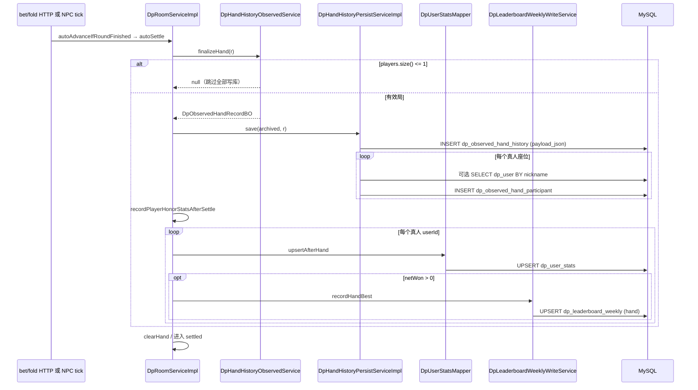

# DB I/O 审计 — 牌谱、局内聊、周榜、曲库、大厅对齐、敏感词（Part Misc）

> **文档性质**：只读 `src/main/java`（main）源码整理；**禁止** git commit / push；**不**改业务代码。  
> **审计日**：2026-05-22 代码树。  
> **优化目标**：对局进行中体感卡顿 — 重点 **结算链路上同步写库堆叠**，而非大厅列表压测。  
> **交叉引用**：对局/大厅触发语义见 `docs/refactor/room-mutation-side-effects.md`；汇总 Agent 合并入 `docs/refactor/db-io-audit.md`。

---

## 变更说明

| 项 | 内容 |
|----|------|
| 新增 | `docs/refactor/db-io-audit-part-misc.md`（本文件） |
| 修改代码 | 无 |

---

## 建议档位（全文统一）

| 档位 | 含义 |
|------|------|
| **S** | 必须同步：不做会错局、丢数据、强一致产品要求 |
| **A** | 建议同步：默认保持，优化收益小 |
| **B** | 可异步/批量：延迟约 1～30s 或合并写可接受 |
| **C** | 仅定时/摘房/低频：已有或应改为 scheduler 一次 |
| **D** | 可只 Redis / 可砍双写：读侧已有缓存，写侧可减负 |

---

## 1. 一手结算：写库堆叠（核心）

### 1.1 触发链与线程

| 环节 | 代码位置 | 持锁? | 说明 |
|------|----------|-------|------|
| 进入结算 | `advanceStage` → river → `autoSettle` | **否** | `bet` / `fold` 末尾 `autoAdvanceIfRoundFinished` 同步调用；**未** `synchronized(r)` |
| 主路径 | `autoSettleNormalPotShowdownPath` | 否 | 边池分配 → `finalizeHand` → `save` → `recordPlayerHonorStatsAfterSettle` |
| 零底池捷径 | `autoSettleZeroPotAndEnterSettledShortcut` | 否 | 无 `recordPlayerHonorStatsAfterSettle`；全员 `upsertAfterHand(0,0,0,0)` 循环 |
| 不落库守卫 | `DpHandHistoryObservedServiceImpl.finalizeHand` | — | `room.getPlayers().size() <= 1` → **null**，后续 **零次** 牌谱/统计写库 |

**阻塞结论**：牌谱 `save`、生涯 `upsertAfterHand`、周榜 `upsertBestHand` 均在 **触发结算的同一线程**（常见为 `POST /dpRoom/bet|fold` 或 1s tick 内 NPC 行动链）上 **同步** 执行；异常仅打日志，不中断对局，但 **占用连接池与 CPU（JSON 序列化）**。

### 1.2 单次结算 SQL 往返估算（`archived != null`）

设桌上真人玩家数为 **H**（非 `DpNpcEngine.isBotPlayer`），`room.getPlayers()` 规模为 **P**（含 Bot）。

| 序号 | 操作 | 表 / Mapper | 次数（典型） | 备注 |
|------|------|-------------|--------------|------|
| ① | `INSERT` 主表 + JSON | `dp_observed_hand_history` / `DpObservedHandHistoryMapper.insert` | **1** | `payloadMapper.writeValueAsString` 后写入 `payload_json` |
| ② | `SELECT` 昵称补 `user_id` | `dp_user` / `DpUserMapper.selectByNickname` | **0～H** | 仅 `DpPlayer.dpUserId == null` 的真人 |
| ③ | `INSERT` 参与者 | `dp_observed_hand_participant` / `DpObservedHandParticipantMapper.insert` | **H**（逐条） | 跳过 Bot；失败单条 warn |
| ④ | `INSERT … ON DUPLICATE KEY UPDATE` | `dp_user_stats` / `upsertAfterHand` | **H** | 主路径在 `recordPlayerHonorStatsAfterSettle`；零底池在 shortcut 内联循环 |
| ⑤ | 周榜单手 | `dp_leaderboard_weekly` / `upsertBestHand` | **0～H** | 仅 `handMultiplier.signum() > 0`（净赢 > 0） |

**主路径合计（6 人桌、4 真人、1 人净赢）**：约 **1 + 0～4 + 4 + 4 + 1 = 10～14** 次 DB 往返（未计连接池排队）。

**零底池捷径**：无 ⑤；④ 对 **所有** 有 `dpUserId` 的玩家各 1 次（含 Bot 跳过逻辑一致）。

**离座/退房（非每手，但同属对局写库）**：`settleAndClearCarryInOnLeaveSeatLocked` → `tryUpdateLargestRoomNet`（1）+ `recordRoomBest` → `upsertBestRoom`（1）；须在 `synchronized(r)` 内由 `exitRoom` 等路径调用。

### 1.3 结算写库时序（Mermaid）

### 1.4 P0 合并写候选（仅建议，不实现）

| 候选 | 现况 | 预期收益 |
|------|------|----------|
| 牌谱 + 参与者 **批量/异步** | ①③ 串行 | 结算线程释放最明显 |
| `upsertAfterHand` **按手批量** | ④ 每真人 1 次 | H 次 → 1 次 JDBC batch 或内存队列 flush |
| 周榜写 **并入异步队列** | ⑤ 与读 Redis 已 60s 延迟 | 与策略 A 一致，结算不必等 MySQL 周表 |

---

## 2. 决策矩阵（本 Part 范围）

| 业务行为 | DB / 方法 | 热路径? | 影响索引/大厅? | 建议 | 理由 |
|----------|-----------|---------|----------------|------|------|
| 每手结算落牌谱 | `DpHandHistoryPersistServiceImpl.save` → `INSERT` history + participants | **是**（`autoSettle` 同步） | 否 | **B** | 大 JSON + 多次 INSERT；复盘可接受秒级延迟；失败已吞异常 |
| 牌谱 `selectByNickname` 补 user_id | `DpUserMapper.selectByNickname`（save 内） | 是（结算内） | 否 | **B** | 可结算前内存带 `dpUserId` 或异步补全，减少 0～H 次读 |
| 每手生涯统计 | `dpUserStatsMapper.upsertAfterHand` × H | **是** | 否 | **B** | 荣誉/局数非当局强一致；与周榜读延迟一致 |
| 每手周榜单手 | `DpLeaderboardWeeklyWriteService.recordHandBest` | **是** | 否 | **B** | 产品已「读 Redis、约 1 分钟更新」；写 MySQL 不必堵结算 |
| 离座/退房周榜单房 | `recordRoomBest` + `tryUpdateLargestRoomNet` | 是（`synchronized(r)` 内） | 否 | **B** | 离座频率低；周榜展示仍延迟 ≤ sync 间隔 |
| 摘房刷局内聊 | `DpRoomChatPersistenceService.flushRoomToDatabase` → `insertBatch` | **否**（摘 `roomMap` 后） | 否（摘房删大厅在 part-room） | **C** | 仅 `DpRoomLobbySync.finalizeHallAfterRoomRemoved`；批量合理 |
| 周榜 MySQL→Redis | `DpLeaderboardWeeklyRedisSyncScheduler` + `selectAllForWeek` | 否（定时） | 否 | **C** | 策略 A 设计；默认 60s `fixedDelay` |
| 周榜 API 读 | `DpLeaderboardWeeklyReadService` → Redis ZSET | 否 | 否 | **D**（读已 Redis） | 不应直查 MySQL 拼榜（现网遵守） |
| 曲库列表 | `DpMusicServiceImpl.listEnabled` → Redis miss → `listEnabled()` SQL | 否 | 否 | **D** | TTL 300s；上传 `evictMusicList`；与对局无关 |
| 大厅公开房分页 | `DpRoomHallServiceImpl.getPublicRoomsPage` / `queryPublicRoomsFromDb` | 否 | 读摘要 | **D** | rev 缓存 120s；miss 才 DB |
| 大厅筛选分页 | `executeFilteredLobbyPageQuery` + MP `selectPage` | 否 | 读摘要 | **D** | 键 `lobbyQuery:data:{rev}:{hash}` |
| 幽灵房对齐 | `reconcileLobbyWithRuntimeRoomIds` → `selectActiveLobbyRoomIds` + 逐条 `delete` | 否（定时） | 删幽灵行 | **C** | 默认每分钟全表 **活跃** room_id；多实例 **禁止开**（见 §6） |
| 敏感词 | `DpSensitiveWordServiceImpl` → `SensitiveWordBs` 内存 DFA | 否（CPU） | 否 | **—** | **零 DB**；聊天/昵称/快照 mask |

**【您的决定】** 列：汇总主文档 `db-io-audit.md` 中统一留空供勾选。

---

## 3. 分项深审

### 3.1 `DpHandHistoryPersistServiceImpl.save`

| 维度 | 结论 |
|------|------|
| **触发点** | 仅 `DpRoomServiceImpl`：`autoSettleNormalPotShowdownPath`（约 3094 行）、`autoSettleZeroPotAndEnterSettledShortcut`（约 2773 行）；**每手最多 1 次**（`finalizeHand != null`） |
| **payload 结构** | `Payload`：seatsAtStart、boardsByStreet、actions、potsBeforeSettlement、holeCardsAtEnd、netChipsChange → `payload_json`（`V1__init_schema.sql` JSON 列） |
| **体积粗算** | 短局（少次加注）：约 **3～15 KB**；6 人长局、多街多次 raise/all-in：**30～80 KB** 常见；极端可 **>100 KB**（actions 数组主导） |
| **是否阻塞主链** | **是** — 同步 `save`；在 `bet`/`fold` 请求线程或 tick 驱动链上执行；**无** `@Async` / 队列 |
| **建议** | **B（异步或摘盘后批量）** — 丢失影响复盘与 `listForUserId`，**不影响**当局筹码；与 `docs/business-flow/audit-agent-04-gameplay-npc-history-aux.md` §2.1 一致 |

**读路径（非结算）**：`DpHandHistoryServiceImpl` / `DpHandHistoryQueryMapper` — PageHelper 分页；**不在**对局热路径。

---

### 3.2 `DpRoomChatPersistenceService.flushRoomToDatabase`

| 维度 | 结论 |
|------|------|
| **是否仅摘房** | **是** — 唯一调用：`DpRoomLobbySync.finalizeHallAfterRoomRemoved` → `roomMap` 移除后的收尾 |
| **实现** | `RoomChatBuffer.drain(roomId)` → `insertBatch` 一条 SQL 多行；`@Transactional` |
| **是否合理** | **合理（C）** — 局内发言走内存 + WS；避免每句 INSERT；摘房时一次落库 |
| **风险** | 进程崩溃未摘房 → buffer 丢失（产品可接受则保持） |

---

### 3.3 周榜 `DpLeaderboardWeeklyWriteService` vs Redis 读延迟

| 维度 | 结论 |
|------|------|
| **写** | 结算：`recordHandBest`（`recordPlayerHonorStatsAfterSettle`）；离座：`recordRoomBest`（`settleAndClearCarryInOnLeaveSeatLocked`）→ **仅 MySQL** `upsertBestHand` / `upsertBestRoom`（GREATEST） |
| **读** | `DpLeaderboardWeeklyReadService` — **只读 Redis** ZSET |
| **同步** | `DpLeaderboardWeeklyRedisSyncScheduler` 默认 **60s** `rebuildCurrentWeekFromMysql`（`selectAllForWeek` 全量） |
| **一致性** | **有意最终一致**：写库即时、榜展示 ≤约 1 分钟滞后；与 `docs/refactor/weekly-leaderboard-plan.md` §0 策略 **A** 一致 |
| **建议** | 写路径 **B** — 结算线程不必等待周表 UPSERT；读侧已容忍延迟 |
| **生涯并行** | `dp_user_stats.largest_pot_won` / `largest_room_net` 仍同步维护（与周榜独立） |

---

### 3.4 `dp_user_stats.upsertAfterHand`（每手多次）

| 维度 | 结论 |
|------|------|
| **调用** | 主路径：`recordPlayerHonorStatsAfterSettle` — **每名真人 1 次**（注释「每人仅一条 upsert」指逻辑合并增量，非 SQL 合并） |
| **零底池** | shortcut 内对每名有 `dpUserId` 玩家 **1 次**（全 0 增量，仅 `total_hands_played +1`） |
| **SQL** | 单条 `INSERT … ON DUPLICATE KEY UPDATE`（`DpUserStatsMapper` 注解） |
| **建议档位** | **B** — 与牌谱、周榜同属「结算堆叠」；可合并为批量或异步 flush |
| **离座** | `tryUpdateLargestRoomNet` — 低频，可 **A** 或随 B 队列 |

---

### 3.5 曲库 Redis + 大厅读路径 Redis miss

**曲库**（`music/**`）

| 项 | 值 |
|----|-----|
| 键 | `mgdemo:cache:dpMusic:listEnabled` |
| TTL | `mgdemoplus.cache.music-list-ttl-seconds` 默认 **300s** |
| 读 | `GET /dpMusic/list` → `DpRedisListCacheServiceImpl.getMusicList` → miss 则 `dpMusicTrackMapper.listEnabled()` |
| 写 | `insert` 成功后 `evictMusicList()` |
| 对局 | BGM 走 WS `roomMusicSync`，**不**每手打 DB |
| 建议 | **D** — 读已缓存；优化优先级低 |

**大厅读**（`DpRoomHallServiceImpl`，本 Part 仅记读路径；写 upsert 在 part-room）

| API | miss 时 DB |
|-----|------------|
| `getPublicRoomsPage` | `PageHelper` + `selectActiveRoomSummaries` |
| `queryPublicRoomsFromDb` | `DpRoomLobbyMpMapper.selectPage` 带筛选 |
| 缓存 | `REV_KEY` + `data:{rev}:{page}:{size}` 或 `lobbyQuery:data:{rev}:{hash}`，TTL 默认 **120s** |
| 建议 | **D** — 对局进行中瓶颈不在此；rev bump 在 upsert/delete 时（part-room 审计） |

---

### 3.6 `DpRoomLobbyReconcileScheduler`

| 项 | 值 |
|----|-----|
| 开关 | `mgdemoplus.dp-lobby-reconcile-enabled` 默认 **true** |
| 间隔 | `mgdemoplus.dp-lobby-reconcile-ms` 默认 **60000**；`ApplicationRunner` 启动立刻 1 次 |
| SQL | `selectActiveLobbyRoomIds()` — **全表活跃** `room_status=0`；内存无则 `deleteRoomSummaryByRoomId` |
| 建议档位 | **C** — 不必更勤；幽灵房可接受分钟级 |
| **多实例** | 类注释：**各节点 `roomMap` 不一致，勿开启**（或需分布式房间注册后再对齐）；否则 A 节点可能删掉 B 节点仍在玩的房的 lobby 行 |

---

### 3.7 `moderation/**`

| 项 | 结论 |
|----|------|
| 实现 | `houbb/sensitive-word` → `SensitiveWordBs` Bean（`DpSensitiveWordConfig`） |
| 调用 | 注册/改昵称 `containsSensitive`；WS 聊天 / 房间快照 `maskForChat` |
| DB | **无** |
| 建议 | 无需 DB 优化项；CPU 级过滤 |

---

## 4. 疑似浪费（Misc 视角，结算优先）

| # | 场景 | 现况 | 若优化可省 |
|---|------|------|------------|
| 1 | River 一手结算（4 真人） | 同步 `save` + 4× `upsertAfterHand` + 至多 4× 周榜 UPSERT | **10+ 次** 往返压到 1～2 次（异步批处理） |
| 2 | 参与者 `selectByNickname` | 结算内补 user_id | 0～H 次 **SELECT** |
| 3 | 周榜写堵在结算线程 | `recordHandBest` 同步 | 每净赢玩家 1 次 UPSERT（可队列） |
| 4 | 牌谱 JSON 同步序列化 | `writeValueAsString` 在请求线程 | CPU 峰值（改异步拷贝 BO） |
| 5 | 零底池仍全员 `upsertAfterHand` | 有效局但无底池 | H 次 UPSERT（业务要计局数则保留，可 BATCH） |
| 6 | Reconcile 每分钟扫全表 id | 活跃房多时 | 1 SELECT + N DELETE（**C**，多实例关） |
| 7 | 曲库/大厅读 | 已 Redis | 仅 miss — **非对局卡顿主因** |

---

## 5. 附录：Mapper / 表清单（本 Part）

| 包 | 表 / 存储 | 写 | 读（热路径外） |
|----|-----------|-----|----------------|
| `history/**` | `dp_observed_hand_history`, `dp_observed_hand_participant` | 结算 `save` | REST 分页/详情 |
| `roomchat/**` | `dp_room_chat_message` | 摘房 `insertBatch` | — |
| `leaderboard/**` | `dp_leaderboard_weekly` | 结算/离座 UPSERT | Redis（API） |
| `leaderboard/**` | Redis ZSET `lb:w:{date}:hand\|room` | Scheduler 重建 | `DpLeaderboardWeeklyReadService` |
| `music/**` | `dp_music_track` | 上传 insert | `listEnabled` + Redis |
| `lobby`（Scheduler） | `dp_room_lobby` | reconcile **delete** | `selectActiveLobbyRoomIds` |
| `moderation/**` | — | — | — |

---

## 6. 给汇总 Agent / 负责人的一句话

- **对局卡顿（Misc 贡献）**：一手有效结算在 HTTP/tick 线程上 **串联** 牌谱 1+N INSERT、生涯 H 次 UPSERT、周榜至多 H 次 UPSERT；建议优先 **B：牌谱异步 + 统计/周榜合并或队列**。  
- **已合理**：局内聊 **摘房批量**、周榜 **读 Redis + 60s 刷**、曲库/大厅 **读缓存**。  
- **配置注意**：多实例部署 **关闭** `dp-lobby-reconcile-enabled`。

---

## 必读源码路径

- `room/impl/DpRoomServiceImpl.java` — `autoSettle*`、`recordPlayerHonorStatsAfterSettle`、`settleAndClearCarryInOnLeaveSeatLocked`
- `history/impl/DpHandHistoryPersistServiceImpl.java`、`DpHandHistoryObservedServiceImpl.java`
- `room/support/DpRoomLobbySync.java`、`roomchat/DpRoomChatPersistenceService.java`
- `leaderboard/impl/DpLeaderboardWeeklyWriteService.java`、`DpLeaderboardWeeklyRedisSyncScheduler.java`
- `lobby/DpRoomLobbyReconcileScheduler.java`、`lobby/impl/DpRoomHallServiceImpl.java`
- `music/cache/impl/DpRedisListCacheServiceImpl.java`
- `user/mapper/DpUserStatsMapper.java`
- `moderation/impl/DpSensitiveWordServiceImpl.java`
