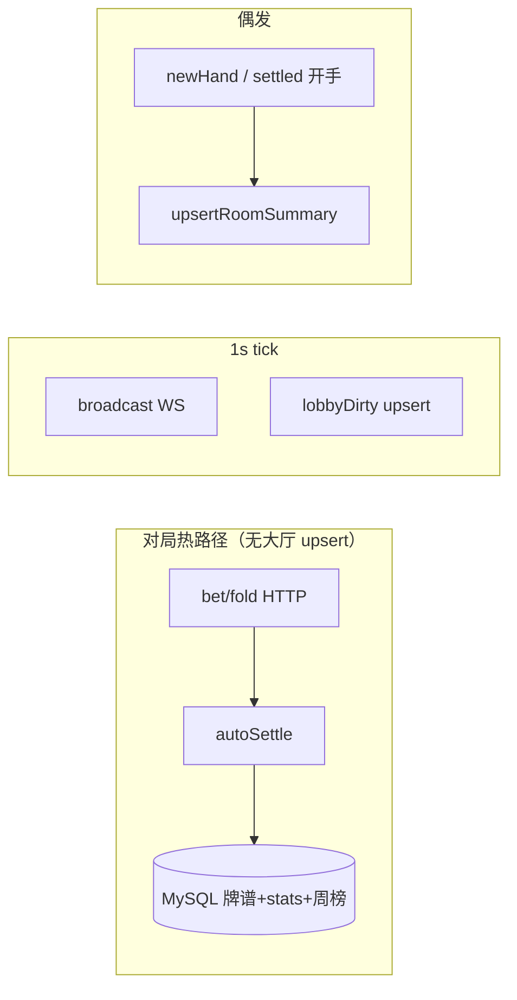

# DB I/O 审计 — 对局与大厅（room / lobby / quickmatch / websocket）

> **只读源码审计**（2026-05-22 代码树），**不修改** `.java`。  
> **优化目标**：**对局进行中**的玩家体验（下注/弃牌/结算/新一手），而非压测大厅 100 人列表。  
> **对照文档**：[room-mutation-side-effects.md](./room-mutation-side-effects.md)（副作用矩阵与 grep 索引）。

---

## 0. 变更说明

| 项 | 内容 |
|----|------|
| 新增 | `docs/refactor/db-io-audit-part-room.md` |
| 范围 | `src/main/java` 内 `room/**`、`lobby/**`、`quickmatch/**`、`websocket/**`（WS 层无直连 DB，推送不另记） |
| 未做 | 代码重构、git commit |

---

## 1. 口径速查（与副作用文档一致）

| 维度 | 口径 |
|------|------|
| **大厅 `player_count`** | 桌上 `!leftThisHand` 席位数；**不含**观众、**不含** `waitNextHand`（`DpRoomHallServiceImpl#toSummary` ~377） |
| **快匹空位** | `maxSeatCount − (桌上非 leftThisHand 且真人未心跳超时 + Bot 在线 + waitNextHand.size())`（`DpQuickMatchRoomSemantics`） |
| **观众** | 不占大厅人数、不占快匹桌席；但占 `waitNextHand` 的移除会影响快匹 |
| **正确范例** | `joinRoom` 已开局观众路径：**注释掉** `refreshQmIndexAfterJoinOutcomeOutsideRoomLock`（~1213：「观众进去又不占位置…刷新个蛋」） |

### 1.1 `DpRoomLobbySync` 方法 → 实际 I/O

| 方法 | 内存 | MySQL | Redis |
|------|------|-------|-------|
| `refreshJoinableQuickMatchIndexRoom` | `JoinableQuickMatchRoomIndex` add/remove | 无 | 无 |
| `syncLobbyForRoomId` | 读 `roomMap` | `upsertRoomSummary`：UPDATE/INSERT `dp_room_lobby` | `bumpRevisionAndCleanupCache` |
| `refreshJoinableQmIndexThenSyncLobby` | 上 + 上 | 上 | 上 |
| `finalizeHallAfterRoomRemoved` | 索引 remove | `flushRoomToDatabase`（`dp_room_chat_message` batch）；`deleteRoomSummary` | 删摘要时 bump |

---

## 2. 锁序标记说明

| 标记 | 含义 |
|------|------|
| **锁内** | 调用点在 `synchronized(room)` / `synchronized(r)` 内 |
| **锁外** | 释放单房监视器之后（推荐放索引/大厅 DB 的位置） |
| **无锁** | 未持 `synchronized(room)`（对局 `bet`/`fold`/`autoSettle` 等） |
| **1s tick** | `DpRoomHeartbeatScheduler` 全局定时器，**不**持 `synchronized(room)` 扫全表 |

---

## 3. `DpRoomServiceImpl` — 穷举表

### 3.1 大厅 / 快匹索引 / 摘房

| # | 业务行为 | 入口（约行） | DB / 方法 | 改大厅摘要 | 改快匹空位 | 锁序 | 建议 | 理由 |
|---|----------|-------------|-----------|------------|------------|------|------|------|
| R01 | 启动重建快匹索引 | `@PostConstruct` ~337 | 仅内存 `rebuildAll` | 否 | 全量重算 | 无锁 | **D** | 启动一次，非对局热路径 |
| R02 | 建房 | `createRoom` ~842-843 | `refreshJoinableQuickMatchIndexRoom` + `syncLobbyForRoomId` | 是（+1 桌席） | 是 | **锁外** | **S** | 新房必须进索引与大厅 |
| R03 | 摘房 | `removeRoom` → `finalizeHallAfterRoomRemovedWithPresenceSnapshot` ~426 | `finalizeHall`：聊天 flush + delete 大厅 | 删行 | 删索引 | 锁内摘 map，**锁外** finalize | **S** | 三件套必须成套 |
| R04 | 移交房主 | `transferOwner` ~466 | `refreshJoinableQmIndexThenSyncLobby` | 是（owner） | 一般否 | 锁内改 owner，**锁外**刷 | **A** | 大厅展示房主 |
| R05 | 心跳易主/空房 | `giveOwner` ~571-574 | 摘房 `finalize` 或 `refreshJoinableQmIndexThenSyncLobby` | 条件 | 条件 | 锁内 mutation，**锁外** | **S/A** | 与 exit 摘房一致 |
| R06 | 踢人（单人） | `kickPlayer` ~584 | `refreshJoinableQmIndexThenSyncLobby` | 是（leftThisHand） | 是（释席） | **锁外**（`kickOne` 内局部 `synchronized` 结算带入） | **A** | 席位数变；但可能连带 `fold`→`autoSettle`（见 §6） |
| R07 | 批量踢人 | `kickPlayersBatch` ~625 | 同上，一次 | 同左 | 同左 | **锁外** | **A** | 已合并为 1 次 upsert，合理 |
| R08 | 普通 join | `joinRoom` ~1213 | **无**（注释掉 refresh） | 否（观众）/ 应刷未刷（上桌 ok） | 否（观众） | 锁内 mutate，**锁外无刷** | **D**（观众）/**A**（上桌缺刷） | **观众范例**；上桌 `ok` 未 sync 大厅/索引（与副作用文档 2.3 一致） |
| R09 | 邀请/跟随观众 | `joinRoomInviteAsSpectator` ~1334 | `refreshJoinableQmIndexThenSyncLobby` | 否（仅观众+wait remove） | 条件（wait remove） | **锁外** | **C/D** | 纯观众无 wait 时双刷浪费；有 wait 时仅索引 **A** |
| R10 | 候补下一局 | `readyNextHand` ~1380 | 仅 `refreshJoinableQuickMatchIndexRoom` | 否 | 是 | **锁外** | **A** | 与注释一致，设计正确 |
| R11 | 取消候补 | `cancelReadyNextHand` ~1409 | 仅 `refreshJoinableQuickMatchIndexRoom` | 否 | 是 | **锁外** | **A** | 同上 |
| R12 | 批量加 Bot 候补 | `addRuleNpcBatch` / `addCustomNpcBatch` ~187,239 | 仅 `refreshJoinableQuickMatchIndexRoom` | 否 | 是 | **无锁**（未 `synchronized(room)`） | **A** | 应刷索引；缺锁是并发风险，非本次改代码 |
| R13 | 退出房间 | `exitRoom` ~1842-1847 | 摘房 `finalize`；否则 `refreshJoinable` + 条件 `syncLobby` | 条件 `lobbyTouch` | 总是 refresh 索引 | 锁内 `exitRoomApply…`，**锁外** | **A/C** | 观众-only 退出仍 `lobbyTouch=true` → 多余 upsert（§5） |
| R14 | 开始游戏 | `startGame` ~2042 | `refreshJoinableQmIndexThenSyncLobby` | 条件（`newHand` 拉人） | 条件 | 锁内 `newHandWithout…`，**锁外** | **A** | 开局常改桌席；摘要无 `isPlaying` 字段时部分字段不变仍 upsert |
| R15 | 新一手（API） | `newHand` ~2174 | `refreshJoinableQmIndexThenSyncLobby` | 常是 | 常是 | `newHandWithout…` **无锁**，再锁外刷 | **A** | wait→桌席时必需 |
| R16 | settled 自动开手 | `checkAndStartNextHandAfterSettleReturning` ~1675 | 不调 DB；由 tick/调用方锁外 `refreshJoinableQmIndexThenSyncLobby` | — | — | 多由 **1s tick 无锁** 调用 | **A** | 开手后由 R15 同类刷新 |
| R17 | 准备超时 prune | `handleReadyTimeout` ~3124 | **无** refresh/sync | 应改未改 | 应改未改 | **无锁**（tick 调） | **A**（补刷） | 桌席→观众应刷；现依赖 tick `lobbyDirty` 延迟 ≤1s |
| R18 | 点准备 | `toggleReady` ~1610 | 无 | 否 | 否 | 锁内 | **D** | 正确 |
| R19 | HTTP 心跳 | `heartbeat` ~3171 | 无 | 否 | 否 | **锁内** | **D** | 正确 |
| R20 | `refreshQmIndexAfterJoinOutcomeOutsideRoomLock` | ~1190 | 索引 + `ok` 时 `syncLobby` | `ok` 时 | 是 | **锁外** | **A** | 被 `joinRoom` 注释掉；仍被快匹 Host 调用 |
| R21 | `syncLobbyForRoomId` 单独 | `createRoom` / `exitRoom` 条件 | `dpRoomHallService.upsertRoomSummary` | 是 | 否 | **锁外** | **A/C** | 见各调用方 |

### 3.2 牌谱 / 统计 / 用户查询

| # | 业务行为 | 入口（约行） | DB / 方法 | 改大厅 | 改快匹 | 锁序 | 建议 | 理由 |
|---|----------|-------------|-----------|--------|--------|------|------|------|
| S01 | 每手结算（正常） | `autoSettleNormalPotShowdownPath` ~3094 | `observedHandPersistService.save`；`recordPlayerHonorStatsAfterSettle` | 否 | 否 | **无锁**（`bet`/`fold` 链） | **B** | 对局热路径；可异步批量落库 |
| S02 | 零底池结算 | `autoSettleZeroPotAndEnterSettledShortcut` ~2773 | `save` + 每人 `dpUserStatsMapper.upsertAfterHand(0…)` | 否 | 否 | **无锁** | **B** | 同上 |
| S03 | 荣誉统计 | `recordPlayerHonorStatsAfterSettle` ~2709 | `upsertAfterHand` × 真人；`recordHandBest` × 赢家 | 否 | 否 | **无锁** | **B** | 每手 2N 次写；可合并或异步 |
| S04 | 离座/退房带入结算 | `settleAndClearCarryInOnLeaveSeatLocked` ~1965 | `tryUpdateLargestRoomNet`；`recordRoomBest` | 否 | 否 | **锁内** | **B** | 非每手，但 kick/exit 可触发 |
| S05 | 进房校验 userId | `resolveAndValidateUserId` ~864 | `dpUserMapper.selectById` | 否 | 否 | 调用方锁内 | **B** | join/候补 热路径只读；可缓存 |
| S06 | 解析观众 userId | `resolveDpUserIdForNickname` ~1085 | `selectByNickname` | 否 | 否 | 无锁 | **B** | 聊天/WS 门禁；非每手 |
| S07 | presence 解析 | `resolvePresenceUserIdPreferHint` ~891 | `selectByNickname` | 否 | 否 | — | **B** | 失败降级 |
| S08 | 牌谱参与者补 id | `DpHandHistoryPersistServiceImpl#insertParticipants` | 缺 id 时 `selectByNickname` | 否 | 否 | save 内 | **B** | 结算路径叠加 |

---

## 4. `DpRoomHeartbeatScheduler`（1s 全局 tick）

| # | 业务行为 | 约行 | DB / 方法 | 改大厅 | 改快匹 | 锁序 | 建议 | 理由 |
|---|----------|------|-----------|--------|--------|------|------|------|
| H01 | 踢断线桌席 | `tickEvictStaleSeatedPlayers` ~87 | 无直连；`giveOwner` 链可能 R05 | 条件 | 条件 | **无锁** 改 `players` | **S**（后续刷） | 必须 exit/易主 |
| H02 | 踢超时观众 | `tickEvictStaleSpectators` ~116 | 调 `exitRoom` → R13 | 常多余 sync | 索引 refresh | **无锁** | **C** | 同「仅观众退出」浪费 |
| H03 | 空房摘除 | `removeDesertedRoom` ~74 | `removeRoom` → finalize | 删 | 删 | **无锁** | **S** | |
| H04 | settled 齐人开手 | `tickSettledCheckAndStartIfReady` ~199 | `refreshJoinableQmIndexThenSyncLobby` | 常是 | 常是 | **无锁** | **A** | 每秒最多 1 次/房，开手时合理 |
| H05 | 准备超时 | `maybeInvokeReadyTimeout` ~220 | `handleReadyTimeout`（无刷） | 延迟 | 延迟 | **无锁** | **A** | 依赖 H06 补救 |
| H06 | lobbyDirty 刷大厅 | `broadcastRoomAndMaybeRefreshLobby` ~231 | `refreshJoinableQmIndexThenSyncLobby` | 是 | 是 | **无锁** | **A/C** | 踢人后必需；与 H02 观众链叠加时可能重复 upsert |
| H07 | WS 广播 | `broadcastIfSubscribed` ~229 | 无 DB | 否 | 否 | **无锁** | **D** | 内存推送 |

**对局进行中频率**：每房 **≥1 次/秒** `broadcastIfSubscribed`（无 DB）；DB 仅在 H04/H06 条件触发。

---

## 5. `DpRoomQuickMatchBridge`

| # | 业务行为 | 约行 | DB / 方法 | 改大厅 | 改快匹 | 锁序 | 建议 | 理由 |
|---|----------|------|-----------|--------|--------|------|------|------|
| Q01 | 已在房快匹签到 | `quickMatchJoinAndReady` ~116 | `refreshJoinableQmIndexThenSyncLobby` | upsert | 索引 | `synchronized(existing)` 后**锁外** | **C** | 仅改 ready 时也 upsert |
| Q02 | 扫房进房成功 | ~159-166 | `refreshQmIndexAfterJoinOutcomeOutsideRoomLock` **再** `refreshJoinableQmIndexThenSyncLobby` | 双次 upsert（`ok`） | 双次索引 | 锁内 join，**锁外** | **C** | **重复刷**（§7 #2） |
| Q03 | 入队/取消/推送 | `quickMatchJoinQueueOrImmediate` 等 | 无房间 DB | 否 | 否 | QM 队列锁 | **D** | |
| Q04 | 配对 flush | `DpRoomQuickMatchPairingHost#flush` → `quickMatchJoinAndReady` | 同 Q02 | 同左 | 同左 | — | **C** | 配对成功路径重复 |

---

## 6. `websocket/**`

| 组件 | DB |
|------|-----|
| `DpGameRoomPushService` | 无；`broadcastIfSubscribed` 读内存快照 |
| `DpQuickMatchPushService` | 无 |

对局 WS **不触发** `upsertRoomSummary`；大厅对齐见 `DpRoomLobbyReconcileScheduler`（定时 `reconcileLobbyWithRuntimeRoomIds`，非对局热路径，**C** 运维级）。

---

## 7. 「疑似浪费」TOP 12（对局体验优先）

| 排名 | 场景 | 现网行为 | 若优化可省 SQL（估算/房/次） | 建议 | 说明 |
|------|------|----------|------------------------------|------|------|
| **1** | **`bet`/`fold` → `autoSettle`** | 同步 `save` + 参与者 + `upsertAfterHand`×真人 + 周榜 | **~3 + 2×真人**（如 6 人 ≈ **15** 次写） | **B** | **最大对局热路径**；应异步队列，结算 UI 仍靠内存+WS |
| **2** | **快匹进房成功** Q02 | 连续 `refreshQmIndexAfterJoin` + `refreshJoinableQmIndexThenSyncLobby` | **1×** `UPDATE/INSERT dp_room_lobby` + **1×** Redis bump | **C** | 第二次 wholly redundant |
| **3** | **`joinRoomInvite` 纯观众**（无 wait） | 双刷索引+大厅 | **1×** upsert + bump（索引刷 2 次内存） | **C/D** | 对照 `joinRoom` 范例应 **仅索引或都不刷** |
| **4** | **进行中仅观众 `exitRoom`** | `lobbyTouch=true` → 必 `syncLobby`；索引仍 refresh | **1×** upsert（摘要不变） | **C** | `player_count` 不含观众；wait remove 时索引 **A**、大厅 **D** |
| **5** | **踢人且 `fold` 触发结算** R06 | 同 #1 + 双刷大厅 | 结算写 + **1×** upsert | **B** + **A** | 踢人必要刷索引/大厅；结算可拆异步 |
| **6** | **`newHand` 后席位数不变** | 仍 `refreshJoinableQmIndexThenSyncLobby` | **1×** upsert | **C** | 可脏检查 `toSummary` 前后 fingerprint |
| **7** | **`startGame` 仅改 stage** | 全量 upsert | **1×** upsert | **C** | 摘要 DTO 无 `isPlaying`，部分字段冗余 |
| **8** | **Q01 已在房仅 toggle ready** | 双刷 | **1×** upsert | **C** | |
| **9** | **`handleReadyTimeout` 不刷** | 0 直至下一秒 H06 | 0（延迟） | **A** 补刷 | 非浪费；**一致性债**，tick 兜底 |
| **10** | **1s tick 观众踢出 + H06** | exit + lobbyDirty 双刷 | 同 #4 + **1×** upsert | **C** | 与 HTTP exit 同根 |
| **11** | **`resolveAndValidateUserId` 每次 join** | `selectById` | **1×** 读 | **B** | 可 JWT 内嵌 uid 信任链减读 |
| **12** | **`joinRoom` 上桌 `ok` 不刷** | 0 | **−1×**（应刷未刷） | **A** 修缺口 | 非浪费；快匹**少**显空位（副作用 2.3） |

---

## 8. 用户样例对照

### 8.1 `joinRoom` 观众路径（正确范例）

```1213:1215:src/main/java/com/example/mgdemoplus/room/impl/DpRoomServiceImpl.java
        //观众进去又不占位置，房间大厅又不显示观众人数，刷新个蛋
        // refreshQmIndexAfterJoinOutcomeOutsideRoomLock(roomId, outcome);
        return outcome;
```

| 检查项 | 结论 |
|--------|------|
| `upsertRoomSummary` | **不应**（现网：不调） ✓ |
| `refreshJoinableQmIndexThenSyncLobby` | **不应**（现网：不调） ✓ |
| `refreshJoinableQuickMatchIndexRoom`  alone | 理想：**不必**（空位公式不变）；产品若要求「观众也占对外展示」才刷索引 |
| 建议档位 | **D**（维持） |

**已开局上桌**（`joinRoom` 未开局分支 `ok`）：应 **A** 刷索引+大厅，现网**漏刷**（与副作用文档一致）。

### 8.2 `kickPlayer` / `kickPlayersBatch`

| 检查项 | `kickPlayer` | `kickPlayersBatch` |
|--------|--------------|-------------------|
| 行为 | `leftThisHand=true` + 进观众；可能 `fold`→`autoSettle` | 同，多次 kick 后 **1 次** sync |
| 大厅 `player_count` | **减少**（非 left 席减少） | 同 |
| 快匹空位 | **增加**（`leftThisHand` 不计入 `seatedNonOfflineCount`） | 同 |
| 现网刷新 | `refreshJoinableQmIndexThenSyncLobby` **锁外 1 次** | 同 ✓ |
| 是否过度 | **索引+大厅：不过度**；**过度在** fold 连带 **S01 结算写**（#5） | 批量已合并 upsert ✓ |
| 建议 | 大厅/索引 **A**；结算 **B** 异步 | |

---

## 9. 对局进行中热路径小结



| 路径 | 典型 DB | 档位 |
|------|---------|------|
| 下注/弃牌/摊牌 | 牌谱 insert + stats upsert × N | **B**（异步） |
| 仅阶段推进 | 无 | **D** |
| HTTP heartbeat | 无 | **D** |
| 新一手 / 开局 | upsert 大厅 + 索引 | **A** |
| 观众 join（`joinRoom`） | 无 | **D** ✓ |

---

## 10. 建议档位图例

| 档位 | 含义 |
|------|------|
| **S** | 必须同步（摘房三件套、建房、易主/踢人释席等） |
| **A** | 建议同步（口径真变：桌席数、wait、房主） |
| **B** | 可异步批量（牌谱、生涯统计、周榜、带入结算） |
| **C** | 仅定时 / 脏检查 / 合并调用（去重 upsert、指纹未变跳过） |
| **D** | 可不写 DB（观众不占位、ready 位、纯 WS） |

---

## 11. 与 `room-mutation-side-effects.md` 交叉索引

| 副作用文档条目 | 本审计结论 |
|----------------|------------|
| 2.3 观众 join 不刷 | §8.1 **D**，范例成立 |
| 2.3 候补只刷索引 | R10 **A**，成立 |
| 2.3 exit `lobbyTouch` | R13 / #4 **C** |
| 2.3 `handleReadyTimeout` 未刷 | R17 / #9 **A** 待补 |
| 2.3 `joinRoomInvite` vs `joinRoom` | R09 / #3 **C** |
| 附录 grep 行号 | 以本文件 §3–5 为准（行号 ±少量漂移可接受） |

---

## 12. 下阶段（只规划，不写代码）

1. **对局结算旁路化（B）**：`observedHandPersistService.save` + `recordPlayerHonorStatsAfterSettle` 入队，HTTP 只改内存。  
2. **合并刷新（C）**：`afterRoomMutation(roomId, INDEX\|LOBBY)` + summary fingerprint；删掉 Q02 双刷。  
3. **对齐范例（C/D）**：`joinRoomInvite` 观众路径与 `joinRoom` 同策略；`exitRoom` 观众-only 时 `lobbyTouch=false`。  
4. **补一致性（A）**：`handleReadyTimeout` 后立即 index（+ 条件 lobby），不依赖 tick 碰运气。

---

*审计 Agent：DB I/O — 对局与大厅 · 只读 main · 2026-05-22*
