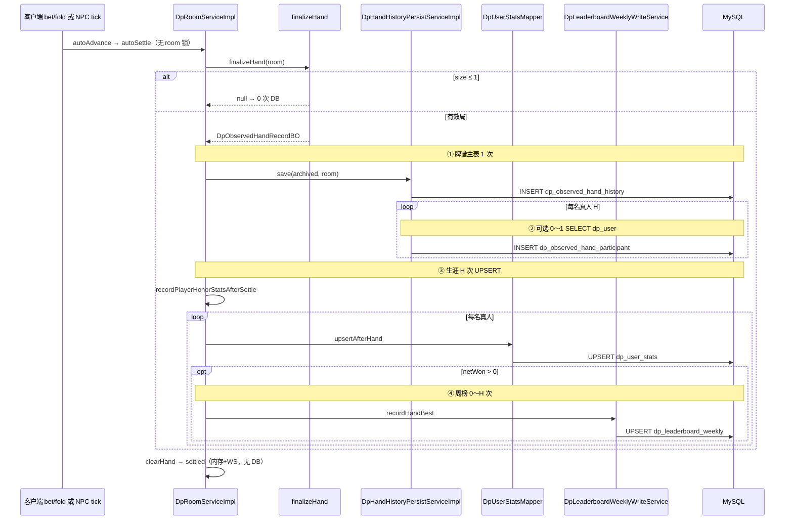

# DB I/O 审计 — 决策主文档

> **性质**：三份附录的汇总与决策入口；**只读审计结论**，不含实现。  
> **附录**：[对局与大厅](./db-io-audit-part-room.md) · [社交与用户](./db-io-audit-part-social.md) · [牌谱/周榜/大厅读等](./db-io-audit-part-misc.md)  
> **交叉**：[room-mutation-side-effects.md](./room-mutation-side-effects.md)  
> **审计日**：2026-05-22 代码树 · **禁止** git commit / 改 `.java` / Flyway

---

## 变更说明

| 项 | 内容 |
|----|------|
| **新增** | `docs/refactor/db-io-audit.md`（本主文档） |
| **合并来源** | `db-io-audit-part-room.md`、`db-io-audit-part-social.md`、`db-io-audit-part-misc.md` |
| **未做** | 代码重构、数据库迁移、git commit |
| **下一步** | 负责人在 §2「【您的决定】」列勾选后，再开**实现 Agent**（按 §5 P0 包拆任务） |

---

## 1. 摘要（负责人 1 页）

### 1.1 对局卡顿主要来自哪几类 DB 写

| 类别 | 典型触发 | 每手/每次量级（6 人桌、4 真人） | 为何卡 |
|------|----------|----------------------------------|--------|
| **① 结算堆叠（最大）** | `bet` / `fold` → `autoSettle`（**无** `synchronized(room)`） | 牌谱 1 + 参与者 H + 生涯 UPSERT × H + 周榜 UPSERT × 净赢者 ≈ **10～15** 次往返 + 大 JSON 序列化 | 全在 **同一 HTTP/tick 线程** 同步完成 |
| **② 大厅/快匹多余 upsert** | 快匹进房双刷、邀请观众、仅观众退房、`toggleReady` 等 | 每次 **1×** `dp_room_lobby` + Redis rev bump（有时 **2×**） | 摘要字段未变仍写；与对局筹码无关但占连接池 |
| **③ 进房身份读** | `join` / `resolveAndValidateUserId` | **1×** `selectById` 或 `selectByNickname` | 热路径只读，可缓存 |
| **④ 社交读放大（局外）** | 每条带 JWT 的 HTTP + SSE `buildForUser` | `selectByNickname` + O(好友数) 未读 COUNT | **不**堵 `bet`，但全局池竞争 |

**不在对局热路径上的合理设计**：局内聊 **摘房** `insertBatch`；周榜 API **只读 Redis**（写 MySQL 可滞后）；曲库/大厅列表 **Redis miss 才查库**；敏感词 **零 DB**。

### 1.2 已做对的例子（应对齐）

| 范例 | 行为 | 结论 |
|------|------|------|
| **观众 `joinRoom`** | 已开局观众路径 **注释掉** `refreshQmIndexAfterJoinOutcomeOutsideRoomLock`（不占席、大厅 `player_count` 不含观众） | **维持（D）** — 产品口径正确 |
| **候补 `readyNextHand`** | 只 `refreshJoinableQuickMatchIndexRoom`，**不** `syncLobby` | **维持（A）** — 快匹空位变、大厅人数不变 |
| **HTTP `heartbeat` / `toggleReady`** | 无 DB | **维持（D）** |
| **局内 WS 推送** | `DpGameRoomPushService` 无直连 DB | **维持（D）** |

### 1.3 负责人结论（一句话）

> **优先动刀**：一手结算上的 **牌谱 + `dp_user_stats` + 周榜 MySQL 写**（改异步/批量）；其次 **合并/跳过** 不变的大厅 upsert；社交侧 **身份与未读汇总缓存** 排后。  
> **勿动**：建房/摘房三件套、踢人释席后索引+大厅同步、私信 insert 同步落库。

---

## 2. 决策矩阵（合并去重，按优先级排序）

图例：**热路径** = 对局进行中 `bet`/`fold`/结算/NPC tick 同步线程。**建议档位**：S 必须同步 · A 建议同步 · B 可异步/批量 · C 脏检查/合并/降频 · D 可不写 DB。

| 优先级 | 业务场景 | DB 操作 | 热路径? | 影响索引/大厅? | 建议档位 | 理由（大白话） | 【您的决定】 |
|:------:|----------|---------|:-------:|:--------------:|:--------:|----------------|-------------|
| **P0** | 每手正常结算 `autoSettle` | `observedHandPersistService.save`（history JSON + 参与者 INSERT） | **是** | 否 | **B** | 复盘晚几秒可接受；别堵下注响应 | |
| **P0** | 同上 · 生涯统计 | `upsertAfterHand` × 真人 H | **是** | 否 | **B** | 荣誉/局数非当局强一致；与周榜读延迟一致 | |
| **P0** | 同上 · 周榜单手 | `recordHandBest` → `dp_leaderboard_weekly` | **是** | 否 | **B** | 榜已 Redis+60s 刷；写表不必等结算线程 | |
| **P0** | 零底池结算捷径 | `save` + 全员 `upsertAfterHand(0…)` | **是** | 否 | **B** | 仍算有效局；可 BATCH，不必逐条堵线程 | |
| **P0** | 踢人且 `fold` 连带结算 | 结算写（上三行）+ `refreshJoinableQmIndexThenSyncLobby` | **是** | **是** | **B** + **A** | 释席必须刷大厅/索引；结算可拆异步 | |
| **P0** | 快匹扫房进房成功 | 连续 `refreshQmIndexAfterJoin` + `refreshJoinableQmIndexThenSyncLobby` | 否* | **是**（双 upsert） | **C** | 第二次 wholly 重复；合并为 1 次 | |
| **P0** | 邀请/跟随 **纯观众**（无 wait） | `refreshJoinableQmIndexThenSyncLobby` | 否* | 可能无变 | **C/D** | 应对齐 `joinRoom` 观众：**不刷或仅索引** | |
| **P0** | 进行中 **仅观众** `exitRoom` | `lobbyTouch=true` → 必 `syncLobby` + 索引 refresh | 否* | **是**（多余 upsert） | **C** | `player_count` 不含观众；wait 移除时只刷索引 | |
| **P0** | 观众 `joinRoom`（已开局） | **无** DB（refresh 已注释） | 否* | 否 | **D** | **范例**；不占位就不该刷 | |
| **P0** | 牌谱 save 内补 `user_id` | `selectByNickname`（0～H 次） | **是** | 否 | **B** | 进房带好 `dpUserId` 可省读 | |
| **P1** | `newHand` / settled 开手后 | `refreshJoinableQmIndexThenSyncLobby` | 偶发 | **是** | **A/C** | 席位数变要刷；不变可用摘要指纹跳过 upsert | |
| **P1** | `startGame` 仅阶段变化 | 全量 `upsertRoomSummary` | 偶发 | **是** | **C** | 摘要 DTO 无 `isPlaying`，常写字段不变 | |
| **P1** | 已在房快匹仅 `toggleReady` | 双刷索引+大厅 | 否 | **是** | **C** | ready 不变快匹空位时可跳过 lobby | |
| **P1** | 准备超时 `handleReadyTimeout` | **当前无** refresh（靠 1s tick） | tick | 延迟 ≤1s | **A** | 桌席→观众应立刻刷索引，别赌 `lobbyDirty` | |
| **P1** | `joinRoom` 上桌成功 `ok` | **漏刷** 大厅/索引 | 否* | **应改未改** | **A** | 非浪费；快匹可能 **少** 显空位（一致性债） | |
| **P1** | 离座/退房带入结算 | `tryUpdateLargestRoomNet` + `recordRoomBest` | 低频 | 否 | **B** | 频率低于每手；可跟结算队列 | |
| **P1** | 建房 `createRoom` | `syncLobby` + 快匹索引 | 否 | **是** | **S** | 新房必须进大厅 | |
| **P1** | 摘房 `removeRoom` / 空房 | `finalizeHall`（聊 flush + delete lobby） | 否 | 删行 | **S** | 三件套成套 | |
| **P1** | 批量/单人踢人（无 fold） | `refreshJoinableQmIndexThenSyncLobby` 1 次 | 否* | **是** | **A** | 席位数变；批量已合并 upsert ✓ | |
| **P1** | 候补 / 取消候补 | 仅 `refreshJoinableQuickMatchIndexRoom` | 否* | 否 | **A** | 与注释一致 ✓ | |
| **P1** | 移交房主 | `refreshJoinableQmIndexThenSyncLobby` | 否* | owner 字段 | **A** | 大厅展示房主 | |
| **P1** | 1s tick `lobbyDirty` | 条件 `refreshJoinableQmIndexThenSyncLobby` | tick | **是** | **A/C** | 踢人后必需；与观众 exit 叠加可能重复 | |
| **P2** | 每 HTTP `requireCurrentUser` | `selectByNickname` | 否 | 否 | **B** | JWT 已有昵称；重复解析占池 | |
| **P2** | 对局 `DpRoomController` 鉴权 | 同上 | 否* | 否 | **B** | 与上合并缓存策略 | |
| **P2** | `join` 校验 `userId` | `selectById` | 否* | 否 | **B** | 可 JWT claim 或本地缓存 | |
| **P2** | 社交写后 `notifyUser` | `buildForUser`：expire + 2 count + list + **F×** unread | 否 | 否 | **B** | 好友多时报文大；合并 SQL/计数器 | |
| **P2** | SSE 30s 心跳过期扫描 | bulk UPDATE + 每被邀请人 `notifyUser` | 否 | 否 | **C** | 无过期行可跳过；降频 | |
| **P2** | 多数 mailbox/friends 读 | `touchExpireRoomInvites` 先 UPDATE | 否 | 否 | **C** | 读路径 WHERE 过滤 + 定时任务 | |
| **P2** | 私信发送 | `insert` + 裁剪 count/delete | 否 | 否 | **A** | 须及时落库；裁剪可后置 | |
| **P2** | 荣誉 `GET /dpUser/stats/{id}` | `selectById` + stats | 否 | 否 | **B** | 局内点头像才拉；短期缓存即可 | |
| **P2** | 大厅列表/筛选 API | Redis miss → `selectPage` | 否 | 读摘要 | **D** | 非对局卡顿主因；已 120s 缓存 | |
| **P2** | 曲库 `listEnabled` | Redis miss → SQL | 否 | 否 | **D** | TTL 300s；与对局无关 | |
| **P2** | 幽灵房对齐 reconcile | 全表活跃 id + 逐条 delete | 否（定时） | 删幽灵行 | **C** | 分钟级可接受；**多实例勿开** | |
| **P2** | 摘房局内聊 flush | `insertBatch` `dp_room_chat_message` | 否 | 否 | **C** | 仅摘房；设计合理 | |
| **P2** | 周榜 MySQL→Redis | `selectAllForWeek` 每 60s | 否 | 否 | **C** | 策略 A；保持 | |
| **P2** | 敏感词 | 内存 DFA | 否 | 否 | **—** | 零 DB | |
| **P2** | 登录会话 | Redis `jti` GET/SET | 每条 HTTP | 否 | **D** | 已合理；勿改 DB | |

\*「否*」= 非 `bet`/结算线程，但仍发生在进房/退房/快匹等与对局并发的请求上。

---

## 3. 疑似浪费 TOP 15（跨章合并，Room 优先）

| 排名 | 场景 | 现网痛点 | 推荐改法一句话 |
|:----:|------|----------|----------------|
| **1** | `bet`/`fold` → `autoSettle` | 同步 save + H×stats + 周榜；6 人≈15 次写 | **结算写全部旁路队列**；HTTP 只改内存+WS |
| **2** | 快匹进房成功双刷 | 两次 `upsertRoomSummary` + 两次索引 | **只保留一次** `afterRoomMutation(INDEX\|LOBBY)` |
| **3** | `joinRoomInvite` 纯观众 | 对标 `joinRoom` 却双刷 | **无 wait 则不 syncLobby**；与观众 join 范例一致 |
| **4** | 仅观众 `exitRoom` | `lobbyTouch=true` 必 upsert | **观众-only 且席位数不变 → `lobbyTouch=false`** |
| **5** | 踢人 + `fold` 结算 | #1 写 + 必要大厅刷 | **大厅/索引保持同步；结算跟 #1 异步** |
| **6** | 牌谱 `save` 同步 JSON | 30～80KB 序列化堵线程 | **`@Async` 或摘盘后批量**；当局不依赖 DB |
| **7** | `upsertAfterHand` 逐人 | H 条独立 UPSERT | **JDBC batch 或按手一条合并增量** |
| **8** | `recordHandBest` 在结算线程 | 净赢者各 1 次周表写 | **并入 #1 队列**；读侧已容忍 60s |
| **9** | 结算内 `selectByNickname` | 0～H 次补 id | **join 时写死 `dpUserId`**，save 不再查 |
| **10** | `newHand` 席位数不变 | 仍全量 upsert | **`toSummary` 指纹未变则跳过 syncLobby** |
| **11** | 1s tick 踢观众 + `lobbyDirty` | 同 #4 可能 **2×** upsert | **exit 路径区分观众；tick 合并脏房刷新** |
| **12** | 已在房快匹仅改 ready | 仍 upsert 大厅 | **仅索引刷新或脏检查** |
| **13** | `joinRoom` 上桌 `ok` 不刷 | 快匹 **少** 显空位（缺口） | **补上与 R20 一致的单次 refresh**（非减写） |
| **14** | 每请求 `selectByNickname` | JWT 后仍查 `dp_user` | **nickname→userId 缓存或 JWT 带 uid** |
| **15** | `buildForUser` N+1 未读 | 好友 F 则 F 次 COUNT | **GROUP BY 一条 SQL 或 Redis 计数器增量** |

---

## 4. 一手结算 DB 往返示意图

**前提**：`finalizeHand != null`（`players.size() > 1`），4 真人、1 人净赢。下图 **次数** 与 [part-misc §1.2](./db-io-audit-part-misc.md) 一致。

### 4.1 往返次数速查（主路径）

| 步骤 | 操作 | 次数 |
|------|------|------|
| ① | `INSERT` 牌谱 + `payload_json` | **1** |
| ② | `SELECT` 补 `user_id`（仅 null 时） | **0～H** |
| ③ | `INSERT` 参与者 | **H** |
| ④ | `UPSERT` `dp_user_stats` | **H** |
| ⑤ | `UPSERT` 周榜单手 | **0～H**（净赢>0） |
| **合计** | 4 真人、1 人净赢 | **约 10～14** |

**零底池**：无 ⑤；④ 仍对全员有 `dpUserId` 各 1 次。  
**离座（非每手）**：+`tryUpdateLargestRoomNet`(1) + `upsertBestRoom`(1)，在 `synchronized(room)` 内。

---

## 5. P0 优化包（勾选【您的决定】后实施）

以下 **5 项相互独立**，可分批 PR；预期收益为 **量级估算**，非压测承诺。

| # | 任务名 | 做什么 | 预期收益 | 风险一句 |
|---|--------|--------|----------|----------|
| **P0-1** | **结算写旁路化** | `save` + `upsertAfterHand` + `recordHandBest` 入内存队列/异步 worker；`bet`/`fold` 只更新筹码与 WS | 热路径 **10+ SQL → 0**；下注延迟最明显 | 进程崩溃可能丢最近 N 手复盘；需监控队列深度与失败重试 |
| **P0-2** | **大厅刷新去重** | 统一 `afterRoomMutation`；删快匹双刷；`toSummary` 指纹未变跳过 `syncLobby` | 进房/退房/ready 路径 **省 1× upsert/次** | 指纹漏字段会导致大厅展示滞后；需单测覆盖 owner/席位数/wait |
| **P0-3** | **观众路径对齐** | `joinRoomInvite` 无 wait 不刷；`exitRoom` 观众-only `lobbyTouch=false` | 减少 **无意义 lobby 写**；与 `joinRoom` 注释一致 | wait 移除时仍须刷快匹索引；别误伤占席观众 |
| **P0-4** | **准备超时即时刷** | `handleReadyTimeout` 后立即 index（+ 条件 lobby） | 消除 **≤1s** tick 碰运气；快匹空位更准确 | 与 tick `lobbyDirty` 可能短窗口重复；可接受则合并 |
| **P0-5** | **身份解析缓存（可选）** | `nickname→userId` Caffeine/Redis；JWT 可选带 `uid` claim | 降低 **全局** 连接池竞争；对局 join 也受益 | 改昵称须失效缓存；JWT 变更需前后端协调 |

**建议实施顺序**：P0-1 → P0-2 → P0-3 → P0-4 → P0-5（社交 N+1 可另开 P1）。

---

## 6. 明确非目标

| 非目标 | 说明 |
|--------|------|
| **本次不实现任何代码** | 本文档仅决策；实现由后续 Agent/PR 完成 |
| **不改 Flyway / 表结构** | 批量写、异步队列优先 **应用层** 解决 |
| **不重做大厅 Redis 架构** | 读路径已缓存；仅优化 **写侧** 频率与结算堆叠 |
| **不改私信同步 insert** | 产品要求及时；裁剪可异步但 **非 P0** |
| **不强制 JWT 协议变更** | P0-5 为可选项；可仅服务端缓存 |
| **不在此轮开启多实例 reconcile** | 多节点 `roomMap` 不一致时 **关闭** `dp-lobby-reconcile-enabled`（配置项，非代码） |
| **不压测大厅 100 人列表** | 审计目标为 **对局进行中** 体感，非大厅分页 QPS |
| **不处理 `POST /upload` 无 JWT 绑定** | 属安全/产品范畴，非 DB I/O P0 |

---

## 7. 附录索引

| 文档 | 内容 |
|------|------|
| [db-io-audit-part-room.md](./db-io-audit-part-room.md) | `DpRoomServiceImpl` 穷举、tick、快匹桥、TOP 12、观众/踢人对照 |
| [db-io-audit-part-social.md](./db-io-audit-part-social.md) | 好友/私信/SSE/JWT Redis、Mapper 清单、端点 SQL 估算 |
| [db-io-audit-part-misc.md](./db-io-audit-part-misc.md) | 结算堆叠明细、牌谱体积、周榜策略 A、reconcile/曲库 |

### 建议档位图例（全文统一）

| 档位 | 含义 |
|------|------|
| **S** | 必须同步：摘房、建房、丢数据或强一致 |
| **A** | 建议同步：桌席数/房主/wait/踢人释席等口径真变 |
| **B** | 可异步/批量：牌谱、stats、周榜、离座最高净赢 |
| **C** | 脏检查/合并/定时：去重 upsert、reconcile、expire 降频 |
| **D** | 可不写 DB：观众不占位、纯 WS、读侧已有 Redis |

---

## 8. 交付提醒

1. 请在 **§2 决策矩阵** 最后一列填写：`保持` / `改异步` / `删除调用` / `待观察`（可按行或按 P0 包勾选）。  
2. **§5** 中勾选要落地的任务编号后，再开 **实现 Agent**（一项任务一个 PR 更易回滚）。  
3. 实现时仍以 [room-mutation-side-effects.md](./room-mutation-side-effects.md) 为副作用回归清单。

---

*汇总 Agent：DB I/O 审计主文档 · 合并三附录 · 2026-05-22*
