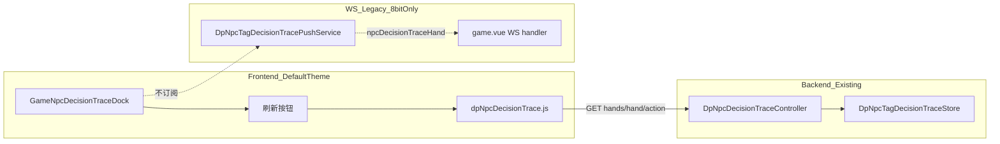

# 默认主题 NPC 决策 Trace — 右侧 Dock 实现计划（Pull-only）

> 状态：**计划文档（PM 已确认，待实现）**  
> 范围：**仅默认主题**（`gameUiTheme !== 'retro8bit'`）；**8bit 主题零改动**。  
> 数据通道：**REST 主动拉取**；**禁止** WebSocket 推送方案；**禁止**将 trace 塞进 `getNowRoom` / room JSON。

---

## 1. 目标与非目标

### 1.1 产品目标

房主在 **默认主题** 对局内，通过 **右侧常驻 dock** 边打边看 TAG NPC（`BOT_TAG_*`）决策 trace（最近最多 **100 手**）：

- dock 常驻于宽屏主布局右侧，不遮挡牌桌核心区域；
- 用户点击 dock 内 **「刷新」** 按钮，主动 REST 拉取最新数据；
- 可选：首次打开 dock（或首次通过密码 gate 后）**自动 load 一次**（仍走 REST，不算 WS）；
- 浏览 hand 列表 → action 列表 → 单条 action 的 **逐步推理 steps** + **翻前 13×13 range matrix**（如适用）；
- 数据 **仅内存**；房间解散后清空；不进入公开房间快照。

### 1.2 技术目标

| 目标 | 说明 |
|------|------|
| Pull-only | 前端仅调用已有 REST；后端 **不新增** WS 消息类型；**不**在 `DpGameRoomPushService` / room broadcast 里带 trace |
| 安全隔离 | REST 均 **房主 + JWT + 实验密码**；trace 永不写入 `DpRoomBO` / `getNowRoom` |
| 默认主题专属 UI | 右侧 dock；中文 UI；与现有牌桌 shell 风格一致 |
| 8bit 隔离 | retro8bit 现有 overlay + WS merge **原样保留**，本计划 **不修改** 任何 8bit 文件 |

### 1.3 非目标

- 不实现 Fish/Maniac/LLM trace
- 不写 DB / Flyway
- 不改造 retro8bit 菜单、overlay、`onNpcDecisionTraceHandPush` 行为
- 不设计、不扩展 WS push / SSE / 实时 action 级推送
- 不把 trace 字段加入 `getNowRoom` 或房间 WS 快照

### 1.4 与总计划的关系

后端采集、内存 store、REST 契约见 [`npc-decision-trace-plan.md`](./npc-decision-trace-plan.md) §2–3.6。  
该总计划 §3.5 / §4.4 的 **WS push 方案对默认主题 dock 作废**；默认主题 **只读 REST**。

---

## 2. 架构（Pull-only）



### 2.1 前端数据流

| 操作 | REST | 说明 |
|------|------|------|
| 刷新 hand 列表 | `GET /dpRoom/npcDecisionTrace/hands?roomId&experimentalPassword` | 主刷新入口 |
| 进入某手 action 列表 | `GET /dpRoom/npcDecisionTrace/hand?roomId&handSeed&experimentalPassword` | summary 不足时补拉 |
| 进入 action 详情 | `GET /dpRoom/npcDecisionTrace/action?roomId&handSeed&actionId&experimentalPassword` | steps + matrix |

REST client 已存在：`front/dp_game/src/utils/dpNpcDecisionTrace.js`（`fetchTraceHands` / `fetchTraceHand` / `fetchTraceAction`）。

密码：复用 `GameDeckPresetPasswordGate.vue` + `dpDeckPresetUnlock.js`（sessionStorage key `dp_deck_preset_unlock_{roomId}`）。

### 2.2 后端约束（本计划不改动）

- **不新增** WS 消息类型；
- **不**在 `DpGameRoomPushService` / `broadcastIfSubscribed` / room JSON 中携带 trace；
- 已有 `DpNpcDecisionTraceController` + `DpNpcDecisionTraceQueryService` **满足 dock 需求**，无需 Backend Agent。

### 2.3 现有 `_ws: npcDecisionTraceHand` 的处理

后端结算后仍可能向房主推送 `_ws: npcDecisionTraceHand`（retro8bit 实现遗留，**本计划不删后端 push 代码**）。

| 主题 | 行为 | 本计划 |
|------|------|--------|
| **默认主题 dock** | **不订阅 WS**；仅 REST + 手动刷新 | **推荐且必须**：dock 数据只来自 `loadTraceHands()` / panel 内 refresh |
| **retro8bit overlay** | `game.vue` 现有 handler merge `traceHands` | **零改动**，可继续收 WS |

**Frontend Agent 任务（默认主题）**：在 `game.vue` 的 `onNpcDecisionTraceHandPush` 入口加门闸 `if (gameUiTheme !== 'retro8bit') return`，避免默认主题无意义 merge；或等价地在 handler 内仅 retro8bit 更新 `traceHands`。dock 侧 **不监听** 该 WS 帧。

---

## 3. 右侧 Dock UI

### 3.1 宽屏（`viewportWidth > 600` 且非 phone layout）

- 挂载点：`game.vue` 布局层，与 `dp-game-layout` 同级或作为 `main` 右侧 sibling（`display: flex` / grid 两列）。
- 结构示意：

```
┌─────────────────────────────────────┬──────────────┐
│  header (top bar)                   │              │
├─────────────────────────────────────┤  Trace Dock  │
│                                     │  [刷新]      │
│         牌桌 main                    │  hand list   │
│                                     │  → actions   │
│                                     │  → detail    │
├─────────────────────────────────────┤              │
│  footer (hero dock)                 │              │
└─────────────────────────────────────┴──────────────┘
```

- 宽度：`min(320px, 28vw)`，可折叠为窄条（仅标题 + 展开钮，**P1**）；P0 常驻展开。
- 样式：复用默认主题 token（`--dp-game-bg`、`--dp-text-primary`、现有 scrollbar）；**不用** CRT / scanline。
- z-index：dock 为布局内嵌，非全屏 overlay；`--dp-z-decision-trace` **仅** 用于 dock 内可能的子 popover（如有）。

### 3.2 窄屏降级（`viewportWidth <= 600` 或 `layoutTier === 'phone'`）

- dock **不**挤占牌桌横向空间；
- 降级为 **底栏入口 + `GameBottomSheet`**（与房主 hub 移动 sheet 同模式）；
- 打开 sheet 后 UI 与宽屏 dock 内容一致（hand / action / detail 三屏状态机）；
- 仍 **仅 REST 刷新**，无 WS。

### 3.3 入口与 Gate

| 项 | 说明 |
|----|------|
| 可见性 | **仅房主** |
| 菜单 | `GameOwnerHubContent.vue` **默认主题** `rootItems` 在 `deck-preset` 后插入 `{ id: 'decision-trace', label: '分析决策' }`（retro8bit 已有项 **不动**） |
| Gate | 与实验排牌共用密码；`openDecisionTraceDock()` 检查 `isDeckPresetUnlocked(roomId)` |
| 宽屏 | gate 通过后 **展开右侧 dock**（`showNpcDecisionTraceDock = true`）并 **可选** `loadTraceHands()` 一次 |
| 窄屏 | gate 通过后打开 bottom sheet |

### 3.4 组件拆分

| 组件 | 职责 | 备注 |
|------|------|------|
| **`GameNpcDecisionTraceDock.vue`**（新建） | 默认主题 dock / 窄屏 sheet shell；toolbar 含 **刷新**；三屏状态机 | **不修改** `GameNpcDecisionTracePanel.vue` |
| **`GameNpcDecisionTraceMatrixGrid.vue`**（已有） | 13×13 矩阵 | 直接复用；可加 prop `variant="default"` 切换配色（**P1**；P0 可用现有样式） |
| **`GameNpcDecisionTraceScreens.vue`**（可选新建） | 抽 hand-list / action-list / action-detail 模板 | 若与 8bit panel 重复度高再抽；P0 可在 Dock 内联 |
| `game.vue` | 布局挂载 dock；`traceHands` 状态；`loadTraceHands()`；gate 路由；**去掉** `openDecisionTracePanel` 的 `retro8bit` 门闸，改为分主题：`retro8bit` → 现有 overlay；`default` → dock |
| `GameDpGameSheets.vue` | 挂载 `<game-npc-decision-trace-dock v-if="vm.gameUiTheme !== 'retro8bit' && vm.isOwner" ...>` | retro8bit 现有 `GameNpcDecisionTracePanel` **不动** |
| `GameOwnerHubContent.vue` | 默认主题增加 `decision-trace` 菜单项 | retro8bit 插入逻辑 **不动** |
| `GameOwnerHubPanel.vue` / `GameOwnerTouchPanel.vue` | 透传 `@open-decision-trace` | 已有链路透传即可 |

### 3.5 `game.vue` 改动要点

1. **去掉 retro8bit 门闸**（对默认主题）：`openDecisionTracePanel()` / 新方法 `openDecisionTraceDock()` 在 `isOwner` 前提下按主题分流，不再 `gameUiTheme !== 'retro8bit'` 早退。
2. **挂载 dock**：宽屏 CSS class 如 `dp-game-root--trace-dock-open` 调整 `main` 宽度；窄屏用 sheet。
3. **状态**：复用已有 `traceHands` / `traceHandsLoading` / `traceHandsLoadError`；dock 与 8bit overlay **可共用** 同一份 `traceHands`（默认主题不收 WS，仅 REST 写入）。
4. **WS handler deprecate（仅默认主题）**：`onNpcDecisionTraceHandPush` 开头 `if (this.gameUiTheme !== 'retro8bit') return`。
5. **不**在 `getNowRoom` 处理或 room merge 中读 trace。

---

## 4. P0 vs P1

| 项 | P0 | P1 |
|----|----|----|
| 主题 | 默认主题右侧 dock + 窄屏 sheet | dock 可折叠窄条 |
| 数据 | REST pull + 刷新按钮 | 首次打开自动刷新（已实现则保留） |
| NPC | TAG only | 其它 archetype |
| 密码 gate | 共用 deck preset | 独立文案 / feature flag |
| 矩阵 UI | 复用 `GameNpcDecisionTraceMatrixGrid` | default 主题专用配色 |
| 8bit | **零改动** | — |
| 后端 | **零改动** | 可选移除 WS push（**非本计划**） |

---

## 5. 风险与回滚

| 风险 | 缓解 |
|------|------|
| 宽屏挤占牌桌宽度 | `min(320px, 28vw)` + 窄屏改 sheet |
| 用户忘记刷新 | 工具栏文案提示「结算后点刷新」；P1 可做首次自动 load |
| REST 密码失效 | 复用 `handleDeckPresetAuthFailure` |
| 与 8bit WS merge 干扰 | 默认主题 handler 早退；dock 不读 WS |
| 后端 trace 开关 | `DpNpcTagDecisionTraceStore.ENABLED=false` 时 REST 返回空列表 |

**回滚（仅前端）**：

1. 移除默认主题菜单项与 dock 挂载；
2. `game.vue` 恢复 `openDecisionTracePanel` retro8bit 门闸；
3. 无需 Flyway / 后端部署。

---

## 6. 验证 Checklist

### 6.1 手动测试（默认主题）

1. `.env` 配置 `EXPERIMENTAL_DECK_PRESET_PASSWORD`；房主登录，**默认主题**进房。
2. 房主 hub →「分析决策」→ 密码 gate → 通过后右侧 dock 出现（宽屏）或 sheet（窄屏）。
3. 添加 `BOT_TAG_1`，打完一手含 TAG 多次行动 → 结算。
4. **不依赖 WS**：DevTools Network 仅见 `GET .../npcDecisionTrace/hands`（点击刷新后）。
5. hand → action → detail：steps 非空；preflop action 显示 13×13 矩阵。
6. `getNowRoom` 响应 **无** trace 字段。
7. 非房主：无菜单、无 dock。
8. **retro8bit 回归**：hub 仍有「分析决策」、overlay + WS 行为与改前一致（本计划未改 8bit 文件）。

### 6.2 构建

```bash
# 本计划仅前端改动，后端无需重编译即可联调（REST 已存在）
cd front/dp_game && npm run build
```

---

## 7. 实现 Agent 顺序

### 7.1 仅 Frontend Agent（无 Backend Agent）

后端 REST / store / gate **已就绪**（`DpNpcDecisionTraceController`、`dpNpcDecisionTrace.js`）。  
**不需要 Backend Agent**，除非联调发现 REST 契约缺失（当前无此预期）。

| 步骤 | 任务 |
|------|------|
| 1 | `GameOwnerHubContent.vue`：默认主题 `rootItems` 增加 `decision-trace`（**不改** retro8bit 块） |
| 2 | 新建 `GameNpcDecisionTraceDock.vue`：toolbar **刷新** → `fetchTraceHands`；三屏导航；窄屏 `GameBottomSheet` |
| 3 | `game.vue`：`openDecisionTraceDock` 分流；布局 class；`loadTraceHands`；gate 复用；`onNpcDecisionTraceHandPush` 仅 retro8bit |
| 4 | `GameDpGameSheets.vue`：挂载 dock（`v-if="vm.gameUiTheme !== 'retro8bit' && vm.isOwner"`） |
| 5 | 样式：`dp-game-shell.css` 或组件 scoped CSS — 右侧列布局 + 窄屏 sheet |
| 6 | 联调 REST；确认 WS 帧被默认主题忽略 |

### 7.2 明确不做（Frontend）

- 不修改 `GameNpcDecisionTracePanel.vue`、`GameDpGameSheets.vue` 中 retro8bit `v-if` 块
- 不新增 `game.vue` WS 订阅逻辑
- 不删除 `mergeTraceHandBundle`（8bit 仍用）；默认主题可不 import 若完全不用 WS merge

---

## 8. 验收标准（P0）

- [ ] 默认主题房主 hub「分析决策」在「实验排牌」下方（或等价 deck-preset 后）
- [ ] 实验密码 gate 与排牌共用
- [ ] 宽屏右侧 dock 常驻；**刷新** 拉取 REST 后可浏览 hand / action / detail
- [ ] action detail：steps + preflop 13×13
- [ ] `getNowRoom` 无 trace
- [ ] 默认主题 **不**因 WS `npcDecisionTraceHand` 更新 UI
- [ ] retro8bit 行为与改动前一致（零 diff on 8bit 文件）
- [ ] 房间解散后 REST 返回空 / 不可用

---

## Appendix — 参考文件

| 用途 | 路径 |
|------|------|
| REST Controller | `controller/DpNpcDecisionTraceController.java` |
| REST client | `front/dp_game/src/utils/dpNpcDecisionTrace.js` |
| 8bit overlay（勿改） | `front/dp_game/src/components/GameNpcDecisionTracePanel.vue` |
| 矩阵 grid | `front/dp_game/src/components/GameNpcDecisionTraceMatrixGrid.vue` |
| 密码 gate | `front/dp_game/src/components/GameDeckPresetPasswordGate.vue` |
| 房主菜单 | `front/dp_game/src/components/GameOwnerHubContent.vue` |
| 布局 shell | `front/dp_game/src/components/game.vue`, `styles/dp-game-shell.css` |
| 总计划（采集/模型） | `docs/refactor/npc-decision-trace-plan.md` |
| WS push（8bit 遗留，dock 忽略） | `npc/trace/DpNpcTagDecisionTracePushService.java`, `game.vue` `onNpcDecisionTraceHandPush` |

---

*文档版本：2026-06-13 · 默认主题 / pull-only REST / 右侧 dock · 8bit 零改动*
