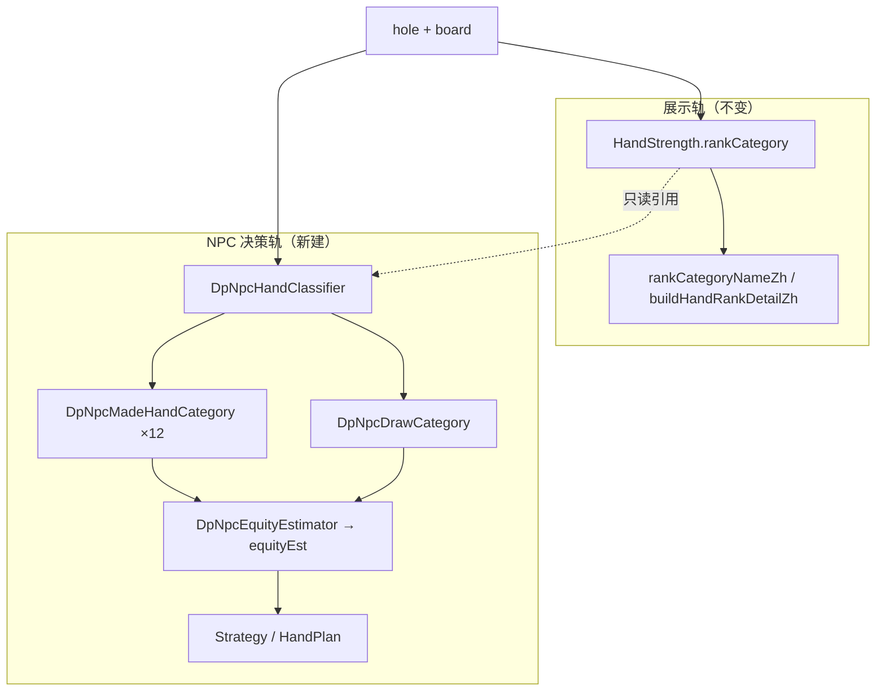
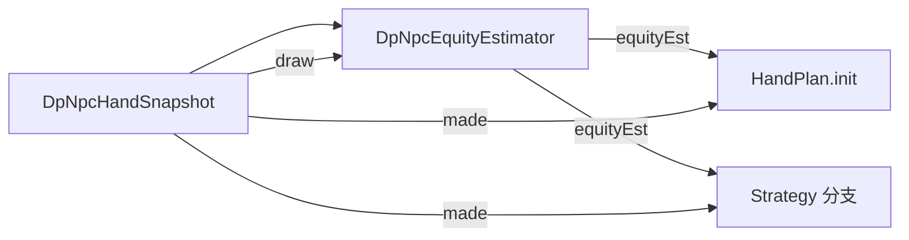
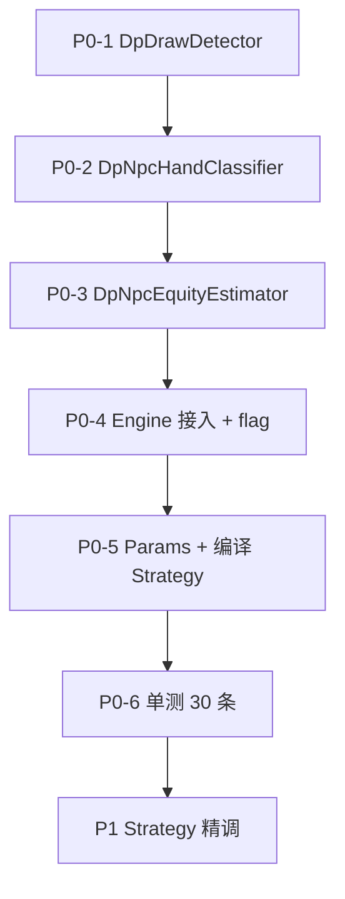

# 规则 NPC 细化牌力与策略重构 — 技术方案

| 项 | 值 |
|---|---|
| 方案版本 | 2026-06-07 |
| 状态 | **规划文档** — 仅描述方案，**不含 Java 实现** |
| 权威来源 | `DpUtilHandEvaluator`、`DpNpcEngine`、`npc/strategy/*` |
| 非目标 | 成就系统、LLM NPC、玩家 outs/equity 工具、前端 `dpGameHandRank.js`、Flyway（除非后续单独立项） |

---

## 0. 摘要（Executive Summary）

### 0.1 背景与问题

当前规则 NPC 翻后决策依赖 `SimpleStrength` 四档（`WEAK` / `MEDIUM` / `STRONG` / `MONSTER`），由 `toSimpleStrength()` 从 `HandStrength.rankCategory` 粗映射，并叠加听牌提档。该模型将「顶对弱踢脚」与「超对」、 「假两对」与「真两对」、 「组合听」与「高牌」混在同一桶，导致：

1. `estimateEquityBucket()` 大量牌型落在 `WEAK@0.20`，与真实可玩性脱节；
2. 听牌检测在 `DpUtilHandEvaluator` 与 `DpNpcEngine` **重复实现且逻辑不一致**（P0 必须统一）；
3. `HandPlan` 初始化、`cbet` 尺度、`foldEquityAdjusted` 等均以四档分支，无法表达「中对控池」「顶对顶踢脚价值线」等职业扑克常识。

### 0.2 目标

为**规则类 NPC** 重建**翻后**成牌 12 档 + **听牌独立第二轴**，驱动 `equityEst` 粗桶与各 Strategy 分支；**展示轨完全不变**（仍用 `HandStrength` + `rankCategoryNameZh`，火箭→高牌）。

### 0.3 非目标（已确认）

| 范围 | 决策 |
|------|------|
| 玩家/UI/牌谱牌型展示 | **不变** — 不修改 `DpUtilHandEvaluator` 展示 API |
| LLM NPC（`BOT_LLM`） | **不接入 12 档** — 继续 `SimpleStrength` + `describeHandStrengthForLlm` |
| 精确胜率 / MC 模拟 | **本次不实现** — 仅留 `DpPokerMath` 扩展点 |
| 成就系统 | **不在本次范围** |
| Flyway | **无表变更** |

### 0.4 核心设计原则



---

## 1. 新建类型与包结构

### 1.1 建议包路径

```
com.example.mgdemoplus.npc.eval/
  DpNpcMadeHandCategory.java      // 翻后成牌 12 档枚举
  DpNpcDrawCategory.java          // 听牌第二轴
  DpNpcPreflopCategory.java       // 翻前专用分类（不硬套 12 档）
  DpNpcHandSnapshot.java          // 不可变快照：made + draw + 元数据
  DpNpcHandClassifier.java        // 翻后 12 档分类器
  DpDrawDetector.java             // 统一听牌检测（P0）
  DpNpcEquityEstimator.java       // 12 档 + 听牌 → equityEst
  DpNpcHandTierBridge.java        // 可选：12 档 → 旧四档兼容桥（回滚/feature flag）
```

```
com.example.mgdemoplus.utils/
  DpPokerMath.java                // 接口占位（§8），本次仅 stub
```

### 1.2 `DpNpcHandSnapshot` 字段

| 字段 | 类型 | 说明 |
|------|------|------|
| `made` | `DpNpcMadeHandCategory` | 翻后成牌档；翻前为 `null` |
| `draw` | `DpNpcDrawCategory` | 听牌轴；河牌恒为 `NONE` |
| `preflop` | `DpNpcPreflopCategory` | 翻前档；翻后为 `null` |
| `handStrength` | `HandStrength` | 7 选 5 结果，**只读**，供调试与 LLM 无关路径 |
| `playingTheBoard` | `boolean` | 公对/公面拼踢脚 |
| `counterfeit` | `boolean` | 假两对/被反超的两对 |
| `holeContributes` | `boolean` | 最佳 5 张是否用到至少一张手牌 |

### 1.3 Feature Flag 与回滚

`application.yml` 新增（P0 即接入）：

```yaml
dp:
  npc:
    granular-strength:
      enabled: ${DP_NPC_GRANULAR_STRENGTH_ENABLED:true}
```

| `enabled` | 行为 |
|-----------|------|
| `true`（默认） | `estimateCurrentHandSnapshot()` → 12 档 + 听牌 → 新 `equityEst` |
| `false` | 回退 `estimateCurrentStrength()` + 旧 `estimateEquityBucket(SimpleStrength, …)` |

**回滚策略**：保留 `SimpleStrength`、`toSimpleStrength()` **不删除**；`DpNpcHandTierBridge.toSimpleStrength(DpNpcHandSnapshot)` 供 LLM 与 flag=false 路径使用。

---

## 2. 翻后成牌 12 档（`DpNpcMadeHandCategory`）

枚举顺序即强度序（用于比较、`ordinal` 谨慎使用，推荐显式 `strengthOrder()` 方法）：

```
HIGH_CARD < BOTTOM_PAIR < MIDDLE_PAIR < TOP_PAIR_WEAK_KICKER < TOP_PAIR_TOP_KICKER
  < TWO_PAIR < TRIPS < STRAIGHT < FLUSH < FULL_HOUSE < QUADS < ROCKET
```

### 2.1 与展示轨 `rankCategory` 映射总表

| `DpNpcMadeHandCategory` | 中文 | `HandStrength.rankCategory` | 展示 `rankCategoryNameZh` |
|-------------------------|------|----------------------------|---------------------------|
| `ROCKET` | 火箭 | 9 或 10 | 同花顺 / 皇家同花顺 |
| `QUADS` | 四条 | 8 | 四条 |
| `FULL_HOUSE` | 葫芦 | 7 | 葫芦 |
| `FLUSH` | 同花 | 6 | 同花 |
| `STRAIGHT` | 顺子 | 5 | 顺子 |
| `TRIPS` | 三条 | 4 | 三条 |
| `TWO_PAIR` | 两对 | 3 | 两对 |
| `TOP_PAIR_TOP_KICKER` | 顶对顶踢脚 | 2 | 一对 |
| `TOP_PAIR_WEAK_KICKER` | 顶对弱踢脚 | 2 | 一对 |
| `MIDDLE_PAIR` | 中对 | 2 | 一对 |
| `BOTTOM_PAIR` | 底对 | 2 | 一对 |
| `HIGH_CARD` | 高牌 | 1 或特殊降级 | 高牌 / 一对（公面） |

> **关键**：同一 `rankCategory=2`（展示仍为「一对」）在 NPC 轨拆为 5 档；**不修改** `rankCategoryNameZh` 与前端。

### 2.2 分类算法（`DpNpcHandClassifier.classifyPostflop`）

**输入**：`HandStrength hs`、`List<String> hole`、`List<String> community`、`String stage`  
**前置**：`hs = evaluateBestHand(hole + community)`，与展示轨一致。

#### 步骤 A — 成牌型大类（`cat = hs.rankCategory`）

| `cat` | 直接映射 |
|-------|----------|
| ≥ 9 | `ROCKET` |
| 8 | `QUADS` |
| 7 | `FULL_HOUSE` |
| 6 | `FLUSH` |
| 5 | `STRAIGHT` |
| 4 | `TRIPS`（见 §2.2.4） |
| 3 | `TWO_PAIR`（见 §2.2.3） |
| 2 | 进入一对子分类（§2.2.2） |
| 1 | `HIGH_CARD`（听牌不并入成牌档） |

#### 步骤 B — 一对子分类（`cat == 2`）

定义：

- `boardHigh = maxRankOnBoard(community)`
- `boardLow = minRankOnBoard(community)`
- `pairRank = hs.ranks.get(0)`
- `heroKicker = hs.ranks.get(1)`（最佳 5 张中踢脚最大点数）
- `boardSecond =` 公牌去重降序第 2 大点数（若仅 3 张 flop 则取第二高）

**B1 公对面** — `isPlayingBoardPairOnly(hs, hole, community)`：

→ `HIGH_CARD`，`playingTheBoard=true`（**不**因听牌把成牌档抬高；听牌走第二轴）。

**B2 超对** — 口袋对子 `pairRank > boardHigh` 且手牌两张同点：

→ `TOP_PAIR_TOP_KICKER`（12 档无单独「超对」；权益在 `DpNpcEquityEstimator` 中对超对 +0.04～+0.06 加成，见 §4.2）。

**B3 顶对** — `pairRank == boardHigh`：

| 条件 | 档位 |
|------|------|
| `heroKicker >= 13`（K+） | `TOP_PAIR_TOP_KICKER` |
| `heroKicker == 14` 且公面无 A | `TOP_PAIR_TOP_KICKER` |
| `heroKicker > boardSecond` 且 `heroKicker >= 11` | `TOP_PAIR_TOP_KICKER` |
| 其余 | `TOP_PAIR_WEAK_KICKER` |

**B4 非顶对** — `pairRank < boardHigh`：

| 条件 | 档位 |
|------|------|
| `pairRank == boardLow` | `BOTTOM_PAIR` |
| 其余（含「第二对」、underpair 到中间牌） | `MIDDLE_PAIR` |

#### 步骤 C — 两对（`cat == 3`）

**真两对**：hero 手牌至少一张参与两对中的**一个**对子点数（计牌：hole 中出现 `hs.ranks[0]` 或 `hs.ranks[1]` 之一）。

**假两对 / counterfeit**（满足任一 → `MIDDLE_PAIR` 或 `HIGH_CARD`，`counterfeit=true`）：

1. **Board 两对**：公牌自身已构成两对，hero 仅持更大踢脚 → `HIGH_CARD`（与公面对踢脚同理）；
2. **被反超**：hero 较低对 + 公牌高对，且 hero 未持有高对点数 → `MIDDLE_PAIR`，`counterfeit=true`；
3. **假两对（paired board + hole 单对）**：如 `hole=K2`，board=`K-K-7-3`，最佳为 `K-K-7-2` 显示两对但实为「顶对 + 公对」→ `TOP_PAIR_WEAK_KICKER` 或 `MIDDLE_PAIR`（实现用：若高对点数在 board 出现 ≥2 次且 hero 仅一张匹配 → 不算 `TWO_PAIR`）。

**单调色板（monotone）**：不改变档位，仅影响 `BoardDanger` 与 Strategy 湿面分支。

#### 步骤 D — 三条（`cat == 4`）

**Set vs Trips**：NPC **不拆档**，均映射 `TRIPS`。

元数据区分（供权益微调，非新枚举）：

| 情形 | 检测 | `equityEst` 加成 |
|------|------|------------------|
| Set（口袋对 + board 一张） | hole 两张同点且 `pairRank` 等于该点 | +0.03 |
| Trips（单卡 + board pair） | hole 仅一张 `pairRank` | 基准 |
| Board trips only | hole 无 `pairRank` | 降至 `MIDDLE_PAIR` 权益档 |

#### 步骤 E — 高牌（`cat == 1`）

→ `HIGH_CARD`；若 `best5` 完全不用 hole（河牌纯公面）→ `playingTheBoard=true`，权益封顶。

### 2.3 边界案例速查

| 场景 | hole | board | 展示 `rankCategory` | 期望 `made` | 备注 |
|------|------|-------|----------------------|-------------|------|
| 公面对踢脚 | `A2` | `KKQ72` | 一对 K | `HIGH_CARD` | `playingTheBoard` |
| 超对 | `QQ` | `J72` | 一对 Q | `TOP_PAIR_TOP_KICKER` | 权益加成 |
| 顶对弱踢 | `K8` | `K72` | 一对 K | `TOP_PAIR_WEAK_KICKER` | kicker 8 |
| 顶对强踢 | `AK` | `K72` | 一对 K | `TOP_PAIR_TOP_KICKER` | kicker A |
| 假两对 | `K2` | `KK732` | 两对 K-2 | `TOP_PAIR_WEAK_KICKER` | counterfeit |
| Set | `77` | `K7Q` | 三条 7 | `TRIPS` | set 加成 |
| Trips | `K7` | `KKQ` | 三条 K | `TRIPS` | |
| monotone 顶对 | `Ah` | `Qh Jh 9h` | 高牌 A | `HIGH_CARD` + `FLUSH_DRAW` | 成牌/听牌分离 |
| 用户举例 | `2h3h` | `6s Ah Kd` | 高牌 3 | `HIGH_CARD` | `GUTSHOT`（听 45） |

---

## 3. 听牌独立第二轴（`DpNpcDrawCategory`）

### 3.1 枚举（专业标准，避免过度复杂）

| 值 | 含义 | 近似 outs（8-max 单对手语义） |
|----|------|------------------------------|
| `NONE` | 无有意义听牌 | 0 |
| `GUTSHOT` | 内听顺（4 outs） | 4 |
| `OESD` | 双头顺听（8 outs） | 8 |
| `FLUSH_DRAW` | 同花听（9 outs，非成花） | 9 |
| `COMBO_DRAW` | 同花听 + 顺听（≥12 outs） | 12+ |

**刻意不包含**：后门花/后门顺（P1 以后可选）、单 overcard（不算听牌轴）。

### 3.2 统一检测落点 — `DpDrawDetector`（P0）

**删除/废弃**：`DpNpcEngine.hasStrongFlushDraw`、`hasOpenEndedStraightDraw` 私有实现。

**迁移**：将 `DpUtilHandEvaluator` 内 `hasStrongFlushDraw` / `hasStrongStraightDraw` **提升为 public** 或整体迁入 `DpDrawDetector`，以 **Evaluator 版为准**（要求 hero 至少一张手牌参与听牌）。

#### 检测顺序（互斥优先级，高者优先）

```
若已成花(cat≥6) 或 已成顺(cat≥5) → NONE
若 COMBO（FLUSH_DRAW 且 (OESD 或 GUTSHOT)）→ COMBO_DRAW
若 FLUSH_DRAW（4 同花且 hero 至少 1 张该花）→ FLUSH_DRAW
若 OESD → OESD
若 GUTSHOT → GUTSHOT
否则 NONE
```

#### OESD vs GUTSHOT 判定（在 Evaluator 双头顺基础上细分）

在 4 点窗口 `distinctCnt >= 4` 且 `hasHoleInWindow` 前提下：

- **OESD**：窗口可延伸为 5 连顺的**两端**至少一端仍开放（非 nut 单端），即 8-out 类；
- **GUTSHOT**：仅单端开放或中间缺 1 点的 4-out 类。

**河牌**：`stage == river` → 强制 `NONE`（无未来街）。

### 3.3 与成牌档共同输入决策



| 消费方 | 使用 `made` | 使用 `draw` | 使用 `equityEst` |
|--------|-------------|-------------|------------------|
| `estimateEquityBucket` | 基础表 | 加成表 | 输出 |
| `initHandPlanIfNeededForPostflop` | VALUE/POT/BLUFF 分界 | 弱成牌+强听 → 抬计划 | bluffProb 门槛 |
| `updateHandPlanForLaterStreetIfNeeded` | ≥`TWO_PAIR` 或强听 | COMBO/OESD+弱对 | minEq 校正 |
| Tag/Nit/Lag Strategy | 下注尺度、弃牌 | 半诈唬门槛 | pot odds fold |
| Fish/Call Strategy | 跟注站 | 听牌跟注 | equity vs potOdds |
| Maniac | 简化：仍主要看 `equityEst` | 加注频率 | all-in 阈值 |

**原则**：成牌档决定「是什么」；听牌轴决定「还有多少 equity」；`equityEst` 是 Strategy 主要数值输入。

---

## 4. 翻前轨（不硬套 12 档）

### 4.1 保留现有结构

| 组件 | 处置 |
|------|------|
| `DpNpcUnifiedPreflopStrategy` | **保留** G1–G8、`rangeLevel`、13×13 矩阵 |
| `applyPreflopHoleEquityAdjustments` | **迁入** `DpNpcEquityEstimator`，逻辑不变 |
| `toSimpleStrength(null, preflop, hole, …)` 翻前粗档 | **废弃于规则 NPC**；由 `DpNpcPreflopCategory` 替代 |

### 4.2 `DpNpcPreflopCategory` 建议枚举

| 值 | 含义 | 与 G 组 / 旧 `SimpleStrength` 关系 |
|----|------|-----------------------------------|
| `PREMIUM` | AA/KK/QQ/AKs/AKo | G1，旧 STRONG |
| `STRONG` | JJ/TT/AQs/AQo/AJs/KQs | G2，旧 STRONG/MEDIUM |
| `PLAYABLE` | 99–66、同花连张、Broadway | G3–G4，旧 MEDIUM |
| `SPECULATIVE` | 小对、同花隔张、Axs | G5，旧 MEDIUM/WEAK |
| `MARGINAL` | 后位偷盲边缘 | G6–G7，旧 WEAK |
| `TRASH` | 其余 | G8，旧 WEAK |

**分类**：复用 `DpNpcUnifiedPreflopStrategy.groupOf(hole)` → 映射上表（不重复造轮子）。

### 4.3 翻前 `equityEst`

```
base = preflopBaseTable[category]   // 见 §5.1
base = applyPreflopHoleEquityAdjustments(base, hole)  // 保留现有细调
return clampEquityEstimate(base)
```

**不**对翻前使用 `DpNpcMadeHandCategory`。

---

## 5. 粗桶 `equityEst` 重映射

### 5.1 翻后成牌基础表（`stage` 修正前）

| `DpNpcMadeHandCategory` | Flop base | Turn base | River base |
|-------------------------|-----------|-----------|------------|
| `HIGH_CARD` | 0.14 | 0.12 | 0.10 |
| `BOTTOM_PAIR` | 0.30 | 0.28 | 0.26 |
| `MIDDLE_PAIR` | 0.38 | 0.36 | 0.34 |
| `TOP_PAIR_WEAK_KICKER` | 0.48 | 0.46 | 0.44 |
| `TOP_PAIR_TOP_KICKER` | 0.58 | 0.56 | 0.54 |
| `TWO_PAIR` | 0.62 | 0.60 | 0.58 |
| `TRIPS` | 0.72 | 0.70 | 0.68 |
| `STRAIGHT` | 0.78 | 0.76 | 0.74 |
| `FLUSH` | 0.80 | 0.78 | 0.76 |
| `FULL_HOUSE` | 0.86 | 0.85 | 0.84 |
| `QUADS` | 0.90 | 0.89 | 0.88 |
| `ROCKET` | 0.92 | 0.91 | 0.90 |

仍经 `clampEquityEstimate(0.06..0.93)`。

### 5.2 听牌加成（叠加在 made base 上，河牌为 0）

| `DpNpcDrawCategory` | Flop Δ | Turn Δ |
|---------------------|--------|--------|
| `GUTSHOT` | +0.06 | +0.04 |
| `OESD` | +0.12 | +0.08 |
| `FLUSH_DRAW` | +0.14 | +0.10 |
| `COMBO_DRAW` | +0.22 | +0.15 |

**封顶**：翻后 `equityEst <= 0.55` 时听牌加成全额；`0.55–0.70` 加成 ×0.7；`>0.70` 不再加（已成强牌）。

### 5.3 保留的修正链

| 步骤 | 来源 | 变更 |
|------|------|------|
| 1 | made base + draw Δ | **新建** `DpNpcEquityEstimator` |
| 2 | `playingTheBoard` / `counterfeit` | `min(base, 0.22)` / `×0.85` |
| 3 | Set 加成 | trips +0.03 |
| 4 | 超对加成 | TPTK 且口袋对 +0.05 |
| 5 | `clampEquityEstimate` | **保留** |
| 6 | pot odds 修正 | `foldEquityAdjusted` 等 **保留**，仍读 `ctx.equityEst` |

**删除**：`estimateEquityBucket(SimpleStrength, …)` 中对 `SimpleStrength` 的四档 `switch`；`applyPostflopMadeHandEquityAdjustments` 逻辑**吸收**进新估计器（避免 double-count，实现时二选一）。

### 5.4 `NpcRuleCoeffs` 调参点

| 系数 | 本次是否改默认值 | Strategy 作者 P1 重调 |
|------|------------------|----------------------|
| `equityPotOddsEps/Margin` | 否 | Tag/Nit：可能略收紧 |
| `equityFoldBoost/Shrink` | 否 | Fish/Call：听牌跟注多则略降 `FoldBoost` |
| `cbetBaseWeak/Medium/Strong` | **P1 按 12 档映射** | Lag/Maniac：弱档 cbet 降、TPTK+ 升 |
| `riverOverbetProb` | 否 | 仅 `FULL_HOUSE+` 触发 overbet |
| `riverBlockProb` | **P1** | `MIDDLE_PAIR`～`TPWK` 提高 block |
| HandPlan `bluffProb` 常数 | **P1** | 见 §6.2 |

### 5.2 旧四档 → 新结构参考映射（兼容桥）

| 旧 `SimpleStrength` | 典型新 `made` | 典型 `equityEst` 区间 |
|---------------------|---------------|----------------------|
| `WEAK` | `HIGH_CARD`～`MIDDLE_PAIR` | 0.10–0.40 |
| `MEDIUM` | `TPWK`～`TWO_PAIR` + 听牌 | 0.38–0.65 |
| `STRONG` | `TPTK`～`STRAIGHT` + 强听 | 0.55–0.78 |
| `MONSTER` | `FLUSH`～`ROCKET` | 0.76–0.92 |

---

## 6. Strategy 改动清单

### 6.1 公共入参

**`DpNpcRuleDecisionParams`**：

```diff
- public final SimpleStrength strength;
+ public final DpNpcHandSnapshot handSnapshot;
+ /** @deprecated 仅 LLM / feature flag=false；规则 NPC 勿用 */
+ public final SimpleStrength strength;
```

**`DpNpcEngine.decideBotAction`**：翻后调用 `estimateCurrentHandSnapshot(room, bot)` 填充 `handSnapshot`。

### 6.2 `DpNpcEngine` 内逻辑

| 方法 | 改动 |
|------|------|
| `estimateCurrentStrength` | 保留；LLM + flag 回退 |
| `estimateCurrentHandSnapshot` | **新增** |
| `estimateEquityBucket` | 委托 `DpNpcEquityEstimator`；或内联重构 |
| `buildSmartContext` | 参数改为 `DpNpcHandSnapshot`；LLM 仍传 `SimpleStrength` |
| `initHandPlanIfNeededForPostflop` | `switch(made)` 替代 `switch(planStrength)` |
| `updateHandPlanForLaterStreetIfNeeded` | `made >= TWO_PAIR` 或 `draw >= OESD` + `equityEst` 阈值 |
| `hasStrongFlushDraw` / `hasOpenEndedStraightDraw` | **删除**，改 `DpDrawDetector` |

#### HandPlan 分界建议（替代原四档 `switch`）

| `made` | 默认 `HandPlanType`（干面、≤2 人） |
|--------|-------------------------------------|
| `FULL_HOUSE`～`ROCKET` | `VALUE` |
| `TRIPS`～`STRAIGHT` | `VALUE`（湿面多人 → `POT_CONTROL`） |
| `TWO_PAIR`、`TPTK` | `VALUE` / `POT_CONTROL` 按湿面 |
| `TPWK`、`MIDDLE_PAIR` | `POT_CONTROL` |
| `BOTTOM_PAIR` | `POT_CONTROL` / `GIVE_UP` |
| `HIGH_CARD` | 按位置 `BLUFF` / `GIVE_UP`；`draw >= OESD` → 提高 `BLUFF` 权重 |

### 6.3 各 Strategy 文件

| 文件 | 改动要点 | P0/P1 |
|------|----------|-------|
| `DpNpcTagStrategy.java` | `st` → `snap.made`；`TPTK+` 价值线；`TPWK` 控池；听牌半诈唬 `draw>=OESD` | P1 系数 |
| `DpNpcNitStrategy.java` | 同 TAG，更紧：`TPWK` 遇注易 fold；`MIDDLE_PAIR` 不加注 | P1 |
| `DpNpcLagStrategy.java` | 扩大 `BLUFF`：`HIGH_CARD+COMBO`；降低 `GIVE_UP` | P1 |
| `DpNpcManiacStrategy.java` | 最小改动：主要依赖新 `equityEst`；`made.ordinal` 替换 MONSTER 判断 | P0 编译通过即可 |
| `DpNpcFishStrategy.java` | 听牌跟注：`draw>=FLUSH_DRAW` 且 `potOdds` 合理 → 降 fold | P1 |
| `DpNpcCallStrategy.java` | 同上，更宽跟注 | P1 |
| `DpNpcCustomStrategy.java` | 与 Tag 同构 | P1 |
| `DpNpcUnifiedPreflopStrategy.java` | **不改**（翻前独立轨） | — |

### 6.4 LLM 路径（明确不动）

| 文件 | 行为 |
|------|------|
| `buildLlmNpcGameSnapshot` | 继续 `estimateCurrentStrength` → `SimpleStrength` |
| `LlmNpcGameContext.getSimpleStrength()` | 仍返回 `WEAK`/`MEDIUM`/`STRONG`/`MONSTER` |
| `LlmNpcGameContext.getHandStrengthLine()` | 仍 `describeHandStrengthForLlm(HandStrength)` |
| `LlmNpcUserSnapshot` | 不改 prompt 字段 |
| `DpLlmNpcDecisionService` | 不改 |

若将来 LLM 需要 12 档，**另开任务**；本次在 `LlmNpcGameContext` 加注释说明即可。

---

## 7. 测试用例表（≥25 条）

约定：牌面字符串 `suit_rank`，`suit ∈ {hearts,diamonds,clubs,spades}`，`rank ∈ {2..10,J,Q,K,A}`。  
期望列为：`made` / `draw` / `equityEst` 区间（flop，无 villain，heads-up 语义粗桶）。

| # | hole | board | stage | 期望 `made` | 期望 `draw` | `equityEst` 区间 |
|---|------|-------|-------|-------------|-------------|------------------|
| 1 | `2h_3h` | `6s_Ah_Kd` | flop | `HIGH_CARD` | `GUTSHOT`（听 4/5 成顺） | 0.18–0.24 |
| 2 | `2h_3h` | `6s_Ah_Kd_5c` | turn | `HIGH_CARD` | `GUTSHOT`（仍缺 4） | 0.16–0.22 |
| 3 | `Ah_Kd` | `Ks_7h_2d` | flop | `TOP_PAIR_TOP_KICKER` | `NONE` | 0.56–0.62 |
| 4 | `Kh_8d` | `Ks_7h_2d` | flop | `TOP_PAIR_WEAK_KICKER` | `NONE` | 0.46–0.52 |
| 5 | `7s_7h` | `Kd_7c_2s` | flop | `TRIPS` | `NONE` | 0.73–0.78 |
| 6 | `Kc_7d` | `Kh_Ks_2d` | flop | `TRIPS` | `NONE` | 0.70–0.75 |
| 7 | `Qd_Qh` | `Jc_7s_2d` | flop | `TOP_PAIR_TOP_KICKER` | `NONE` | 0.60–0.66 |
| 8 | `5c_5d` | `Ah_Kd_9s` | flop | `BOTTOM_PAIR` | `NONE` | 0.28–0.34 |
| 9 | `9h_8d` | `Tc_7s_2d` | flop | `MIDDLE_PAIR` | `OESD` | 0.46–0.52 |
| 10 | `Jh_Th` | `9h_8h_2c` | flop | `HIGH_CARD` | `COMBO_DRAW` | 0.32–0.40 |
| 11 | `Ah_5h` | `Kh_9h_2d` | flop | `HIGH_CARD` | `FLUSH_DRAW` | 0.26–0.32 |
| 12 | `Qc_Jd` | `Tc_9s_2h` | flop | `HIGH_CARD` | `OESD` | 0.24–0.30 |
| 13 | `8s_7s` | `6h_5d_2c` | flop | `HIGH_CARD` | `OESD` | 0.24–0.30 |
| 14 | `9c_6d` | `8h_5s_2c` | flop | `HIGH_CARD` | `GUTSHOT` | 0.18–0.24 |
| 15 | `Ac_2d` | `Kh_Ks_Qd` | flop | `HIGH_CARD` | `NONE` | 0.12–0.18 |
| 16 | `Kc_2d` | `Kh_Ks_Qd_7h` | turn | `HIGH_CARD` | `NONE` | `playingTheBoard` |
| 17 | `Ah_9d` | `9s_9h_Kd` | flop | `TRIPS` | `NONE` | 0.70–0.76 |
| 18 | `Kc_Qd` | `Ks_Qh_7d` | flop | `TWO_PAIR` | `NONE` | 0.60–0.66 |
| 19 | `Kc_2d` | `Ks_Kh_7d_3s` | turn | `TOP_PAIR_WEAK_KICKER` | `NONE` | counterfeit |
| 20 | `Ad_Kc` | `Ah_7d_7s` | flop | `TWO_PAIR` | `NONE` | 0.60–0.66 |
| 21 | `9h_8h` | `7h_6h_Kd` | flop | `HIGH_CARD` | `COMBO_DRAW` | 0.32–0.40 |
| 22 | `Jc_Tc` | `9c_8c_2d` | flop | `HIGH_CARD` | `COMBO_DRAW` | 0.32–0.40 |
| 23 | `Qh_Jh` | `Th_9h_2c` | flop | `HIGH_CARD` | `COMBO_DRAW` | 0.32–0.40 |
| 24 | `6c_6d` | `6h_3s_2d` | flop | `TRIPS` | `NONE` | set 0.73–0.78 |
| 25 | `Ah_Kh` | `Qh_Jh_Th` | flop | `ROCKET` | `NONE` | 0.90–0.93 |
| 26 | `5d_5c` | `5h_Ks_Kd` | flop | `FULL_HOUSE` | `NONE` | 0.84–0.88 |
| 27 | `As_Ad` | `Ac_Ah_Kd` | turn | `QUADS` | `NONE` | 0.88–0.92 |
| 28 | `9s_8s` | `7s_6s_Kd` | flop | `HIGH_CARD` | `COMBO_DRAW` | 0.32–0.40 |
| 29 | `2c_7d` | `Ah_Kd_Qs` | flop | `HIGH_CARD` | `NONE` | 0.12–0.16 |
| 30 | `Jd_Td` | `9c_8s_2h` | flop | `HIGH_CARD` | `OESD` | 0.24–0.30 |

**单测类**：`src/test/java/.../npc/eval/DpNpcHandClassifierTest.java`（分类）+ `DpNpcEquityEstimatorTest.java`（区间）。

---

## 8. P0 / P1、风险与回滚

### 8.1 P0（必须先交付）

| 序号 | 任务 | 验收 |
|------|------|------|
| P0-1 | `DpDrawDetector` 统一听牌，删除 Engine 重复实现 | 与 Evaluator 行为一致的单测 |
| P0-2 | `DpNpcHandClassifier` 12 档 + 边界标记 | §7 全部用例通过 |
| P0-3 | `DpNpcEquityEstimator` + `clampEquityEstimate` | 区间用例通过 |
| P0-4 | `DpNpcEngine` 接入 snapshot + flag | 编译通过；flag=false 回归旧行为 |
| P0-5 | `DpNpcRuleDecisionParams` 增加 `handSnapshot` | 各 Strategy 编译；行为允许暂用 bridge |
| P0-6 | 单测 ≥30 条 | CI `mvn test -Dtest=DpNpc*Eval*` 绿 |

### 8.2 P1（行为精调）

| 序号 | 任务 |
|------|------|
| P1-1 | Tag/Nit/Lag/Fish/Call/Custom 按 §6.3 逐文件改分支 |
| P1-2 | `NpcRuleCoeffs.cbetBase*` 按 `made` 分档 |
| P1-3 | HandPlan `bluffProb` / `updateHandPlan` 阈值重标定 |
| P1-4 | 回归对局冒烟：Fish 少过度弃顶对；Lag 组合听半诈唬 |
| P1-5 | 更新 `docs/ai/npc-engine/02_normal_npc_implementation.md` |

### 8.3 风险

| 风险 | 影响 | 缓解 |
|------|------|------|
| 分类边界与职业直觉偏差 | NPC 过度松/紧 | §7 用例 + P1 人工牌谱复盘 |
| `equityEst` 与旧四档分布漂移 | 跟注/弃牌率突变 | feature flag；分 BotType 灰度 |
| 假两对误判 | 价值线过高 | `counterfeit` 标记 + 权益封顶 |
| 删除 Engine 听牌函数遗漏调用点 | 编译/行为错误 | grep + 单测 |
| LLM 误接新档 | prompt 污染 | 代码审查隔离 `buildLlmNpcGameSnapshot` |

### 8.4 回滚

1. `DP_NPC_GRANULAR_STRENGTH_ENABLED=false`
2. 或 revert P0 commit（`SimpleStrength` 路径未删除）
3. 无需 DB 回滚

---

## 9. 将来扩展 — `DpPokerMath` 占位

```java
package com.example.mgdemoplus.utils;

/**
 * 上帝视角精确扑克数学（成就 / 复盘 / 未来精确 NPC）。
 * 本次仅接口占位，规则 NPC 仍用 DpNpcEquityEstimator 启发式粗桶。
 */
public interface DpPokerMath {

    /** 精确 win% vs 1~N 随机范围（枚举或 MC），成就系统用 */
    double exactEquity(List<String> heroHole, List<String> board,
                       List<List<String>> villainHoles, int iterations);

    /** 精确 outs 数（含 dirty outs 标记） */
    int countOuts(List<String> heroHole, List<String> board, boolean includeDirty);

    /** 是否已实现 MC（本次返回 false） */
    default boolean isMonteCarloAvailable() { return false; }
}
```

**实现类**（将来）：`DpPokerMathMcImpl` 或 `DpPokerMathExactEnumImpl`；成就模块注入，**不**进入 `DpNpcEngine` 热路径。

---

## 10. 实现 Agent 开工顺序（推荐）



### 10.1 文件创建/修改清单

| 操作 | 路径 |
|------|------|
| 新建 | `npc/eval/DpNpcMadeHandCategory.java` |
| 新建 | `npc/eval/DpNpcDrawCategory.java` |
| 新建 | `npc/eval/DpNpcPreflopCategory.java` |
| 新建 | `npc/eval/DpNpcHandSnapshot.java` |
| 新建 | `npc/eval/DpDrawDetector.java` |
| 新建 | `npc/eval/DpNpcHandClassifier.java` |
| 新建 | `npc/eval/DpNpcEquityEstimator.java` |
| 新建 | `npc/eval/DpNpcHandTierBridge.java` |
| 新建 | `utils/DpPokerMath.java`（接口 stub） |
| 新建 | `test/.../DpNpcHandClassifierTest.java` |
| 新建 | `test/.../DpNpcEquityEstimatorTest.java` |
| 修改 | `npc/engine/DpNpcEngine.java` |
| 修改 | `npc/strategy/DpNpcRuleDecisionParams.java` |
| 修改 | `utils/DpUtilHandEvaluator.java`（听牌方法 public 或委托） |
| 修改 | `application.yml`（`dp.npc.granular-strength.enabled`） |
| P1 修改 | `npc/strategy/DpNpc*Strategy.java`（7 个） |

---

## 11. 文档维护

实现完成后由实现 Agent 更新：

- `docs/ai/npc-engine/02_normal_npc_implementation.md` — §2.1 `strength` 改为 `handSnapshot`
- `docs/ai/npc-engine/03_normal_npc_modules.md` — 补充 `npc/eval` 包说明
- 本文件头部状态改为 `implemented` 并注明核对日期

---

> **核对日期**：2026-06-07  
> **权威来源**：`DpUtilHandEvaluator.java`、`DpNpcEngine.java`、`npc/strategy/*`  
> **Status**: planning
