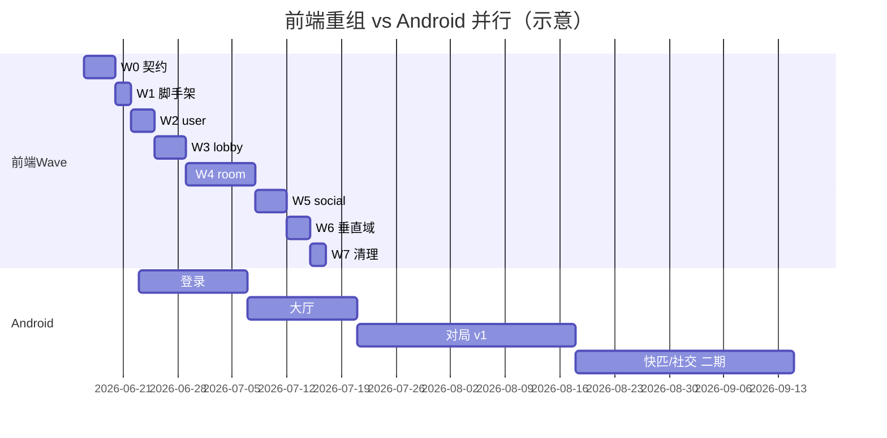

# 前端目录重组 × Android 并行迁移波次计划（Wave 0–7）

> **文档类型**：可执行波次计划（供 PM 派 Agent、Android 团队、前端负责人使用）  
> **核对基准**：`front/dp_game/src/`（213 源文件、90 个 `.vue`）  
> **关联后端域**：`room/`、`lobby/`、`social/`、`quickmatch/`、`history/`、`user/` 等（见 [CLAUDE.md](../../CLAUDE.md)）  
> **契约权威文档**：[DPGAME.md](../DPGAME.md)、[WEBSOCKET.md](../WEBSOCKET.md)、[JWT.md](../JWT.md)、[dp-quick-match-flow.md](../dp-quick-match-flow.md)、[dp_friend_mailbox_mvp.md](../dp_friend_mailbox_mvp.md)  
> **状态**：草案 — 推荐默认项标有「待负责人确认」

---

## 1. 背景

MGDemoPlus 前端为 Vue 2 单仓（`front/dp_game/`），与 Spring Boot 后端同域部署（端口 8088）。Android 团队计划基于同一套 REST / WebSocket / SSE / JWT 契约开发原生客户端。

当前前端代码按「页面 + 巨型组件」组织，与后端按功能域分包（`room`、`lobby`、`social`…）**不对齐**，导致：

- PM / Agent 难以按域派工；
- Android 无法从目录结构快速定位契约消费方；
- `game.vue`（约 3090 行）、`home.vue`（约 2424 行）耦合过重，任何小改都牵动全文件；
- API 仅 3 个封装文件，**45+ 处**组件/工具直接调用 `$http`，契约散落。

本计划将前端重组为 `features/` 域驱动结构，并在各 Wave 向 Android 交付**冻结契约快照**与**交接清单**，使两端可并行推进。

---

## 2. 目标

| # | 目标 | 验收口径 |
|---|------|----------|
| G1 | 前端 `src/features/` 与后端功能域一一对应 | 每个域含 `api/`、`components/`、`store/`（按需）、`utils/` |
| G2 | 消灭散落 `$http` | 域内 REST 经 `features/*/api/` 或 `shared/api/`；Wave 7 前保留 re-export 兼容层 |
| G3 | 拆解 `game.vue` / `home.vue` | Wave 4/3 后主文件各 < 800 行（逻辑下沉子组件 + composable 式 utils） |
| G4 | Android v1 可并行开发 | Wave 0 契约冻结后，Week 1 起 Android 可开工登录+大厅+对局 |
| G5 | 零业务回归 | 每 Wave 末 `npm run build` + 冒烟路径（登录→大厅→建房/进房→下注→结算） |

---

## 3. 非目标

- **不改**后端 API 路径、WS 帧格式、JWT 签发逻辑（除非另开 RFC）。
- **不重写** UI 主题/Retro8bit 视觉（仅搬迁文件）。
- **不在本计划内**完成 Electron 客户端目录重组（可后续跟 Wave 7 兼容层删除一并处理）。
- **Android v1 不包含**：快匹完整 WS 流、社交 SSE 实时推送、成就墙、牌谱详情页 — 列为二期（见 §11 推荐默认）。
- **不修改** `front/` 代码作为本文档交付物（本文档仅为计划；实施由各 Wave Agent 执行）。

---

## 4. 总验收（Program Done）

全部 Wave 0–7 完成后，需满足：

1. `front/dp_game/src/features/` 存在且 router / store 仅从 features 或 `shared/` 引用。
2. 旧路径 `components/`、`api/`、`utils/` 根目录仅保留 **re-export 薄层**（Wave 7 可选删除）。
3. `$http` 直调仅剩 `shared/http/` 与测试桩；业务调用经域 API 模块。
4. Android 交接包齐全：`docs/android-handoff/` 下每域 OpenAPI 摘录 + WS/SSE 帧样例 + 冒烟 Postman/脚本。
5. [DPGAME.md](../DPGAME.md) / [WEBSOCKET.md](../WEBSOCKET.md) 与前端消费方路径交叉引用已更新（文档 PR，非代码）。
6. PM 签署《契约变更流程》：Wave 0 冻结点后，破坏性变更须升版本号并通知 Android。

---

## 5. 现状摘要

### 5.1 规模

| 指标 | 数值 | 说明 |
|------|------|------|
| `src/` 源文件 | **213** | `.vue` + `.js` + mixins/constants 等 |
| `.vue` 组件 | **90** | 几乎全部在 `components/` 扁平目录 |
| `game.vue` | **~3090 行** | 对局页：WS、心跳、下注、房主工具、聊天、BGM… |
| `home.vue` | **~2424 行** | 大厅：公开房列表、快匹、邮箱、好友、资料 |
| API 封装文件 | **3** | `api.dpRoom.js`、`api.dpSocial.js`、`api.dpLeaderboard.js` |
| 散落 `$http` | **45+ 处 / 30 文件** | 集中在 `game.vue`(31)、`home.vue`(26) 等 |
| Vuex 模块 | **3** | `dpGame.js`(~643 行)、`dpMailbox.js`、`dpAchievement.js` |

### 5.2 路由一览（`router/index.js`）

| 路径 | 组件 | 域 |
|------|------|-----|
| `/login`、`/register`、`/oauth/callback` | login / register / OAuthCallback | user |
| `/home` | home.vue | lobby + social |
| `/create-room` | CreateRoom.vue | lobby → room |
| `/game/:roomId` | game.vue | room |
| `/hand-history`、`/hand-history/detail/:id` | HandHistory / HandHistoryDetail | history |
| `/leaderboard` | LeaderboardPage | leaderboard |
| `/music-upload`、`/download-center`、`/image_upload` | 运维/工具页 | music / admin |

### 5.3 主要痛点

```text
components/（90 个 vue 扁平）
    ├── game.vue ────────── WS + REST + 30+ 子组件 import
    ├── home.vue ────────── 快匹 WS + 大厅 REST + 社交 UI
    └── Game* / Dp* ─────── 命名前缀不统一

api/（仅 3 文件，大量路径未收录）
utils/（65 文件，域边界模糊）
store/modules/dpGame.js ── 全局对局状态与 room 域混杂
```

### 5.4 契约现状（Android 须复用）

| 通道 | 权威文档 | 要点 |
|------|----------|------|
| REST 房间 | [DPGAME.md](../DPGAME.md) §2 | 前缀 `/dpRoom`；`getNowRoom`/`getAllRooms2` 白名单 |
| REST 社交 | [dp_friend_mailbox_mvp.md](../dp_friend_mailbox_mvp.md) | 前缀 `/dp/**`；需 JWT |
| WS 对局 | [WEBSOCKET.md](../WEBSOCKET.md) | `/ws/dp-game?roomId&nickname&token`；快照同 `getNowRoom` |
| WS 快匹 | [dp-quick-match-flow.md](../dp-quick-match-flow.md) | `/ws/dp-quick-match`；`WAITING`/`MATCHED`/`IDLE` |
| SSE 社交 | [JWT.md](../JWT.md) §3 + [dp_friend_mailbox_mvp.md](../dp_friend_mailbox_mvp.md) §6 | `GET /dp/social/stream?token=` |
| JWT | [JWT.md](../JWT.md) | Bearer + 单会话 JTI；401 跳登录 |

---

## 6. 目标目录结构

```text
front/dp_game/src/
├── app/                          # 壳：main、App.vue、router、全局样式入口
│   ├── main.js
│   ├── App.vue
│   └── router/
│       └── index.js              # 懒加载 → features/*/pages/
├── shared/                       # 跨域基础设施
│   ├── http/
│   │   ├── axios.js              # 从 main.js 抽出拦截器
│   │   └── result.js             # dpApiResult 等
│   ├── websocket/
│   │   └── dpWsClient.js         # 连接、重连、帧解析基类
│   ├── ui/                       # DpRetro* 通用壳、ThemePicker、Avatar
│   ├── styles/                   # 原 styles/ 迁入（token、主题）
│   └── constants/                # 仅真正跨域常量
├── features/
│   ├── user/                     # 对齐 user + oauth
│   │   ├── api/
│   │   ├── pages/                # LoginPage, RegisterPage, OAuthCallbackPage
│   │   ├── components/           # DpAuthStage, HomeProfileModal, image_upload
│   │   └── utils/                # dpAuthEnterLobby, dpEnsureUserId, dpAvatarUrl
│   ├── lobby/                    # 对齐 lobby + quickmatch（大厅侧）
│   │   ├── api/
│   │   ├── pages/                # LobbyPage（原 home.vue 壳）
│   │   ├── components/           # DpCreateRoomConsole, CreateRoom, QuickMatch*
│   │   ├── store/                # lobby 列表缓存（从 home 拆出）
│   │   └── utils/                # dpLobbyEnterGame, dpCreateRoomSubmit
│   ├── quickmatch/               # 对齐 quickmatch（可并入 lobby，独立便于 Android 二期）
│   │   ├── api/
│   │   ├── websocket/
│   │   └── utils/                # dpQuickMatchExit, dpLobbyQuickMatchExit
│   ├── room/                     # 对齐 room + roomchat + websocket 消费
│   │   ├── api/                  # 扩展 api.dpRoom + 收拢 $http
│   │   ├── pages/                # GamePage（原 game.vue 壳）
│   │   ├── components/           # Game* 子组件、房主面板、行动面板
│   │   ├── store/                # 原 store/modules/dpGame.js
│   │   ├── websocket/            # 对局 WS 会话管理
│   │   ├── mixins/               # dpGame* mixins
│   │   └── utils/                # 牌面、布局、心跳、指纹
│   ├── social/                   # 对齐 social + presence
│   │   ├── api/                  # 原 api.dpSocial.js
│   │   ├── components/           # DpMailboxConsole, FriendChat*, GameInvite*
│   │   ├── store/                # dpMailbox
│   │   ├── sse/                  # dpSocialStream*
│   │   └── utils/                # dpFriendPresence, dpCopySocialId
│   ├── history/                  # 对齐 history
│   │   ├── api/
│   │   ├── pages/                # HandHistory, HandHistoryDetail
│   │   └── components/           # DpHandHistory*
│   ├── leaderboard/              # 对齐 leaderboard
│   │   ├── api/                  # api.dpLeaderboard
│   │   └── pages/
│   ├── achievement/              # 对齐 achievement
│   │   ├── store/                # dpAchievement
│   │   └── components/           # DpAchievement*
│   ├── music/                    # 对齐 music
│   │   ├── components/           # DpMusicPlayer, MusicUpload
│   │   └── utils/                # dpGameMusicUrl
│   ├── npc/                      # NPC 决策 trace / mood（前端展示，对齐 npc/trace）
│   │   ├── components/           # GameNpcDecisionTrace*, CustomNpc*
│   │   └── utils/                # dpNpcDecisionTrace*
│   └── presence/                 # 对齐 presence
│       └── utils/                # dpSiteHeartbeat
└── compat/                       # Wave 1–6 兼容 re-export（Wave 7 删除）
    ├── components/               # export from features/*
    ├── api/
    └── utils/
```

**原则**：新代码只写 `features/`；`compat/` 用一行 re-export 保持旧 import 路径可用，例如：

```js
// compat/components/game.vue → export { default } from '@/features/room/pages/GamePage.vue'
```

---

## 7. Wave 0–7 波次计划

### 人天汇总

| Wave | 名称 | 人天 | 累计 |
|------|------|------|------|
| **0** | 契约盘点与基线 | **3–4** | 3–4 |
| **1** | 脚手架 + 兼容层 | **2** | 5–6 |
| **2** | user 域 | **2–3** | 7–9 |
| **3** | lobby 域（含 home 拆壳） | **3–4** | 10–13 |
| **4** | room 域（game 拆壳） | **7–9** | 17–22 |
| **5** | social + SSE | **3–4** | 20–26 |
| **6** | history / leaderboard / achievement / music | **2–3** | 22–29 |
| **7** | 清理兼容层 + 文档收口 | **2** | **24–31** |
| | **重组小计（Wave 1–7）** | **22–28** | |
| | **含 Wave 0 总计** | **25–32** | |

> PM 对外承诺：**22–28 人天（重组）+ 3–4 人天（Wave 0 文档）= 25–32 人天**。

---

### Wave 0 — 契约盘点与迁移基线

| 项 | 内容 |
|----|------|
| **目标** | 冻结 Android v1 契约；产出 `$http` 全量清单与文件映射表定稿 |
| **范围** | 只写文档/脚本，**不改** `front/` 业务逻辑 |
| **交付物** | ① `docs/android-handoff/contract-freeze-v1.md` ② `$http` 调用矩阵（路径→文件→域）③ 本计划映射表评审签字 ④ Postman/Bruno 集合导出 |
| **Android 交接物** | 契约冻结公告；JWT 登录样例；`getNowRoom` 响应 JSON 样例；WS 首包样例 |
| **验收 checklist** | ☐ REST 路径与 [DPGAME.md](../DPGAME.md) diff 为零 ☐ WS 帧与 [WEBSOCKET.md](../WEBSOCKET.md) 一致 ☐ 快匹 WS 与 [dp-quick-match-flow.md](../dp-quick-match-flow.md) 一致 ☐ SSE 与 [JWT.md](../JWT.md) 一致 ☐ Android TL 确认 v1 范围 |
| **人天** | 3–4 |
| **风险** | 盘点遗漏隐藏 `$http` → 用 ripgrep `\$http` 全仓扫描 |
| **依赖** | 无 |

---

### Wave 1 — 脚手架 + 兼容层

| 项 | 内容 |
|----|------|
| **目标** | 建立 `features/`、`shared/`、`compat/` 空壳；抽出 axios 拦截器 |
| **范围** | 新建目录；`main.js` 瘦身；**零业务行为变更** |
| **交付物** | 目录骨架；`shared/http/axios.js`；`compat/**` re-export 生成脚本 |
| **Android 交接物** | 更新 `contract-freeze-v1.md` 版本号；目录对照表（后端包 ↔ 前端 features） |
| **验收 checklist** | ☐ `npm run build` 通过 ☐ 所有路由可访问 ☐ 旧 import 路径仍可用（compat） ☐ CI 无新增 lint 错误 |
| **人天** | 2 |
| **风险** | webpack alias 配置遗漏 → 在 `vue.config.js` 预置 `@features` |
| **依赖** | Wave 0 契约冻结签字 |

---

### Wave 2 — user 域

| 项 | 内容 |
|----|------|
| **目标** | 登录/注册/OAuth/资料模态框迁入 `features/user/` |
| **范围** | `login.vue`、`register.vue`、`OAuthCallback.vue`、`DpAuthStage.vue`、`HomeProfileModal.vue`、`image_upload.vue`；相关 utils |
| **交付物** | `features/user/api/userApi.js`（`loginProfile`、`registerUser`、资料接口）；pages 替换 router 指向 |
| **Android 交接物** | **Android Week 1–2 主交付**：登录/注册/OAuth 序列图；Token 存储建议；401 处理；头像上传 `multipart` 说明 |
| **验收 checklist** | ☐ 登录→token 写入→进大厅 ☐ 注册敏感词/重复名校验 ☐ OAuth callback ☐ 资料弹窗改昵称/头像 ☐ compat re-export 有效 |
| **人天** | 2–3 |
| **风险** | OAuth 回调路径硬编码 → 保持 `/oauth/callback` 不变 |
| **依赖** | Wave 1 |

---

### Wave 3 — lobby 域（home.vue 拆壳）

| 项 | 内容 |
|----|------|
| **目标** | `home.vue` 拆为 `LobbyPage` + 子组件；收拢大厅 REST |
| **范围** | `home.vue`、`CreateRoom.vue`、`DpCreateRoomConsole.vue`、`LobbyRoomPasswordGate.vue`、`LeaderboardPage` 入口链接；`publicRooms`/`createRoom` 等 `$http` |
| **交付物** | `features/lobby/api/lobbyApi.js`；`LobbyPage.vue` < 800 行；快匹 UI 保留但 API 经 `quickmatch/` 预备 |
| **Android 交接物** | **Android Week 3–4 主交付**：公开房列表分页；建房参数；`joinRoom2` 流程；大厅心跳无关说明 |
| **验收 checklist** | ☐ 公开房列表/搜索 ☐ 建房→进桌 ☐ 密码房 gate ☐ 从大厅进 `/game/:id` ☐ home 旧路由 compat |
| **人天** | 3–4 |
| **风险** | home 与社交 UI 交织 → 社交组件暂留 lobby 壳内，Wave 5 再迁 |
| **依赖** | Wave 2（需登录态） |

**Feature freeze（待负责人确认）**：Wave 3 启动后对 `home.vue` 新功能冻结 **2 周**，仅允许 bugfix。

---

### Wave 4 — room 域（game.vue 拆壳）★ 关键路径

| 项 | 内容 |
|----|------|
| **目标** | 对局页域化；`store/modules/dpGame.js` 迁入；WS/心跳/下注 REST 收拢 |
| **范围** | `game.vue`、全部 `Game*` 组件、`dpGame.js`、room mixins/utils、`api.dpRoom.js` 扩展 |
| **交付物** | `features/room/pages/GamePage.vue` < 800 行；`roomApi.js` 覆盖 [DPGAME.md](../DPGAME.md) 全部前端用到的 POST；`room/websocket/gameRoomWs.js` |
| **Android 交接物** | **Android Week 5–8 主交付**：`bet`/`fold`/`toggleReady` 请求体；WS 快照字段表；心跳 15s 约定；`roomClosed` 处理；聊天 `chatSend` 帧（v1 可选） |
| **验收 checklist** | ☐ 进房 WS 首包 ☐ 下注/弃牌/加注 ☐ 局后 toggleReady ☐ 房主踢人/开局 ☐ 观众席 ☐ HTTP heartbeat 与 WS 并存 ☐ 离房清理 |
| **人天** | 7–9 |
| **风险** | 回归面最大 → 2–3 周 **game.vue / dpGame.js feature freeze**（待负责人确认）；双 Agent 串行复核 |
| **依赖** | Wave 3（进房路径）；Wave 0 WS 契约 |

**Feature freeze（待负责人确认）**：Wave 4 期间 `game.vue` + `dpGame.js` **冻结 2–3 周**，NPC trace / 新 UI 特性延后到 Wave 6 或独立分支。

---

### Wave 5 — social 域 + SSE

| 项 | 内容 |
|----|------|
| **目标** | 好友/邮箱/私信/SSE 迁入 `features/social/` |
| **范围** | `DpMailboxConsole`、`FriendChatDialog`、`GameInvite*`、`GamePlayerSocialSheet`；`api.dpSocial.js`；`dpSocialStream*`；`store/dpMailbox.js` |
| **交付物** | `socialApi.js`；`sse/socialStreamClient.js`；大厅邮箱从 lobby 壳剥离 |
| **Android 交接物** | **Android 二期（Week 11+）**：SSE 重连；`notify-summary` 轮询降级方案；私信分页 |
| **验收 checklist** | ☐ 好友申请/接受 ☐ 邮箱红点 ☐ SSE 连接/断线重连 ☐ 局内邀请好友 ☐ 私信收发 |
| **人天** | 3–4 |
| **风险** | SSE 与 Nginx 缓冲 → 引用 [NGINX.md](../NGINX.md) 配置 |
| **依赖** | Wave 3 大厅壳稳定；可与 Wave 4 **尾部并行**（不同 Agent） |

---

### Wave 6 — history / leaderboard / achievement / music / npc

| 项 | 内容 |
|----|------|
| **目标** | 剩余垂直域搬迁；NPC trace UI 独立 |
| **范围** | `HandHistory*`、`LeaderboardPage`、`DpAchievement*`、`DpMusicPlayer`、`GameNpcDecisionTrace*` 等 |
| **交付物** | 各域 `api/` + `pages/`；achievement store 迁入 |
| **Android 交接物** | 牌谱列表 API（v2）；周榜只读（已 permitAll）；成就 API 索引 |
| **验收 checklist** | ☐ 牌谱列表/详情 ☐ 周榜页 ☐ 成就 toast ☐ BGM 播放 ☐ NPC trace 面板（Web 专属可标 Android 不做） |
| **人天** | 2–3 |
| **风险** | 低；与 Android v1 无硬依赖 |
| **依赖** | Wave 4 对局稳定 |

---

### Wave 7 — 清理兼容层 + 文档收口

| 项 | 内容 |
|----|------|
| **目标** | 删除 `compat/`；全局替换旧 import；更新文档索引 |
| **范围** | codemod 全仓 import；删除空 `components/` 根目录；更新 [docs/README.md](../README.md) |
| **交付物** | 无 compat 的干净树；`front/dp_game/docs/` 架构说明 |
| **Android 交接物** | `contract-freeze-v2.md`（若一期有扩展）；最终交叉引用表 |
| **验收 checklist** | ☐ 无 `compat/` 引用 ☐ grep `$http` 仅 shared ☐ 全量冒烟 ☐ Android 确认无阻塞项 |
| **人天** | 2 |
| **风险** | 漏网 import → CI 加「禁止 import compat/components」规则 |
| **依赖** | Wave 1–6 全部完成 |

---

## 8. 文件迁移映射表（主要文件）

### 8.1 页面级 `.vue`

| 现路径 | 目标路径 | 域 |
|--------|----------|-----|
| `components/login.vue` | `features/user/pages/LoginPage.vue` | user |
| `components/register.vue` | `features/user/pages/RegisterPage.vue` | user |
| `components/OAuthCallback.vue` | `features/user/pages/OAuthCallbackPage.vue` | user |
| `components/home.vue` | `features/lobby/pages/LobbyPage.vue` | lobby |
| `components/CreateRoom.vue` | `features/lobby/pages/CreateRoomPage.vue` | lobby |
| `components/game.vue` | `features/room/pages/GamePage.vue` | room |
| `components/HandHistory.vue` | `features/history/pages/HandHistoryPage.vue` | history |
| `components/HandHistoryDetail.vue` | `features/history/pages/HandHistoryDetailPage.vue` | history |
| `components/LeaderboardPage.vue` | `features/leaderboard/pages/LeaderboardPage.vue` | leaderboard |
| `components/MusicUpload.vue` | `features/music/pages/MusicUploadPage.vue` | music |
| `components/DownloadCenter.vue` | `features/admin/pages/DownloadCenterPage.vue` | admin |
| `components/GameButtonGuidePage.vue` | `features/room/pages/ButtonGuidePage.vue` | room |
| `components/image_upload.vue` | `features/user/components/ImageUpload.vue` | user |

### 8.2 大厅 / 建房组件

| 现路径 | 目标路径 |
|--------|----------|
| `components/DpCreateRoomConsole.vue` | `features/lobby/components/DpCreateRoomConsole.vue` |
| `components/LobbyRoomPasswordGate.vue` | `features/lobby/components/LobbyRoomPasswordGate.vue` |
| `components/QuickMatchPixelCritters.vue` | `features/quickmatch/components/QuickMatchPixelCritters.vue` |
| `components/DpAuthStage.vue` | `features/user/components/DpAuthStage.vue` |
| `components/HomeProfileModal.vue` | `features/user/components/HomeProfileModal.vue` |

### 8.3 对局 `Game*` 组件（整批 → `features/room/components/`）

| 现路径 | 目标路径 |
|--------|----------|
| `components/GameActionPanel.vue` | `features/room/components/GameActionPanel.vue` |
| `components/GameTopBar.vue` | `features/room/components/GameTopBar.vue` |
| `components/GameRoundTable.vue` | `features/room/components/GameRoundTable.vue` |
| `components/GameCommunityCards.vue` | `features/room/components/GameCommunityCards.vue` |
| `components/GamePlayerCard.vue` | `features/room/components/GamePlayerCard.vue` |
| `components/GameRoomChatPanel.vue` | `features/room/components/GameRoomChatPanel.vue` |
| `components/GameRoomChatBar.vue` | `features/room/components/GameRoomChatBar.vue` |
| `components/GameOwnerPanel.vue` | `features/room/components/GameOwnerPanel.vue` |
| `components/GameOwnerHubPanel.vue` | `features/room/components/GameOwnerHubPanel.vue` |
| `components/GameDpFloatingModals.vue` | `features/room/components/GameDpFloatingModals.vue` |
| `components/GameDpGameSheets.vue` | `features/room/components/GameDpGameSheets.vue` |
| `components/GameHandHistoryModal.vue` | `features/room/components/GameHandHistoryModal.vue` |
| `components/GameMusicBoxModal.vue` | `features/room/components/GameMusicBoxModal.vue` |
| `components/GameSpectatorModal.vue` | `features/room/components/GameSpectatorModal.vue` |
| `components/GameWaitNextHandModal.vue` | `features/room/components/GameWaitNextHandModal.vue` |
| `components/GameDeckPresetDialog.vue` | `features/room/components/GameDeckPresetDialog.vue` |
| `components/GameHeroHandHologram.vue` | `features/room/components/GameHeroHandHologram.vue` |
| `components/GameSettledPrepareBar.vue` | `features/room/components/GameSettledPrepareBar.vue` |
| `components/GameTableActionTimer.vue` | `features/room/components/GameTableActionTimer.vue` |
| `components/GamePlayGuideModal.vue` | `features/room/components/GamePlayGuideModal.vue` |
| `components/GamePlayFlowContent.vue` | `features/room/components/GamePlayFlowContent.vue` |
| `components/GameHandRankModal.vue` | `features/room/components/GameHandRankModal.vue` |
| `components/GameDeckPresetPasswordGate.vue` | `features/room/components/GameDeckPresetPasswordGate.vue` |
| `components/GameInviteFriendPanel.vue` | `features/social/components/GameInviteFriendPanel.vue` |
| `components/GameInviteFriendSheet.vue` | `features/social/components/GameInviteFriendSheet.vue` |
| `components/GameInviteFriendContent.vue` | `features/social/components/GameInviteFriendContent.vue` |
| `components/GameFriendChatPanel.vue` | `features/social/components/GameFriendChatPanel.vue` |
| `components/GameFriendChatSheet.vue` | `features/social/components/GameFriendChatSheet.vue` |
| `components/GameFriendChatPickerContent.vue` | `features/social/components/GameFriendChatPickerContent.vue` |
| `components/GamePlayerSocialSheet.vue` | `features/social/components/GamePlayerSocialSheet.vue` |

### 8.4 社交 / 邮箱

| 现路径 | 目标路径 |
|--------|----------|
| `components/DpMailboxConsole.vue` | `features/social/components/DpMailboxConsole.vue` |
| `components/FriendChatDialog.vue` | `features/social/components/FriendChatDialog.vue` |
| `components/DpHandHistoryViewer.vue` | `features/history/components/DpHandHistoryViewer.vue` |
| `components/DpHandHistoryDetail.vue` | `features/history/components/DpHandHistoryDetail.vue` |

### 8.5 NPC / 成就 / 共享 UI

| 现路径 | 目标路径 |
|--------|----------|
| `components/GameNpcDecisionTrace*.vue` | `features/npc/components/` |
| `components/GameNpcMoodSheet.vue` | `features/npc/components/GameNpcMoodSheet.vue` |
| `components/CustomNpcStyleDialog.vue` | `features/npc/components/CustomNpcStyleDialog.vue` |
| `components/DpCustomNpcConsole.vue` | `features/npc/components/DpCustomNpcConsole.vue` |
| `components/DpOwnerNpcConsole.vue` | `features/npc/components/DpOwnerNpcConsole.vue` |
| `components/DpAchievement*.vue` | `features/achievement/components/` |
| `components/DpRetro*.vue` | `shared/ui/retro/` |
| `components/DpThemePicker.vue` | `shared/ui/DpThemePicker.vue` |
| `components/DpUserAvatar.vue` | `shared/ui/DpUserAvatar.vue` |
| `components/DpMusicPlayer.vue` | `features/music/components/DpMusicPlayer.vue` |
| `components/DpTerminalCli.vue` | `features/admin/components/DpTerminalCli.vue` |

### 8.6 Store

| 现路径 | 目标路径 |
|--------|----------|
| `store/index.js` | `app/store/index.js` |
| `store/modules/dpGame.js` | `features/room/store/dpGame.js` |
| `store/modules/dpMailbox.js` | `features/social/store/dpMailbox.js` |
| `store/modules/dpAchievement.js` | `features/achievement/store/dpAchievement.js` |

### 8.7 API

| 现路径 | 目标路径 | 扩展动作 |
|--------|----------|----------|
| `api/api.dpRoom.js` | `features/room/api/roomApi.js` | 收拢 game.vue 内 31 处 `$http` |
| `api/api.dpSocial.js` | `features/social/api/socialApi.js` | 已较完整 |
| `api/api.dpLeaderboard.js` | `features/leaderboard/api/leaderboardApi.js` | — |
| （散落） | `features/user/api/userApi.js` | login/register/资料 |
| （散落） | `features/lobby/api/lobbyApi.js` | publicRooms/createRoom/join |
| （散落） | `features/quickmatch/api/quickMatchApi.js` | quickMatch2/cancel |
| （散落） | `features/history/api/historyApi.js` | 牌谱 CRUD |

### 8.8 Utils（按域归类，节选）

| 现路径 | 目标路径 | 域 |
|--------|----------|-----|
| `utils/dpAuthEnterLobby.js` | `features/user/utils/` | user |
| `utils/dpEnsureUserId.js` | `features/user/utils/` | user |
| `utils/dpAvatarUrl.js` | `features/user/utils/` | user |
| `utils/dpLobbyEnterGame.js` | `features/lobby/utils/` | lobby |
| `utils/dpCreateRoomSubmit.js` | `features/lobby/utils/` | lobby |
| `utils/dpCreateRoomEnterGame.js` | `features/lobby/utils/` | lobby |
| `utils/dpQuickMatchExit.js` | `features/quickmatch/utils/` | quickmatch |
| `utils/dpLobbyQuickMatchExit.js` | `features/quickmatch/utils/` | quickmatch |
| `utils/dpSocialStream.js` | `features/social/sse/` | social |
| `utils/dpSocialStreamClient.js` | `features/social/sse/` | social |
| `utils/dpFriendPresence.js` | `features/social/utils/` | social |
| `utils/dpGameHandRank.js` | `features/room/utils/` | room |
| `utils/dpGameCardVisual.js` | `features/room/utils/` | room |
| `utils/dpGameRoomFingerprint.js` | `features/room/utils/` | room |
| `utils/dpHandHistoryReplay.js` | `features/history/utils/` | history |
| `utils/dpNpcDecisionTrace*.js` | `features/npc/utils/` | npc |
| `utils/dpSiteHeartbeat.js` | `features/presence/utils/` | presence |
| `utils/dpApiResult.js` | `shared/http/result.js` | shared |
| `utils/dpBodyGameTheme.js` | `shared/styles/` | shared |

### 8.9 Mixins / Constants / Styles

| 现路径 | 目标路径 |
|--------|----------|
| `mixins/dpGame*.js` | `features/room/mixins/` |
| `mixins/dpLobbyThemeMixin.js` | `features/lobby/mixins/` |
| `mixins/dpProfileGrayGlitchMixin.js` | `features/user/mixins/` |
| `constants/dpGame*.js` | `features/room/constants/` 或 `shared/constants/` |
| `constants/npcStylePresets.js` | `features/npc/constants/` |
| `styles/*` | `shared/styles/`（按域子目录可选） |

---

## 9. 双 Agent 并行 / 串行分工

```text
                    Wave 0
              ┌─────────────────┐
              │ Agent-B（契约）  │ 文档、Postman、Android 对齐会
              │ Agent-A（盘点）  │ $http 矩阵、映射表校对
              └────────┬────────┘
                         │ 冻结签字
                    Wave 1（串行）
              ┌─────────────────┐
              │ Agent-A          │ 目录脚手架 + compat
              └────────┬────────┘
                         │
         ┌───────────────┼───────────────┐
         ▼               ▼               ▼
    Wave 2          Wave 3          Agent-B
   Agent-A          Agent-A       Android W1-2 登录
   user域           lobby域        （读交接包）
         │               │
         └───────┬───────┘
                 ▼
            Wave 4 ★串行优先
         ┌─────────────────┐
         │ Agent-A 主拆     │ game.vue / dpGame.js
         │ Agent-B 复核     │ WS 帧对照 WEBSOCKET.md
         │ Agent-B 并行     │ Android W5-8 对局客户端
         └────────┬────────┘
                  │
      ┌───────────┴───────────┐
      ▼                       ▼
  Wave 5                  Wave 6
 Agent-A social         Agent-A 垂直域
 Agent-B Android二期    Agent-B 文档
      │                       │
      └───────────┬───────────┘
                  ▼
            Wave 7（串行）
         Agent-A 删 compat
         Agent-B 最终验收会
```

| 角色 | 职责 | 典型 Waves |
|------|------|------------|
| **Agent-A（前端重构）** | 文件搬迁、API 收拢、拆壳、build 冒烟 | 1–7 代码主责 |
| **Agent-B（契约/Android 联络）** | 契约 diff、交接包、与 Android TL 周会、复核 WS/SSE | 0、1 文档；4–5 并行支援 |

**并行规则**：

- Wave 0 完成前，Agent-A **不得**改 `features/` 业务代码。
- Wave 4 期间 **禁止**双 Agent 同时改 `game.vue` / `dpGame.js`（一人改、一人审）。
- Wave 5 可与 Wave 4 **尾部并行**（不同文件集）。
- 任何契约变更：仅 Agent-B 更新 `contract-freeze-v*.md` 并通知 Android。

---

## 10. 契约冻结点

| 冻结点 | 时机 | 范围 | 变更流程 |
|--------|------|------|----------|
| **F0 — v1 基线** | Wave 0 结束 | 登录、大厅 REST、进房、`getNowRoom`、对局 WS 快照、`bet`/`fold`/`heartbeat` | 破坏性变更 → `v1.1` 附录 + Android 邮件 |
| **F1 — 对局操作** | Wave 4 开始 | 全部 `/dpRoom` POST 请求体/响应 | 与 [DPGAME.md](../DPGAME.md) 同步 PR |
| **F2 — 快匹** | Wave 3 结束（Android 二期） | `quickMatch2`、`/ws/dp-quick-match` | 见 [dp-quick-match-flow.md](../dp-quick-match-flow.md) |
| **F3 — 社交** | Wave 5 开始（Android 二期） | `/dp/friends/**`、`/dp/mailbox/**`、SSE 事件类型 | 见 [dp_friend_mailbox_mvp.md](../dp_friend_mailbox_mvp.md) |
| **F4 — 最终** | Wave 7 结束 | 全量 API 索引 | `contract-freeze-v2.md` |

### 10.1 REST 要点（Android v1 必实现）

引用 [DPGAME.md](../DPGAME.md)、[JWT.md](../JWT.md)：

- `POST /dpUser/loginProfile`、`/dpUser/registerUser`
- `GET /dpRoom/publicRooms`、`/dpRoom/publicRooms/query`
- `POST /dpRoom/createRoom`、`/dpRoom/joinRoom2`、`/dpRoom/exitRoom`
- `POST /dpRoom/toggleReady`、`/dpRoom/startGame`、`/dpRoom/bet`、`/dpRoom/fold`
- `POST /dpRoom/heartbeat`
- `GET /dpRoom/getNowRoom`（旁观/轮询降级）

### 10.2 WebSocket 要点

引用 [WEBSOCKET.md](../WEBSOCKET.md)：

- 对局：`/ws/dp-game?roomId={id}&nickname={nick}&token={jwt}`
- 首包：房间 JSON（同 `getNowRoom`）或 `{"_ws":"roomClosed"}`
- 上行：`chatSend`、`roomMusicSync`（v1 可选）
- 心跳：**HTTP** `POST /dpRoom/heartbeat`，非 WS

### 10.3 SSE 要点（Android 二期）

引用 [JWT.md](../JWT.md)、[dp_friend_mailbox_mvp.md](../dp_friend_mailbox_mvp.md)：

- `GET /dp/social/stream?token={jwt}`
- 降级：`GET /dp/social/notify-summary` 轮询

### 10.4 JWT 要点

引用 [JWT.md](../JWT.md)：

- Header：`Authorization: Bearer {token}`
- 单会话：新登录使旧 token 失效
- 401：清 token、跳登录

---

## 11. Android 并行时间线（Week 1–14）

假设 Week 1 = Wave 0 完成次日；前端重组与 Android 开发**并行**。

| 周次 | 前端 Wave | Android 里程碑 | 依赖交接包 |
|------|-----------|----------------|------------|
| **W1** | Wave 0→1 | 项目骨架、HTTP 客户端、Token 存储 | F0 登录契约 |
| **W2** | Wave 2 | 登录/注册 UI、401 处理、OAuth（可选） | userApi 样例 |
| **W3** | Wave 3 | 大厅列表 UI、`publicRooms` 分页 | lobbyApi |
| **W4** | Wave 3 | 建房/进房流程、`joinRoom2` | createRoom 参数表 |
| **W5** | Wave 4 | 对局页骨架、`getNowRoom` 渲染 | 房间 JSON 字段表 |
| **W6** | Wave 4 | WS 连接、快照更新、去重逻辑 | WEBSOCKET.md 样例帧 |
| **W7** | Wave 4 | `bet`/`fold`/`toggleReady` | roomApi POST 体表 |
| **W8** | Wave 4 | HTTP heartbeat、离房、`roomClosed` | 心跳/离房序列图 |
| **W9** | Wave 4→5 | **v1 集成测试**：登录→大厅→对局完整链路 | — |
| **W10** | Wave 5 | Bugfix 缓冲；Android v1 **候选发布** | — |
| **W11** | Wave 5 | **二期**：快匹 `quickMatch2` + WS | F2 快匹交接 |
| **W12** | Wave 5 | **二期**：邮箱/好友 REST | F3 社交 REST |
| **W13** | Wave 6 | **二期**：SSE 或轮询降级 | SSE 事件表 |
| **W14** | Wave 7 | 双端回归；文档收口 | F4 最终索引 |



---

## 12. 推荐默认（待负责人确认）

| # | 决策项 | 推荐默认 | 确认人 |
|---|--------|----------|--------|
| D1 | **Android v1 范围** | 登录 + 大厅 + 对局（含 WS + HTTP 心跳） | Android TL |
| D2 | **Android 二期** | 快匹完整流、社交 SSE、私信邮箱 | Product |
| D3 | **Feature freeze** | Wave 4 期间 `game.vue` + `dpGame.js` 冻结 **2–3 周** | 前端负责人 |
| D4 | **home.vue freeze** | Wave 3 期间冻结 **2 周** | 前端负责人 |
| D5 | **兼容策略** | Wave 1–6 保留 `compat/` re-export；Wave 7 删除 | 前端负责人 |
| D6 | **NPC trace / Retro UI** | Android v1 **不做**；Web 保留 | Product |
| D7 | **牌谱/成就/周榜** | Android v2+；Web Wave 6 搬迁 | Product |
| D8 | **契约变更** | F0 后破坏性变更须升版本 + 通知 Android | PM |

---

## 13. PM 派工速查

| 指令模板 | 对应 Wave | Agent |
|----------|-----------|-------|
| 「执行 Wave 0，产出契约冻结与 $http 矩阵」 | 0 | A+B |
| 「搭建 features 目录与 compat，不改行为」 | 1 | A |
| 「搬迁 user 域并收拢登录 API」 | 2 | A |
| 「拆 home.vue 为 LobbyPage，收拢大厅 API」 | 3 | A |
| 「拆 game.vue，迁入 room store 与 WS」 | 4 | A（B 复核） |
| 「搬迁 social/SSE，剥离大厅邮箱」 | 5 | A |
| 「搬迁 history/leaderboard/achievement」 | 6 | A |
| 「删除 compat，全局改 import」 | 7 | A |
| 「更新 Android 交接包并对齐周会」 | 0–7 | B |

**单 Wave 开工前检查**：契约冻结点是否满足 · feature freeze 是否生效 · `npm run build` 基线是否绿 · Android 对应周是否已读交接包。

---

## 14. 风险登记册

| ID | 风险 | 影响 | 缓解 |
|----|------|------|------|
| R1 | `game.vue` 拆分校验不足 | 高 — 对局回归 | 2–3 周 freeze；Wave 4 专用冒烟脚本 |
| R2 | 契约 undocumented 字段 | 中 — Android 解析失败 | Wave 0 JSON Schema 样例 |
| R3 | compat 与 features 双份真相 | 中 — 改漏 | Wave 7 强制删除；CI 禁止新 compat import |
| R4 | 社交与大厅耦合 | 中 — Wave 3/5 扯皮 | Wave 3 只迁壳；社交组件 Wave 5 再切 |
| R5 | Android 超前实现二期 API | 低 — 返工 | F0/F2/F3 分级；周会确认范围 |
| R6 | WS 多实例/代理路径 | 低 — 联调失败 | [WEBSOCKET.md](../WEBSOCKET.md) `/dp-ws` 开发说明 |

---

## 15. 参考文档索引

| 文档 | 用途 |
|------|------|
| [DPGAME.md](../DPGAME.md) | 房间 REST、生命周期、BO 字段 |
| [WEBSOCKET.md](../WEBSOCKET.md) | 对局 WS、聊天、BGM 帧 |
| [JWT.md](../JWT.md) | 鉴权、白名单、前端 axios/SSE |
| [dp-quick-match-flow.md](../dp-quick-match-flow.md) | 快匹 HTTP + WS |
| [dp_friend_mailbox_mvp.md](../dp_friend_mailbox_mvp.md) | 好友/邮箱/私信/SSE |
| [dp-quick-match-concurrency.md](../dp-quick-match-concurrency.md) | 快匹并发边界 |
| [RoomUi.md](../RoomUi.md) | 房间 UI 与后端字段对照 |
| [DP_PERSISTENCE_README.md](../DP_PERSISTENCE_README.md) | 牌谱持久化 |
| [NGINX.md](../NGINX.md) | SSE 反向代理 |
| [refactor/oauth2-client-migration-plan.md](./oauth2-client-migration-plan.md) | OAuth 前端迁移（与 user 域相关） |
| [refactor/room-mutation-side-effects.md](./room-mutation-side-effects.md) | 房间字段变更副作用 |

---

*文档版本：v0.1 · 创建日期：2026-06-15 · 维护：前端重组负责人 + PM*
