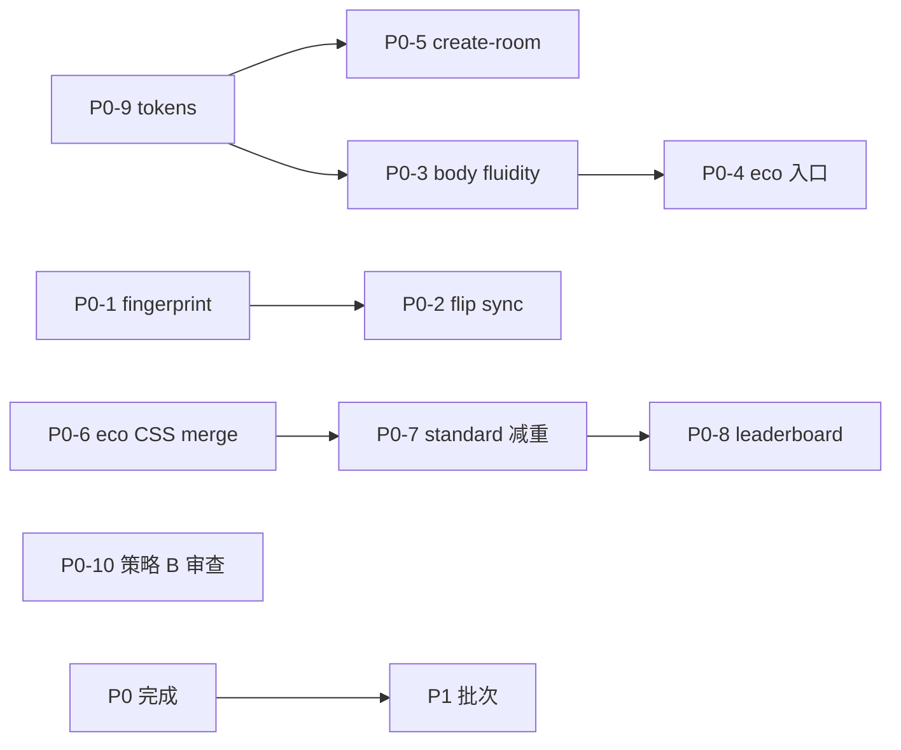

# 前端流畅度与质感改造方案（阶段 2 · 仅方案）

> **角色**：方案 Agent（合并对局 + 壳层审计）  
> **日期**：2026-05-22  
> **输入审计**：`frontend-fluidity-audit-game.md`、`frontend-fluidity-audit-shell.md`  
> **约束**：**禁止**改源码；**禁止** git commit / push；**不改后端**  
> **范围**：`front/dp_game` 全站（Vue 2 SPA）

---

## 0. 已锁定产品口径

| 项 | 口径 |
|---|---|
| 范围 | `front/dp_game` 全站；登录/大厅/建房/等待/历史/排行榜/曲库/教程/对局 |
| 后端 | **不改动**（WS 频率、API 形态维持现状；优化仅在客户端 reconcile / CSS / 布局） |
| 双档 | **节能档** = 少动效 + 静态色彩层次；**标准档** = 可有扑克相关动效，但须 **GPU 友好**（禁 `backdrop-filter`、关键帧 `blur`、多路 infinite 等） |
| 质感 | **色彩美学 + 视觉层次**（边框、字重、单层阴影、`color-mix` 面板底），**非**特效堆叠 |
| Android | **策略 B**：出厂/首次进入 **默认标准档**；仅用户 **手动** 开启节能；**禁止** UA / `prefers-reduced-motion` **自动** 切换档位或写入 `localStorage` |
| 系统 PRM | 可与节能 **叠加** 作为无障碍兜底（缩短动画），但 **不得** 替代策略 B 的「默认标准」决策 |

**与审计差异说明**：`audit-game` §6 第 3 条曾写「按 UA 默认关 blur」——本方案 **不采纳 UA 自动切档**；标准档下通过 **CSS/JS 减重**（见 P0）达到 Android 可玩，节能档由用户显式承担「少动效」。

---

## 1. 目标架构：全站双档

### 1.1 档位定义

| 档位 | 存储 | DOM 标记（建议） | 用户可见 |
|---|---|---|---|
| **标准档** | `localStorage.dp_game_eco_mode` 缺省或 `'0'` | `document.body[data-dp-fluidity='standard']`；对局根仍 `:data-dp-eco-mode="false"` | 默认；扑克可有 deal/flip/fold（GPU 友好版） |
| **节能档** | `'1'` | `body[data-dp-fluidity='eco']` + 对局 `.dp-game-root[data-dp-eco-mode='true']` | 顶栏/设置 **手动** 勾选；全站降级 |

### 1.2 同步点（实现时单一真源）

```
readEcoMode() / writeEcoMode()  (dpGameEcoMode.js)
  → Vuex SET_ECO_MODE
  → syncDpBodyFluidity(store)   【新建，main.js afterEach + subscribe】
  → body[data-dp-fluidity]
  → game.vue / GameButtonGuidePage :data-dp-eco-mode
```

**禁止**：`navigator.userAgent` / `matchMedia('(prefers-reduced-motion)')` 在 `created` 里 `writeEcoMode(true)`。

**允许**：`prefers-reduced-motion` 仅作 CSS 联合选择器（与 `[data-dp-fluidity='eco']` 并列），不改动 storage。

### 1.3 壳层与对局作用域

| 区域 | 标准档 | 节能档 |
|---|---|---|
| 对局 | `dp-poker-cards.css`、`dp-game-community-cards.css`、`dp-game-shell.css` 全量（减重后） | `dp-game-eco-mode.css` + 新 `dp-motion-tokens` 壳层规则 |
| 大厅/登录 | 可有轻量 hover / Element 默认过渡 | `body[data-dp-fluidity='eco']` 关 spin、缩短 dialog/drawer |
| `/guide` | 与对局同壳 `app--dp-game`，跟对局 eco 绑定 | 同左 |

---

## 2. 双档验收表

> 验收设备：**Android 中低端 Chrome**（两档各一轮）、**iOS Safari**（仅标准档）、**桌面 Chrome**（仅标准档）。  
> 主题：至少 `default` + 1 套自定义强调色。

| ID | 场景 | 标准档通过标准 | 节能档通过标准 | 失败即阻塞 |
|---|---|---|---|---|
| A1 | 冷启动登录 → `/home` | 无灰底闪屏 >300ms（`/create-room` 修复后）；主题底与 body 一致 | 同左；列表刷新 **无** infinite spin | P0 |
| A2 | 大厅 → `/game/:id` | 首屏可交互 ≤3s（chunk 已加载前提下）；壳切换无露 `#f5f7fa` 条 | 进房前可在大厅顶栏/设置 **手动** 开 eco（见 P0 顶栏入口） | P0 |
| A3 | 6 人桌发牌（preflop） | deal/fold 动画流畅，无明显掉帧（主观 + Performance 无长任务 >50ms 连续） | **无** hole deal fly；牌直接落位 | P0 |
| A4 | flop/turn/river | 3D flip ≤0.5s，**无** reveal glow 多层脉冲；**无** 牌背 infinite 呼吸 | 公共牌 **瞬时** 翻面（transform 可关）；无 glow | P0 |
| A5 | 连续 WS ~1s（NPC 房） | 指纹未变时 **无** 全桌 Vue commit 风暴；翻牌中牌型不误清 | 同左；flip 定时 ≤200ms 级完成 | P0 |
| A6 | 多人行动倒计时 | 圆环 `conic-gradient` 可接受；danger **无** 大面积 shadow 脉冲 | 计时器 **无** `backdrop-filter`；danger 静态色 | P1 |
| A7 | fold → muck | 飞牌轨迹可见（标准） | 立即完成，无 `getBoundingClientRect` 飞牌 | P1 |
| A8 | chip-leader / 摊牌 | 静态描边 + 单层阴影；摊牌 **无** 14px blur glass | 同左；已关 aura 动画 | P1 |
| A9 | `el-dialog` / `el-drawer`（大厅邮箱/好友） | 过渡 ≤300ms | eco：`transition: none` 或 ≤80ms | P1 |
| A10 | 排行榜 `/leaderboard` | 主色跟随 `--dp-accent`，无 `#409eff` 块 | 同左；tab 无动画或静态下划线 | P0 质感 |
| A11 | 手牌历史详情 | 加载态有层次（静态块），非长时间空白 | spinner **关闭** 或改为静态文案 | P1 |
| A12 | 路由 `/create-room` | `#app.app--lobby` 与 body 主题一致，无半屏露底 | 同左 | P0 |
| A13 | Android 默认进房 | **未** 勾选 eco 即为标准档 | 用户勾选后持久化，刷新仍 eco | 策略 B |
| A14 | iOS / PC | 标准档动效与色彩 **不弱于** 改造前主观质感（减特效不减层次） | 不要求测 eco（可选抽测） | 回归 |
| A15 | `npm run build` | 无 error；体积增量 <30KB gzip（token 两文件） | 同左 | 发布 |

---

## 3. 节能禁止项 / 标准允许项

### 3.1 节能档 — 全站禁止

| 类别 | 禁止项 | 主要现路径 |
|---|---|---|
| 滤镜 | `backdrop-filter`、`filter: blur()` 于 UI 面板/摊牌/计时器 | `dp-game-shell.css` A1/A2；eco 已部分关 |
| 无限动画 | `@keyframes` + `animation-iteration-count: infinite`（扫光、牌背呼吸、chip-leader aura、思考点、win-streak badge） | `dp-poker-cards.css`、`dp-game-community-cards.css`、`dp-game-shell.css` |
| 3D 重度 | 公共牌 `perspective` + 长 `rotateY`（>0.2s）；发牌/弃牌关键帧内 `blur` | `dp-game-community-cards.css`、`dp-poker-cards.css` |
| 脉冲阴影 | `box-shadow` 随 keyframes 缩放；`dp-mobile-action-pulse`、`dp-rival-turn-pulse` | `dp-game-shell.css` G1 |
| 路由壳 | `<transition>` 路由切换动画；keep-alive 入场动画 | 方案禁止新增 |
| 壳层 | `home-room-list-spin` infinite；`HandHistoryDetail` spinner；nav `translateY` hover | `home.vue`、`HandHistoryDetail.vue`、`App.vue` |
| Element | dialog/drawer 长 fade（>100ms） | `dp-game-element-ui.css` + `dp-motion-tokens.css` |
| JS | hole/community deal fly；fold muck fly；`syncCommunityCardsFlipState` 长 `setTimeout` 链；`bestHandCardEnterStyle` stagger delay | `GamePlayerCard.vue`、`GameCommunityCards.vue`、`game.vue` |
| 产品 | UA 自动 `writeEcoMode`；系统 PRM 自动写 storage | **策略 B** |

### 3.2 标准档 — 允许（须 GPU 友好）

| 类别 | 允许项 | 实现要求 |
|---|---|---|
| 扑克动效 | 发牌/翻牌/弃牌 **单次** `transform`/`opacity` 动画 | 禁关键帧 `blur`；时长 ≤0.55s；同时并行动画路数 ≤2 |
| 层次 | 台呢径向渐变、单层 `box-shadow`、`color-mix` 面板、1px 描边 | 不叠 4 层以上静态阴影；不叠 `::after` infinite 扫光 |
| 计时器 | `conic-gradient` 秒级更新 | 可保留；danger 用 **纯色** 非脉冲阴影 |
| 交互 | 按钮 `:active` opacity、tab 背景 0.15s | 禁止 `transform: scale` 大面积 |
| 壳层 | Element 短过渡、静态 loading 占位块 | 不用 `v-loading` 全屏遮罩动效 |
| 质感 | `--dp-depth-*` 边框/面板/字色；牌框 token 统一 | 见 §6 |

### 3.3 标准档 — 明确禁止（即使标准档）

| 项 | 原因 |
|---|---|
| `backdrop-filter` 于对局 UI | Android A1/A2 |
| `card-base::after` infinite 扫光 × N 牌 | Android A3 + overdraw |
| `card-back-breathe` infinite | Android A8 |
| `community-card-reveal-glow` 多层动画阴影 | Android A7 |
| `win-streak-card-aura` / `dp-table-action-timer-pulse` 大面积脉冲 | Android A9/A11 |
| 路由级 transition | 壳层审计 P1；节能口径 |

---

## 4. P0 / P1 任务表（含文件路径）

### 4.1 P0 — 必须先做

| ID | 任务 | 文件路径 | 验收关联 |
|---|---|---|---|
| P0-1 | **接入房间指纹**：WS/HTTP `applyRoomFromServer` 比较 `encodeRoomApplyFingerprint`，相同则跳过 `APPLY_ROOM` | `front/dp_game/src/utils/dpGameRoomFingerprint.js`；`front/dp_game/src/components/game.vue`（`applyRoomFromServer`、WS `onmessage`） | A5 |
| P0-2 | **`syncCommunityCardsFlipState` 对齐 eco**：`prefersReducedMotion()` 或 `ecoMode` 时批量 `SET_FLIP_AT` + 短 `flipComplete`（≤200ms） | `front/dp_game/src/components/game.vue`（约 1443–1491）；`front/dp_game/src/store/modules/dpGame.js` | A4、A5 |
| P0-3 | **全站双档 DOM**：`syncDpBodyFluidity`；`main.js` `afterEach` + `store.subscribe`；大厅根组件或 `App.vue` 读 `ecoMode` | **新建** `front/dp_game/src/utils/dpBodyFluidity.js`；`front/dp_game/src/main.js`；`front/dp_game/src/App.vue` | A1、A2、A13 |
| P0-4 | **顶栏/设置 eco 入口扩展到大厅**（仅手动切换，写 storage） | `front/dp_game/src/components/GameTopBar.vue` 或 **新建** `DpFluidityToggle.vue`；`front/dp_game/src/components/home.vue`；`front/dp_game/src/store/modules/dpGame.js` | A2、A13 |
| P0-5 | **路由真源统一**：`/create-room` 纳入 `isLobbyRoute` | `front/dp_game/src/App.vue`；`front/dp_game/src/utils/dpBodyGameTheme.js`（已含，仅 App 缺） | A12 |
| P0-6 | **合并 eco + PRM 样式源**，补 G1 mobile pulse、G8 公共牌 eco instant flip | `front/dp_game/src/styles/dp-game-eco-mode.css`；`front/dp_game/src/styles/dp-poker-cards.css`；`front/dp_game/src/styles/dp-game-community-cards.css`；`front/dp_game/src/styles/dp-game-shell.css` | A4、A8 |
| P0-7 | **标准档减重（非关动效）**：去掉 A3/A8/A9/A11 等 infinite/脉冲/blur；chip-leader 改静态描边；计时器 rich 改半透明实色 | `front/dp_game/src/styles/dp-poker-cards.css`；`front/dp_game/src/styles/dp-game-community-cards.css`；`front/dp_game/src/styles/dp-game-shell.css`；`front/dp_game/src/components/GameTableActionTimer.vue` | A4、A6、A14 |
| P0-8 | **排行榜主题 token 化**（去 `#409eff` 等） | `front/dp_game/src/components/LeaderboardPage.vue` | A10 |
| P0-9 | **引入 token 文件并在 main 全局加载** | **新建** `front/dp_game/src/styles/dp-motion-tokens.css`；**新建** `front/dp_game/src/styles/dp-depth-tokens.css`；`front/dp_game/src/main.js` | A15 |
| P0-10 | **确认无 UA 自动 eco**（代码审查 + 注释） | `front/dp_game/src/utils/dpGameEcoMode.js`；全站 grep `userAgent`、`prefers-reduced-motion` 写 storage | 策略 B |

### 4.2 P1 — 第二批

| ID | 任务 | 文件路径 | 验收关联 |
|---|---|---|---|
| P1-1 | 公共牌列表 **稳定 key**（避免 `cc-{idx}-{char}` 重建 DOM） | `front/dp_game/src/components/GameCommunityCards.vue` | A4 |
| P1-2 | `SET_FLIP_AT` 批量提交，减少逐张 `Vue.set` | `front/dp_game/src/store/modules/dpGame.js`；`game.vue` | A5 |
| P1-3 | 发牌/测距 **节流**（同帧仅一次 `getBoundingClientRect`） | `front/dp_game/src/components/GameCommunityCards.vue`；`front/dp_game/src/components/GamePlayerCard.vue` | A3 |
| P1-4 | `bestHandCardEnterStyle` 在 eco/PRM 下 delay=0 | `front/dp_game/src/components/GamePlayerCard.vue` | G13 |
| P1-5 | `tableFit` 高频推送时暂停 ResizeObserver（或 debounce 100ms） | `front/dp_game/src/mixins/dpGameTableFitMixin.js` | A5 |
| P1-6 | 双计时器 tick 合并评估 | `front/dp_game/src/mixins/dpGameActionCountdownMixin.js`；`front/dp_game/src/components/GameActionPanel.vue` | A6 |
| P1-7 | 壳层 loading：静态占位 + eco 关 spin | `front/dp_game/src/components/home.vue`；`front/dp_game/src/components/HandHistoryDetail.vue`；`front/dp_game/src/styles/dp-lobby-shell.css` | A11 |
| P1-8 | Element dialog/drawer eco 过渡 | `front/dp_game/src/styles/dp-game-element-ui.css`；`dp-motion-tokens.css` | A9 |
| P1-9 | `room.vue` loading/error 态 | `front/dp_game/src/components/room.vue` | — |
| P1-10 | `HandHistory.vue` / `HandHistoryDetail` 色板收敛到 `--dp-*` | `front/dp_game/src/components/HandHistory.vue`；`front/dp_game/src/components/HandHistoryDetail.vue` | A10 |
| P1-11 | 收敛壳层重复 `import` themes/lobby（仅依赖 main） | `home.vue`、`CreateRoom.vue`、`room.vue` 等 | 维护性 |
| P1-12 | `#app` 默认底 `#f5f7fa` → `var(--dp-game-bg)` token | `front/dp_game/src/App.vue`；`dp-depth-tokens.css` | A1 |
| P1-13 | `GamePlayGuideModal` 与 `el-dialog` 质感统一（圆角/阴影用 depth token） | `front/dp_game/src/components/GamePlayGuideModal.vue`；`front/dp_game/src/styles/dp-game-modals.css` | 质感 |
| P1-14 | 未连 WS 时 1s HTTP poll 与指纹协同 | `front/dp_game/src/components/game.vue`（307–313） | A5 |

### 4.3 P2 — 可延后

| ID | 任务 | 文件路径 |
|---|---|---|
| P2-1 | `/image_upload` 下线或重定向 | `front/dp_game/src/router/index.js` |
| P2-2 | 路由 chunk 静态壳占位（无新 npm） | `front/dp_game/src/App.vue`；`dp-lobby-shell.css` |
| P2-3 | `HandHistoryDetail` `--hd-*` 与全局 token 合并 | `HandHistoryDetail.vue` |
| P2-4 | 壳层 `@media (prefers-reduced-motion)` 与 eco 联合（不写 storage） | `dp-motion-tokens.css` |

---

## 5. 质感改造清单（不靠特效）

| ID | 动作 | 文件 | 档位 |
|---|---|---|---|
| Q1 | 台呢：标准保留静态径向+围边；节能不复制 `felt` 加厚块 | `dp-game-shell.css` 637–691 | 两档 |
| Q2 | 牌框/牌背统一 `--dp-card-frame-*`、`--dp-card-back-*` | `dp-game-themes.css`；`dp-poker-cards.css` | 两档 |
| Q3 | 牌型 pill 对比度微调 | `dp-game-shell.css` 2176–2186 | 两档 |
| Q4 | chip-leader：静态 2px 描边 + 单层外阴影 | `dp-poker-cards.css` 269–293 | 标准；节能已有 |
| Q5 | 计时器：半透明实色 + 1px 描边替代 blur rich | `dp-game-shell.css` 719–726；`GameTableActionTimer.vue` | 标准 |
| Q6 | 摊牌：渐变底替代 glass blur | `dp-game-shell.css` 2202–2217；`GamePlayerCard.vue` | 标准 |
| Q7 | 未翻牌背：静态亮度差，取消 infinite 呼吸 | `dp-game-community-cards.css` 108–120 | 标准 |
| Q8 | 手机 urgent 底栏：纯色按钮，关 `dp-mobile-action-pulse` | `dp-game-shell.css` 1334–1387 | **两档** |

---

## 6. Token 文件建议

### 6.1 `dp-depth-tokens.css`（色彩与层次）

```css
/* 建议挂载：body[data-dp-game-theme] 与 body[data-dp-fluidity] */
:root {
  --dp-depth-panel-bg: /* color-mix 面板 */
  --dp-depth-panel-border: 1px solid ...
  --dp-depth-elev-1: 0 1px 3px rgba(...)
  --dp-depth-elev-2: 0 4px 12px rgba(...)  /* 单层，禁止 4 层 stack */
  --dp-depth-text-primary: var(--dp-text-primary, ...)
  --dp-depth-accent: var(--dp-accent, ...)
}
```

**消费方**：`dp-lobby-shell.css`、`dp-auth-shell.css`、`LeaderboardPage`（改 scoped 后）、`dp-game-shell.css` 牌型 pill/胶囊、`dp-game-element-ui.css` 弹层圆角阴影。

**已有可复用**：`front/dp_game/src/constants/dpGameThemeColorTokens.js` — 方案阶段约定 JS 常量与 CSS 变量 **同名映射**，避免双份色值。

### 6.2 `dp-motion-tokens.css`（动效时长与 eco 开关）

```css
--dp-motion-duration-fast: 0.15s;
--dp-motion-duration-card: 0.45s;   /* 标准翻牌上限 */
--dp-motion-duration-none: 0s;

body[data-dp-fluidity='eco'] {
  --dp-motion-duration-card: 0s;
  /* 壳层 spin、dialog、nav 一并引用 */
}
```

**联合选择器模板**（减少 eco/PRM 双份维护）：

```css
body[data-dp-fluidity='eco'] .foo,
@media (prefers-reduced-motion: reduce) { .foo { animation: none; } }
```

### 6.3 `main.js` 加载顺序

```
dp-game-themes.css
dp-depth-tokens.css      ← 新，在 themes 后
dp-lobby-shell.css
dp-auth-shell.css
dp-motion-tokens.css     ← 新，在 element-ui 前
dp-game-element-ui.css
```

对局专用：`dp-game-eco-mode.css` 仍在 `game.vue` / 对局 chunk 或全局末位（与现网一致，实现时二选一避免重复）。

---

## 7. 风险与回滚

| 风险 | 影响 | 缓解 | 回滚 |
|---|---|---|---|
| 指纹漏字段导致 UI 不更新 | 筹码/牌面不同步 | 指纹注释已列 `APPLY_ROOM` 字段；单测 + NPC 房 A5 | 移除 `encodeRoomApplyFingerprint` 调用，恢复全量 `APPLY_ROOM` |
| flip 即时化破坏「翻牌中推送」逻辑 | 牌型不显示 | 保留 `game.vue` 1439–1441 `numNew===0` 不清定时器；回归 A5 | 恢复旧 `setTimeout` 链 |
| 标准档减特效用户主观「变丑」 | iOS/PC 投诉 | Q1–Q8 用静态层次补偿；A14 录屏对比 | 按文件 revert CSS 减重 commit |
| `body[data-dp-fluidity]` 与旧 eco 不同步 | 大厅 eco 无效 | P0-3 与 storage 单一写入点 | 仅保留 `.dp-game-root[data-dp-eco-mode]` |
| Element 过渡关断突兀 | 弹层闪现 | eco 仅缩短至 80ms 非全关（可选） | 去掉 `dp-motion-tokens` 中 dialog 规则 |
| build 体积略增 | 首包 | token 纯 CSS <5KB | 不引入新 npm |
| **误做 UA 自动 eco** | 违反策略 B | P0-10 code review | 删除 UA 分支 |

**回滚策略（发布级）**：

1. 前端静态资源按 hash 部署 → 回滚 JAR/镜像上一版 `front/dp_game/dist` 即可。  
2. `localStorage.dp_game_eco_mode` 向前兼容（`'1'`/`'0'` 语义不变）。  
3. 若仅指纹有问题，可热修单行跳过逻辑，无需动 Flyway/后端。

---

## 8. 自测 Checklist

### 8.1 构建与静态

- [ ] `cd front/dp_game && npm run build` — **0 error**
- [ ] 检查 `dist` 体积与上一版对比（token 增量可接受）
- [ ] 生产 `mvn spring-boot:run` 或 Docker 8088 访问 `/home`、`/game/:id` 资源 200

### 8.2 Android（策略 B + 两档）

**设备**：中低端 Android，Chrome 或 WebView。

| 步骤 | 标准档 | 节能档 |
|---|---|---|
| 清除站点数据后进入 | 确认 **未** 自动勾选 eco | 在大厅或对局顶栏 **手动** 开启 eco |
| 登录 → 大厅 → 建房 → 进 6 人 NPC 房 | A3、A4、A5、A6 | 同场景，无 fly/infinite/blur |
| DevTools Performance（可选） | WS 推送时无连续 Long Task | 同左，任务更短 |
| 退出再进 | 仍为 standard | 仍为 eco（storage） |

### 8.3 iOS / PC（仅标准档）

- [ ] Safari / Chrome：`/leaderboard` 色跟随主题（A10）
- [ ] 对局：翻牌/发牌/摊牌层次感不低于改造前（A14）
- [ ] 无 `backdrop-filter` 残留（Elements 搜索）
- [ ] 好友 drawer、邮箱 dialog 正常主题（A9 标准侧）

### 8.4 壳层路径

- [ ] `/create-room`：`#app` 含 `app--lobby`，无露底（A12）
- [ ] `/hand-history` → 详情：加载态可读（A11）
- [ ] `/guide`：eco 与对局一致
- [ ] 主题切换：大厅 ↔ 对局 body `data-dp-game-theme` 不断档

### 8.5 回归锚点（代码注释处）

- [ ] `game.vue` ~1439：`numNew===0` 不清 flip 定时器
- [ ] `encodeRoomApplyFingerprint` 与 `APPLY_ROOM` mutation 字段一致
- [ ] grep：无 `userAgent` → `writeEcoMode`

---

## 9. 实施顺序建议（给开发 Agent）



1. **第 1 周**：P0-9、P0-5、P0-3、P0-4、P0-10（基础设施 + 策略 B）  
2. **第 2 周**：P0-1、P0-2、P0-6、P0-7（对局性能）  
3. **第 3 周**：P0-8 + P1 壳层/质感 + §8 全量验收  

---

## 10. 文档索引

| 文档 | 用途 |
|---|---|
| `docs/refactor/frontend-fluidity-audit-game.md` | 对局 P0/P1、Android A1–A18、eco 缺口 G1–G14 |
| `docs/refactor/frontend-fluidity-audit-shell.md` | 壳层路由/loading/modal/eco 作用域 |
| `docs/refactor/frontend-fluidity-plan.md` | 本文 — 阶段 2 交付 |
| `front/dp_game/docs/THEME_BINDING_README.md` | 主题与 body 绑定约束 |

---

## 11. 交接汇总

| 项 | 值 |
|---|---|
| **交付文件** | `docs/refactor/frontend-fluidity-plan.md` |
| **P0 任务数** | 10 |
| **P1 任务数** | 14 |
| **验收表条目** | A1–A15 |
| **Android 策略** | **B**（默认标准，仅手动 eco，禁止 UA 自动切档） |
| **源码变更** | 阶段 2 **未执行**（仅方案） |

---

*实现由后续开发 Agent 按本方案分批提交；须遵守仓库 `CLAUDE.md`（先确认再改代码、Flyway 不动后端）。*
