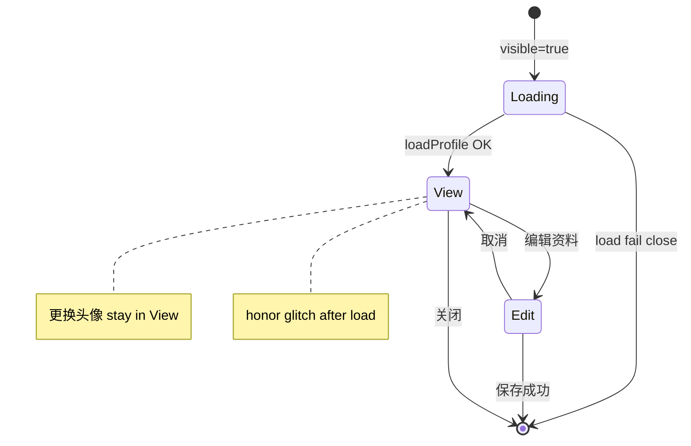

# HomeProfileModal 大厅个人资料卡 — UI 方案（P0）

| 项 | 值 |
|---|---|
| 目标文件 | `front/dp_game/src/components/HomeProfileModal.vue` |
| 入口 | `home.vue` 工具栏「个人资料」→ `:visible.sync="profileVisible"` |
| 方案版本 | 2026-05-28 |
| 用户已确认 | 方卡桌面 / 竖卡手机 / view·edit 分离 / 荣誉 glitch / eco+PRM 降级 / 仅 default 主题 P0 |
| **P0 硬约束** | **不改 API**；不动 `GamePlayerSocialSheet`；类名前缀 **`home-prof-*`** |

---

## 0. 文档目的与范围

### 0.1 目的

将大厅个人资料弹窗从「竖长表单 + 局内 `prof-*` 样式混用」升级为 **资料卡（Profile Card）** 形态：桌面近方卡 + 头像虚化背景；手机细长竖卡；查看/编辑分态；荣誉数字 glitch 揭示。业务与 `@saved` / `@avatar-updated` 契约 **零变更**。

### 0.2 P0 包含

- `HomeProfileModal.vue` 模板 / 脚本 / 样式重构（`home-prof-*`）
- `mode: 'view' \| 'edit'` 状态机（同 `el-dialog`）
- Dialog body 内 **backdrop 层**（头像 blur + scrim，仅桌面且非 eco/PRM）
- 荣誉区 **glitch → 800ms 闪出**（仅数值；昵称/ID 立即显示）
- `@media (max-width: 640px)` 竖卡布局；`min-width: 641px` 方卡 `aspect-ratio: 1/1`
- `shouldSkipEffects()`：`body[data-dp-fluidity='eco']` + `prefers-reduced-motion: reduce` 跳过 blur 与 glitch
- **在 `data-dp-game-theme='default'` 下验收**

### 0.3 P0 不包含

- 多主题（scifi / midnight 等）专项适配 → **P1**
- 后端、`GET/PUT /dpUser/profile`、`POST /dpUser/avatar` 变更
- `GamePlayerSocialSheet.vue` 局内资料 sheet
- 段位相框、分享卡片、动效 B 档 stagger

### 0.4 参考实现

| 参考 | 用途 |
|------|------|
| `CreateRoom.vue` | `shouldSkipStagger()` / eco·PRM CSS 模式 |
| `docs/refactor/create-room-ui-plan.md` | 本文档结构 |
| `DpUserAvatar.vue` | 头像展示与 `avatarFileSrc` |
| `dp-motion-tokens.css` | 动效 token；可选补充 home-prof eco 规则 |

---

## 1. 美学方向

| 维度 | 定义 |
|------|------|
| **Purpose** | 大厅内快速查看生涯荣誉、改昵称/密码、换头像 |
| **Tone** | 轻度游戏感资料卡：扑克花色点缀 + 勋章墙，非对局 HUD |
| **Differentiation** | 桌面 **方卡 + 头像铺满虚化底**；荣誉数字 **终端 glitch** 揭示 |
| **Constraints** | Vue 2 + Element（Dialog / Form / Upload 已注册）；`home-prof-*` 与局内 `prof-*` 隔离 |

### 1.1 Token（仅 `--dp-*`）

| 用途 | Token |
|------|--------|
| 卡面/对话框底 | `--dp-panel-bg` |
| _scrim_ | `color-mix(in srgb, var(--dp-panel-bg) 72%, transparent)` 叠在 blur 上 |
| 主文案 | `--dp-text-primary` |
| 次要/ID | `--dp-text-muted` |
| CTA 金 | `--dp-warning`（保存/编辑主按钮） |
| 勋章描边 | `--dp-warning` / `--dp-accent` / `--dp-danger` |
| 子块底 | `--dp-subpanel-bg` + `--dp-subpanel-border` |

### 1.2 尺寸 token（组件内 CSS 变量）

```css
.home-prof-card {
  --home-prof-card-max: min(92vw, 520px);
  --home-prof-avatar-desktop: clamp(88px, 22vw, 120px);
  --home-prof-blur: 28px;
  --home-prof-scrim: color-mix(in srgb, var(--dp-panel-bg) 78%, #000 22%);
  --home-prof-glitch-duration: 800ms;
}
```

---

## 2. 布局线框

### 2.1 桌面（≥641px）— 近方卡 1:1

```
┌──────────────────────────────────────────────┐  ← min(92vw,520px), aspect-ratio 1/1
│ ░░░░░ 虚化头像全卡背景 + scrim ░░░░░░░░░░░░░ │
│ ┌──────┐  昵称（立即）                        │
│ │ 头像 │  ID: 123（立即）                     │
│ │ 方框 │  [ 更换头像 ]                        │
│ └──────┘                                      │
│        ♦ 生涯荣誉 ♦                           │
│   [♛ 皇家] [♠ 同花顺] [4 四条]  ← glitch 数值 │
│   [最高净赢] [单房最高] [总局数]              │
│                    [ 编辑资料 ]  [ 关闭 ]     │
└──────────────────────────────────────────────┘
```

- 头像：**左上**，正方形相框（沿用金属框视觉，类名 `home-prof-avatar-frame`）
- 荣誉区：卡面中下；统计三列 grid
- Footer（view）：右下「编辑资料」「关闭」

### 2.2 手机（≤640px）— 细长竖卡

```
┌─────────────────────────┐
│      [ 头像居中 ]        │
│        昵称 / ID         │
│      [ 更换头像 ]        │
│  ── 生涯荣誉 ──          │
│  勋章行（可横向 scroll）  │
│  统计三列                 │
│ [ 编辑资料 ] [ 关闭 ]     │
└─────────────────────────┘
```

- **无** 全卡 blur backdrop（性能 + 竖卡无 1:1 画布）；纯色 `--dp-panel-bg`
- 头像居中叠放

### 2.3 编辑态（同 Dialog，`mode === 'edit'`）

```
┌──────────────────────────────┐
│ 个人资料          [×]        │
│ （可选：无 backdrop 或弱底）   │
│ ♣ 编辑资料 ♣                 │
│  昵称 [ input ]              │
│  密码状态 / 修改密码          │
│  当前密码 [ input ]          │
│        [ 取消 ]  [ 保存 ]    │
└──────────────────────────────┘
```

- 编辑态 **隐藏** 荣誉墙（聚焦表单）；「取消」→ `mode = 'view'`（不关闭 Dialog）
- 保存成功仍 `dialogVisible = false`（与现网一致）

### 2.4 Mermaid 状态机



---

## 3. Backdrop 规格

| 项 | 值 |
|----|-----|
| 挂载位置 | `el-dialog__body` 内、`.home-prof-card` 最底层 |
| 结构 | `.home-prof-backdrop` > `img.home-prof-backdrop__img` + `.home-prof-backdrop__scrim` |
| 图源 | `avatarFileSrc(form.avatarUrl, cacheBust, { variant: 'full' })`；无头像时不渲染层 |
| 模糊 | `filter: blur(var(--home-prof-blur))` + `transform: scale(1.15)` 防白边 |
| Scrim | 线性渐变 + 半透明 panel 色，保证白字/金钮对比度 ≥ 4.5:1 |
| 显示条件 | `min-width: 641px` **且** `!shouldSkipEffects()` |
| eco / PRM | 不渲染 backdrop；卡面用 `--dp-panel-bg` |

```css
.home-prof-backdrop__img {
  width: 100%; height: 100%;
  object-fit: cover;
  filter: blur(28px);
  transform: scale(1.12);
}
.home-prof-backdrop__scrim {
  position: absolute; inset: 0;
  background: linear-gradient(
    160deg,
    color-mix(in srgb, var(--dp-panel-bg) 55%, transparent),
    color-mix(in srgb, var(--dp-panel-bg) 88%, #000)
  );
}
```

---

## 4. Glitch 规格（仅 honor 数值）

### 4.1 作用域

| 字段 | glitch |
|------|--------|
| `royalFlushWins` / `straightFlushWins` / `fourOfAKindWins` | ✓ |
| `largestPotWon` / `largestRoomNet` / `totalHandsPlayed` | ✓（格式化后字符串） |
| `nickname` / `id` | ✗ 立即显示 |

### 4.2 阶段（JS）

| 阶段 | 时机 | UI |
|------|------|-----|
| `idle` | `loadProfile` 中 |  honor 区 hidden 或 skeleton |
| `scrambling` | `loadProfile` finally + `$nextTick` | 每 48ms 刷新乱码（`0-9A-Z!@#`） |
| `revealed` | scrambling 累计 **~320ms** 后进入 | CSS `home-prof-honor-val--reveal` **800ms** |

- `shouldSkipEffects()`：直接进入 `revealed`，无 scrambling
- `onClosed` / `visible=false`：清 timer，`honorGlitchPhase = 'idle'`

### 4.3 CSS

```css
@keyframes home-prof-honor-reveal {
  0% { opacity: 0.35; filter: brightness(2); transform: scale(1.06); }
  40% { opacity: 1; filter: brightness(1.35); }
  100% { opacity: 1; filter: none; transform: none; }
}
.home-prof-honor-val--reveal {
  animation: home-prof-honor-reveal var(--home-prof-glitch-duration)
    cubic-bezier(0.22, 1, 0.36, 1) both;
}
```

### 4.4 Eco / PRM

```css
body[data-dp-fluidity='eco'] .home-prof-backdrop,
body[data-dp-fluidity='eco'] .home-prof-honor-val--reveal { animation: none; }
body[data-dp-fluidity='eco'] .home-prof-backdrop { display: none; }

@media (prefers-reduced-motion: reduce) {
  .home-prof-backdrop { display: none !important; }
  .home-prof-honor-val--reveal { animation: none !important; }
}
```

---

## 5. view / edit 与 Footer

| mode | 主区 | Footer |
|------|------|--------|
| `view` | 身份 + 荣誉 + 更换头像 | 「编辑资料」「关闭」 |
| `edit` | `el-form` 昵称/密码（逻辑不变） | 「取消」→ view；「保存」→ `onSave` |

- `onClosed`：`mode = 'view'`，清密码字段、`editingPassword = false`、停止 glitch timer
- `loading`：全卡 loading（chip spin），无 honor glitch

---

## 6. 组件选型

| 区块 | 选型 |
|------|------|
| 壳 | `el-dialog` `custom-class="home-profile-dialog"` `width="min(92vw, 520px)"` |
| 头像 | `dp-user-avatar` size=`lg` |
| 上传 | `el-upload` `:http-request="onAvatarUploadRequest"`（view 可见） |
| 表单 | `el-form` / `el-form-item` / `el-input`（edit only） |
| 按钮 | 原生 `button.home-prof-btn` |

### 6.1 main.js

**无需新增注册**（已有 `Dialog`, `Form`, `FormItem`, `Input`, `Upload`）。

---

## 7. a11y

| 项 | 做法 |
|----|------|
| 关闭 | `aria-label="关闭"` |
| Dialog | Element 默认 `role="dialog"`；标题「个人资料」保留 |
| 乱码阶段 | `aria-busy="true"` on `.home-prof-honor` until `revealed` |
| 揭示后 | `aria-busy="false"`；数值用 `aria-label` 含中文标签（如「皇家同花顺 3 次」） |
| 对比度 | default 主题下 scrim 上正文抽检 ≥ 4.5:1 |
| 动效 | PRM / eco 无 glitch、无 blur |
| 焦点 | 打开 Dialog 后焦点在关闭钮；edit 时第一个 input 可聚焦 |

---

## 8. P0 验收清单

1. Home 工具栏打开资料卡；加载失败仍 toast + 关闭。
2. **桌面宽度 ≥641px**：Dialog 宽约 `min(92vw,520px)`，内容区 **1:1**；左上头像；背景虚化+scrim。
3. **手机 ≤640px**：竖卡；头像居中；无 blur backdrop。
4. **view**：昵称/ID 立即可见；荣誉数字 glitch 后约 800ms 稳定显示；「更换头像」可用。
5. **编辑资料** → edit；仅 edit 有昵称/密码表单；取消回 view；保存成功关窗并 `@saved`。
6. **eco**（`body[data-dp-fluidity=eco]`）或系统减少动效：无 blur、荣誉直接显示、无 glitch 动画。
7. **default 主题**下可读；切换 midnight 等不阻塞 P0。
8. `npm run build` 通过；API 路径与 payload 与改前一致。

---

## 9. P1 二期

| 项 | 说明 |
|----|------|
| 多主题 | scrim / 勋章色在深色主题回归 |
| 段位相框 | `home-prof-avatar-frame--gold` 等 |
| 编辑态保留荣誉只读预览 | 产品若要 |
| 分享资料卡 PNG | 新 API + canvas |
| 与局内 `GamePlayerSocialSheet` 视觉统一 | 抽 shared partial |

---

## 10. 实现交接

### 10.1 预计修改

| 文件 | 操作 |
|------|------|
| `docs/refactor/home-profile-ui-plan.md` | 本文 |
| `front/dp_game/src/components/HomeProfileModal.vue` | **主改** |
| `front/dp_game/src/styles/dp-motion-tokens.css` | 可选：eco 下 `.home-prof-honor-val--reveal { animation: none }` |

**不改**：`home.vue`（除非 props 事件签名变化）、后端、`GamePlayerSocialSheet.vue`、`main.js`。

### 10.2 业务冻结

- `loadProfile` / `onSave` / `onAvatarUploadRequest` 逻辑与校验不变
- `@saved` / `@avatar-updated` payload 不变

---

*方案撰写：前端 UI Agent · P0 文档*
