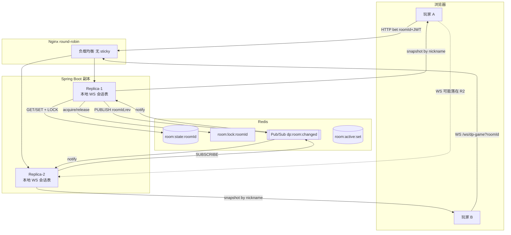
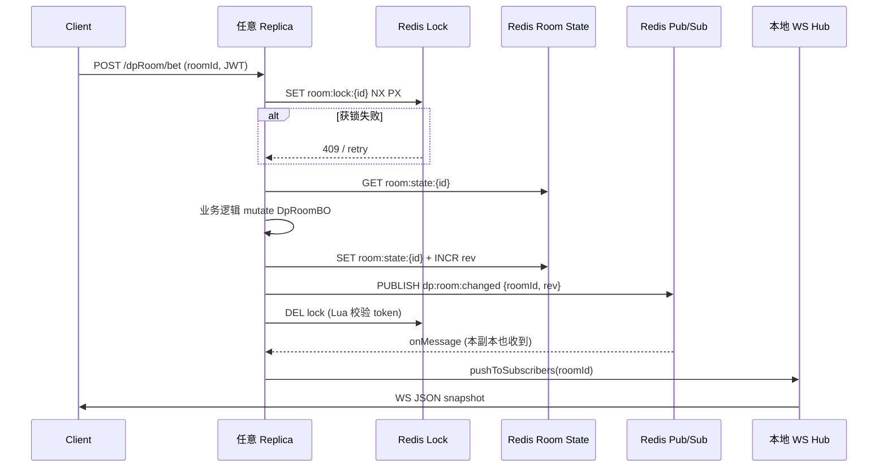

# 多实例 Redis 房间状态 — 归档方案（未实现）

> **文档性质**：架构归档 / 迁移蓝图。当前主线代码仍为 **单机 JVM `roomMap`**，本文描述目标态，**不代表已实现**。  
> **核对日期**：2026-06-12  
> **权威来源（现状）**：`DpRoomRegistry`、`DpRoomHeartbeatScheduler`、`DpGameRoomPushService`、`docs/WEBSOCKET.md`、`README.md`  
> **Status**: archived plan

---

## 1. 目标

| # | 目标 |
|---|------|
| G1 | 房间热状态从 JVM `roomMap` 外置到 **Redis**（`roomId` 为 key），任意副本均可读写同一房间 |
| G2 | WebSocket 连接 **分布在各副本**；**不要求** Nginx session sticky / `ip_hash` |
| G3 | 前端仅需 **JWT + roomId**（`roomId` 在 URL/请求参数，**不写入 JWT**） |
| G4 | 任意副本处理写请求：Redis get/update → **Pub/Sub 发布变更** → 各副本按本地 WS 订阅推送到对应 nickname |
| G5 | 并发由 **Redis 分布式锁**（非 JVM `synchronized`）保证同房互斥 |
| G6 | 广播 **仅在状态变更时** 触发（替代当前 1s 全量 tick 推送空转） |
| G7 | 多副本部署运维明确：`DpRoomLobbyReconcileScheduler` **关闭**；大厅摘要以分布式房间注册为准 |

---

## 2. 非目标

| # | 非目标 | 说明 |
|---|--------|------|
| NG1 | 本阶段改造 SSE / 快匹 WS | `SocialSseHub`、`DpQuickMatchPushService` 仍可按「粘滞或独立方案」后续迭代 |
| NG2 | 房间状态落 MySQL 实时同步 | 仍保持结算后牌谱异步落库；Redis 为热状态 SSOT |
| NG3 | 跨地域多活 / CRDT | 单 Redis 集群（或 Sentinel）即可 |
| NG4 | JWT 内嵌 roomId | 保持现有鉴权：JWT 仅身份；roomId 由客户端显式传递 |
| NG5 | 消除 `DpRoomBO` 内存对象 | 副本内仍可 deserialize 为 `DpRoomBO` 做业务逻辑，但持久真相在 Redis |

---

## 3. 优先级（P0 / P1）

### P0 — 多实例对局可用

1. `DpRoomRedisRepository`：房间 JSON / Hash 读写、`room:ids` 集合
2. `DpRoomDistributedLock`：`SET key NX PX` + Lua 续期/释放（或 Redisson，见 §6）
3. 写路径改造：`DpRoomServiceImpl` 所有 `synchronized(r)` → **锁 roomId → 读 Redis → 改 → 写 Redis → publish**
4. `DpRoomChangePublisher` + `DpRoomChangeSubscriber`：Pub/Sub 通知各副本
5. `DpGameRoomPushService`：保留本地 `roomId → WebSocketSession`；收到 Pub/Sub 后 **仅对订阅者** 按 nickname 生成快照并推送
6. **事件驱动广播**：下注/结算/进退房等 mutation 后 publish；1s tick **仅** 做超时/NPC/空房摘除（不再无条件 `broadcastIfSubscribed`）
7. 配置：`mgdemoplus.dp-lobby-reconcile-enabled=false`（多副本强制）
8. Nginx：`upstream app` 多 backend + **round-robin**（无 sticky）

### P1 — 体验与运维

1. 快匹：`JoinableQuickMatchRoomIndex` / 配对协调器改为 Redis 索引或单 leader 选举
2. 房间 BGM / 聊天：跨副本 via Pub/Sub 或 Redis 存 `lastRoomMusicJson`
3. `DpRoomHeartbeatScheduler` 拆分为：**全局 tick 仅本副本有房列表** vs **Redis 扫描活跃 roomId**（或订阅 room 集合变更）
4. 监控：锁等待时间、Pub/Sub 延迟、Redis 内存、每房 WS 订阅数
5. SSE `SocialSseHub`：Redis Pub/Sub 跨副本扇出（或文档化「SSE 仍粘滞」）

---

## 4. 架构图

### 4.1 请求与推送总览



### 4.2 写路径（单房）



---

## 5. Redis 数据结构草案

| Key | 类型 | 说明 | TTL |
|-----|------|------|-----|
| `dp:room:state:{roomId}` | String (JSON) 或 Hash | 序列化后的 `DpRoomBO`（或分字段 Hash）；含 `version` / `updatedAtMs` | 无（摘房 DEL） |
| `dp:room:rev:{roomId}` | String | 单调递增 revision，用于推送去重与 Pub/Sub payload | 随 state 删除 |
| `dp:room:lock:{roomId}` | String | 分布式锁 value=UUID+thread | PX 5–15s，续期 |
| `dp:room:active` | Set | 当前活跃 roomId；tick / 监控用 | — |
| `dp:room:subs:{roomId}` | Set（可选） | 全局订阅计数（非 WS 会话）；辅助「是否有订阅者」 | — |
| `dp:room:music:{roomId}` | String | 最后一帧 BGM JSON（跨副本补发） | 随房删除 |

**序列化建议**：

- P0 用 **JSON String** + Jackson 与现有 `DpRoomBO` 对齐，迁移成本最低。
- 大对象优化（P1）：Hot fields Hash + 冷字段 JSON blob。

**与现有 Redis 用途隔离**：

- 登录 JTI、`dp:lobby:*` 分页缓存、曲库、周榜 ZSET **不复用** room state key 前缀。

---

## 6. 分布式锁方案

### 6.1 为何 JVM `synchronized` 不够

当前 `DpRoomServiceImpl` 使用 `synchronized (DpRoomBO r)`，锁对象是 **本进程堆内实例**。多副本时：

- 玩家 A 的请求落在 Replica-1，玩家 B 落在 Replica-2 → **两把无关的锁** → 双写丢失更新。
- `ConcurrentHashMap` 各副本各一份 → 房间可能「只存在于一台机器」。

### 6.2 推荐实现（P0）

**方案 A — 原生 Redis + Lua（零新依赖）**

```text
ACQUIRE:  SET dp:room:lock:{roomId} {token} NX PX 10000
RENEW:    if GET == token then PEXPIRE
RELEASE:  Lua: if GET == ARGV[1] then DEL
```

- 锁粒度：**roomId**（与现有 `synchronized(r)` 同粒度）。
- 持锁期间：读 state → 内存 mutate → 写 state → publish → release。
- 超时：`PX` 10s + NPC/LLM 长调用需在锁内续期或缩短临界区（LLM 决策应 **锁外** 预计算，锁内仅提交 action）。

**方案 B — Redisson `RLock`（P1 可选）**

- 优点：看门狗续期、可重入 API。
- 缺点：新增依赖；需评估与 Spring Data Redis 版本兼容。

### 6.3 与快匹 / 全局锁的关系

- `dpQuickMatchAssignmentLock`、`JoinableQuickMatchRoomIndex.indexLock` 仍为 **JVM 锁** → P1 必须 Redis 化或 **leader 单点配对**。
- 文档 [dp-quick-match-concurrency.md](../dp-quick-match-concurrency.md) §6 已说明单机局限。

---

## 7. 广播策略：变更才推

### 7.1 现状（单机）

| 机制 | 位置 | 行为 |
|------|------|------|
| 1s tick | `DpRoomHeartbeatScheduler` | 每房调用 `broadcastIfSubscribed` |
| 去重 | `DpGameRoomPushService.lastBroadcastPayloadBySession` | 同 session 相同 JSON 则 skip |
| 例外 | `DpRoomServiceImpl` 结算 | 一处主动 `broadcastIfSubscribed`（抢跑桌边话） |

问题：多副本下 tick 各推各的；且 **每秒遍历 roomMap** 在 Redis 模式下浪费 IO。

### 7.2 目标策略

| 事件 | 动作 |
|------|------|
| 写路径成功 commit Redis | `PUBLISH dp:room:changed {roomId, rev, reason}` |
| 副本收到 Pub/Sub | 若本地 `roomSessions` 含该 roomId → 生成 per-nickname 快照 → 去重后 WS send |
| 新 WS 连接 | `sendInitialSnapshot` 直接 **Redis GET**（不经 Pub/Sub） |
| 1s tick | **不广播**（除非 tick 内发生了 state mutation，如踢人/空房摘除，则 publish） |
| `roomClosed` | publish + 本地 `shutdownSubscriptionsForRoom` |

**保留 per-session 去重**：跨副本仍按连接维度比较 JSON 字符串，避免重复帧。

**NPC 桌边话 / chat / music**：可走独立 channel `dp:room:ephemeral:{roomId}` 或合并在 changed 事件 reason 字段。

---

## 8. Pub/Sub 频道设计

| 频道 | Payload | 订阅者 |
|------|---------|--------|
| `dp:room:changed` | `{"roomId":"…","rev":42,"reason":"bet\|settle\|join\|…"}` | 所有 app 副本 `@PostConstruct` SUBSCRIBE |
| `dp:room:closed` | `{"roomId":"…"}` | 同上；触发本地 WS `roomClosed` 清理 |
| `dp:room:ephemeral`（P1） | chat / music / npc talk JSON | 同上，不经 state revision |

**注意**：

- Redis Pub/Sub **不持久**；订阅者离线期间消息丢失 → 客户端仍依赖 HTTP `getNowRoom` / WS 重连首包兜底（现有 15s backup poll 可保留）。
- 高可靠可选 P1：Redis Stream 或 MQ。

---

## 9. Nginx 多 upstream 配置要点

当前 `docker/nginx/default.conf` 为 **单 upstream `app:8088`**，无 `ip_hash`。

**目标示例**（round-robin，无 sticky）：

```nginx
upstream app_cluster {
    # 默认 round-robin；不要 ip_hash / sticky cookie
    server app-1:8088 max_fails=3 fail_timeout=30s;
    server app-2:8088 max_fails=3 fail_timeout=30s;
}

location /ws/ {
    proxy_pass http://app_cluster;
    proxy_http_version 1.1;
    proxy_set_header Upgrade $http_upgrade;
    proxy_set_header Connection $connection_upgrade;
    proxy_read_timeout 86400s;
}

location / {
    proxy_pass http://app_cluster;
    # ...
}
```

| 要点 | 说明 |
|------|------|
| **不要** `ip_hash` | 目标架构依赖 Redis 共房间，而非粘滞 |
| WS 与 HTTP 同 upstream | 同一 roomId 的连接可在不同副本 |
| `proxy_read_timeout` | WS / SSE 拉长（现有配置已 86400s） |
| SSE `/dp/social/stream` | 多副本仍 **无跨节点扇出**（P1 或粘滞）；`proxy_buffering off` 保持 |
| 健康检查 | `max_fails` + K8s readiness 配合 |

---

## 10. 多副本运维

| 配置项 | 单实例（现状） | 多副本（目标） |
|--------|----------------|----------------|
| `mgdemoplus.dp-lobby-reconcile-enabled` | `true`（默认） | **`false` 强制** |
| `DpRoomLobbyReconcileScheduler` | 启动 + 每分钟对齐 DB 与 **本机** roomMap | **禁用**；大厅行由 **upsert/delete 写路径** 维护 |
| `docker-compose-prod.yml` | 单 `app` 容器 | 多 `app` 实例 + 共享 Redis/MySQL |
| 进程重启 | 丢内存局 | Redis 有 state 则可恢复（需 TTL/清理策略） |
| 上传文件 volume | 单节点 `mgdemo_uploads` | 需 MinIO/NFS 共享（已有 MinIO 集成笔记） |

**Reconcile 风险（现状已文档化）**：

> 各节点 `roomMap` 不一致时，Reconcile 会删除 **DB 有、本机无** 的大厅行 → 误删他节点仍在线房间。

---

## 11. 与当前代码差异

| 模块 | 现状 | 目标态 |
|------|------|--------|
| `DpRoomRegistry.roomMap` | `ConcurrentHashMap` 进程内 SSOT | 薄封装 → Redis；或本地 L1 缓存 + Redis SSOT |
| `DpRoomServiceImpl` | `synchronized(DpRoomBO)` + 直接改 map | 分布式锁 + Redis RMW |
| `DpGameRoomPushService.roomSessions` | 进程内，注释已说明 | **保持进程内**（WS 必须本地） |
| `DpRoomHeartbeatScheduler` | 1s 遍历 `registry.values()` + broadcast | 1s tick 读 Redis active set；**mutation 才 publish** |
| `DpGameRoomWebSocketHandler` | `roomId` query + 可选 JWT | **不变**；roomId 不在 JWT |
| Redis 使用 | JTI、大厅缓存、曲库、周榜 | **新增** room state / lock / pubsub |
| Nginx | 单 app upstream | 多 upstream round-robin |
| 测试 | 单 JVM `@SpringBootTest` | 需 Testcontainers Redis + 双实例集成测 |

**代码中 **无** 以下泄漏类/文件**（2026-06-12 审计）：`DpRoomRedis*`、`RoomPubSub*`、`DistributedLock*`、`RedisMessageListenerContainer`、`ip_hash` 配置。

---

## 12. 迁移步骤（建议顺序）

1. **基础设施**：Redis 容量评估；新增 `dp:room:*` key 规范与监控。
2. **并行读写层**：实现 `DpRoomRedisRepository` + 分布式锁，单测覆盖竞态。
3. **Feature flag**：`mgdemoplus.room-storage=memory|redis`，默认 memory。
4. **改 DpRoomRegistry**：delegate 到 Redis（或 adapter 模式）。
5. **改 DpRoomServiceImpl**：替换锁与读写；mutation 末 publish。
6. **Pub/Sub 订阅器**：新 `@Component` 调 `DpGameRoomPushService.pushAfterChange(roomId)`。
7. **收缩 tick 广播**：删除 tick 内 unconditional broadcast；保留 mutation publish。
8. **双副本联调**：Nginx round-robin，两玩家同房异机 WS 验证。
9. **关闭 Reconcile**：多副本 env `MGDEMOPLUS_DP_LOBBY_RECONCILE_ENABLED=false`。
10. **P1 快匹 / SSE**：独立里程碑。

---

## 13. 验收标准

| # | 标准 |
|---|------|
| AC1 | 两副本 + round-robin：玩家 A、B 同房，WS 连在不同副本，互能看到下注/结算 |
| AC2 | 并发 bet：10 线程同 roomId，筹码一致，无丢失更新 |
| AC3 | 副本重启：Redis 中未结束局可继续（或明确「重启丢局」产品决策） |
| AC4 | 状态不变时 **无** 每秒 WS 流量（抓包验证） |
| AC5 | 摘房：所有副本 WS 收 `roomClosed`，Redis key 删除 |
| AC6 | 多副本运行 24h：`dp-lobby-reconcile-enabled=false` 下大厅列表无幽灵/误删 |
| AC7 | `roomId` 仅来自请求/WS query，JWT payload 无 roomId |

---

## 14. 风险与回滚

| 风险 | 缓解 | 回滚 |
|------|------|------|
| Redis 单点 | Sentinel / 云托管 | flag 切回 `memory` |
| 锁泄漏 | TTL + 续期 + 告警 | 手动 DEL lock key |
| Pub/Sub 丢消息 | 重连首包 + backup HTTP poll | — |
| 序列化兼容 | `version` 字段 + 迁移脚本 | 保留旧 JSON 解析 |
| 延迟上升 | 本地 L1 缓存（短 TTL） | — |
| 快匹未 Redis 化 | P0 可 **单副本处理快匹** 或暂禁多副本快匹 | — |

**回滚**：`mgdemoplus.room-storage=memory` + 单副本部署 + 恢复 reconcile（仅单实例）。

---

## 15. 待确认项

| # | 问题 | 建议默认 |
|---|------|----------|
| Q1 | Redis 中 `DpRoomBO` 用 JSON String 还是 Hash？ | P0 JSON String |
| Q2 | 进程 crash 后是否恢复进行中对局？ | 产品定；技术可恢复 |
| Q3 | LLM NPC 决策持锁时间 | 锁外决策，锁内仅 apply action |
| Q4 | 快匹 P0 是否阻塞多副本上线？ | 可暂限「仅房主房」或单 leader |
| Q5 | SSE / 成就通知是否 P0 一并 Redis 化？ | P1；或 SSE 粘滞 |
| Q6 | 是否需要 Redis Stream 替代 Pub/Sub？ | P0 Pub/Sub 足够 |
| Q7 | 共享上传（头像/曲库）多副本 | MinIO（见 INTEGRATION_NOTES） |

---

## 16. 代码库审计摘要（2026-06-12）

### 16.1 结论

**当前仓库为纯正单机实现；未发现旧分支泄漏的多实例/Redis 房间/Pub/Sub 实现代码。**

### 16.2 已实现（生产代码）

| 类别 | 文件/组件 | 说明 |
|------|-----------|------|
| 内存房间 | `room/support/DpRoomRegistry.java` | `ConcurrentHashMap` SSOT |
| 1s tick | `room/support/DpRoomHeartbeatScheduler.java` | 心跳/NPC + **`broadcastIfSubscribed`** |
| WS 推送 | `websocket/DpGameRoomPushService.java` | 注释：**单机内存，不依赖 Redis** |
| WS 握手 | `websocket/DpGameRoomWebSocketHandler.java` | `roomId` query + JWT |
| JVM 锁 | `room/impl/DpRoomServiceImpl.java` | `synchronized(DpRoomBO)` |
| SSE 单 JVM | `social/notify/SocialSseHub.java` | 注释：**P0 无跨实例扇出** |
| Redis（非房间） | 登录 JTI、大厅分页、曲库、周榜、OAuth state | 与 roomMap **无关** |
| Reconcile | `lobby/DpRoomLobbyReconcileScheduler.java` | 多实例警告注释 |

### 16.3 仅文档/注释（准确描述「未实现」）

| 文件 | 内容 |
|------|------|
| `docs/WEBSOCKET.md` §3、§10 | Redis 未用于 WS；多实例需 Pub/Sub |
| `docs/DPGAME.md` §1 | roomMap 不在 Redis |
| `docs/SpringScheduling.md` §1、§3 | reconcile 多实例风险；分布式锁未内置 |
| `README.md` / `README.ch.md` / `README.en.md` | 单实例免责；sticky **或** 分布式方案（选项，非已实现） |
| `docs/dp_friend_mailbox_mvp.md` | SSE 多副本需粘滞或 Pub/Sub，**未实现** |
| `docs/dp-quick-match-concurrency.md` §6 | 多机需 Redis 锁 |
| `docs/notes/BACKEND_INTERVIEW_QUESTIONS.md` | 面试题：扩展思路 |
| `.env.example` | reconcile 多实例建议 false |

### 16.4 死代码 / 泄漏代码

**无。** 未发现可安全删除的多实例孤儿类。

### 16.5 文档过时（非多实例，顺带记录）

| 文件 | 问题 | 建议 |
|------|------|------|
| `README.md` / `README.ch.md` | 引用 `RedisLabController` | 类已不存在；另开文档修复 |
| `docs/notes/BACKEND_INTERVIEW_QUESTIONS.md` Q5 | 同上 | 更新为实际 Redis 用途列表 |

### 16.6 本次清理

**无代码删除。** 现有文档已正确标明「单机 / 未实现多实例」，无需为 multi-instance 主题做 minimal doc 修正。

---

## 17. 文档与实现对照

| 路径 | 声称 | 实际 | 建议动作 |
|------|------|------|----------|
| `docs/WEBSOCKET.md` | 单机内存 + 多实例需自行扩展 | ✅ 一致 | 实现后更新 §3/§10 指向本文 |
| `docs/DPGAME.md` | roomMap 单机 | ✅ 一致 | 实现后改 §1 表格 |
| `docs/SpringScheduling.md` | tick + reconcile 风险 | ✅ 一致 | 实现后补充「Redis 模式 tick 无 broadcast」 |
| `README.md` | sticky **或** 分布式 | ✅ 选项描述 | 实现后可改为「推荐 Redis 方案见 plan」 |
| `docs/NGINX.md` | 单 app upstream | ✅ 一致 | 实现后增 §多副本 upstream 链到本文 §9 |
| `docs/refactor/room-mutation-side-effects.md` | 单机模型 | ✅ 一致 | 实现后增 Redis mutation 副作用 |
| `docs/dp-quick-match-concurrency.md` | §6 多机局限 | ✅ 一致 | P1 快匹 Redis 化后更新 |
| `docker/nginx/default.conf` | 单 `app:8088` | ✅ 一致 | 多副本时改 upstream |
| `docker-compose-prod.yml` | 单 `app` | ✅ 一致 | 水平扩容时复制 service |
| `docs/INTEGRATION_NOTES.md` | MinIO 等通用接入 | 与房间无关 | 多副本共享上传可参考 |

---

## 18. 参考链接（仓库内）

- [WEBSOCKET.md](../WEBSOCKET.md) — 当前 WS 与 1s 推送
- [DPGAME.md](../DPGAME.md) — REST 与 roomMap
- [SpringScheduling.md](../SpringScheduling.md) — Reconcile 与 tick
- [room-mutation-side-effects.md](./room-mutation-side-effects.md) — 改字段副作用
- [dp-quick-match-concurrency.md](../dp-quick-match-concurrency.md) — 单机锁说明
- [NGINX.md](../NGINX.md) — 反向代理
- [Redis.md](../Redis.md) — 现有 Redis 用途

---

*本文档随实现进度更新；实现前以代码与 WEBSOCKET.md 为准。*
