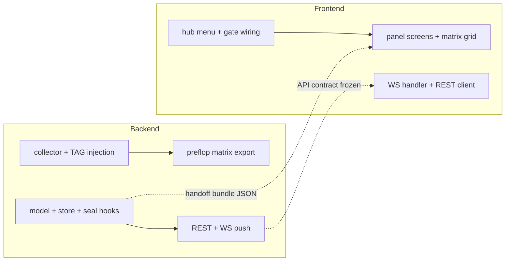

# NPC Decision Flow Analyzer — Implementation Plan (P0: TAG only)

> 状态：**计划文档（PM 已确认，待实现）**  
> 非目标：本阶段**不实现**、**不提交**；不写 DB；不暴露于公开 `getNowRoom`；不覆盖 Fish/Maniac/LLM。

---

## 1. Overview & goals

### 1.1 产品目标

房主在 **retro8bit** 主题对局内，通过房主终端打开「**分析决策**」（位于「实验排牌」下方），通过实验功能访问密码 gate 后，可查看最近最多 **100 手** TAG NPC（`BOT_TAG_*`）的决策 trace：

- 一手牌结算完成后，后端 **批量推送** 该手全部 TAG action trace 至房主 WS 连接；
- 房主可浏览 hand 列表 → action 列表 → 单条 action 的 **逐步推理 steps** + **翻前 13×13 range matrix**（如适用）；
- 数据 **仅内存**；房间解散后清空；不进入公开房间快照。

### 1.2 技术目标

| 目标 | 说明 |
|------|------|
| 低侵入采集 | 仅在 TAG 决策路径注入 step 记录；Fish/Maniac/LLM/Custom 零改动 |
| 与现有生命周期对齐 | `beginHand` / `sealOnSettle` / `clearHand` / `removeRoom` 镜像 `DpNpcStreetActionLog` + `LlmNpcGlobalHandConversationStore` |
| 安全隔离 | REST + WS 均 **房主 + JWT + 实验密码**；trace 永不写入 `DpRoomBO` / `getNowRoom` |
| retro8bit 专属 UI | 仅 `gameUiTheme === 'retro8bit'` 显示菜单入口；终端 CRT 风格 |

### 1.3 决策流水线（现状，P0 挂载点）

```
DpRoomHeartbeatScheduler.tickNpcTurnOrHumanActionTimeout
  → DpNpcEngine.decideActionIfReady(room, bot)     ← 【commit trace 点】
  → DpRoomServiceImpl.npcAction(room, p, action)

DpNpcEngine.decideActionIfReady
  → decideBotAction(room, bot, type)                 ← 【begin/finish trace 上下文】
    → DpNpcStrategyProvider.get().decidePreflop(ctx) ← preflop: DpNpcUnifiedPreflopStrategy
    → DpNpcStrategyProvider.get().decidePostflop(ctx)← postflop TAG: DpNpcTagPostflopStrategy
      → DpNpcHardConstraints.applyOrOverride(ctx, action)  ← L1 覆盖
```

TAG 识别：`DpNpcEngine.getBotTypeByNickname(nick) == BotType.TAG`（含 `BOT_TAG_*` 与 legacy `BOT_Tag`）。

---

## 2. Data model

### 2.1 层级结构

```
RoomTraceStore (per roomId, max 100 sealed hands)
└── HandTraceBundle (sealed at settle)
    ├── handMeta
    └── actions[]: ActionTrace (one per TAG decision)
        ├── actionMeta
        ├── steps[]
        └── preflopMatrix? (optional)
```

进行中一手：`roomId + handSeed` → `MutableHandTrace`（与 `DpNpcStreetActionLog` 同键策略）。

### 2.2 JSON Schema（REST / WS 共用）

#### `HandTraceBundle`

```json
{
  "roomId": "abc123",
  "handSeed": 1718123456789,
  "sealedAtMs": 1718123460000,
  "handIndex": 42,
  "dealerNickname": "Alice",
  "smallBlind": 10,
  "bigBlind": 20,
  "actionCount": 3,
  "actions": [ /* ActionTraceSummary | ActionTrace — 见 endpoint 说明 */ ]
}
```

| 字段 | 类型 | 说明 |
|------|------|------|
| `handSeed` | long | `DpRoomBO.getCurrentHandSeed()`，手内唯一 |
| `handIndex` | int | 房间内单调递增序号（seal 时分配，便于 UI 展示「第 N 手」） |
| `sealedAtMs` | long | 结算 seal 时刻 |
| `actions` | array | 按 `actionSeq` 升序 |

#### `ActionTraceSummary`（hand 列表 / WS 摘要）

```json
{
  "actionId": "1",
  "actionSeq": 1,
  "actorNickname": "BOT_TAG_1",
  "seatIndex": 2,
  "street": "preflop",
  "timestampMs": 1718123451000,
  "finalAction": { "type": "RAISE", "amount": 60 },
  "holeCards": ["hearts_A", "spades_K"]
}
```

#### `ActionTrace`（detail 完整体）

在 Summary 基础上增加：

```json
{
  "steps": [
    {
      "seq": 1,
      "phase": "CONTEXT",
      "code": "PREFLOP_SPOT",
      "message": "spot=FACING_OPEN raiseLevel=1 callAmount=40",
      "data": { "spot": "FACING_OPEN", "raiseLevel": 1, "position": "LATE", "rangeLevel": 5 }
    },
    {
      "seq": 2,
      "phase": "MATRIX",
      "code": "RANGE_CHECK",
      "message": "hero AKs in vsOpenContinue matrix → continue",
      "data": null
    }
  ],
  "preflopMatrix": { /* PreflopMatrixSnapshot，见 2.3 */ }
}
```

| 字段 | 类型 | 说明 |
|------|------|------|
| `actionId` | string | `{handSeed}-{actionSeq}` 或纯 `actionSeq` 字符串；**同一 hand 内唯一** |
| `actionSeq` | int | 该手内 TAG 第几次行动，从 1 递增 |
| `seatIndex` | int | `room.getPlayers().indexOf(bot)` |
| `street` | string | `room.getCurrentStage()`：`preflop` / `flop` / `turn` / `river` |
| `finalAction.type` | enum | `FOLD` \| `CALL_OR_CHECK` \| `RAISE` \| `ALL_IN`（对齐 `DpNpcEngine.BotActionType`） |
| `holeCards` | string[2] | TAG 手牌；仅房主可见，**禁止**写入 `getNowRoom` |
| `steps[].phase` | string | `CONTEXT` \| `EVAL` \| `MATRIX` \| `PROB` \| `PLAN` \| `L1` \| `RESULT` |
| `steps[].code` | string | 稳定机器码，便于 i18n / 测试断言（如 `PREFLOP_SPOT`, `FOLD_ROLL`, `L1_BLOCK_FOLD`） |

### 2.3 Preflop 13×13 matrix 格式

翻前决策完成后附带 **该次决策使用的最终矩阵**（非中间快照链）。

```json
{
  "labels": ["A","K","Q","J","T","9","8","7","6","5","4","3","2"],
  "cells": [
    [1,1,1,0,0,0,0,0,0,0,0,0,0],
    ...
  ],
  "heroCell": { "row": 0, "col": 1, "inRange": true },
  "matrixKind": "vsOpenContinueAllow",
  "spot": "FACING_OPEN",
  "position": "LATE",
  "rangeLevel": 5,
  "heroHandLabel": "AKs"
}
```

| 字段 | 说明 |
|------|------|
| `cells` | 13×13，`1`=在该矩阵中允许 / 继续，`0`=不在范围；索引规则与 `DpNpcUnifiedPreflopStrategy.matrixAllows` 一致：对角线对子；`row > col`  offsuit；`row < col` suited |
| `matrixKind` | `openAllow` \| `vsOpenContinueAllow` \| `vsOpen3BetValueAllow` \| `vs3BetContinueAllow` \| `vs3Bet4BetValueAllow` \| `facing4BetPotOddsCallAllow` \| `facing4BetJamAllow` \| `facing4BetMidG3Allow` |
| `heroCell.row/col` | 0-based，对应 rank 2→index 0 … A→index 12 |
| `heroHandLabel` | UI 展示用，如 `AKs` / `QQ` |

矩阵数据来源：新增 `DpNpcUnifiedPreflopStrategy.exportDecisionMatrix(...)` 包可见方法，在 `decide(...)` 分支选定 matrix 后调用 `fillRangeSlice` 同源逻辑，返回 `byte[13][13]` 转 `int[][]`。

翻后 action：`preflopMatrix` 为 `null`，steps 仍记录 plan / fold prob / L1 等。

---

## 3. Backend design

### 3.1 新类与包结构

```
src/main/java/com/example/mgdemoplus/npc/trace/
├── DpNpcTagDecisionTraceStore.java      # 内存 store：begin / append / seal / query / removeRoom
├── DpNpcTagDecisionTraceCollector.java  # ThreadLocal 当前 action 的 step 构建器
├── DpNpcTagDecisionTraceSupport.java    # isTagBot(nick), actionId 格式化, BotAction → JSON
├── model/
│   ├── DpNpcHandTraceBundle.java
│   ├── DpNpcActionTrace.java
│   ├── DpNpcTraceStep.java
│   ├── DpNpcPreflopMatrixSnapshot.java
│   └── DpNpcActionTraceSummary.java
├── DpNpcTagDecisionTracePushService.java # seal 后调 DpGameRoomPushService 推房主
└── preflop/
    └── DpNpcPreflopMatrixExporter.java  # 薄封装，调用 DpNpcUnifiedPreflopStrategy 新 export API

src/main/java/com/example/mgdemoplus/room/dto/
├── NpcDecisionTraceHandListRequest.java   # roomId + experimentalPassword (query)
├── NpcDecisionTraceHandRequest.java
└── NpcDecisionTraceActionRequest.java

# 可选：Controller 独立类（推荐，避免 DpRoomController 膨胀）
src/main/java/com/example/mgdemoplus/controller/DpNpcDecisionTraceController.java
```

**职责摘要**

| 类 | 职责 |
|----|------|
| `DpNpcTagDecisionTraceStore` | `ConcurrentHashMap`：`roomId → RoomRingBuffer(100)`；`Key(roomId,handSeed) → MutableHand`；线程安全 append |
| `DpNpcTagDecisionTraceCollector` | `begin(room,bot)` / `step(phase,code,msg,data)` / `attachMatrix(snapshot)` / `build(action)` / `clear()` |
| `DpNpcTagDecisionTracePushService` | `pushHandSealed(room, bundle)` → 调 push service |
| `DpNpcPreflopMatrixExporter` | 从 preflop decide 路径入参导出 matrix snapshot |

**全局开关（rollback）**

```java
// DpNpcTagDecisionTraceStore.java
public static volatile boolean ENABLED = true;
```

设为 `false` 时所有 hook no-op。

### 3.2 In-memory store API

```java
public final class DpNpcTagDecisionTraceStore {

    public static void beginHand(DpRoomBO room);
    /** TAG 行动决策完成后调用（decideActionIfReady 返回非 null action 时） */
    public static void appendAction(DpRoomBO room, DpPlayer bot, BotAction action, DpNpcActionTrace trace);
    /** 结算路径：将当前 hand 移入 room 环缓冲，返回 bundle 供 push/REST */
    public static DpNpcHandTraceBundle sealHand(DpRoomBO room);
    /** 丢弃进行中 buffer（不删已 seal 的 100 手） */
    public static void clearHand(DpRoomBO room);
    public static void removeRoom(String roomId);

    // REST 查询
    public static List<DpNpcHandTraceBundle> listHandSummaries(String roomId); // actions 仅 summary
    public static DpNpcHandTraceBundle getHandBundle(String roomId, long handSeed);
    public static DpNpcActionTrace getActionDetail(String roomId, long handSeed, String actionId);
}
```

**Ring buffer 语义**

- `sealHand`：`MutableHand → HandTraceBundle` 追加到 `roomId` 的 `ArrayDeque`；超过 100 则 `pollFirst()` 丢弃最旧；
- `handIndex`：每 room 单调递增 `AtomicInteger`；
- `clearHand`：仅 `remove(Key(roomId, handSeed))` 的 mutable 条目；
- `removeRoom`：删除 `roomId` 下全部 mutable + sealed deque。

**内存估算（风险参考）**：假设每 action ~2KB steps+matrix，每手 8 action，100 手 ≈ 1.6MB/room，可接受。

### 3.3 采集锚点清单（P0 TAG only）

#### A. 入口 / 出口（必须）

| 文件 | 方法 | 改动 |
|------|------|------|
| `DpNpcEngine.java` | `decideBotAction` (~L2007) | `if (type==TAG && ENABLED) collector.begin(room,bot)`；preflop/postflop 调用后 `collector` 不 finish |
| `DpNpcEngine.java` | `decideActionIfReady` (~L1654–1666) | 得到非 null `action` 且 TAG 时：`trace = collector.build(action)` → `DpNpcTagDecisionTraceStore.appendAction(...)` → `collector.clear()` |
| `DpNpcEngine.java` | `decideActionIfReady` | 若 `type != TAG` 或提前 return null：`collector.clear()` 防泄漏 |

#### B. Preflop steps + matrix（必须）

| 文件 | 方法 | 记录内容 |
|------|------|----------|
| `DpNpcUnifiedPreflopStrategy.java` | `decide` | CONTEXT：`spot`, `rangeLevel`, `position`, `heroHand`, `activePlayers`, `effStackBB` |
| 同上 | `decideUnopened` / `decideFacingOpen` / `decideFacing3Bet` / `decideFacing4Bet` | MATRIX：`matrixKind`, hero in/out；RESULT：分支名 |
| 同上 | 各 `decide*`  return 前 | 调用 `DpNpcPreflopMatrixExporter.capture(...)` → `collector.attachMatrix` |
| `DpNpcUnifiedPreflopStrategy.java` | **新增** `exportDecisionMatrix(...)` | 返回当前分支使用的 `byte[13][13]` + metadata |

采集方式：在 `decide` 内通过 `DpNpcTagDecisionTraceCollector.current()` 判空后写 step（**不**改方法签名链）。

#### C. Postflop TAG steps（必须）

| 文件 | 方法 | 记录内容 |
|------|------|----------|
| `DpNpcTagPostflopStrategy.java` | `decide` | CONTEXT：`stage`, `callAmount`, `HandPlanType`, `made`, `draw`, `tex` |
| 同上 | `tryFoldFacingBet` | PROB：`baseFold` 关键中间值；若 fold → RESULT |
| 同上 | `decideFacingBet` / `decideNoBet` | RESULT：下注/加注尺度 rationale（一行摘要） |
| `DpNpcHardConstraints.java` | `applyOrOverride` | 若 TAG trace active 且 fold→call 覆盖：L1 step `L1_BLOCK_FOLD` |

#### D. Facade（可选薄记录）

| 文件 | 方法 | 记录 |
|------|------|------|
| `DpNpcStrategyFacadeImpl.java` | `decidePreflop` / `decidePostflop` | 仅当 `ctx.botType==TAG`：step `FACADE_ROUTE`（debug 用，可省略若下层已够） |

**明确不挂载**：`decideCustomBotAction`、LLM 路径、`DpNpcFishStrategy` 等其它 archetype。

### 3.4 生命周期 Hook 注册

镜像 `DpNpcStreetActionLog` / `LlmNpcGlobalHandConversationStore`：

| 事件 | 文件 | 方法 | 调用 |
|------|------|------|------|
| 新一手 | `DpRoomServiceImpl.java` | `newHandWithoutLobbyUpsert` (~L2338) | `DpNpcTagDecisionTraceStore.beginHand(r)` **紧接** `DpNpcStreetActionLog.beginHand(r)` |
| 正常结算 | `DpRoomServiceImpl.java` | `autoSettleNormalPotShowdownPath` (~L3411–3421) | **在** `DpNpcStreetActionLog.clearHand` **之前**：`bundle = sealHand(r)` → `tracePushService.pushHandSealed(r, bundle)` → `clearHand(r)` |
| 零池/quick settle | `DpRoomServiceImpl.java` | 零池路径 (~L3098) | 同上 seal → push → clearHand |
| 房间移除 | `DpRoomServiceImpl.java` | `removeRoom` (~L459–461) | `DpNpcTagDecisionTraceStore.removeRoom(roomId)` **紧接** `llmNpcGlobalHandConversationStore.removeRoom` |

**注意**：`sealHand` 必须在 `clearHand` 之前，否则 mutable key 已被删。若该手无任何 TAG action，仍 seal 空 `actions: []`（便于 UI 显示「本手无 TAG 行动」）— 或 **跳过 push** 空 bundle（推荐：**无 TAG action 不 push、不占 ring buffer 槽位**）。

### 3.5 Hand-end WS push

#### 消息类型

```json
{
  "_ws": "npcDecisionTraceHand",
  "roomId": "abc123",
  "handSeed": 1718123456789,
  "handIndex": 42,
  "sealedAtMs": 1718123460000,
  "actionCount": 3,
  "bundle": { /* 完整 HandTraceBundle，actions 为 ActionTraceSummary[] */ }
}
```

- **`_ws` 固定值**：`npcDecisionTraceHand`（与现有 `chat` / `roomMusic` / `roomClosed` 并列）。
- **payload**：含完整 `bundle`，但 `actions[]` 仅 **Summary**（不含 steps/matrix），减轻帧体积；详情走 REST `getAction`。

#### 推送目标：仅房主

在 `DpGameRoomPushService` 新增：

```java
/** 向房间内 viewerNickname 与 ownerNickname 匹配的 open 会话发送（可多开标签页各收一份） */
public void sendRawJsonToRoomOwner(String roomId, String ownerNickname, String json);
```

实现：遍历 `roomSessions.get(roomId)`，取 `session.getAttributes().get("viewerNickname")`，与 `ownerNickname` 字符串相等则 `sendMessage`（逻辑同 `shutdownSubscriptionsForNicknameInRoom` 的匹配方式）。

调用链：

```
DpRoomServiceImpl.autoSettle* 
  → DpNpcTagDecisionTraceStore.sealHand(r) 
  → DpNpcTagDecisionTracePushService.pushHandSealed(r, bundle)
      → pushService.sendRawJsonToRoomOwner(r.getRoomId(), r.getOwner(), json)
```

**时序**：在 `gameRoomPushService.broadcastIfSubscribed` **之前或之后** 均可；推荐 **之后**（settled 快照先到，trace 面板异步刷新）。与 `npcTableTalkService.afterHandSettled` 无强依赖。

### 3.6 REST endpoints

**安全**：全部需 **JWT**（`DpCurrentUserSupport.requireUser()`）+ **房主**（`isRoomOwnerNickname`）+ **`DpExperimentalDeckPresetPasswordGuard.gate(experimentalPassword)`**。

密码验证 endpoint **复用**，不新建：

| 方法 | 路径 | 说明 |
|------|------|------|
| POST | `/dpRoom/verifyExperimentalDeckPassword` | 已有；前端 gate 共用 |

新增（建议前缀 `/dpRoom/npcDecisionTrace/`）：

| 方法 | 路径 | 请求 | 响应 `ResultUtil.data` |
|------|------|------|------------------------|
| GET | `/dpRoom/npcDecisionTrace/hands` | `roomId`, `experimentalPassword` (query) | `{ hands: HandTraceBundle[] }` — 每手仅 meta + `ActionTraceSummary[]` |
| GET | `/dpRoom/npcDecisionTrace/hand` | `roomId`, `handSeed`, `experimentalPassword` | `{ bundle: HandTraceBundle }` — summaries |
| GET | `/dpRoom/npcDecisionTrace/action` | `roomId`, `handSeed`, `actionId`, `experimentalPassword` | `{ action: ActionTrace }` — 含 steps + matrix |

**JWT 白名单**：**不要**加入 `JwtSecurityConstants.PERMIT_ALL`（与 deck preset 一致，需登录）。

Controller 示例挂载：

```java
@RestController
@RequestMapping("/dpRoom/npcDecisionTrace")
public class DpNpcDecisionTraceController { ... }
```

Service 层可放在 `DpRoomServiceImpl` 委托方法，或独立 `DpNpcDecisionTraceQueryService`（推荐后者，保持 `DpRoomServiceImpl` 体量）。

### 3.7 与 `getNowRoom` 隔离

- `DpNpcTagDecisionTraceStore` **不得**挂到 `DpRoomBO` 任何字段；
- `snapshotForViewerFromLive` / `getRoomSnapshotForViewer` **零改动**；
- WS 推送使用 **独立 `_ws` 帧**，不嵌入房间 JSON 快照。

---

## 4. Frontend design (retro8bit only)

### 4.1 菜单入口

**文件**：`front/dp_game/src/components/GameOwnerHubContent.vue`

在 `rootItems` 的 **`deck-preset` 之后** 插入（**仅** `gameUiTheme === 'retro8bit'`）：

```javascript
{ id: 'decision-trace', label: '分析决策' }
```

- 新增 prop：`gameUiTheme: { type: String, default: 'default' }`
- `computed rootItems`：filter 或条件 splice；非 retro8bit **不渲染**该项
- `activateRootItem`：`decision-trace` → `$emit('open-decision-trace')`

**冒泡链**（与 deck-preset 相同）：

```
GameOwnerHubContent → GameOwnerTouchPanel / GameOwnerHubPanel 
  → GameDpGameSheets → game.vue
```

需改：

| 文件 | 改动 |
|------|------|
| `GameOwnerTouchPanel.vue` | `@open-decision-trace="$emit('open-decision-trace')"` |
| `GameOwnerHubPanel.vue` | 同上（宽视口键盘终端） |
| `GameDpGameSheets.vue` | 传 `@open-decision-trace="() => vm.openDecisionTracePanel()"`；挂载新 overlay 组件 |
| `game.vue` | `openDecisionTracePanel()` 实现 |

### 4.2 密码 gate

**复用** `GameDeckPresetPasswordGate.vue` + `dpDeckPresetUnlock.js`：

- **sessionStorage key 共用**：`dp_deck_preset_unlock_{roomId}`（同一密码、同一 gate 组件、同一 verify API）
- 流程：`openDecisionTracePanel()` → 若 `isDeckPresetUnlocked(roomId)` 直接开面板，否则 `showDeckPresetPasswordGate = true` → `onDeckPresetPasswordVerified` 后开面板

可选 UX：gate 标题/retro 文案通过 prop `featureLabel="DECISION_TRACE"` 区分（**P1**）；P0 可共用「实验排牌」文案，功能上无阻碍。

REST 请求带 `experimentalPassword: dpDeckPresetSessionPassword(roomId)`；失败时走现有 `handleDeckPresetAuthFailure`。

### 4.3 UI 流程与组件

```
GameNpcDecisionTracePanel.vue          # retro8bit 全屏/大 overlay shell（CRT）
├── screen: hand-list                  # 最近 N 手，新→旧
├── screen: action-list                # 选中手的 TAG actions
└── screen: action-detail              # steps 滚动 + matrix grid

GameNpcDecisionTraceMatrixGrid.vue   # 13×13 网格，磷光绿 terminal 色
```

**状态机**（panel 内 `menuStack` 或单 `screen` enum）：

1. **hand-list**：显示 `handIndex`, `sealedAtMs`, `actionCount`；点击进入 action-list
2. **action-list**：每行 `actionSeq`, `street`, `finalAction`, `actorNickname`；点击进入 detail
3. **action-detail**：左侧/上方 step 列表（`phase` badge + `message`）；翻前时下方/右侧 `GameNpcDecisionTraceMatrixGrid`；hero cell 高亮

**样式**：复用 `dp-deck-preset-gate-retro` / `dp-owner-touch__console--retro` 的 font、scanline、边框 token；矩阵 cell：`inRange=1` 亮绿，`0` 暗灰，hero 加 yellow border。

### 4.4 WS push vs REST fallback

**`game.vue` `ws.onmessage`**（~L1299）增加分支：

```javascript
if (data._ws === 'npcDecisionTraceHand') {
  self.onNpcDecisionTraceHandPush(data)
  return
}
```

`onNpcDecisionTraceHandPush(data)`：

- 若 `showNpcDecisionTracePanel` 或 hub 刚打开：merge `data.bundle` 进 local `traceHands` store（按 `handSeed` upsert，新 hand 插头部）
- 可选：retro toast `> HAND #${handIndex} TRACE READY (${actionCount})`

**Fallback REST**：

- 打开 panel 时：`GET /dpRoom/npcDecisionTrace/hands?roomId&experimentalPassword`
- 进入 action-list：`GET .../hand?handSeed=...`（若 summary 不足）
- 进入 detail：`GET .../action?handSeed&actionId=...`
- WS 丢失时用户手动刷新 hand-list（panel 内 `[REFRESH]` 按钮）

### 4.5 Element UI / 组件注册

- 新组件在 `GameDpGameSheets.vue` **局部 import**（与 `GameDeckPresetDialog` 相同），**无需** `main.js` 全局注册
- z-index：在 `dpModalZIndex.js` 增加 `decisionTrace: 9310`（高于 deckPreset 9300）

### 4.6 非 retro8bit

- `rootItems` 无入口；
- 不挂载 `GameNpcDecisionTracePanel`（或 `v-if="gameUiTheme === 'retro8bit'"`）。

---

## 5. P0 vs P1 scope

| 项 | P0 | P1 |
|----|----|----|
| NPC 范围 | TAG (`BOT_TAG_*`) only | Fish, Maniac, LAG, NIT, CALL, Custom |
| 主题 / 入口 | retro8bit owner hub | 其它主题 / 桌面端独立窗口 |
| 推送 | hand-end WS + REST fallback | SSE；实时 action 级 push |
| Preflop matrix | 最终 13×13 | 中间矩阵 diff / 动画 |
| 密码 gate | 共用 deck preset | 独立 feature flag / 独立密码 |
| 存储 | 内存 100 手 | 可选 DB 归档、导出 JSON |
| 测试 | 手动 + 少量单元测试（store/seal） | 全链路集成测试、step 快照 golden |
| LLM | 不做 | BOT_LLM 推理链 |
| i18n | steps `message` 中文硬编码 | `code` → i18n map |
| 性能开关 | `ENABLED` 静态布尔 | 按 room 配置 |

---

## 6. Verification

### 6.1 手动测试步骤

1. **环境**：`.env` 设置 `EXPERIMENTAL_DECK_PRESET_PASSWORD`；启动 `mvn spring-boot:run`；前端 retro8bit 主题进房为房主。
2. **Gate**：房主 hub →「分析决策」→ 密码 gate → 验证通过 → 空 hand 列表。
3. **采集**：添加 `BOT_TAG_1`，玩一手 preflop+postflop 多次 TAG 行动 → 结算。
4. **WS**：浏览器 DevTools → WS 帧含 `_ws:npcDecisionTraceHand`，`actionCount > 0`。
5. **UI**：面板自动出现新手；点进 action → steps 非空；preflop action 见 13×13 网格且 hero 高亮。
6. **REST**：curl 带 JWT + query password → `/hands` `/action` 返回一致。
7. **隔离**：匿名 `getNowRoom` 响应无 trace 字段。
8. **非 TAG**：仅 FISH 桌 → 结算后无 push（或 0 action 不占 buffer）。
9. **100 手环**：快速跑多手（可降 thinking delay）→ 列表最多 100 条。
10. **解散**：解散房间 → REST `/hands` 404/空；内存泄漏目测稳定。
11. **非 retro8bit**：换主题 → hub 无「分析决策」。

### 6.2 构建 / 测试范围

```bash
mvn -q -DskipTests package          # 编译通过即可
mvn test -Dtest=DpNpcTagDecisionTraceStoreTest   # 新增：ring buffer + seal/clear/remove
mvn test -Dtest=DpNpcUnifiedPreflopStrategyTest # 若有 matrix export 单测
```

不要求全量 `mvn test` 通过除非改动破坏现有测试；HardConstraints / TAG postflop 现有测试应无行为变化（`ENABLED=false` 时零 diff）。

---

## 7. Risks & rollback

| 风险 | 缓解 |
|------|------|
| **内存增长** | 100 手/room 上限 + removeRoom 清空；无 TAG 手不占槽 |
| **漏挂分支** | TAG 仅两条路径：preflop unified + postflop tag；collector 在 `decideActionIfReady` 统一 commit |
| **ThreadLocal 泄漏** | `decideActionIfReady` 所有 exit 路径 `collector.clear()`；try/finally |
| **WS 投递失败** | 房主未连 WS 时 REST 打开 panel 仍可用；panel REFRESH |
| **密码未配置** | `gate()` 返回「未启用」；菜单可显示但 gate 拦截（与 deck preset 一致） |
| **决策行为漂移** | trace 只读采集；不改 BotAction；`ENABLED=false` 一键关闭 |
| **getNowRoom 泄露** | Code review 禁止写 DpRoomBO；独立 `_ws` 帧 |

**Rollback 步骤**：

1. `DpNpcTagDecisionTraceStore.ENABLED = false`
2. 前端隐藏菜单项（或 feature flag）
3. 无需 Flyway / 数据迁移

---

## 8. Execution order for implementers

### 8.1 推荐并行分工



### 8.2 Backend Agent 顺序

1. `model/*` + `DpNpcTagDecisionTraceStore` + 单元测试（ring buffer）
2. `DpNpcTagDecisionTraceCollector` + `DpNpcEngine` 入口/出口 hook
3. `DpNpcPreflopMatrixExporter` + `DpNpcUnifiedPreflopStrategy.exportDecisionMatrix` + preflop steps
4. `DpNpcTagPostflopStrategy` + `DpNpcHardConstraints` steps
5. `DpRoomServiceImpl` lifecycle hooks（beginHand / seal / clear / removeRoom）
6. `DpGameRoomPushService.sendRawJsonToRoomOwner` + `DpNpcTagDecisionTracePushService`
7. `DpNpcDecisionTraceController` + DTOs
8. `mvn -DskipTests package`

**Handoff 给 Frontend**：冻结 §2 JSON 样例 + REST 路径 + `_ws:npcDecisionTraceHand` 样例 payload（可用 curl/Postman 录一条 mock）。

### 8.3 Frontend Agent 顺序

1. `GameOwnerHubContent` 菜单 + prop `gameUiTheme` + emit 链到 `game.vue`
2. `openDecisionTracePanel` + 共用 password gate
3. `GameNpcDecisionTracePanel` + matrix grid（mock 数据先行）
4. REST client 函数 `fetchTraceHands / fetchTraceAction`
5. `game.vue` WS handler `npcDecisionTraceHand`
6. z-index + retro 样式 polish
7. 联调 Backend

### 8.4 依赖关系

| Frontend 可开始 | 需 Backend 就绪 |
|----------------|----------------|
| 菜单 / gate / 空 panel shell | 无 |
| REST 真实数据 | §3.6 endpoints |
| WS 自动刷新 | §3.5 push |
| Matrix 正确性 | §2.3 export API |

### 8.5 验收对齐（P0 checklist）

- [ ] retro8bit owner hub「分析决策」在「实验排牌」下
- [ ] 同密码 gate，session 共用
- [ ] TAG 手结算后 WS push + panel 可阅
- [ ] action detail：steps + preflop 13×13
- [ ] `getNowRoom` 无 trace
- [ ] 房间解散后无数据

---

## Appendix A — 参考文件索引

| 用途 | 路径 |
|------|------|
| Street action 生命周期 | `npc/engine/DpNpcStreetActionLog.java` |
| LLM store 环清理 | `npc/llm/LlmNpcGlobalHandConversationStore.java` |
| 新一手 / 结算 | `room/impl/DpRoomServiceImpl.java` — `newHandWithoutLobbyUpsert`, `autoSettleNormalPotShowdownPath` |
| 密码 guard | `room/support/DpExperimentalDeckPresetPasswordGuard.java` |
| TAG 决策 | `npc/engine/DpNpcEngine.java` — `decideActionIfReady`, `decideBotAction` |
| Preflop | `npc/strategypro/preflop/DpNpcUnifiedPreflopStrategy.java` |
| Postflop TAG | `npc/strategypro/postflop/tag/DpNpcTagPostflopStrategy.java` |
| L1 | `npc/strategypro/l1/DpNpcHardConstraints.java` |
| WS push | `websocket/DpGameRoomPushService.java` |
| 前端 gate | `front/dp_game/src/components/GameDeckPresetPasswordGate.vue`, `utils/dpDeckPresetUnlock.js` |
| 前端 WS | `front/dp_game/src/components/game.vue` ~L1299 |

---

*文档版本：2026-06-12 · P0 TAG / retro8bit / hand-end batch push*
