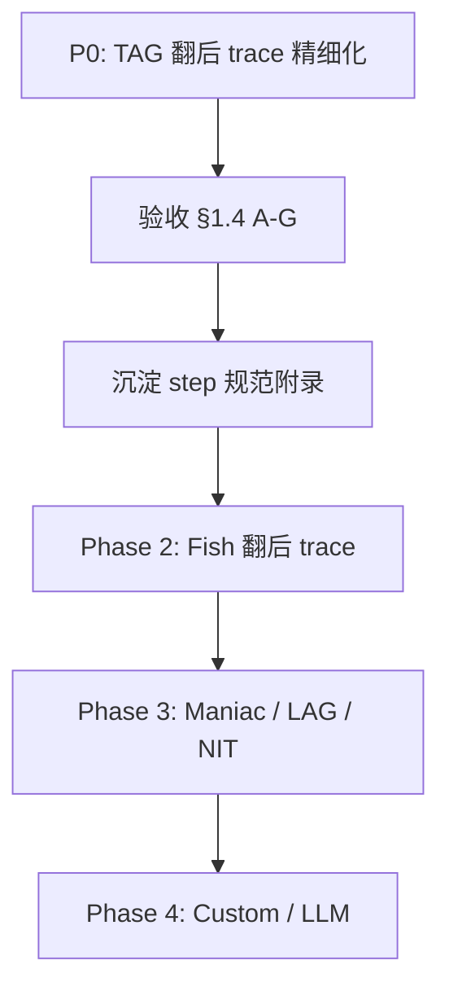

# TAG 翻后 Decision Trace 精细化计划

> 状态：**计划文档（PM 已确认路线，待实现）**  
> 前置：P0 TAG trace 骨架已落地（见 [`npc-decision-trace-plan.md`](./npc-decision-trace-plan.md)）  
> 路线：**先做 TAG 翻后 trace 精细化**，验收通过后再推广 Fish/Maniac 等 NPC 翻后 trace  
> 本阶段：**只写文档 / 改 trace 采集与展示**；**不改 BotAction 决策结果**（GIVE_UP 策略逻辑 P0 冻结）

---

## 1. 目标 / 非目标 / 验收

### 1.1 产品目标

房主在「分析决策」面板（默认主题 dock + retro8bit overlay 共用 `GameNpcDecisionTraceBody` 详情区）查看 **TAG 翻后**（flop / turn / river）行动时，能 **一眼读懂**：

1. 当时牌力与局面（成牌、听牌、牌面湿度、跟注额、计划类型）  
2. 随机层掷骰过程（弃牌概率 / 加注概率 / 价值下注概率）及 **未命中时的后续分支**  
3. `HandPlanType`（尤其 `GIVE_UP`）与 **最终行动** 之间的因果关系，而非仅见 `call facing bet (raiseProb miss)` 等误导文案  
4. L1 硬约束是否在 commit 前改写了 fold → call

### 1.2 技术目标

| 目标 | 说明 |
|------|------|
| 补全 step 链 | `DpNpcTagPostflopStrategy` 各分支均有稳定 `phase` + `code` + `data`；禁止「静默 return」 |
| message 与 data 分工 | `message` 一行中文摘要；结构化字段进 `data`（前端可渲染牌力卡） |
| 零行为漂移 | trace 采集 **不得** 改变 `BotAction`；`DpNpcTagDecisionTraceStore.ENABLED=false` 时与现网一致 |
| 契约向后兼容 | 不删已有 `code`；新增 code 仅追加；REST JSON schema 不变（仍 `ActionTrace.steps[]`） |

### 1.3 非目标

- **不修改** TAG 翻后决策逻辑（含 GIVE_UP +0.15 fold boost、`raiseProb` 公式、commit threshold 阈值）— PM 明确 P0 冻结  
- **不推广** Fish / Maniac / NIT / LAG / Custom / LLM trace（留待本计划验收后）  
- **不新增** DB、Flyway、WS 消息类型  
- **不实现** 翻后 range matrix（仅翻前有 `preflopMatrix`）  
- **不做** steps 全量 i18n（P1 用 `code` 映射；P0 message 中文硬编码即可）

### 1.4 验收标准（TAG 翻后可读性）

手动测试：retro8bit 或默认主题 dock，添加 `BOT_TAG_1`，打至少 3 手含翻后 facing bet / no-bet / GIVE_UP 线的牌，结算后逐条检查 action detail。

| # | 场景 | 必须通过 |
|---|------|----------|
| A | flop facing bet，最终 **CALL** | steps 含 `CONTEXT`（made/draw 可见）+ `PROB/FOLD_ROLL_MISS` 或 `PROB/RAISE_ROLL_MISS`（含概率数值）+ `RESULT/COMMIT`；**不得** 仅一条 `call facing bet (raiseProb miss)` |
| B | facing bet，fold 骰命中 | `PROB/FOLD_ROLL`（baseFold、foldProb）→ `RESULT/FOLD` → `RESULT/COMMIT` type=FOLD |
| C | plan=**GIVE_UP**，边缘对子 facing bet 最终 CALL | 详情区 **明确写出** plan=GIVE_UP；若因 fold 未命中而进入 raise/call 线，有 `FOLD_ROLL_MISS` 且 message 含「GIVE_UP 已抬高 foldProb，本次未弃牌」类说明；**不要求** bot 改为 FOLD |
| D | no-bet line，value bet | `PROB/VALUE_BET_ROLL`（valueBetProb）+ `RESULT/POSTFLOP_ACTION` |
| E | L1 阻止弃牌 | fold 意图后出现 `L1/L1_BLOCK_FOLD`，最终 CALL |
| F | `step.data` 含 made/draw/tex | 前端 **牌力摘要区** 展示（不只靠 message 字符串） |
| G | 翻前 action | 现有 matrix + steps **无回归** |

---

## 2. 翻后 step 规范

### 2.1 phase 枚举（翻后沿用总计划，补充语义）

| phase | 用途（翻后） |
|-------|----------------|
| `CONTEXT` | 街道、跟注额、plan、成牌/听牌/牌面、关键 ctx（equityEst、potOdds、activeVillains、commitFactor） |
| `EVAL` | 中间评估：commitThreshold、heroCall 判定、plan skip aggressive 守卫 |
| `PROB` | 概率掷骰：fold / raise / valueBet；**命中与未命中分 code** |
| `PLAN` | HandPlan 与 barrels 状态（若影响分支） |
| `RESULT` | 策略层分支结论（**非最终 commit**） |
| `L1` | `DpNpcHardConstraints` 覆盖 |
| `RESULT` | 末尾 `COMMIT`（collector.build 自动追加，不变） |

### 2.2 固定 step 序列（理想完整链）

```
CONTEXT/POSTFLOP_SPOT
  → [EVAL/COMMIT_THRESHOLD 可选]
  → PROB/FOLD_ROLL 或 PROB/FOLD_ROLL_MISS
  → [EVAL/HERO_CALL 若命中]
  → [PROB/RAISE_ROLL 或 PROB/RAISE_ROLL_MISS]   # facing bet 且未 fold
  → [EVAL/COMMIT_CAP 若 raise 超 commitThreshold]
  → [PLAN/SKIP_AGGRESSIVE 若 plan 限制进攻]
  → RESULT/POSTFLOP_ACTION
  → [L1/L1_BLOCK_FOLD 若适用]
  → RESULT/COMMIT
```

无 facing bet（`callAmount==0`）时，fold/raise 段替换为：

```
CONTEXT/POSTFLOP_SPOT
  → [PLAN/SKIP_AGGRESSIVE]
  → PROB/VALUE_BET_ROLL 或 PROB/VALUE_BET_ROLL_MISS
  → [PLAN/SKIP_AGGRESSIVE 二次守卫]
  → RESULT/POSTFLOP_ACTION
  → RESULT/COMMIT
```

**原则**：每个 `if` 分支要么写 step，要么在父级 PROB step 的 `data.outcome` 标明走了哪条子分支。

### 2.3 code 清单（翻后 P0 新增 / 修订）

| code | phase | 触发点 | message 要点 | data 字段（建议） |
|------|-------|--------|--------------|-------------------|
| `POSTFLOP_SPOT` | CONTEXT | `decide()` 入口 | 中文一行：「{street} 需跟注 {callAmount}，计划 {plan}」 | `stage`, `callAmount`, `plan`, **`made`**, **`draw`**, **`tex`**, `equityEst`, `potOdds`, `activeVillains`, `commitFactor` |
| `GIVE_UP_FOLD_BOOST` | EVAL | `tryFoldFacingBet` 内 GIVE_UP 分支 | 「GIVE_UP 计划：非 TRIPS+ 边缘牌 foldProb +0.15」 | `plan`, `made`, `delta`, `baseFoldAfter` |
| `HERO_CALL` | EVAL | `DpNpcHeroCall.shouldHeroCall` 命中 | 「L4 hero call：跳过弃牌骰，继续后续线」 | `reason` |
| `FOLD_ROLL` | PROB | fold 骰命中 | 「弃牌骰命中：roll < foldProb」 | `baseFold`, `foldProb`, `roll`（若可记录） |
| **`FOLD_ROLL_MISS`** | PROB | fold 骰未命中 | 「弃牌骰未命中：继续 facing bet 线（非弃牌）」 | `baseFold`, `foldProb`, `plan` |
| `RAISE_ROLL` | PROB | facing bet 加注骰命中 | 「加注骰命中：roll < raiseProb」 | `raiseProb`, `aggro`, `plan`, `made` |
| **`RAISE_ROLL_MISS`** | PROB | `decideFacingBet` 走 call 分支 | 「加注骰未命中 → 默认跟注（非因 plan 直接弃牌）」 | `raiseProb`, `aggro`, `plan`, `made`, **`note`**：`GIVE_UP 不降低 raiseProb，call 为 facing bet 默认回退` |
| `VALUE_BET_ROLL` | PROB | no-bet value bet 命中 | 「价值下注骰命中」 | `valueBetProb`, `potFraction` |
| `VALUE_BET_ROLL_MISS` | PROB | no-bet check | 「价值下注骰未命中 → check」 | `valueBetProb` |
| `COMMIT_THRESHOLD` | EVAL | `commitThresholdAction` | 「投入超过 commit 阈值，随机 call/jam/fold」 | `commitThreshold`, `heroInvestAfter`, `branch` |
| `SKIP_AGGRESSIVE` | PLAN | `shouldSkipAggressiveActionByPlan` | 「计划/barrels 限制进攻 → check/call」 | `plan`, `stage`, `made` |
| `POSTFLOP_ACTION` | RESULT | 各分支 return 前 | 中文动作摘要（raise amount / check 原因） | `actionIntent`: `RAISE`/`CALL`/`CHECK`/`FOLD`/`ALL_IN` |
| `FOLD` | RESULT | fold 骰命中后 | 「面对下注选择弃牌」 | 同 FOLD_ROLL |
| `L1_BLOCK_FOLD` | L1 | 已有 | 不变 | 可补 `made`, `equityEst` |

**废弃 / 修订文案**

| 旧 message | 问题 | P0 处理 |
|------------|------|---------|
| `call facing bet (raiseProb miss)` | 像「错误 miss」，未展示 raiseProb/plan/GIVE_UP 上下文 | 改为 `RAISE_ROLL_MISS` step + 中文说明 |
| `stage=... plan=...`（message 无 made/draw） | UI 只渲染 message | message 补中文牌力摘要；**同时** data 保留枚举供卡片渲染 |

### 2.4 made / draw / equity 展示约定

**Backend（CONTEXT data 必填）**

```json
{
  "made": "TOP_PAIR_WEAK_KICKER",
  "madeLabel": "顶对弱踢",
  "draw": "FLUSH_DRAW",
  "drawLabel": "同花听",
  "tex": "wet",
  "equityEst": 0.42,
  "potOdds": 0.28,
  "plan": "GIVE_UP"
}
```

- `madeLabel` / `drawLabel`：后端 trace 层用小型映射表生成（与前端 duplicative 可接受，P0 求稳）  
- `equityEst` / `potOdds`：来自 `DpUtilSmartContext`（`buildSmartContext` 已有）  
- `commitFactor` / `commitThreshold`：在 CONTEXT 或 EVAL 步写入，便于理解 jam/call 分界

**Frontend**

- 从 **第一个 `CONTEXT` + `POSTFLOP_SPOT`** 的 `data` 渲染 **牌力摘要卡**（见 §4）  
- steps 列表仍展示 PROB/RESULT；摘要卡固定显示 made/draw/plan/equity，**不依赖** message 解析

### 2.5 plan 与 final 关系说明（产品文案 + trace 结构）

| 关系 | 说明 | trace 如何表达 |
|------|------|----------------|
| plan 是 **跨街意图**，非强制动作 | `GIVE_UP` = 除非牌力大幅提升，优先过牌/弃牌；TAG 对非 TRIPS+ **仅 +0.15 foldProb** | `GIVE_UP_FOLD_BOOST` + CONTEXT.plan |
| plan ≠ final 是 **正常** | facing bet 时：fold 骰未命中 → 进入 raise/call 线；`raiseProb` 对 GIVE_UP **无额外惩罚**（与 `valueBetProb` 不同） | `FOLD_ROLL_MISS` → `RAISE_ROLL_MISS` → `RESULT/COMMIT` CALL |
| final 由 **多层叠加** | tryFold → facingBet raise roll → commitThreshold → plan skip → L1 | steps 按序可读；COMMIT 前最后一条 RESULT 与 COMMIT 一致或为 L1 改写 |
| L1 改写 | mustNotFold → call | `L1_BLOCK_FOLD` 在 COMMIT 前 |

**详情区顶部固定一行说明（Frontend 静态 copy）**：

> 计划类型（VALUE / GIVE_UP 等）表示本手跨街意图，不等于本街必弃/必跟。最终行动以逐步推理 +「提交」为准。

---

## 3. 策略 vs 展示分工

PM 倾向：**GIVE_UP 策略先不动，trace 先补全**。下表标明 P0 边界。

| 问题 | 根因（代码位置） | P0：只改 trace | P2+：改 TAG 逻辑（不在本计划） |
|------|------------------|----------------|----------------------------------|
| GIVE_UP 却 CALL | foldProb +0.15 仍可能未命中；随后 `raiseProb` 无 GIVE_UP 惩罚，call 为 facing bet 默认回退 | 记录 `GIVE_UP_FOLD_BOOST`、`FOLD_ROLL_MISS`、`RAISE_ROLL_MISS`，message 解释「非 bug」 | 讨论是否对 GIVE_UP 降低 raiseProb 或直接 fold（改 `DpNpcPostflopFormula.raiseProb` 或 TAG 分支） |
| `raiseProb miss` 误导 | `tracePostflopResult("call facing bet (raiseProb miss)")` 无概率数据 | 新增 `RAISE_ROLL_MISS` + data.raiseProb | — |
| CONTEXT 看不到 made/draw | `data` 已有，UI 只显示 `message` | 前端牌力卡 + message 中文摘要 | — |
| commitThreshold 静默 | `commitThresholdAction` 无 trace | 补 `COMMIT_THRESHOLD` + RESULT | — |
| hero call 静默 | `shouldHeroCall` return null 无 step | 补 `HERO_CALL` | — |
| no-bet high card 静默 | 部分 return 无 trace | 补 `VALUE_BET_ROLL_MISS` 或 `RESULT/check` | — |
| fold 未命中无 step | 仅 fold **命中** 时 `traceFoldResult` | 在 fold 骰后 else 分支写 `FOLD_ROLL_MISS` | — |

**仅 Backend trace**

- `DpNpcTagPostflopStrategy`：所有 `trace*`  helper 扩展；`tryFoldFacingBet` / `decideFacingBet` / `decideNoBet` / `commitThresholdAction` 补 step  
- 可选：`DpNpcHeroCall` 内 TAG collector 钩子（或 TAG 策略层包装，避免 Fish 受影响）

**仅 Frontend**

- `GameNpcDecisionTraceBody.vue`（及必要时抽 `GameNpcDecisionTracePostflopSummary.vue`）  
- 枚举 label 映射：`front/dp_game/src/utils/dpNpcDecisionTrace.js` 或 `dpNpcDecisionTraceLabels.js`

**双方配合**

- CONTEXT `data` 字段冻结后 Frontend 再对接卡片  
- PROB step 的 `code` 驱动 steps 区图标/颜色（可选 P1）

**明确不改（P0）**

- `HandPlanType.GIVE_UP` 语义与 +0.15、`raiseProb` 公式、`tagCommitFactor`  
- `DpNpcHardConstraints` 判定逻辑（仅可 enrich L1 step data）  
- `DpNpcEngine.decideActionIfReady` commit 点

---

## 4. Frontend：翻后详情区布局

适用：**默认主题 dock** 与 **retro8bit** 共用 `GameNpcDecisionTraceBody` L3 详情 pane（[`trace-action-grid-ui-plan.md`](./trace-action-grid-ui-plan.md) 已定义左右分栏）。

### 4.1 布局（上下结构）

```
┌─ detail-head（已有：actionSeq / street / actor / finalAction / holeCards）─┐
├─ postflop-summary（新增，仅 street ∈ {flop,turn,river}）──────────────────┤
│  牌力：顶对弱踢 · 同花听 · 湿面                                                    │
│  计划：GIVE_UP    权益：42%    池赔：28%    需跟注：120                              │
├─ steps-scroll（下方，现有 steps 列表增强）───────────────────────────────────────┤
│  CONTEXT → PROB → … → COMMIT                                                       │
└─ preflop-matrix（仅 preflop，已有）───────────────────────────────────────────────┘
```

- **上：CONTEXT + 牌力**：单卡只读，数据来自 `steps` 中首个 `POSTFLOP_SPOT.data`；缺字段时降级显示 `—`  
- **下：steps**：按 `seq` 排序；`phase` badge 保留；`PROB` 步可展开 `data` 键值（P0 可 inline 小字）  
- **plan vs final**：summary 卡「计划」与 detail-head「finalAction」并列，用户对照 steps 理解偏差

### 4.2 与翻前 matrix 共存

| street | 上部 | 下部 | 底部 |
|--------|------|------|------|
| preflop | 可选简化 spot 行 | steps | `GameNpcDecisionTraceMatrixGrid` |
| postflop | **postflop-summary 卡** | steps | 无 matrix；显示一句灰色说明「翻后无范围矩阵」**可选 P1**（当前翻前 empty 提示仅 preflop 显示，翻后可不显示） |

### 4.3 文案映射（Frontend）

| 枚举 | 展示 |
|------|------|
| `TOP_PAIR_WEAK_KICKER` | 顶对弱踢 |
| `GIVE_UP` | 放弃（GIVE_UP） |
| `FOLD_ROLL_MISS` | 弃牌骰未命中 |
| `RAISE_ROLL_MISS` | 加注骰未命中 → 跟注 |

完整表实现时对齐 `DpNpcMadeHandCategory` / `DpNpcDrawCategory` / `HandPlanType` 枚举名。

### 4.4 非目标（Frontend）

- 不改 `GameNpcDecisionTracePanel.vue` 8bit shell 结构（只改 Body 子组件）  
- 不做翻后可视化 equity 曲线  
- 窄屏矩阵 L2 **不**在本计划范围

---

## 5. P0 / P1 / P2 与任务拆分

### P0 — 可读性闭环（必须先做）

**Backend — trace steps**

| 任务 ID | 内容 | 文件 |
|---------|------|------|
| B-P0-1 | 扩展 `tracePostflopContext`：message 中文 + data 含 equity/potOdds/commitFactor/labels | `DpNpcTagPostflopStrategy.java` |
| B-P0-2 | `tryFoldFacingBet`：`GIVE_UP_FOLD_BOOST`；fold 命中 `FOLD_ROLL`；**未命中 `FOLD_ROLL_MISS`** | 同上 |
| B-P0-3 | `decideFacingBet`：`RAISE_ROLL` / **`RAISE_ROLL_MISS`** 替代旧 message；raise/jam/call 各分支 `POSTFLOP_ACTION` | 同上 |
| B-P0-4 | `commitThresholdAction` / `guardFold`：补 `COMMIT_THRESHOLD` + RESULT | 同上 |
| B-P0-5 | `decideNoBet`：`VALUE_BET_ROLL` / `_MISS`；plan skip 补 `SKIP_AGGRESSIVE` | 同上 |
| B-P0-6 | hero call：`HERO_CALL` step（策略层或 `DpNpcHeroCall` TAG 钩子） | TAG 策略 / L4 |
| B-P0-7 | 单测：给定 seed 固定 trace steps 快照（至少 facing bet call、fold、GIVE_UP 各 1） | `DpNpcTagPostflopStrategyTest` 或新 trace test |

**Frontend — UI**

| 任务 ID | 内容 | 文件 |
|---------|------|------|
| F-P0-1 | 新增 `postflop-summary` 卡：解析 `POSTFLOP_SPOT.data` | `GameNpcDecisionTraceBody.vue` 或子组件 |
| F-P0-2 | steps 区：对 `PROB` 步 inline 展示 `baseFold`/`raiseProb`/`valueBetProb` | 同上 |
| F-P0-3 | 静态说明：plan ≠ final（§2.5 一句 copy） | 同上 |
| F-P0-4 | label 映射 util | `dpNpcDecisionTraceLabels.js` |

**P0 完成定义**：§1.4 验收表 A–G 全绿；`mvn -DskipTests package` 通过。

### P1 — 体验 polish

| 任务 | 说明 |
|------|------|
| B-P1-1 | L1 step  enrich：`equityEst`, `made` |
| B-P1-2 | PROB step 记录 `roll` 值（若 random 可注入测试 seed） |
| F-P1-1 | `code` → 图标/颜色（FOLD 红、CALL 蓝、PROB 黄） |
| F-P1-2 | steps `data` 可折叠 JSON（调试向） |
| F-P1-3 | 8bit / default 主题样式 token 统一 |

### P2 — 策略讨论（非本计划实现）

| 任务 | 说明 |
|------|------|
| S-P2-1 | 评估 GIVE_UP facing bet：`raiseProb *= 0.35` 或更高 fold boost |
| S-P2-2 | 与 NPC 组对齐 `HandPlanType` 跨 archetype 语义 |
| S-P2-3 | 推广 trace 至 Fish/Maniac（见 §6） |

---

## 6. 与「其他 NPC 翻后推广」的衔接顺序



| 阶段 | 范围 | 依赖 | 产出 |
|------|------|------|------|
| **Phase 0（已完成）** | TAG 翻前 + 骨架 + store/REST | `npc-decision-trace-plan.md` | 基础 `ActionTrace` |
| **Phase 1（本计划）** | TAG 翻后 step + UI | Phase 0 | 本文 §2 code 规范 + 验收通过 |
| **Phase 2** | Fish 翻后 | Phase 1 规范冻结 | `DpNpcFishPostflopStrategy` 同模式采集；Frontend **复用** postflop-summary（plan 语义可能不同，label 扩展） |
| **Phase 3** | Maniac / LAG / NIT | Phase 2 经验 | 各策略 `*DecisionTraceCollector` 或统一 `DpNpcRuleTraceCollector` 抽象（P1 技术债） |
| **Phase 4** | Custom / BOT_LLM | Phase 3 | Custom 轴；LLM 另文档 |

**推广原则**

1. **code 复用**：`POSTFLOP_SPOT`、`FOLD_ROLL` / `_MISS`、`RAISE_ROLL` / `_MISS` 跨 NPC 同名同义  
2. **Collector 抽象可晚做**：Phase 2 仍可在 Fish 策略内 copy TAG 模式；Phase 3 再抽公共 helper  
3. **Frontend 一次建设**：postflop-summary 与 PROB 渲染 **NPC 无关**；推广时仅增 actor 过滤（matrix 已按 NPC 分行）  
4. **策略改动单独立项**：GIVE_UP 行为调整 **不得** 夹在 Phase 2 Fish trace 里做

**与默认主题 dock 计划关系**

- [`default-theme-npc-decision-trace-plan.md`](./default-theme-npc-decision-trace-plan.md) 的 Pull-only dock **不阻塞** 本计划；Backend step 变更对两主题同时生效  
- [`trace-action-grid-ui-plan.md`](./trace-action-grid-ui-plan.md) L3 详情 pane 为本计划 Frontend 挂载点

---

## 7. 执行顺序（Implementer checklist）

### Backend Agent

1. 读 `DpNpcTagPostflopStrategy` 全分支，列出 silent return 清单（对照 §3 表）  
2. 实现 B-P0-1～B-P0-6，保持 `ENABLED=false` 零 diff  
3. 补充单测 B-P0-7  
4. 用 curl/REST 录一条 GIVE_UP facing bet → CALL 样例 JSON，交给 Frontend  
5. `mvn -DskipTests package`

### Frontend Agent

1. 等 B-P0-1 `POSTFLOP_SPOT.data` 字段冻结（或 mock）  
2. F-P0-1～F-P0-4  
3. 默认主题 dock + retro8bit 各走一遍 §1.4 验收  
4. 确认翻前 matrix **无回归**

### PM / QA

- 签核 §1.4 表格  
- 确认 P0 **未** 改变 TAG 胜率/行动分布（对比 `ENABLED=false` 同 seed 回归）  
- 批准进入 Phase 2 Fish

---

## Appendix — 现状 gap 速查（2026-06-13 代码审阅）

| 位置 | 现状 | gap |
|------|------|-----|
| `tracePostflopContext` | data 含 made/draw，message 无 | UI 未读 data |
| `tryFoldFacingBet` | 仅 fold 命中写 step | 缺 FOLD_ROLL_MISS、GIVE_UP_FOLD_BOOST、HERO_CALL |
| `decideFacingBet` | 仅 `tracePostflopResult` 一行 | 缺 RAISE_ROLL/MISS、commitThreshold |
| `commitThresholdAction` | 无 trace | 全静默 |
| `decideNoBet` | 部分 trace | high card / plan skip 多条路径无 step |
| `GameNpcDecisionTraceBody` | phase + message 两列 | 无 postflop 摘要卡、无 data 渲染 |

---

*文档版本：2026-06-13 · TAG 翻后 trace 精细化 · PM 路线：先 TAG 翻后，再推广其他 NPC*
