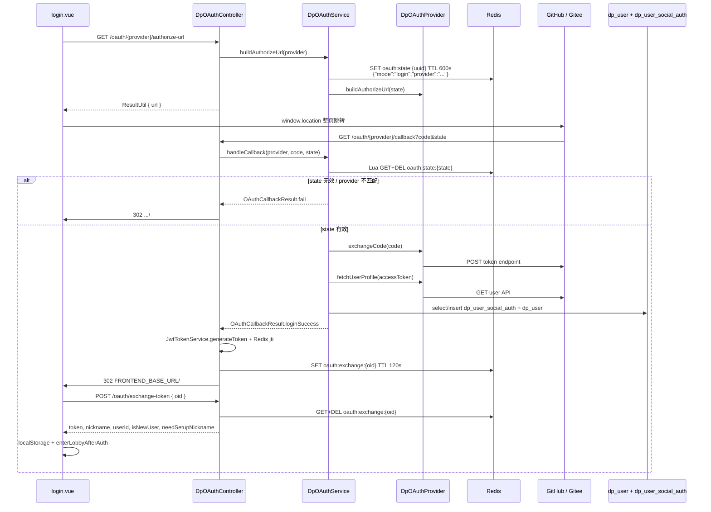

# OAuth 迁移评估：手搓实现 → Spring Security OAuth2 Client

> **文档性质**：技术债评估 / 迁移方案  
> **状态**：**已实施 MVP+**（2026-06-09）— GitHub + Gitee + 钉钉 token 层  
> **范围**：GitHub + Gitee + 钉钉第三方登录；不涉及改密、账号绑定 UI 扩展  
> **约束**：未启用 Spring OAuth2 Login；Controller 契约与 JWT+oid 流程保持不变

---

## 11. 实施记录（2026-06-09）

### 11.1 已完成

| 项 | 说明 |
|----|------|
| 依赖 | `pom.xml` 增加 `spring-boot-starter-oauth2-client` |
| 配置 | `application.yml` → `spring.security.oauth2.client.registration` + `provider`（github/gitee/ding，env 变量不变） |
| 统一 token 交换 | 新建 `oauth/client/DpOAuth2TokenExchangeService`（GitHub/Gitee 用 `RestClientAuthorizationCodeTokenResponseClient`） |
| 钉钉定制 | 新建 `oauth/client/DingOAuth2AccessTokenResponseClient`（JSON POST userAccessToken；unionId/openId 入 additionalParameters） |
| Provider 瘦身 | `DpGitHubOAuthProvider` / `DpGiteeOAuthProvider` / `DpDingOAuthProvider` 删除手搓 HttpClient token 交换；profile 仍各 Provider 映射 |
| 不变 | `DpOAuthController`、`DpOAuthService`、Redis state、oid 交换、`DpSocialAuth`、`JwtSecurityConstants` `/oauth/**` |
| 单测 | `mvn test -Dtest=*OAuth*` 全绿（含新增 `DpOAuth2TokenExchangeServiceTest`） |

### 11.2 架构分工（实施后）

| 组件 | 职责 |
|------|------|
| **Spring OAuth2 Client** | `ClientRegistration` 集中配置；authorization_code → access_token（GitHub/Gitee 标准；钉钉 custom client） |
| **DpOAuthProvider** | authorize URL 拼装；token→profile 映射 → `OAuthUserProfile`（openId 契约不变） |
| **DpOAuthService** | Redis state CSRF；登录/注册；`DpSocialAuth` 绑定 |
| **DpOAuthController** | REST 契约；callback 302；JWT 签发 + Redis jti + oid 一次性交换 |
| **JwtTokenService** | 项目认证 JWT（非 Session） |

### 11.3 钉钉后续 / 运维 Checklist

钉钉 token 交换已走统一抽象，但 **profile 仍依赖钉钉开放平台权限**：

- [ ] 应用开通 **Contact.User.Read**（通讯录个人信息读权限）
- [ ] OAuth2  scope 含 `openid` + `Contact.User.Read`（已在 registration 配置）
- [ ] `DING_REDIRECT_URI` 与钉钉控制台回调地址**完全一致**
- [ ] `FRONTEND_BASE_URL` 与浏览器访问主机一致（dev 8080 代理到 8088）
- [ ] 若 `contact/users/me` 仍 403：登录可降级为 unionId/openId（token bundle fallback），但无头像/昵称

### 11.4 未做（P2，按需）

- 启用 `oauth2Login()` / 改 callback 为 `/login/oauth2/code/{id}`
- 前端改跳 `/oauth2/authorization/{id}`
- `buildAuthorizeUrl` 改读 Spring `OAuth2AuthorizationRequest` 生成器
- 删除 `mgdemoplus.oauth.{github,gitee,ding}.client-*` 冗余配置键（现 credentials 以 `spring.security.oauth2.client` 为准）

---

## 1. Executive Summary

MGDemoPlus 当前采用自研 OAuth 栈（`DpOAuthController` + `DpOAuthService` + `DpOAuthProvider` 插件化），覆盖 GitHub 与 Gitee；授权成功后仍签发项目自有 JWT（`JwtTokenService` + Redis `jti`），前端经 `oid` 一次性交换令牌完成登录。实现已上线、有单测（state 校验、GitHub profile 反序列化），`pom.xml` **无** `spring-boot-starter-oauth2-client`。

**要不要迁**：无功能缺口、无紧急安全项；当前手搓代码体量可控（两 Provider 各约 140 行 HttpClient）。迁移收益主要是减少 token/profile HTTP 维护、复用 Spring 对 OAuth2 协议边界的补丁——属 **P2 技术债**，非必须。

**何时迁**：计划在 **6 个月内新增 ≥2 个 OAuth 渠道**，或团队明确不愿维护 HttpClient/IdP 差异时再排期。若做，**第一步只做 MVP**（仅 GitHub token 交换层），保留 Controller 契约、Redis state、前端 callback 与 `DpSocialAuth` 绑定逻辑不动；全量 Spring OAuth2 Login（改 callback 为 `/login/oauth2/code/{id}`）与现有 JWT+oid 模式冲突大，不建议作为首步。

**默认建议**：**暂不迁移**；有 refactor 窗口时走 MVP 小试（约 3 人日），验证通过再评估 Gitee 与 P2 深度整合（再约 5～6 人日）。

---

## 2. 现状架构

### 2.1 组件职责表

| 层级 | 类 / 文件 | 职责 |
|------|-----------|------|
| REST | `controller/DpOAuthController.java` | `GET /oauth/providers`；`GET /oauth/{provider}/authorize-url`；`GET /oauth/{provider}/callback`（302 前端）；`POST /oauth/exchange-token` |
| 业务 | `oauth/impl/DpOAuthService.java` | Redis state 存取（600s TTL，Lua GET+DEL）；登录/注册；`DpSocialAuth` 绑定；头像下载；昵称合规 |
| 插件接口 | `oauth/provider/DpOAuthProvider.java` | authorize URL、code→token、token→profile |
| 注册表 | `oauth/provider/DpOAuthProviderRegistry.java` | Spring 注入 `List<DpOAuthProvider>`，按 `id()` 索引 |
| GitHub | `oauth/provider/github/DpGitHubOAuthProvider.java` | `java.net.http.HttpClient`；scope `read:user` |
| Gitee | `oauth/provider/gitee/DpGiteeOAuthProvider.java` | HttpClient；scope `user_info`；显式 `response_type=code` |
| 持久化 | `oauth/entity/DpSocialAuth.java` + `DpSocialAuthMapper` | 表 `dp_user_social_auth`，`(provider, open_id)` 唯一 |
| 安全 | `security/JwtSecurityConstants.java` | `/oauth/**` 在 `PERMIT_ALL` 白名单，免 JWT |
| 前端 | `front/dp_game/src/components/login.vue` | `GET /oauth/{provider}/authorize-url` → 整页跳转 IdP |
| 前端 | `front/dp_game/src/components/OAuthCallback.vue` | 路由 `/#/oauth/callback`；`POST /oauth/exchange-token { oid }` |
| 配置 | `application.yml` → `mgdemoplus.oauth.*` | `GITHUB_*`、`GITE_*`（Gitee 环境变量前缀为 **`GITE_`**）、`FRONTEND_BASE_URL` |
| 测试 | `DpOAuthServiceStateTest`、`DpGitHubOAuthProviderProfileTest` | state 原子消费、provider  mismatch、openId=login 契约 |

### 2.2 数据流（authorize → callback → token → profile → user/JWT）



### 2.3 关键实现细节（代码已确认）

| 项 | 值 / 行为 |
|----|-----------|
| State Redis 键 | `oauth:state:` + UUID，TTL **600s** |
| State 消费 | Lua 脚本原子 `GET` + `DEL`（兼容 Redis &lt; 6.2 无 GETDEL） |
| Exchange Redis 键 | `oauth:exchange:` + oid，TTL **120s**（JWT 不出现在 URL） |
| openId 语义 | GitHub/Gitee 均用平台 **`login` 字符串**（非 numeric id） |
| Provider 启用 | `client-id` 与 `client-secret` 均非空 → `enabled()` true |
| Dev 代理 | `vue.config.js`：`/oauth` → `localhost:8088` |
| Dev redirect URI | 通常 `http://localhost:8080/oauth/{provider}/callback`（浏览器落前端端口） |
| pom 依赖 | 有 `spring-boot-starter-security`；**无** `spring-boot-starter-oauth2-client` |

---

## 3. 迁移目标态

### 3.1 主选方案：Spring Security OAuth2 Client（不启用 OAuth2 Login）

在现有 JWT 认证模型上，**仅借用** `spring-boot-starter-oauth2-client` 的：

- `ClientRegistration` / `ClientRegistrationRepository` — 集中管理 client-id、secret、scope、token/userinfo URI
- `OAuth2AccessTokenResponseClient` — 标准 authorization_code grant 的 code→token
- 可选 `RestClient` / `OAuth2UserService` — token→profile（需自定义 attribute → `OAuthUserProfile` 映射）

**不采用** Spring OAuth2 Login 默认的 Session + `/login/oauth2/code/{registrationId}` 作为终态第一步，以免与 `oid` 交换、hash 路由前端冲突。

### 3.2 备选方案（等价「正统」）

| 方案 | 说明 | 适用场景 |
|------|------|----------|
| **A. 库级 OAuth2 Client（推荐 MVP）** | 加 starter，Provider 内注入 token client；authorize/state/callback 仍自管 | 成本最低，与现架构兼容 |
| **B. 全量 OAuth2 Login** | `SecurityConfig.oauth2Login()` + 自定义 `AuthenticationSuccessHandler` 桥接 JWT+oid | 多 IdP 长期统一、可接受改 callback 路径 |
| **C. 保持手搓 + 抽象** | 提取共用 `OAuthHttpClient`、OpenAPI 生成 DTO | 仅 2 个 IdP、零新依赖诉求 |
| **D. 第三方 BFF** | Auth0 / Keycloak 等托管登录 | 团队无 Spring OAuth 经验且可接受外部依赖 |

本文档后续 Checklist 以 **方案 A（MVP）→ 可选 B（P2）** 为主线。

---

## 4. 迁移清单（Checklist）

### P0 — 决策与基线（迁移前必做）

| # | 动作 | 涉及文件 / 配置 | 预估工时 | 风险 |
|---|------|-----------------|----------|------|
| P0-1 | 确认范围：MVP（仅 GitHub token 层）/ 双平台 / 全量 OAuth2 Login | 本文档 §5、§6 | 0.5 人日 | 低：范围不清导致返工 |
| P0-2 | 梳理 OAuth App **redirect URI** 清单（dev 8080、prod 域名、Docker 8088） | GitHub/Gitee 控制台、`.env.example` | 0.25 人日 | **高**：URI 不一致则授权 404 |
| P0-3 | 只读统计 `dp_user_social_auth` 行数及 provider 分布 | DB | 0.25 人日 | 低 |
| P0-4 | 定回滚策略：feature flag 或保留旧 HttpClient 实现分支 | 实施设计 | 0.25 人日 | 中：无 flag 则 revert 成本高 |
| P0-5 | 确认 openId=**login** 契约不可变（老用户绑定键） | `DpGitHubOAuthProvider`、`DpGiteeOAuthProvider` | 0.25 人日 | **高**：改用 numeric id 会导致重复注册 |

**P0 小计**：约 **1.5 人日**

### P1 — MVP 与全量实施

| # | 动作 | 涉及文件 / 配置 | 预估工时 | 风险 |
|---|------|-----------------|----------|------|
| P1-1 | 引入 `spring-boot-starter-oauth2-client` | `pom.xml` | 0.25 人日 | 低：与 Security 版本由 BOM 对齐 |
| P1-2 | 配置 GitHub `ClientRegistration`（映射现有 `GITHUB_*` env） | `application.yml` 或 `config/OAuth2ClientConfig.java` | 0.5 人日 | 低 |
| P1-3 | 重构 `DpGitHubOAuthProvider`：`exchangeCode` / `fetchUserProfile` 改调 OAuth2 Client API | `DpGitHubOAuthProvider.java`、新建 Config | 1 人日 | 中：token 响应解析差异 |
| P1-4 | **保持** `DpOAuthController`、`DpOAuthService`、Redis state、oid 流程不变 | 无前端改动 | 0.5 人日（联调） | 低 |
| P1-5 | 单测：state 测试保持；GitHub token/profile mock 或 contract test | `DpOAuthServiceStateTest`、新增测试 | 0.5 人日 | 低 |
| P1-6 | Gitee PoC：自定义 `OAuth2AccessTokenResponseClient` 或暂留手搓 | `DpGiteeOAuthProvider.java` | 1 人日 | **中～高**：grant 参数、API v5 差异 |
| P1-7 | 文档与 `.env.example` 对齐（不写真实密钥） | `docs/`、`.env.example` | 0.25 人日 | 低 |
| P1-8 | （可选 P2）启用 `oauth2Login()`，callback 改 `/login/oauth2/code/{id}` | `SecurityConfig`、OAuth App 控制台 | 2 人日 | **高**：redirect 全量变更 |
| P1-9 | （可选 P2）`AuthenticationSuccessHandler` 桥接 JWT + oid 302 | 新 Handler、可能精简 Controller | 1.5 人日 | 中 |
| P1-10 | （可选 P2）前端 authorize 改 `/oauth2/authorization/{id}` 或 BFF 包装 | `login.vue` | 1 人日 | 中 |
| P1-11 | （可选 P2）删除手搓 Provider / 统一 YAML registrations | `oauth/provider/**` | 0.5 人日 | 中：依赖 P1-8～10 稳定 |

**P1 MVP（P1-1～7，仅 GitHub）**：约 **3 人日**  
**P1 含 Gitee（P1-1～7 全做）**：约 **4～5 人日**  
**P1 + P2 全量（P1-1～11）**：约 **9～11 人日**

---

## 5. 最小可行迁移（MVP）

**定义**：只迁 **GitHub** 的 code→token→profile HTTP 层；Gitee 继续手搓直至 P1-6 PoC 通过。

### 5.1 MVP 步骤（共 8 步）

1. **P0 决策**：书面确认 MVP 范围、redirect URI 清单、回滚方式（§4 P0-1～5）。
2. **加依赖**：`pom.xml` 增加 `spring-boot-starter-oauth2-client`（不启用 `oauth2Login()` filter）。
3. **注册 ClientRegistration**：新建 `OAuth2ClientConfig`（或 YAML `spring.security.oauth2.client.registration.github`），将 `GITHUB_CLIENT_ID/SECRET/REDIRECT_URI` 映射进去；redirect 仍为 **`/oauth/github/callback`**。
4. **改 GitHub Provider**：`DpGitHubOAuthProvider.exchangeCode()` 注入 `OAuth2AccessTokenResponseClient`，用 `ClientRegistration` 构造 `OAuth2AuthorizationCodeGrantRequest`；删除手搓 POST `access_token` 的 HttpClient 代码。
5. **Profile 映射不变**：`fetchUserProfile` 可用 `RestClient` + Bearer，或框架 userinfo；**必须**继续输出 `OAuthUserProfile(login, avatarUrl, name)`，openId = **login**。
6. **不动上层**：`DpOAuthService.buildAuthorizeUrl` / `storeState` / `handleCallback` / `handleLoginMode` 零改动；`DpOAuthController` 零改动。
7. **测试**：`DpOAuthServiceStateTest`、`DpGitHubOAuthProviderProfileTest` 全绿；Dev 手工 GitHub 登录冒烟（8080 → GitHub → callback → 大厅）。
8. **观测与回滚开关**：保留旧 HttpClient 实现于 feature flag 或 Git tag；出问题 revert Provider 类即可，**无需 DB 回滚**。

### 5.2 更小路径：「只换 token exchange」

若步骤 4 风险过高，可先 **仅** 替换 `exchangeCode()`，profile GET 仍用手搓 HttpClient；authorize URL 与 Redis state **完全自管**，不与 Spring 内置 state 混用，避免双 state 机制冲突。

### 5.3 不推荐的「伪 MVP」

- 只加依赖不改代码 — 无收益。
- 同时启用 Spring OAuth2 Login **且** 保留 `/oauth/{provider}/callback` — 双 callback、双 state，CSRF/重复消费风险高。

---

## 6. 保持不变 vs 必须改

| 维度 | MVP | 全量 OAuth2 Login (P2) | 说明 |
|------|-----|------------------------|------|
| **`dp_user_social_auth` 表结构** | ✅ 不变 | ✅ 不变 | 与 OAuth 框架无耦合；无需 Flyway |
| **openId = 平台 login** | ✅ 不变 | ✅ 不变 | 老用户绑定键；改则重复注册 |
| **`DpOAuthService.handleLoginMode`** | ✅ 不变 | ⚠️ 可迁入 SuccessHandler，逻辑须保留 | 注册、昵称、敏感词、头像 |
| **JWT + Redis jti** | ✅ 不变 | ✅ 不变 | 项目认证模型，非 Session |
| **前端 `OAuthCallback.vue`** | ✅ 不变 | ⚠️ 可能简化（若 JWT 改其他下发方式） | MVP 零改动 |
| **前端 `login.vue` authorize 调用** | ✅ 不变 | ❌ 须改 | 改跳 `/oauth2/authorization/{id}` 或等价 |
| **路由 `/#/oauth/callback`** | ✅ 不变 | ⚠️ 视 SuccessHandler 302 目标 | |
| **Redis `oauth:state:` 自管 state** | ✅ 保留 | ⚠️ 可换 `AuthorizationRequestRepository` | MVP **不要**引入框架 state |
| **Redis `oauth:exchange:` oid** | ✅ 不变 | ✅ 仍须自写 | 框架无标准等价 |
| **Redirect URI 路径** | ✅ 不变 | ❌ 须改控制台 | P2 改为 `/login/oauth2/code/github` 等 |
| **`JwtSecurityConstants` `/oauth/**`** | ✅ 不变 | ⚠️ 可能增 `/oauth2/**` 或 login 路径 | |
| **`GET /oauth/providers` API** | ✅ 不变 | ⚠️ 可改读 `ClientRegistrationRepository` | |
| **Gitee Provider** | ✅ 暂留手搓 | ❌ 须 PoC 后迁移 | Spring 对 Gitee 开箱支持弱于 GitHub |
| **环境变量名 `GITHUB_*` / `GITE_*`** | ⚠️ 可选映射 | ⚠️ 建议映射到 `spring.security.oauth2.client.*` | 可保留旧名 + `@Configuration` 桥接 |
| **`DpGitHubOAuthProvider` HttpClient** | ❌ 替换 | ❌ 删除 | MVP 核心改动点 |
| **`pom.xml` 依赖** | ❌ 新增 oauth2-client | 同左 | |

---

## 7. 风险与回滚

### 7.1 Redirect URI 不一致

| 风险 | 影响 | 缓解 |
|------|------|------|
| P2 改用 Spring 默认 `/login/oauth2/code/github` | GitHub/Gitee 控制台 302 失败 | MVP **不改** callback；P2 才批量改控制台 |
| Dev 8080 vs 8088 混用 | 授权成功但 callback 404 | OAuth App 登记 **8080**；`vue.config.js` 代理 `/oauth` → 8088 |
| Docker 生产写 `localhost:8080` | 生产授权失败 | Compose 注入对外 `https` 域名 |

### 7.2 Dev 前端代理

浏览器只认 OAuth App 登记的 URI。Dev 流程：GitHub → `http://localhost:8080/oauth/github/callback` → dev-server 代理 → 8088 `DpOAuthController`。迁移后若 callback 改到纯 8088 路径，需同步 OAuth App **且** dev 可能绕开 proxy — **MVP 不改路径可规避**。

### 7.3 Gitee 差异

- Token POST 含 `grant_type=authorization_code`；User API 为 `https://gitee.com/api/v5/user`。
- Spring 默认 GitHub 适配成熟；Gitee 需验证 token client 是否开箱可用 — **建议 MVP 后单独 PoC**，可长期手搓 Gitee。

### 7.4 已有用户绑定与会话回归

- 绑定键 `(provider, open_id)`，`open_id` = **login 名**；框架若默认用 numeric `id` 会导致老用户无法匹配。
- 回归项：新/老用户登录、needSetupNickname、oid 一次性交换、state 过期与重放、未配置 client-id 时不 500。

### 7.5 回滚步骤（MVP）

1. Revert `DpGitHubOAuthProvider` 至 HttpClient 版本（或关 feature flag）。
2. 可选移除 `spring-boot-starter-oauth2-client`（无 schema 变更）。
3. 跑 `DpOAuthServiceStateTest` + Dev GitHub 登录冒烟。

---

## 8. 验收标准（若未来执行迁移）

### 8.1 功能

- [ ] **新用户 GitHub 登录**：创建 `dp_user`（password NULL）+ `dp_user_social_auth`；头像本地化；JWT + Redis jti。
- [ ] **老用户 GitHub 登录**：`(github, open_id)` 命中已有行，不重复 INSERT。
- [ ] **Gitee**（若纳入）：provider=`gitee`，同上。
- [ ] **needSetupNickname**：纯数字/敏感词/占用 → `player_xxxxxx`，前端提示。
- [ ] **oid 交换**：302 后 `POST /oauth/exchange-token` 一次性成功；重复 oid 失败。

### 8.2 安全与边界

- [ ] State 超过 600s →「无效或已过期的授权状态」；token 接口不被调用。
- [ ] 同一 state 第二次 callback 失败（Lua 已 DEL）。
- [ ] State 内 provider 与 URL 路径不一致 → 拒绝。
- [ ] 未配置 client-id：`/oauth/providers` 不展示；`authorize-url` 明确错误；无 NPE/500。

### 8.3 回归测试

- [ ] `DpOAuthServiceStateTest` 全绿。
- [ ] `DpGitHubOAuthProviderProfileTest` 全绿（openId=login 不变）。
- [ ] Dev：8080 登录 → GitHub → 回跳 → 进大厅。
- [ ] Prod/Docker：`FRONTEND_BASE_URL` 302 正确。

---

## 9. 不建议迁移的信号 / 建议迁移的信号

| 维度 | 不建议迁移 | 建议迁移 |
|------|------------|----------|
| 业务 | 仅 GitHub+Gitee，近期无新 IdP | 计划接入 Google/Apple/微信等 ≥2 个新渠道 |
| 代码 | Provider 各 ~140 行，团队熟悉 | 不愿维护 HttpClient / OAuth 细节与 IdP 变更 |
| 认证 | 强依赖 JWT + 无 Session | 可接受写 SuccessHandler 桥接 JWT，或转 Session |
| 质量 | 现有单测 + 线上稳定 | 希望框架级安全补丁覆盖 token 解析 |
| 人力 | 无 3+ 人日 refactor 窗口 | 有专项技术债排期 |
| 前端 | 必须 SPA + hash + oid 契约 | 可改登录跳转与 callback |
| Gitee | Gitee 占比高且 Spring 适配未验证 | GitHub 为主，Gitee 可长期手搓 |
| 风险 | 生产 OAuth 零故障 SLA | 可 staged rollout + feature flag |

---

## 10. 粗算总工时

| 范围 | 包含项 | 预估工时 | 说明 |
|------|--------|----------|------|
| **P0 基线** | 决策、URI 清单、DB 统计、回滚设计 | **1.5 人日** | 任何迁移路径前置 |
| **MVP** | P0 + P1-1～7（仅 GitHub token 层） | **3～4.5 人日** | 推荐首步；DB/前端不动 |
| **MVP + Gitee** | P0 + P1-1～7 含 Gitee PoC | **4.5～6.5 人日** | Gitee 定制风险更高 |
| **全量** | MVP + Gitee + P1-8～11（OAuth2 Login + 前端 + 删手搓） | **9～11 人日** | 与 JWT+oid 冲突大，非首步 |

---

## 附录 A. 环境 / 部署提醒

| 变量 | 用途 | 备注 |
|------|------|------|
| `GITHUB_CLIENT_ID` / `GITHUB_CLIENT_SECRET` | GitHub OAuth App | Secret 勿提交 Git |
| `GITHUB_REDIRECT_URI` | 回调 | Dev: `http://localhost:8080/oauth/github/callback` |
| `GITE_CLIENT_ID` / `GITE_CLIENT_SECRET` | Gitee OAuth | 前缀 **`GITE_`**，非 `GITEE_` |
| `GITE_REDIRECT_URI` | Gitee 回调 | Dev: `http://localhost:8080/oauth/gitee/callback` |
| `FRONTEND_BASE_URL` | 成功后 302 基址 | Dev: `http://localhost:8080`；Prod: 对外 https 域名 |

配置键：`mgdemoplus.oauth.*`（`src/main/resources/application.yml`）。  
Dev 代理：`front/dp_game/vue.config.js` — `'/oauth': { target: 'http://localhost:8088' }`。

实施 MVP 时拟增依赖（**本文档阶段不修改 pom**）：

```xml
<dependency>
  <groupId>org.springframework.boot</groupId>
  <artifactId>spring-boot-starter-oauth2-client</artifactId>
</dependency>
```

---

## 附录 B. 相关文件索引

| 类型 | 路径 |
|------|------|
| Controller | `src/main/java/com/example/mgdemoplus/controller/DpOAuthController.java` |
| Service | `src/main/java/com/example/mgdemoplus/oauth/impl/DpOAuthService.java` |
| Provider | `src/main/java/com/example/mgdemoplus/oauth/provider/github/DpGitHubOAuthProvider.java` |
| Provider | `src/main/java/com/example/mgdemoplus/oauth/provider/gitee/DpGiteeOAuthProvider.java` |
| 实体 / Mapper | `oauth/entity/DpSocialAuth.java`、`oauth/mapper/DpSocialAuthMapper.java` |
| 安全白名单 | `security/JwtSecurityConstants.java` |
| 前端 | `front/dp_game/src/components/login.vue`、`OAuthCallback.vue` |
| 路由 | `front/dp_game/src/router/index.js`（`/oauth/callback`） |
| 测试 | `src/test/.../DpOAuthServiceStateTest.java`、`DpGitHubOAuthProviderProfileTest.java` |
| DB | `db/migration/V16__social_auth_replace_github_id.sql` |
| 设计笔记 | `docs/notes/GitHub OAuth2.0 业务流程设计.md`（部分已演进，以代码为准） |

---

## 附录 C. 手搓 vs Spring OAuth2 Client 对照

| 现手搓逻辑 | Spring 替代点 | MVP 可替换？ |
|------------|---------------|--------------|
| `buildAuthorizeUrl` | `OAuth2AuthorizationRequestRedirectFilter` | ❌ 保留自研（前端依赖 authorize-url API） |
| Redis `oauth:state:` | `AuthorizationRequestRepository` | ❌ MVP 保留，避免双 state |
| `exchangeCode` HttpClient | `OAuth2AccessTokenResponseClient` | ✅ **核心** |
| `fetchUserProfile` | `RestClient` / `OAuth2UserService` | ✅ 须映射到 login |
| `DpOAuthProviderRegistry` | `ClientRegistrationRepository` | ⚠️ P2 统一 |
| Controller callback + JWT | `OAuth2LoginAuthenticationFilter` | ❌ JWT 模型不同 |
| Redis `oauth:exchange:` + 302 | 无标准等价 | ❌ 仍须自写 |
| `handleLoginMode` / `DpSocialAuth` | 无 | ❌ 仍须自写 |
