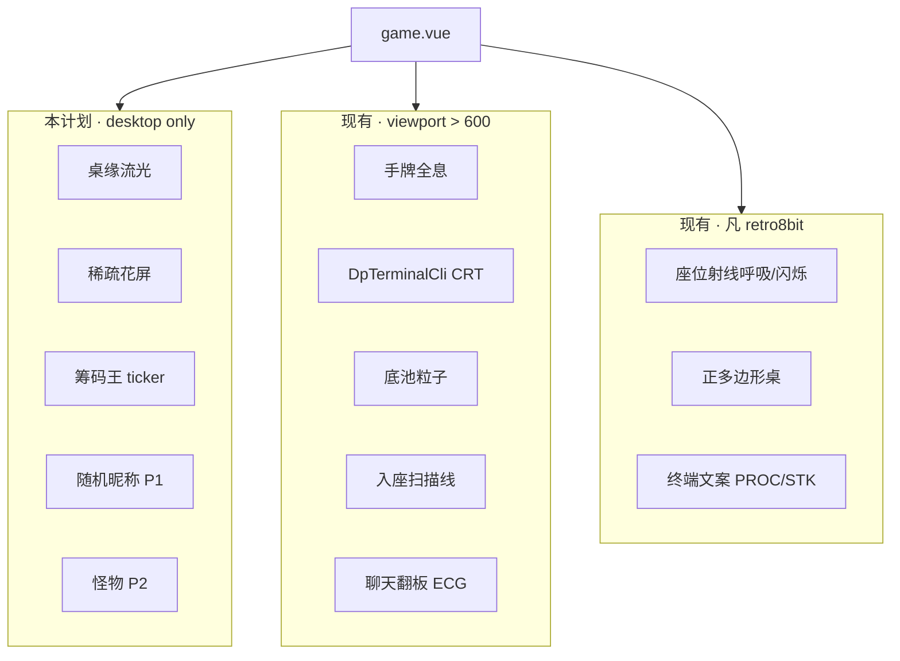

# retro8bit 桌面氛围特效 — 差异化体验计划

> 状态：**计划文档（Design/Planning Agent，待 PM + 用户选概念后实现）**  
> 非目标：本阶段**不实现**、**不提交**；不改后端/WebSocket 协议（除非 richest 展示需新字段，见 §6）；不为非 `retro8bit` 主题加特效；不把 tablet（641–1024px）纳入 v1 桌面特效档。

---

## 1. Goal / Non-goals

### 1.1 Goal

在 **桌面宽屏对局**（`retro8bit` 主题）上，把现有「磷光绿 CRT + 终端文案」从 **换皮感** 提升为 **可识别的氛围系统**：牌桌边缘流光、偶发信号故障、桌上信息彩蛋（随机昵称跑马灯 + 实时筹码王展示）、8bit 怪物装饰——且与已有全息手牌、CLI、底池粒子、座位射线等同屏共存，不抢操作可读性。

### 1.2 Non-goals

| 项 | 说明 |
|----|------|
| 其它四主题 | `default` / `gothic` / `strawberry` / `halloween` 零改动 |
| 移动端 / 窄窗 | `layoutTier !== 'desktop'` 或 `viewportWidth < 1025` 不挂载新 overlay（与现有 retro 特效 `>600` 档并存，见 §5.1） |
| 重做主视觉 | 不改正多边形桌几何、座位环、公共牌发牌时序 |
| 新音效 / 震动 | 除非用户后续单独立项 |
| 全局 canvas 游戏引擎 | 不做全屏 WebGL；特效以 **CSS + 轻量 Vue overlay** 为主 |
| 替换 `chipLeaderNicknames` 后端语义 | 结算后并列最高仍用现有字段；「桌上最富」为 **前端实时** 计算 |

---

## 2. 现状盘点（只读）

### 2.1 主题与门控

| 触点 | 位置 | 现状 |
|------|------|------|
| 根主题 | `game.vue` `:data-dp-game-theme="effectiveThemeForCss"` | 子树继承 `--dp-*` |
| retro 专属组件 | `game.vue` L125–131 | `GameHeroHandHologram`、`DpTerminalCli`、`DpCrtEventPopup`、`DpMusicPlayer`、`DpHandHistoryViewer` 仅 `retro8bit` |
| 宽屏门控惯例 | `viewportWidth > 600` | 全息、CLI CRT、入座扫描、底池粒子、聊天翻板 |
| 布局三档 | `dpGameLayoutTierMixin.js` | `phone` ≤640 / 短边≤480；`tablet` ≤1024；**`desktop` >1024** |
| 节能 / 动效降级 | `ecoMode` + `prefersReducedMotion` | `dp-game-eco-mode.css` 全局禁用 keyframes；各组件 `showCrt` / `isRetro` 计算属性 |

### 2.2 牌桌与动画资产

| 能力 | 位置 | 可复用 |
|------|------|--------|
| 正多边形桌 | `buildRetroTableLayout` → `--dp-table-polygon` | 流光应沿 **clip-path 同源** 边框 |
| 座位射线高亮 | `dp-game-shell.css` L2565–2614 | `transform`/`opacity` 动画范式 |
| 底池 CRT + 粒子 | `DpTablePotDisplay.vue` | `inject dpGameView`、pot diff → 粒子（rAF 节制） |
| 手牌全息光束 | `dp-game-shell.css` L1442+、`GameHeroHandHologram.vue` | 磷光 volumetric 色板 `#4af626` / `#39ff14` |
| 聊天 ECG / 翻板 | `GameRoomChatPanel.vue` + shell L1212+ | 桌面 footer 已有强动效，新特效 **避开聊天 cluster** |
| CRT 雪花 / 扫描线 | `DpTerminalCli`、`DpHandHistoryDetail`、`DpCrtEventPopup`、`GameOwnerHubPanel` | noise + bars + scanlines **可抽共享 token** |

### 2.3 玩家昵称与筹码数据

| 数据 | 来源 | 用途 |
|------|------|------|
| `state.players[]` | WebSocket / `APPLY_ROOM` | 每项含 `nickname`、`chips`、`bet`、`leftThisHand` 等 |
| `myChips` getter | `dpGame.js` L132–134 | **仅当前用户**筹码，≠ 桌上最富 |
| `chipLeaderNicknames` | 后端 `room.chipLeaderNicknames` | **结算后**「场上积分并列最高」；已传 `GameRoundTable` → `fieldChipLeader` → class `player-card--win-streak`（历史命名，实为 chip leader 光效） |
| `spectators[]` | store | 昵称字符串列表，可参与彩蛋采样 |
| 展示名 | `dpDisplayNickname()` | 过滤/美化 BOT 昵称 |

**结论：** 「桌上最富玩家昵称」应新增 store getter（例如 `liveTableChipLeaderNicks`），对 `players` 中 `!leftThisHand` 取 `chips` 最大值；**不要**误用 `myChips` 或仅结算态的 `chipLeaderNicknames`。

---

## 3. Design direction（frontend-design + ui-ux-pro-max）

### 3.1 美学立场

- **Tone：** *corrupted phosphor terminal* — 不是「复古绿滤镜」，而是 **1990 年代街机厅里一台接触不良的监控器**，仍在运行扑克进程（`PROC:` / `STK:` 文案已建立世界观）。
- **Differentiation：** 竞品换皮只改色；我们要 **信号层叙事**——光在桌缘跑、噪声偶发、系统把玩家当进程调度（昵称跑马灯）、筹码王被标为 `ROOT_STACK`。
- **Avoid AI slop：** 禁止紫色渐变、Inter、圆角大卡片浮层；坚持 **0 圆角、等宽/像素字、`#4af626` 主磷光 + `#0a0c0e` 深底**；装饰用 **inline SVG 像素图**，不用 emoji 当图标（ui-ux-pro-max `no-emoji-icons`）。

### 3.2 动效原则

| 规则 | 落地 |
|------|------|
| 每屏 1–2 个持续动效 | 常驻：桌缘流光 **或** 角落怪物 idle；偶发：全屏 glitch |
| 仅 `transform` / `opacity` | 流光用 `stroke-dashoffset` / `background-position`；禁止动画 `width`/`height` |
| 150–500ms 微交互；复杂 ≤800ms | 彩蛋文字切变 300ms；glitch burst 120–200ms |
| `prefers-reduced-motion` + `ecoMode` | 关闭流光、怪物帧动画、随机 glitch；保留静态 richest 标签 |
| 对比度 ≥4.5:1 | 跑马灯文字用 `#e0e8e0` on `#0a0c0e`，磷光仅作外发光 |

### 3.3 与现有 retro 特效的分层（z-index 草案）

```
z=0   felt / seats / cards
z=2   DpRetroTableFx（流光 SVG、怪物）  pointer-events: none
z=5   seat cards / pot
z=10  hero hologram portal
z=20  modals / CLI
```

---

## 4. 三套 cohesive 主题概念（PM + 用户三选一）

### 概念 A — **Corrupted CRT Poker**（推荐默认）

| 维度 | 描述 |
|------|------|
| 一句话 | 牌桌是一台过热终端，信号在桌缘泄漏，偶发花屏是「内存抖动」 |
| 视觉 | 桌缘 **绿色数据流** 沿多边形单向循环；全屏 **稀疏** glitch（雪花 80ms）；无卡通角色 |
| 昵称 | 底部状态行式跑马：`[SCAN] nick1 | nick2 | …` |
| 最富 | 桌心 pot 上方：`STACK_LEADER >> {nick} ({chips})` 终端行 |
| 怪物 | 无（或 P2 才加「噪点块」而非生物） |
| 适合 | 用户强调 glitch / 流光、偏酷、偏硬核 |

### 概念 B — **Arcade Cabinet Ghost**

| 维度 | 描述 |
|------|------|
| 一句话 | 街机柜里的幽灵在桌缘巡逻，把玩家名字当高分榜刷屏 |
| 视觉 | **双色流光**（绿 + 琥珀）沿桌缘 **往返**；角落 **半透明幽灵 SVG** 沿顶点缓动 |
| 昵称 | 随机 **大号像素字** 在桌心上方 **淡入淡出**（3s 一轮），像 attract mode |
| 最富 | 幽灵「托举」昵称牌：`👾` 改为像素 crown + nick |
| 怪物 | 幽灵本体即装饰；可加 1–2 帧 wings flap |
| 适合 | 要 playful、仍 retro，接受略多装饰 |

### 概念 C — **Pixel Critter Lounge**

| 维度 | 描述 |
|------|------|
| 一句话 | 桌角住着 8bit 小怪物，偶尔举牌显示玩家名；桌缘光迹像它们留下的粘液轨迹 |
| 视觉 | **粗像素 slime trail**（阶梯色块，非平滑渐变）；怪物 **4 方向 idle** |
| 昵称 | 怪物头顶 **speech bubble** 随机切换玩家 nick（5–8s） |
| 最富 | 最大只怪物蹲 dealer 对面顶点，举 `RICH` 牌 |
| 怪物 | **核心身份**；流光为辅 |
| 适合 | 用户明确要 monster sprites、偏可爱差异化 |

**推荐：** **概念 A（Corrupted CRT Poker）** — 与现有 `PROC:` / CLI / pot 粒子语言最一致，实现成本最低，且最不像「又一层皮肤」。

---

## 5. Feature list（P0 / P1 / P2）

### 5.1 统一门控（所有特性前置）

```text
useRetroDesktopAmbience =
  gameUiTheme === 'retro8bit'
  && layoutTier === 'desktop'    // 等价 viewport > 1024，满足用户 ≥1025
  && !ecoMode
  && !prefersReducedMotion
```

CSS 安全网：`@media (min-width: 1025px)` + `[data-dp-game-theme='retro8bit']` + `:not([data-dp-eco-mode='true'])` + `@media (prefers-reduced-motion: reduce)` 禁用动画。

> **与现有 `>600` 档关系：** 入座扫描、全息、底池粒子 **保持** 600 门槛；本计划 **新特效** 仅 desktop，避免 tablet 性能与拥挤 UI。

---

### P0 — MVP（v1 建议交付）

| ID | 特性 | 描述 | 技术 | 性能 |
|----|------|------|------|------|
| P0-1 | **桌缘流光** | 沿 `--dp-table-polygon` 边缘单向流动，亮度 25–40%，不遮挡牌面 | 在 `GameRoundTable` 内增 **SVG overlay**（与 `seat-rays` 同 viewBox），`stroke-dasharray` + CSS `@keyframes` 改 `stroke-dashoffset`；颜色 `#4af626` / 透明度脉冲 | 纯 CSS；1 条 path；GPU friendly |
| P0-2 | **实时筹码王** | 桌心显示当前 **桌上筹码最多** 玩家（并列则轮播或 `A | B`） | 新增 getter `liveTableChipLeaderNicks` + `liveTableChipLeaderMaxChips`；新组件 `DpRetroStackLeaderTicker.vue` 置于 `GameRoundTable` center stack（pot 上方） | 仅 chips 变化时更新；无动画或 200ms crossfade |
| P0-3 | **轻量全屏 glitch** | 平均每 **45–90s** 一次 **120ms** 花屏：噪声条 + 水平位移 2px | `DpRetroAmbientOverlay.vue` 挂 `game.vue` 内 `gameRoot`；`setInterval` + 随机 jitter；复用 `.dp-cli__snow-noise` 类 token | `pointer-events:none`；触发时暂停流光 200ms；PRM/eco 关闭 |
| P0-4 | **门控与降级** | 上述在 eco/PRM/tablet/非 retro 完全静默 | `useRetroDesktopAmbience` + eco CSS | — |

**P0 工作量粗估：** 3–5 人日（含 getter、SVG 流光、overlay、验收）。

---

### P1 — 增强（v1.1）

| ID | 特性 | 描述 | 技术 |
|----|------|------|------|
| P1-1 | **随机昵称彩蛋** | 桌心或桌缘下方每 **8–15s** 闪现 1 个随机玩家 nick（含观众，排除 bot） | 从 `players + spectators`  reservoir 抽样；`DpRetroNickFlash.vue`；CSS `opacity` 渐入渐出 |
| P1-2 | **流光 × 行动联动** | 当前行动者座位对应桌缘边 **增亮 1 段**（与 `seat-ray--active` 同步） | 由 `actingDisplayIndex` + 多边形顶点索引映射到 path 段；仅改 stroke 色 |
| P1-3 | **结算 richest 强化** | `chipLeaderNicknames` 非空时，桌心 ticker 切 `SETTLED_LEADER` 文案 3s | 监听 store；与 P0-2 复用组件 |
| P1-4 | **共享 CRT token 抽离** | snow / scanlines 抽到 `dp-retro-crt-layers.css` | 减少 DpTerminalCli / overlay 重复 |

---

### P2 — 锦上添花（v2+）

| ID | 特性 | 描述 | 技术 |
|----|------|------|------|
| P2-1 | **8bit 怪物** | 2–4 个 **16×16 或 24×24** 像素 sprite 栖在桌 **外角**（多边形顶点外侧） | 静态 SVG + CSS `steps()` 2–4 帧 idle；概念 C 全量 / 概念 A 可选「噪点块」 |
| P2-2 | **怪物举牌** | 与 P1-1 合并：怪物头顶 bubble 显示 nick | 需怪物锚点坐标来自 `buildRetroTableLayout` |
| P2-3 | **Canvas 流星尾迹** | 偶发流星沿桌缘（仅高端桌面） | **单** `requestAnimationFrame` 循环，tab hidden 暂停；默认关闭，localStorage flag |
| P2-4 | **与 DpCrtEventPopup 联动** | bad beat / big pot 时强制 1 次 glitch + 流光加速 2s | 事件总线或 `game.vue` ref |

---

## 6. Technical approach（按特性）

### 6.1 桌缘流光（P0-1）

| 方案 | 选用 | 理由 |
|------|------|------|
| 纯 CSS `conic-gradient` on felt | 备选 | clip-path 多边形下渐变边缘难对齐 |
| **SVG stroke-dashoffset** | **主方案** | 与 `seat-rays`、polygon 几何一致；易做分段高亮 |
| 全屏 canvas | 否 | 维护成本高，违背「CSS 优先」 |

实现要点：

- 从 `buildRetroTableLayout(n).polygonPoints` 生成闭合 `<path>`（与 felt `clip-path` 同源）。
- `pathLength="100"` 或 JS 测长；动画周期 **4–6s** `linear infinite`。
- `filter: drop-shadow(0 0 4px #39ff14)` 限量，避免大面积 blur 掉帧。

### 6.2 Glitch / 花屏（P0-3）

| 方案 | 选用 |
|------|------|
| 纯 CSS 类切换 `.dp-retro-ambient--burst` | **主方案** |
| 每帧 canvas noise | 否（除非 P2 升级） |

频率：**随机 45–90s**；**禁止**在 `showHeroHandHologram`、`DpTerminalCli.open`、`DpCrtEventPopup.active` 时触发（避免叠加晕眩）。

可访问性：

- `prefers-reduced-motion: reduce` → `display: none`。
- 未来可加设置项「减少花屏」（localStorage），默认开。

### 6.3 随机昵称 vs 筹码王（P0-2 / P1-1）

| 需求 | 数据源 | 注意 |
|------|--------|------|
| 桌上最富 | `players.filter(!leftThisHand)` → `max(chips)` | 并列全部返回；WS 延迟时允许 1 帧陈旧 |
| 随机彩蛋 | `players[].nickname` ∪ `spectators` | `isDpBotNickname` 过滤；`dpDisplayNickname` 展示 |
| 结算最高 | `chipLeaderNicknames` | 与 live richest **不同**；settled 阶段优先展示结算字段 |

**不要**用 `myChips` 驱动桌上最富展示。

建议 getter（`dpGame.js`）：

```javascript
// 伪代码
liveTableChipLeaderNicks(state) {
  var max = -1, nicks = []
  for (p of state.players) {
    if (!p || p.leftThisHand) continue
    var c = Number(p.chips) || 0
    if (c > max) { max = c; nicks = [p.nickname] }
    else if (c === max) nicks.push(p.nickname)
  }
  return nicks
}
```

### 6.4 8bit 怪物（P2-1）

| 方案 | 选用 |
|------|------|
| **Inline SVG symbol + use** | 主方案；4 色以内，`<symbol id="dp-critter-slime">` |
| PNG sprite sheet | 备选；需 retina 2x |
| Lottie | 否 |

放置：`position:absolute` 于 `.dp-game-table__layout` 四角，坐标由 `retroSeatRay` 顶点 **外法线偏移 2–4%**，`pointer-events: none`。

动画：`animation: critter-idle 1.2s steps(4) infinite`；eco/PRM 停在最前一帧。

---

## 7. Files to create / modify（高层）

### 7.1 新建

| 文件 | 职责 |
|------|------|
| `front/dp_game/src/components/DpRetroTableEdgeGlow.vue` | SVG 桌缘流光（P0-1） |
| `front/dp_game/src/components/DpRetroStackLeaderTicker.vue` | 筹码王终端行（P0-2） |
| `front/dp_game/src/components/DpRetroAmbientOverlay.vue` | 全屏偶发 glitch（P0-3） |
| `front/dp_game/src/components/DpRetroNickFlash.vue` | 随机昵称（P1-1） |
| `front/dp_game/src/styles/dp-retro-desktop-fx.css` | 桌面特效样式（按 media + theme 作用域） |
| `front/dp_game/src/styles/dp-retro-crt-layers.css` | 共享 snow/scanline（P1-4，可选） |
| `front/dp_game/src/utils/dpRetroDesktopFxDevLog.js` | dev-only `[dp-retro-desktop-fx]` |
| `front/dp_game/src/assets/retro8bit/critters.svg` | P2 怪物图集（可选） |

### 7.2 修改

| 文件 | 变更 |
|------|------|
| `front/dp_game/src/components/game.vue` | 挂载 overlay；`computed useRetroDesktopAmbience`；provide 或 inject |
| `front/dp_game/src/components/GameRoundTable.vue` | 插入 EdgeGlow + StackLeaderTicker |
| `front/dp_game/src/store/modules/dpGame.js` | getters `liveTableChipLeaderNicks` 等 |
| `front/dp_game/src/styles/dp-game-shell.css` | 必要时 z-index / center-stack 间距 |
| `front/dp_game/src/styles/dp-game-eco-mode.css` | 禁用新 keyframes |
| `front/dp_game/src/main.js` 或 game 样式 import | 引入 `dp-retro-desktop-fx.css` |

**不改：** Flyway、后端（除非产品坚持服务端 richest 权威）。

---

## 8. Acceptance criteria

| # | 条件 |
|---|------|
| AC-1 | 仅 `data-dp-game-theme='retro8bit'` 且 `data-dp-layout-tier='desktop'`（宽 ≥1025）可见 P0 特效 |
| AC-2 | 切换 `ecoMode` 或系统「减少动态效果」→ 流光/glitch 停止；筹码王 **静态文字仍可见** |
| AC-3 | 切换到其它主题或离开对局 → overlay 卸载，无定时器泄漏（`beforeDestroy` clear） |
| AC-4 | 桌缘流光不遮挡公共牌点击、座位卡片点击（`pointer-events: none`） |
| AC-5 | 筹码王显示与 `players[].chips` 一致；玩家全下后 leftThisHand 排除；并列最高显示多个 nick |
| AC-6 | Glitch 平均间隔 ≥45s；单次 ≤200ms；打开 CLI/全息时不触发 |
| AC-7 | 60fps 桌面中端机（Chrome）下滚动/发牌无明显掉帧；`will-change` 仅限流光 path |
| AC-8 | tablet（768–1024）与 phone **无** 新增 fullscreen 层（回归现有 retro >600 行为） |

---

## 9. Risks

| 风险 | 影响 | 缓解 |
|------|------|------|
| 动晕（glitch + 射线闪） | 恶心、投诉 | 稀疏触发；PRM 关闭；与 CLI/全息互斥；概念 A 默认弱强度 |
| 可读性 | pot / board 被挡 | 特效层 z-index 低于牌；桌心文字最多 1 行 |
| WS 更新滞后 | richest 短暂不准 | chips 变时 crossfade；不做过强音效 |
| 性能（多动画叠加） | 掉帧 | 桌面档才开；tablet 不挂；hidden tab 暂停 interval |
| `chipLeader` vs live richest 混淆 | 产品误解 | UI 前缀区分 `STACK_LEADER` vs `FIELD_LEADER`（结算） |
| 类名 `player-card--win-streak` | 维护困惑 | 文档注明；可选 P1 重命名为 `--chip-leader`（纯 CSS 重构） |
| 与 hologram portal 争 z-index | 层叠错误 | 统一 `dp-game-shell.css` z-index 表 |

---

## 10. Rollout

| 阶段 | 策略 |
|------|------|
| 开发 | 全部样式在 `dp-retro-desktop-fx.css`，选择器带 `[data-dp-game-theme='retro8bit'][data-dp-layout-tier='desktop']` |
| Feature flag（可选） | `localStorage dp_retro_desktop_fx=0` 关闭；默认 `1`；仅开发文档，不必须首版 UI |
| 发布 | 无后端迁移；前端随 `front/dp_game` 部署 |
| 回滚 | 移除 `game.vue` 三行挂载 + CSS import 即可 |

---

## 11. Recommended MVP（v1 范围）

**采用概念 A（Corrupted CRT Poker）时，v1 只做 P0：**

1. **桌缘流光**（P0-1）  
2. **实时筹码王 ticker**（P0-2）  
3. **稀疏全屏 glitch**（P0-3）  
4. **门控 + eco/PRM**（P0-4）  

**推迟到 v1.1：** 随机昵称（P1-1）、行动段流光（P1-2）  
**推迟到 v2：** 怪物 sprite（P2-1+）

---

## 12. Open questions（需用户 / PM 确认）

| # | 问题 | 默认建议 |
|---|------|----------|
| Q1 | 三套概念选哪一套？ | **A — Corrupted CRT Poker** |
| Q2 | 桌面门槛用 `layoutTier === 'desktop'`（>1024）还是硬编码 `viewportWidth >= 1025`？ | 用 **layoutTier**，与现有 CSS 变量一致 |
| Q3 | 「最富」指 **当前桌上筹码** 还是 **结算后 chipLeader**？ | v1 做 **当前筹码**；结算态叠加 `chipLeaderNicknames` 文案 |
| Q4 | 随机昵称是否包含 **观众席**？ | 包含，但可配置权重玩家 80% / 观众 20% |
| Q5 | Glitch 是否允许用户设置关闭（独立于 eco）？ | v1 不做；若投诉加开关 |
| Q6 | 是否与 BGM / 全息同时加强「进入对局」仪式感？ | 否，避免首屏过载 |

---

## 13. 附录：现有 retro8bit 特效地图（避免重复造轮子）



---

*文档版本：2026-06-02 · Planning only*
