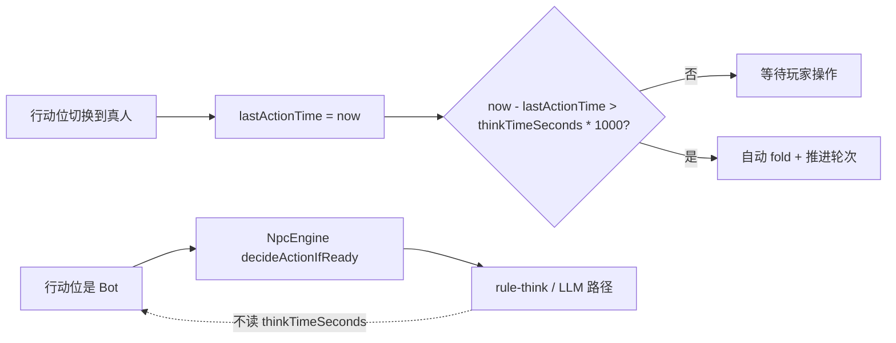
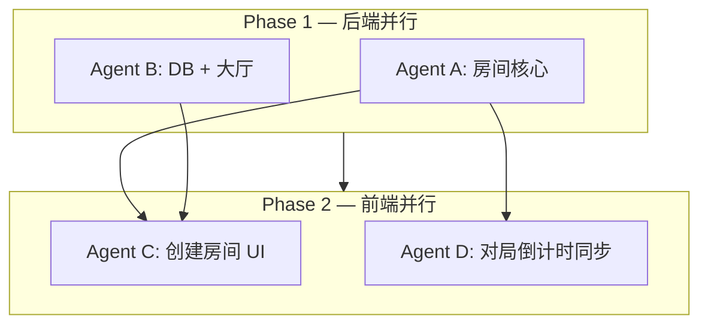

# 房间思考时间参数化 — 方案与验收

| 项 | 值 |
|---|---|
| 方案版本 | 2026-06-03 |
| 字段名 | `thinkTimeSeconds` |
| 合法范围 | **15～180 秒**（含端点） |
| 默认值 | **30 秒** ✓（PM 已确认） |
| Flyway | **V12** — `dp_room_lobby.think_time_seconds` |
| 状态 | **规划文档** — 本文档仅描述方案，**不含代码实现** |

---

## 1. 摘要（Executive Summary）

当前对局中**真人行动超时**与前端行动倒计时均硬编码为 **30 秒**；后端 `DpRoomBO.ACTION_TIMEOUT` 为静态常量，心跳 `tickNpcTurnOrHumanActionTimeout` 用 `lastActionTime` 与之比较；前端 `dpGameActionCountdownMixin` 在行动位切换时本地重置 `timeLeft = 30` 并每秒递减，**未**与后端 `lastActionTime` 对齐。

本特性将「每手行动思考上限」提升为**建房时可配置的房间级参数** `thinkTimeSeconds`（15～180s，默认 30s），写入内存房间与大厅摘要表，并在真人超时判定、WS/REST 房间快照、创建房间 UI 中贯通。**结算后准备倒计时仍为硬编码 30s**，与本参数无关。

**PM 已确认边界：**

| 范围 | 决策 |
|------|------|
| 默认思考时间 | **30 秒** |
| 快速匹配（QM） | **OUT OF SCOPE** — 不参数化 QM；策略为「有房就进，不卡思考时间；条件房以后再做」 |
| NPC / BOT | **OUT OF SCOPE** — 规则 Bot 继续使用现有 `dp.npc.rule-think` 采样（约 0.5～4s）；LLM Bot 沿用 ticket 路径；**房间 `thinkTimeSeconds` 仅约束真人** |
| retro8bit  urgency 阈值 | **不变** — `warning` ≤10s 剩余，`danger` ≤5s 剩余 |
| Ready 超时 | **不变** — 硬 30s（`readyDeadline` / 前端 `readyTimeLeft`） |

---

## 2. 现状（Current State）

### 2.1 后端

| 位置 | 行为 |
|------|------|
| `DpRoomBO` | `private static final int ACTION_TIMEOUT = 30000`；`getActionTimeout()` 静态；`lastActionTime` 在换行动位时由 `DpRoomServiceImpl` 写入 |
| `DpRoomHeartbeatScheduler#tickNpcTurnOrHumanActionTimeout` | 非 Bot 且非 `leftThisHand`：`now - lastActionTime > getActionTimeout()` → 自动 fold |
| `DpRoomServiceImpl` | `setReadyDeadline(now + 30_000L)` — 结算准备阶段，与行动超时无关 |
| `createRoom(...)` | 无思考时间参数；仅 sb/bb/stackBb/maxSeat/password |
| `DpRoomController#createRoom` | 同上 |
| `dp_room_lobby` / `DpRoomLobby` / `DpRoom` DTO | 无思考时间列 |
| `DpRoomLobbySync#lobbySummaryFingerprint` | 未含 think time（新增后需纳入 fingerprint） |

### 2.2 前端

| 位置 | 行为 |
|------|------|
| `dpGameActionCountdownMixin.js` | `timeLeft` 初始 30；行动 session 切换时 `startCountdown()` 重置为 30 并本地 tick |
| `game.vue` | `actionTimerProgressPct = timeLeft / 30`；`tableActionTimerUrgency`：`>10 ok`，`>5 warning`，否则 `danger` |
| `GameRoundTable.vue` | retro8bit 座位射线 `active-breathe`：`timeLeft > 20` 时启用 |
| `dpGame` store `APPLY_ROOM` | 未映射 `lastActionTime` / `thinkTimeSeconds` |
| `dpCreateRoomSubmit.js` / `DpCreateRoomConsole.vue` / `CreateRoom.vue` | 创建参数无 think time |
| 大厅房间卡片 | 展示 sb/bb/stack/seats/密码锁；无思考时间 |

### 2.3 已知偏差（本特性需修复）

- 前端倒计时与后端 `lastActionTime` **不同步**：刷新页面、WS 延迟或轮询间隔会导致圆环与真实超时漂移。
- 参数化后若仍本地重置为固定 30，则非 30s 房间 UI 与超时判定将**双重错误**。

---

## 3. 目标设计（Target Design）

### 3.1 数据模型

```
建房请求 thinkTimeSeconds (15..180, default 30)
        ↓
DpRoomBO.thinkTimeSeconds (int, 实例字段, JSON 下发)
        ↓
dp_room_lobby.think_time_seconds (INT NOT NULL DEFAULT 30)  ← Flyway V12
        ↓
DpRoomLobby / DpRoom 摘要 DTO（大厅列表可选展示，P1）
```

- **单位**：秒（整数）；后端超时比较时使用 `thinkTimeSeconds * 1000L` 毫秒。
- **不可通过环境变量覆盖**（与 sb/stack 一致，属房间规则）。
- **创建后不可变**（推荐，见 §10 开放问题）；无 `PATCH room settings` P0 接口。

### 3.2 超时语义（仅真人）



- Bot 路径：**不**用 `thinkTimeSeconds` 作决策延迟上限；**不**用其作 Bot 强制 fold（现有引擎逻辑不变）。
- 若 Bot 占位过久，仍由各自 `nextBotActionTime` / LLM ticket 控制；真人超时逻辑不介入 Bot 分支（与现网一致）。

### 3.3 前端倒计时（推荐 P0 方案）

行动位 session 内：

```
remainingSec = ceil((lastActionTime + thinkTimeSeconds * 1000 - Date.now()) / 1000)
remainingSec = clamp(remainingSec, 0, thinkTimeSeconds)
```

- WS / `getNowRoom` 快照携带 `lastActionTime`（毫秒）与 `thinkTimeSeconds`。
- `dpGame` store `APPLY_ROOM` 持久两字段；mixin 在 `actIndex` / `currentHandSeed` 变化或快照更新时 **resync**，而非盲重置 30。
- **进度条分母**：`thinkTimeSeconds`（替换硬编码 30）。
- **urgency 阈值**：仍按**剩余秒数** — `>10 ok`，`>5 warning`，`≤5 danger`（与 retro8bit 规格一致，与总时长无关）。
- **ready 倒计时**：继续硬 30s，不读 `thinkTimeSeconds`。

### 3.4 API 变更

**`POST /dpRoom/createRoom`**

| 参数 | 类型 | 默认 | 校验 |
|------|------|------|------|
| `thinkTimeSeconds` | int | 30 | 15 ≤ x ≤ 180，否则 400 |

**房间快照 JSON（`DpRoomBO` / `getNowRoom` / WS push）**

| 字段 | 类型 | 说明 |
|------|------|------|
| `thinkTimeSeconds` | int | 本房思考上限（秒） |
| `lastActionTime` | long | 当前行动位起始毫秒时间戳（已有字段，确保前端可见） |

### 3.5 快速匹配 — 明确 OUT OF SCOPE

- `DpQuickMatchPairingHost` / `createRoom` 无密码公开房路径：**不**新增 QM 专用 think time；配对房继承默认 30s 或内存 `createRoom` 默认值即可。
- **产品策略（PM）**：「有房就进，不卡思考时间；条件房（按思考时间筛选/匹配）以后再做。」
- `JoinableQuickMatchRoomIndex`：**不**将 think time 纳入 joinable 条件（本迭代零改动）。

### 3.6 NPC — 明确 OUT OF SCOPE

- `dp.npc.rule-think`（`DpNpcRuleThinkProperties` / `DpNpcRuleThinkSampler`）：保持 fast/slow 桶与 `maxMs=4000` 等配置。
- `DpNpcEngine#decideActionIfReady` / `DpLlmNpcDecisionService`：**不**读取 `thinkTimeSeconds`。
- 文档与代码注释中注明：**人类专用超时**，避免后续误用。

---

## 4. 优先级（P0 / P1）

### P0 — 必须交付

| # | 项 |
|---|-----|
| 1 | Flyway **V12**：`ALTER TABLE dp_room_lobby ADD think_time_seconds INT NOT NULL DEFAULT 30` |
| 2 | `DpRoomBO.thinkTimeSeconds` + 创建时 clamp(15,180) + 默认 30 |
| 3 | `createRoom` 全链路：Controller → Service → 接口签名 → `DpRoomServiceCallbacks` / QM bridge 传参（值可忽略，签名一致） |
| 4 | 心跳真人超时：`thinkTimeSeconds * 1000L` 替换 `getActionTimeout()` |
| 5 | 移除或废弃静态 `ACTION_TIMEOUT` 作为**实例超时**来源（可保留 `@Deprecated` 常量仅测试兼容，或改为 `DEFAULT_THINK_TIME_SECONDS = 30`） |
| 6 | 大厅 sync：`DpRoomLobby`、`DpRoomHallServiceImpl#toSummary`、`lobbySummaryFingerprint` 含 think time |
| 7 | 前端创建房：经典 `CreateRoom` + retro `DpCreateRoomConsole` + `dpCreateRoomSubmit.js` 提交 `thinkTimeSeconds` |
| 8 | 前端对局：`APPLY_ROOM` + `dpGameActionCountdownMixin` 基于 `lastActionTime + thinkTimeSeconds` resync |
| 9 | `game.vue` 进度分母改为 `thinkTimeSeconds`；urgency 阈值不变 |
| 10 | 默认 30s 时行为与现网等价（回归） |

### P1 — 可后续

| # | 项 |
|---|-----|
| 1 | 大厅房间卡片 / 搜索筛选项展示 `thinkTimeSeconds`（如「思考 60s」） |
| 2 | 房主开局前修改思考时间（若 PM 否决「创建后不可变」） |
| 3 | retro 创建页预设 profile 携带 think time（casual/standard/deep） |
| 4 | `GameRoundTable` breathe 阈值与最短 15s 的体验优化（见 §10） |
| 5 | 文档：`docs/DPGAME.md`、README.ch.md 房间规则一节 |

---

## 5. 后端改动清单

| 文件 / 区域 | 改动 |
|-------------|------|
| `db/migration/V12__room_think_time_seconds.sql` | **新建** — lobby 列 |
| `DpRoomBO.java` | 字段 `thinkTimeSeconds`；getter/setter；JSON 序列化；超时 helper `getThinkTimeMs()` |
| `DpRoomController.java` | `createRoom` 增加 `@RequestParam(defaultValue="30") int thinkTimeSeconds` + 校验 |
| `DpRoomService.java` / `DpRoomServiceImpl.java` | `createRoom` 签名与赋值；QM `createRoom` 回调传默认或省略 |
| `DpRoomServiceCallbacks.java` / `DpRoomQuickMatchPairingHost.java` | 签名对齐（QM 仍 OUT OF SCOPE 逻辑） |
| `DpRoomHeartbeatScheduler.java` | 真人分支用 `room.getThinkTimeSeconds()` |
| `DpRoomLobby.java` | 字段 + MyBatis 映射 |
| `DpRoomHallServiceImpl.java` | `toSummary` / upsert SQL 写 `think_time_seconds` |
| `DpRoomLobbySync.java` | `lobbySummaryFingerprint` 追加 think time |
| `DpRoom.java`（大厅 DTO） | 可选字段供 REST 列表（P0 若 API 已返回 DpRoom 则一并加） |
| 测试 | `DpRoomHeartbeatScheduler` 或 Service 层：15/180 边界、默认 30、Bot 不受影响 |

**明确不改（本迭代）：**

- `DpNpcRuleThinkProperties` / `DpNpcEngine` / `DpLlmNpcDecisionService`
- `readyDeadline` 30_000L 常量
- `JoinableQuickMatchRoomIndex` 匹配条件

---

## 6. 前端改动清单

| 文件 / 区域 | 改动 |
|-------------|------|
| `dpCreateRoomSubmit.js` | params 增加 `thinkTimeSeconds`（clamp 15–180） |
| `CreateRoom.vue` | 表单项：滑块或数字输入，默认 30，hint 15–180 |
| `DpCreateRoomConsole.vue` | retro 创建：`config.sys` 新字段（如 `THINK_SEC`）+ 校验 + preset 可选 P1 |
| `store/modules/dpGame.js` | state + `APPLY_ROOM`：`thinkTimeSeconds`、`lastActionTime` |
| `mixins/dpGameActionCountdownMixin.js` | resync 算法；session key 可含 `lastActionTime` |
| `components/game.vue` | `actionTimerProgressPct` 分母；watch 快照触发 resync |
| `components/GameRoundTable.vue` | **P0 无强制改动**（breathe 仍 `timeLeft > 20`）；P1 可讨论 |
| `utils/dpGameRoomFingerprint.js` | 若 fingerprint 用于跳过 UI 更新，纳入新字段 |
| 大厅列表组件（P1） | 卡片展示 think time |

**UI 文案建议（创建页）：**

- 标签：「行动思考时间」
- 辅助：「每步最多思考秒数（15～180），超时自动弃牌」
- 默认选中 30s；快捷芯片：30 / 60 / 90（可选）

---

## 7. 执行顺序（多 Agent 分工）

建议两阶段：**先 A∥B（后端）**，完成后 **C∥D（前端）** 并行。



### Agent A — 房间核心与超时

1. `DpRoomBO.thinkTimeSeconds` + `getThinkTimeMs()`
2. `createRoom` Service / Controller / 回调签名
3. `DpRoomHeartbeatScheduler` 真人超时
4. 单元测试：边界与 Bot 路径回归

**交付物：** 可 `curl createRoom?thinkTimeSeconds=60` 且心跳在 60s 后 fold；WS JSON 含字段。

### Agent B — Flyway + 大厅镜像

1. `V12__room_think_time_seconds.sql`
2. `DpRoomLobby` + `DpRoomHallServiceImpl` upsert
3. `DpRoomLobbySync#lobbySummaryFingerprint`
4. `DpRoom` DTO（列表 API）

**依赖：** Agent A 的 `DpRoomBO` 字段名与默认值一致。

**交付物：** 建房后 DB 行 `think_time_seconds` 正确；reconcile 不丢列。

### Agent C — 创建房间 UI（依赖 A+B API 稳定）

1. `dpCreateRoomSubmit.js`
2. `CreateRoom.vue` + `DpCreateRoomConsole.vue`
3. 表单校验与默认 30

**交付物：** 两主题创建页均可提交合法 think time。

### Agent D — 对局倒计时（依赖 A 快照字段）

1. `dpGame.js` store
2. `dpGameActionCountdownMixin.js` resync
3. `game.vue` 进度与 urgency

**交付物：** 60s 房间圆环总时长 60；刷新页面剩余时间正确；30s 房间与现网一致。

### 集成顺序（人工 / CI）

1. `mvn clean package -DskipTests`
2. Flyway 迁移 UP
3. 建房 15 / 30 / 180 三档 smoke
4. 真人超时 fold + Bot 正常行动
5. retro8bit urgency 在 ≤10 / ≤5 仍变色
6. ready  bar 仍 30s

---

## 8. 验收标准（Acceptance Criteria）

### 8.1 后端

- [ ] `thinkTimeSeconds=14` 或 `181` → HTTP 400
- [ ] 省略参数 → 房间为 30；真人约 30s 无操作 fold
- [ ] `thinkTimeSeconds=60` → 约 60s  fold；59s 内 action 不 fold
- [ ] Bot 行动不因 15s 房间被「行动超时」强制 fold
- [ ] `readyDeadline` 仍为创建后 30s，与 `thinkTimeSeconds` 无关
- [ ] `dp_room_lobby.think_time_seconds` 与内存一致；服务重启 reconcile 后仍在

### 8.2 前端

- [ ] 创建页默认 30；可设 15～180
- [ ] 对局圆环总时长 = 房间 `thinkTimeSeconds`
- [ ] 中途刷新 / WS 重连后剩余秒数与后端一致（误差 ≤1s）
- [ ] retro8bit：`timeLeft=10` → warning；`timeLeft=5` → danger（与总时长 15/180 无关）
- [ ] `thinkTimeSeconds=30` 全链路视觉与现网无回归

### 8.3 范围外（不应发生）

- [ ] QM 配对逻辑 **无** think time 筛选
- [ ] NPC `rule-think` 配置 **无** 变更
- [ ] Ready 倒计时 **无** 随 think time 变化

---

## 9. 风险与缓解

| 风险 | 影响 | 缓解 |
|------|------|------|
| 前端仍本地重置 30 | 非 30s 房间 UI 骗人 | P0 强制 `lastActionTime` resync；Code review mixin |
| `lastActionTime` 未下发或 `@JsonIgnore` | 前端无法 sync | 确认 `DpRoomBO` JSON 含该字段；集成测试 getNowRoom |
| Flyway V12 与已存在 V12 冲突 | 启动失败 | 合并前检查 `db/migration` 最大版本号，协调序号 |
| lobby fingerprint 漏字段 | 改 think time 不 upsert（若未来可编辑） | P0 纳入 fingerprint；当前不可变则影响低 |
| 15s 房间 retro breathe 永不触发 | 视觉略减 | PM 确认是否 OK（§10）；P1 改阈值公式 |
| QM `createRoom` 签名变更编译面 | 配对建房失败 | 回调链全量改签名；QM 行为不改 |
| 多客户端时钟漂移 | 剩余 1～2s 误差 | 以服务端超时为准；前端仅展示 |

---

## 10. 开放问题（待 PM / 用户确认）

以下 **尚未拍板**；表中 **推荐** 供决策参考。

| # | 问题 | 选项 | 推荐 | 优先级 |
|---|------|------|------|--------|
| Q1 | 思考时间仅创建时设定，还是允许房主在**开局前**修改？ | A) 仅 createRoom<br>B) 开局前可改 API | **A — 仅创建时（P0）**；B 放 P1 | P0 决策 |
| Q2 | 大厅房间卡片是否展示思考时间？ | A) 不展示<br>B) 展示「思考 Ns」 | **P1 再展示**；P0 API 可先带字段 | P1 |
| Q3 | 房间创建后是否**不可变**？ | A)  immutable<br>B) 可 PATCH | **A — immutable**；与 Q1 一致 | P0 决策 |
| Q4 | `GameRoundTable` breathe 条件为 `timeLeft > 20`；**15s 桌**全程无 breathe — 是否接受？ | A) 接受<br>B) P1 改为按比例或 `> min(20, thinkTime*0.66)` | 需产品确认；工程默认 **A 可接受** | P1 体验 |
| Q5 | 前端倒计时是否必须从 **`lastActionTime + thinkTimeSeconds`** 推导？ | A) 服务端 sync（推荐）<br>B) 继续本地 session 重置 | **A — P0** | P0 决策 |

**建议 P0 默认包：** Q1=A，Q3=A，Q5=A；Q2/Q4 不阻塞合并。

---

## 11. 参考代码锚点

|  Concern | 位置 |
|----------|------|
| 静态 30s 超时 | `DpRoomBO.ACTION_TIMEOUT` |
| 真人 fold | `DpRoomHeartbeatScheduler#tickNpcTurnOrHumanActionTimeout` |
| 换行动位写时间 | `DpRoomServiceImpl` — `setLastActionTime` |
| Bot 思考（不变） | `DpNpcEngine#decideActionIfReady` |
| 前端本地 30s | `dpGameActionCountdownMixin.js` |
| urgency 阈值 | `game.vue` — `tableActionTimerUrgency` |
| retro breathe | `GameRoundTable.vue` — `seatRayClass` |
| Ready 30s | `DpRoomServiceImpl` — `setReadyDeadline(+30_000L)` |
| 创建 API | `DpRoomController#createRoom` |
| Lobby 表 | `V1__init_schema.sql` — `dp_room_lobby` |

---

## 12. 变更文件索引（实施时勾选）

**Backend**

- [ ] `src/main/resources/db/migration/V12__room_think_time_seconds.sql`
- [ ] `src/main/java/.../common/bo/DpRoomBO.java`
- [ ] `src/main/java/.../controller/DpRoomController.java`
- [ ] `src/main/java/.../room/DpRoomService.java`
- [ ] `src/main/java/.../room/impl/DpRoomServiceImpl.java`
- [ ] `src/main/java/.../room/support/DpRoomHeartbeatScheduler.java`
- [ ] `src/main/java/.../room/support/DpRoomLobbySync.java`
- [ ] `src/main/java/.../lobby/entity/DpRoomLobby.java`
- [ ] `src/main/java/.../lobby/impl/DpRoomHallServiceImpl.java`
- [ ] `src/main/java/.../common/entity/DpRoom.java`
- [ ] `src/main/java/.../room/support/DpRoomServiceCallbacks.java`（及 QM host）

**Frontend**

- [ ] `front/dp_game/src/utils/dpCreateRoomSubmit.js`
- [ ] `front/dp_game/src/components/CreateRoom.vue`
- [ ] `front/dp_game/src/components/DpCreateRoomConsole.vue`
- [ ] `front/dp_game/src/store/modules/dpGame.js`
- [ ] `front/dp_game/src/mixins/dpGameActionCountdownMixin.js`
- [ ] `front/dp_game/src/components/game.vue`

**Docs（P1）**

- [ ] `docs/DPGAME.md`
- [ ] `README.ch.md`

---

*本文档由 PM 工作流产出；确认 §10 开放问题后即可按 §7 分 Agent 实施。*
