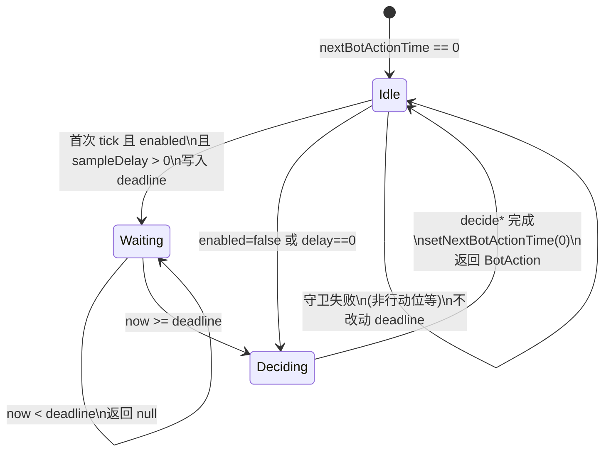

# 规则类 NPC 思考延时 — 实施方案

> **文档性质**：方案 Agent 交付；**不写业务 Java、不 git commit/push**。  
> **实现方**：按本文落地后端；前端无需改协议（仍靠 `currentActorIndex` 高亮「思考中」）。  
> **需求冻结**：规则 NPC（含 `BOT_CUSTOM_*`，不含 `BOT_LLM*`）轮到后随机等待再决策；复用 `DpPlayer.nextBotActionTime`；采样方案 B（偏快分布）+ 秒出概率；上限 **4000ms**；默认开启；配置前缀 `dp.npc.rule-think`；接受 1s 心跳带来的端到端约 **1～6s**。

---

## 变更说明（本次交付）

| 项 | 内容 |
|----|------|
| 新增 | `docs/refactor/rule-npc-think-delay-plan.md`（本文件） |
| 修改代码 | 无 |

---

## 1. 背景与现状

### 1.1 调用链（只读核对）

| 步骤 | 位置 | 行为 |
|------|------|------|
| 1s 全局 tick | `DpRoomHeartbeatScheduler.java:144-168` | `tickNpcTurnOrHumanActionTimeout`：LLM 与规则 **分岔** 调用 |
| LLM | `DpLlmNpcDecisionService.java:194-296` | 用 `nextBotActionTime` + `inflightByKey` 两阶段（排期 → 等 API） |
| 规则 | `DpNpcEngine.java:1886-1916` | `decideActionIfReady`：进门 **`setNextBotActionTime(0)`** 后立即 `decideCustomBotAction` / `decideBotAction` |
| 执行 | `DpRoomServiceImpl.java:374-400` | `npcAction`：`action == null` 时不 fold/bet |

字段：`DpPlayer.java:69-74` 已有 `nextBotActionTime` 及注释；`newHand` 玩家重置循环（`DpRoomServiceImpl.java:2090-2103`）**尚未**清零该字段。

文档滞后：`docs/DPGAME.md:662-671`、`docs/ai/npc-engine/03_normal_npc_modules.md:14` 仍写「思考延迟已移除」——实现后需同步（见 §9）。

### 1.2 目标 / 非目标

**目标**

- 规则 Bot 轮到后先「思考」再出招，体感更接近真人。
- 与 LLM 路径 **字段复用、逻辑隔离**；`enabled: false` 即恢复「即时决策」。
- P0：全局一套 `dp.npc.rule-think`；P1 仅列按 `BotType` 分套想法。

**非目标**

- 不改 LLM 提示词、HTTP、异步池、`PRE_API_DELAY_MS`（`DpLlmNpcDecisionService.java:77-78` 仍为 0）。
- 不 Flyway、不改前端 WS 协议、不按牌力/情绪分档（P0）；P1 可扩展。
- 不把心跳从 1s 改细（产品已接受 1～6s 端到端）。

---

## 2. 状态机

### 2.1 规则 NPC 单次行动（两阶段 + 清零）



### 2.2 ASCII（与 LLM 对照）

```
规则 NPC（本方案）                    LLM NPC（禁止改动）
─────────────────                    ─────────────────
Idle (next=0)                          Idle (next=0, no inflight)
  │ tick 采样 delay                      │ tick 设 next=now+PRE_API
  ├─ delay>0 → Waiting                   ├─ 到点 → 发起 HTTP → inflight
  └─ delay=0 → Deciding                  └─ inflight 未完成 → null
Waiting (next>0, now<next) → null       inflight 完成 → next=0 → BotAction
Waiting (now>=next) → Deciding
Deciding → next=0 → BotAction
```

**关键**：规则路径 **不得** 在进门时无条件 `setNextBotActionTime(0)`（当前 `DpNpcEngine.java:1903` 需删除/后移）；仅在 **决策完成返回 `BotAction` 前** 或 **§5 强制清零点** 置 0。

---

## 3. 与 LLM 隔离

### 3.1 调度层已隔离（保持不动）

`DpRoomHeartbeatScheduler.java:151-157`：

- `isLlmBotNickname` → **仅** `llmNpcDecisionService.decideActionIfReady`
- 否则 → **仅** `DpNpcEngine.decideActionIfReady`

昵称互斥：`BOT_LLM*` 与 `BOT_CUSTOM_*` / `BOT_TAG_*` 等前缀不同，**同一 `DpPlayer` 不会同时走两条路径**。

### 3.2 允许修改

| 类 / 文件 | 改动 |
|-----------|------|
| `DpNpcEngine.java` | `decideActionIfReady`：两阶段排期 + 到点再调 `decideBotAction` / `decideCustomBotAction`；**删除** `:1903` 进门清零 |
| **新增** `DpNpcRuleThinkProperties.java` | `@ConfigurationProperties(prefix = "dp.npc.rule-think")`，参照 `DpNpcTableTalkProperties.java` |
| **新增** `DpNpcRuleThinkConfig.java` | `@EnableConfigurationProperties`，参照 `DpNpcTableTalkConfig.java` |
| **新增** `DpNpcRuleThinkSampler.java`（或 `*Runtime` 静态 holder） | 读配置、采样 delay；供静态 `DpNpcEngine` 调用 |
| `DpRoomServiceImpl.java` | `newHandWithoutLobbyUpsert` 玩家重置循环（`:2090` 附近）对每个 `p.setNextBotActionTime(0L)` |
| `application.yml` | 增加 `dp.npc.rule-think` 段（`:108` 旁 `dp.npc` 下） |
| 单元测试 | 扩展 `DpNpcCustomBotTest` 或新增 `DpNpcRuleThinkSamplerTest`（采样边界、enabled=false） |

### 3.3 禁止修改（LLM 回归保护区）

| 类 / 方法 | 原因 |
|-----------|------|
| `DpLlmNpcDecisionService` 全文，尤其 `decideActionIfReady`、`inflightByKey`、`PRE_API_DELAY_MS` | LLM 独占 `nextBotActionTime` 语义：排 API / 等 Future |
| `DpRoomHeartbeatScheduler.tickNpcTurnOrHumanActionTimeout` 分岔结构 | 已正确分流；无需为规则延时改 tick 周期 |
| `DpNpcEngine.decideBotAction`、`decideCustomBotAction` 及下游策略类 | 只改 **何时调用**，不改决策数学 |
| `DpNpcEngine.buildLlmNpcGameSnapshot`、LLM 相关常量 | 与规则延时无关 |
| Flyway / 前端 | 无表结构、无协议变更 |

### 3.4 同字段共存约定

- **规则 Bot**：`nextBotActionTime` = 「允许调用 `decide*` 的最早时刻」；无 `inflightByKey`。
- **LLM Bot**：同字段 + `inflightByKey`；规则采样器 **不得** 写入 LLM 座位的 deadline（调度层已保证不会调用规则 `decideActionIfReady` 处理 LLM）。
- 实现时在 `decideActionIfReady` 开头保留 `isLlmBotNickname` → `return null`（`:1905-1907`），防御性双保险。

---

## 4. 配置项

### 4.1 配置表（P0 统一一套）

| 键（YAML 相对 `dp.npc.rule-think`） | 类型 | 默认 | 说明 |
|-----------------------------------|------|------|------|
| `enabled` | boolean | `true` | `false`：采样恒为 0，行为等同当前「即时决策」 |
| `snap-probability` | double [0,1] | `0.30` | **秒出**概率：本次行动 delay=0，本 tick 内直接 `decide*` |
| `max-ms` | int | `4000` | 采样结果硬上限（ms） |
| `fast-min-ms` | int | `600` | 快桶均匀采样下界（含） |
| `fast-max-ms` | int | `1800` | 快桶均匀采样上界（含） |
| `fast-weight` | double >0 | `0.65` | 非秒出时选快桶的相对权重 |
| `slow-min-ms` | int | `1800` | 慢桶下界（含） |
| `slow-max-ms` | int | `4000` | 慢桶上界（含）；仍受 `max-ms` cap |
| `slow-weight` | double >0 | `0.35` | 非秒出时选慢桶的相对权重 |

校验建议（实现方）：`fast-min-ms <= fast-max-ms <= max-ms`，`slow-min-ms <= slow-max-ms <= max-ms`；权重 ≤0 时 fallback 默认；非法概率 clamp 到 [0,1]。

### 4.2 方案 B（偏快）体感

- 约 **30%** 秒出 → 加上最多 1s tick，体感 **0～1s**。
- 非秒出 **65%** 落快桶 **0.6～1.8s** + tick → 约 **1～3s**。
- **35%** 慢桶 **1.8～4s** + tick → 约 **2～5s**；极端上界 **4s + ~1s ≈ 5～6s**，符合产品预期。

### 4.3 `application.yml` 示例

```yaml
dp:
  npc:
    table-talk:
      enabled: true
      min-interval-ms: 2500
    rule-think:
      enabled: true
      snap-probability: 0.30
      max-ms: 4000
      fast-min-ms: 600
      fast-max-ms: 1800
      fast-weight: 0.65
      slow-min-ms: 1800
      slow-max-ms: 4000
      slow-weight: 0.35
  llm:
    ark:
      api-key: ${ARK_API_KEY:}
      endpoint-id: ${ARK_ENDPOINT_ID:}
      # ...
 无真实密钥；LLM 配置与 rule-think 无关
```

---

## 5. 采样算法（伪代码）

```text
function sampleRuleThinkDelayMs(config, rng) -> long:
    if not config.enabled:
        return 0

    if rng.nextDouble() < config.snapProbability:
        return 0   // 秒出

  // 非秒出：按权重选桶，桶内均匀整数毫秒
    totalW = config.fastWeight + config.slowWeight
    if totalW <= 0:
        totalW = 1.0
    pickFast = rng.nextDouble() < (config.fastWeight / totalW)

    if pickFast:
        lo, hi = config.fastMinMs, config.fastMaxMs
    else:
        lo, hi = config.slowMinMs, config.slowMaxMs

    if lo > hi:
        swap or clamp using defaults

    delay = lo + rng.nextInt(hi - lo + 1)   // 闭区间
    return min(delay, config.maxMs)


function decideActionIfReady(room, bot):
    // ... 现有守卫（:1887-1901）...

    if isLlmBotNickname(bot): return null   // 保留

    now = currentTimeMillis()
    deadline = bot.getNextBotActionTime()

    if deadline <= 0:
        delay = sampleRuleThinkDelayMs(config, handRandom(room, bot))
        if delay > 0:
            bot.setNextBotActionTime(now + delay)
            return null                    // 本 tick 仅排期
        // delay == 0： fall through 到决策
    else if now < deadline:
        return null                        // 等待中

    // 到点或秒出：决策
    action = isCustomBotNickname(bot)
        ? decideCustomBotAction(room, bot)
        : decideBotAction(room, bot, type)
    bot.setNextBotActionTime(0L)           // 决策后清零（无论 action 是否 null）
    return action
```

**随机源**：与牌局决策一致，使用 `DpNpcEngine.buildHandRandom(room, bot)`（`:1923` 起），避免污染发牌 RNG；**不要**用 `ThreadLocalRandom` 单独一套，除非单测注入。

**`enabled: false`**：`sampleRuleThinkDelayMs` 恒返回 0，逻辑与现网「进门即决策」等价（仍建议在决策后 `setNextBotActionTime(0)` 保持一致）。

---

## 6. 行动位切换与 `nextBotActionTime` 清零

必须在以下时机将相关玩家的 `nextBotActionTime` 置 **0**，避免脏 deadline 导致「未轮到我却还要等 / 秒出变长等」：

| # | 时机 | 位置建议 | 说明 |
|---|------|----------|------|
| R1 | **单次决策完成** | `decideActionIfReady` 返回 `BotAction` 前 | 正常路径；与 LLM `:296` 一致 |
| R2 | **新一手开局** | `DpRoomServiceImpl.newHandWithoutLobbyUpsert` 玩家循环 `:2090-2103` | 与 HandPlan 一并 reset；防止上一手残留 |
| R3 | **玩家离桌 / 踢出** | 移除 `DpPlayer` 前 | 对象销毁即可；若仅 `leftThisHand` 且仍可能在后续街行动，**不必**清（仍可能再轮到） |
| R4 | **守卫失败：非当前行动者** | `decideActionIfReady` 早退 | **不要**修改该 bot 的 deadline（非其 tick） |
| R5 | **规则引擎对 LLM 昵称** | `isLlmBotNickname` 分支 | `return null` 且 **不读写** deadline（LLM 服务自理） |
| R6 | **enabled 从 true→false 热改** | 可选：配置 refresh 时遍历房间 | P0 可不做；重启 + `enabled: false` 足够回滚 |

**不应清零**：等待阶段（`now < deadline`）每次 tick 返回 null 时——否则永远决策不了。

**行动位切换**：`moveToNextValidActor`（`:708-748`）在上一玩家 **已执行** `npcAction` 后才会切换；上一玩家 deadline 应在 R1 已清。若未来存在「强制改 actor 不经过 npcAction」的管理路径，须在改 index 前对 **旧 actor** 执行 R1 或 R2。

---

## 7. P0 / P1 范围

### P0（本迭代必做）

- 全局 `dp.npc.rule-think` 一套参数，所有规则 Bot（含 `BOT_CUSTOM_*`）共用。
- `DpNpcEngine.decideActionIfReady` 两阶段；`newHand` 清零。
- 配置注册方式对齐 `dp.npc.table-talk`（Properties + Config）。
- 单测：enabled false、delay>0 时首 tick null / 次 tick 行动、max-ms cap、snap 概率边界（可 mock RNG）。

### P1（仅想法，不写实现）

- **按 `BotType` 分套**：`dp.npc.rule-think.profiles.tag` / `.maniac` / `.custom` 覆盖 snap/桶参数；`decideActionIfReady` 内 `getBotTypeByNickname` / `isCustomBotNickname` 选 profile。
- **按局面微调**：cheap call（`callAmount==0` 或 `callRatio<=0.2`）提高 `snap-probability`；强牌略增 slow 桶权重——需与 P0 全局采样器扩展，**仍不进** `decideBotAction`。
- **按 mood**：`NPC_MOOD_ENABLED` 为 true 时对 delay ±10%（文档 `02_normal_npc_implementation.md:14` 曾提及 mood 与思考；P1 再接）。
- **观测**：Micrometer 计数 `rule_think_scheduled_total` / `rule_think_delay_ms`  histogram（可选）。

---

## 8. 验收清单（可手工）

| # | 场景 | 操作 | 期望 |
|---|------|------|------|
| A1 | 开关关闭 | `enabled: false`，开桌加 `BOT_TAG_1` | 轮到后 **≤1s** 内出手，与改前一致 |
| A2 | 开关开启 | `enabled: true`，同上 | 多数回合有 **1～5s** 思考高亮；偶发秒出 |
| A3 | 标准 Bot | `BOT_FISH` / `BOT_MANIAC` / `BOT_TAG` 各测几手 | 均有随机等待；决策合法 |
| A4 | 自定义 Bot | `BOT_CUSTOM_1`（见 `DpNpcCustomBotTest`） | 同样等待再行动，风格决策不变 |
| A5 | LLM 回归 | 桌上有 `BOT_LLM` 或 `BOT_LLM_GLOBAL` | 仍异步 HTTP；**不受** rule-think 配置影响；无异常 `nextBotActionTime` 冲突 |
| A6 | 最长体感 | 临时设 `snap-probability: 0`、`slow-max-ms: 4000` | 单步 **≤约 6s**（4s + 1s tick 余量） |
| A7 | 最短体感 | `snap-probability: 1.0` | 几乎 tick 内立即行动 |
| A8 | 跨手 | 观察一手末与 `newHand` 后 | 无「刚开局莫名多等」；日志无重复排期 |
| A9 | 回滚 | 仅 `enabled: false` 重启 | 即时决策恢复，无需改代码 |

---

## 9. 风险与回滚

| 风险 | 缓解 |
|------|------|
| 与 LLM 共用 `nextBotActionTime` 字段 | 调度分岔 + 规则方法内 LLM 早退；规则 **禁止** 在进门清零 LLM 座 |
| 1s tick 粒度导致体感抖动 | 产品已接受；P1 可考虑 500ms tick（**非本方案**） |
| `newHand` 未清零残留 deadline | P0 在 `:2090` 循环显式 `setNextBotActionTime(0)` |
| 静态 `DpNpcEngine` 读 Spring 配置 | 使用 `RuleThinkRuntime` 静态 holder 或 scheduler 注入后再调实例方法（二选一，推荐 holder 最小 diff） |
| 单测依赖即时决策 | 测试里设 `enabled: false` 或 mock deadline 为过去时间 |

**回滚**：`dp.npc.rule-think.enabled: false` → 重启 → 行为回到当前 `DpNpcEngine.java:1903` 即时决策；**无 Flyway**。

---

## 10. 需同步的文档列表

| 文档 | 修改要点 |
|------|----------|
| `docs/DPGAME.md` §「四、机器人思考时间」（`:662-716`） | 更新为 rule-think 现行为；注明 tick 1s、max 4s、配置前缀；删除「已不再使用 nextBotActionTime」 |
| `docs/ai/npc-engine/03_normal_npc_modules.md` | 恢复思考延迟说明；删除「已移除」行（`:14`）；`decideActionIfReady` 表项对齐 |
| `docs/ai/npc-engine/01_overview_and_entry.md` | `:25` 改为两阶段排期描述 |
| `docs/readme-scan/ai-npc.md` | `:174` 规则 Bot 不再「进门即 set 0」；补充 `dp.npc.rule-think` |
| `docs/ai/npc-engine/README.md` | 索引仍指向 03，注明思考延时已回归 |
| `docs/business-flow/audit-agent-04-gameplay-npc-history-aux.md` | 规则 NPC 行补充「1s tick + 随机思考窗」 |
| `CLAUDE.md` | 可选：在 `npc` 小节加一句 rule-think 配置说明 |

---

## 11. 实现检查清单（给开发 Agent）

- [ ] 删除 `DpNpcEngine.java:1903` 无条件清零，改为 §5 两阶段
- [ ] 新增 Properties / Config / Sampler，`application.yml` 默认值与 §4 一致
- [ ] `newHandWithoutLobbyUpsert` 玩家循环增加 `setNextBotActionTime(0L)`
- [ ] 不修改 `DpLlmNpcDecisionService`、`DpRoomHeartbeatScheduler` 分岔逻辑
- [ ] 单测 + 手工 A1～A9
- [ ] 同步 §10 文档

---

*文档版本：2026-05-24 · 方案 Agent*
