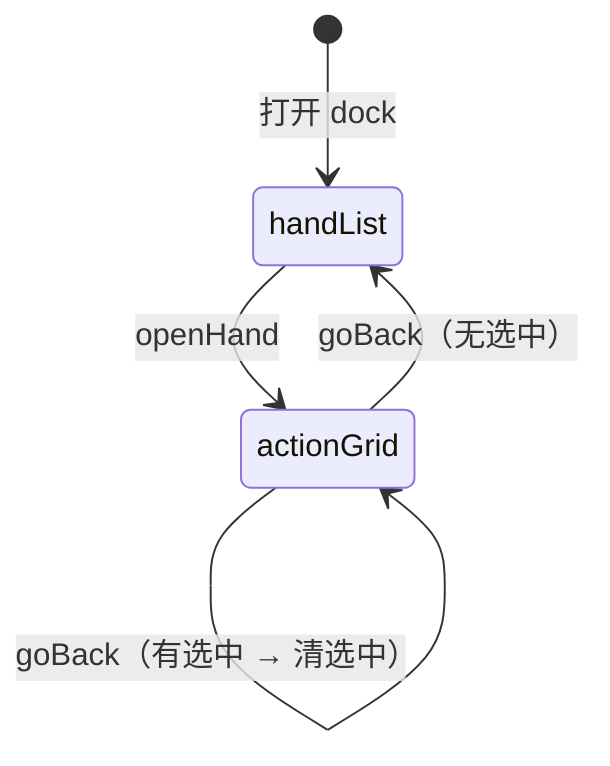

# NPC 决策 Trace — 二级行动矩阵 UI 重构计划

> 状态：**计划文档（PM 已确认，待实现）**  
> 范围：**仅默认主题** `GameNpcDecisionTraceBody` / `GameNpcDecisionTraceDock`；**8bit `GameNpcDecisionTracePanel` 零改动**  
> 数据：**Pull-only REST**，不改后端

---

## 1. 背景

默认主题 dock 当前 L2 为 **线性 action 列表**（按 `actionSeq` 逐条），一屏只能扫序号，难以对照「某 NPC 在某街做了什么」。PM 确认改为 **四街 × NPC 矩阵**（方案 A），点格内 chip 后在同屏右侧展开 L3 详情。

---

## 2. 信息架构

| 层级 | 名称 | 行为 | 变更 |
|------|------|------|------|
| **L1** | 手牌列表 | 展示最近 trace 手牌，点击进入 L2 | **不变** |
| **L2** | 行动矩阵 | 纵轴 = 本手有 trace 的 NPC；横轴 = 翻前 / Flop / Turn / River；格内 = 该 NPC 该街 action chip（`actionSeq` 竖排） | **重做**（替换原 `action-list`） |
| **L3** | 行动详情 | steps + preflop 13×13 matrix | **保留**；宽屏与 L2 **左右分栏**，非全屏切换 |

### 2.1 L2 矩阵规则

- **纵轴 NPC**：仅 `actions[]` 中出现过的 `actorNickname`（按该 NPC 首次行动的 `actionSeq` 排序）
- **横轴四列**：`preflop`（翻前）、`flop`、`turn`、`river`（列头中文 + 英文）
- **格内 chip**：该 NPC 在该街的全部 action，按 `actionSeq` 升序竖排
- **chip 文案**：`finalAction.type` 简写大写（`CALL` / `RAISE` / `FOLD` …）；`title` 可带 amount
- **空 cell**：无 action 时显示占位「—」
- **点击 chip**：选中并 REST 拉取 L3；右侧展示详情（左矩阵右详情）

### 2.2 L3 详情规则

- 复用现有 REST `fetchTraceAction` 与展示逻辑（head / steps / `GameNpcDecisionTraceMatrixGrid variant="default"`）
- 宽屏 dock：**grid | detail** 双栏；未选中 chip 时仅显示矩阵
- 窄屏 sheet：**不专门优化**；可保持上下堆叠或简单双栏，不单独设计矩阵 responsive

### 2.3 导航 / 面包屑

| 屏幕 | breadcrumb | 返回 |
|------|------------|------|
| L1 | `手牌列表` | — |
| L2（无选中） | `手牌 #N / 矩阵` | → L1 |
| L2（有选中） | `手牌 #N / 矩阵 / 行动 #S` | 第一次返回清选中；再返回 → L1 |

内部 `screen` 枚举：`hand-list` | `action-grid`（含 split detail 状态，由 `selectedActionSummary` 驱动）

---

## 3. 非目标

- **不修改** `GameNpcDecisionTracePanel.vue`（8bit overlay）及任何 retro8bit 文件
- **不改后端** REST / trace 采集 / GIVE_UP 策略 / steps 文案
- **不硬套** 牌谱 `splitRoundsByRaises`（trace 无 raise-round 语义，独立 `buildTraceStreetMatrix()`）
- **不做** 窄屏矩阵专项 UX
- **不做** Fish/Maniac/LLM trace
- **不新增** WebSocket / DB

---

## 4. 技术方案

### 4.1 数据工具（新建）

**文件**：`front/dp_game/src/utils/dpNpcDecisionTraceMatrix.js`

```text
buildTraceStreetMatrix(actions[]) → {
  npcs: string[],
  streets: { key, label }[],
  getCellActions(npc, streetKey): ActionSummary[]
}
formatTraceActionShort(finalAction) → string
normalizeTraceStreet(street) → 'preflop'|'flop'|'turn'|'river'|null
```

- 输入：hand bundle 的 `actions[]`（与现有 summary 同构）
- 街道归一化：小写 `preflop/flop/turn/river`；未知 street 忽略
- 不依赖 Vue / DOM

### 4.2 组件（新建 / 修改）

| 文件 | 动作 |
|------|------|
| **`GameNpcDecisionTraceActionGrid.vue`**（新建） | L2 矩阵 table + chip；props: `matrix`, `selectedActionId`；emit: `select-action` |
| **`GameNpcDecisionTraceBody.vue`**（修改） | `action-list` → `action-grid`；split layout；nav / goBack / breadcrumb |
| **`GameNpcDecisionTraceDock.vue`**（修改） | dock 在 `action-grid` 时加宽 class（如 `dp-trace-dock--wide`），便于左右分栏 |
| **`GameNpcDecisionTraceMatrixGrid.vue`** | **不改**（L3 preflop matrix 复用） |
| **`GameNpcDecisionTracePanel.vue`** | **不改**（8bit） |
| **`main.js`** | 无新增 Element 组件时 **不改**；若引入 Tag/Badge 等再注册 |

### 4.3 UI 风格

- 矩阵 **table 骨架**参考 `HandHistoryDetail.vue` 的 `.hand-detail-table-wrap` / `.hand-detail-table` 结构
- 配色适配 **默认主题 dock** dark token（`--dp-surface-*`、`--dp-accent`），非牌谱页浅色
- chip：小 pill/button，`selected` 高亮 accent border

### 4.4 布局示意（宽屏 dock）

```text
┌─────────────────────────────────────────────┐
│ [返回] [刷新]          手牌 #3 / 矩阵 / #7 │
├──────────────────┬──────────────────────────┤
│  NPC │翻前│Flop│… │  #7 preflop TAG_BOT     │
│  ────┼────┼────┼── │  steps…                 │
│  BOT │CALL│ — │… │  [13×13 matrix]          │
│      │RAISE│   │   │                          │
└──────────────────┴──────────────────────────┘
```

dock 宽：`action-grid` 时 `min(560px, 42vw)`；L1 保持 `min(320px, 28vw)`。

### 4.5 状态流



---

## 5. 改动文件清单

| 路径 | 说明 |
|------|------|
| `docs/refactor/trace-action-grid-ui-plan.md` | 本文档 |
| `front/dp_game/src/utils/dpNpcDecisionTraceMatrix.js` | **新建** 矩阵构建 |
| `front/dp_game/src/components/GameNpcDecisionTraceActionGrid.vue` | **新建** L2 矩阵 UI |
| `front/dp_game/src/components/GameNpcDecisionTraceBody.vue` | L2/L3 导航与 split layout |
| `front/dp_game/src/components/GameNpcDecisionTraceDock.vue` | 宽屏 dock 宽度 class |

**明确不改动**：`GameNpcDecisionTracePanel.vue`、`GameNpcDecisionTraceMatrixGrid.vue`（8bit variant）、`game.vue` 8bit WS 逻辑、后端 Java。

---

## 6. 验收 Checklist

### 6.1 功能（默认主题）

- [ ] 房主 gate 后打开 dock，L1 手牌列表与现有一致
- [ ] 点击手牌进入 **四街 × NPC 矩阵**，不再出现线性 action 列表
- [ ] 矩阵 **仅显示** 本手 `actions` 中出现过的 NPC
- [ ] 每格 chip 按 `actionSeq` 竖排，文案为 `finalAction` 简写
- [ ] 点击 chip → 左侧矩阵保持，**右侧**展示 steps + preflop matrix（如有）
- [ ] 面包屑与返回键：有选中时先清选中，再回手牌列表
- [ ] REST 失败 / 密码失效提示与现有一致

### 6.2 回归

- [ ] `npm run build`（`front/dp_game`）通过
- [ ] 8bit 主题 `GameNpcDecisionTracePanel` **git diff 为空**
- [ ] 窄屏 sheet 可打开 trace，不 crash（不要求矩阵专项优化）

### 6.3 非目标确认

- [ ] 未改后端 Java / Flyway
- [ ] 未改 GIVE_UP / trace step 文案
- [ ] 未使用 `splitRoundsByRaises`

---

## 7. 风险与回滚

| 风险 | 缓解 |
|------|------|
| dock 加宽挤占牌桌 | 仅 `action-grid` 态加宽；L1 仍窄 |
| 多 NPC 行高过大 | 格内 scroll / 紧凑 chip |
| 未知 street 丢 action | 工具内 log 忽略；P0 仅四标准街 |

**回滚**：还原 Body/Dock + 删除新文件即可；8bit 未动。

---

## 8. 变更说明（实现摘要）

| 项 | 内容 |
|----|------|
| L2 | `action-list` 屏幕改为 `action-grid`；新建 `buildTraceStreetMatrix()` + `GameNpcDecisionTraceActionGrid.vue` |
| L3 | 点击 chip 后在同屏右侧 split 展示 steps + preflop matrix，不再全屏切换 |
| 导航 | breadcrumb：`手牌 #N / 矩阵 [/ 行动 #S]`；返回：先清选中，再回 L1 |
| Dock | `action-grid` 时 `dp-trace-dock--wide`（560px / 42vw）以容纳左右分栏 |
| 8bit | `GameNpcDecisionTracePanel.vue` **未改动** |
| Element UI | 无新增组件，`main.js` 未改 |
| 构建 | `npm run build` 通过（2026-06-13） |
